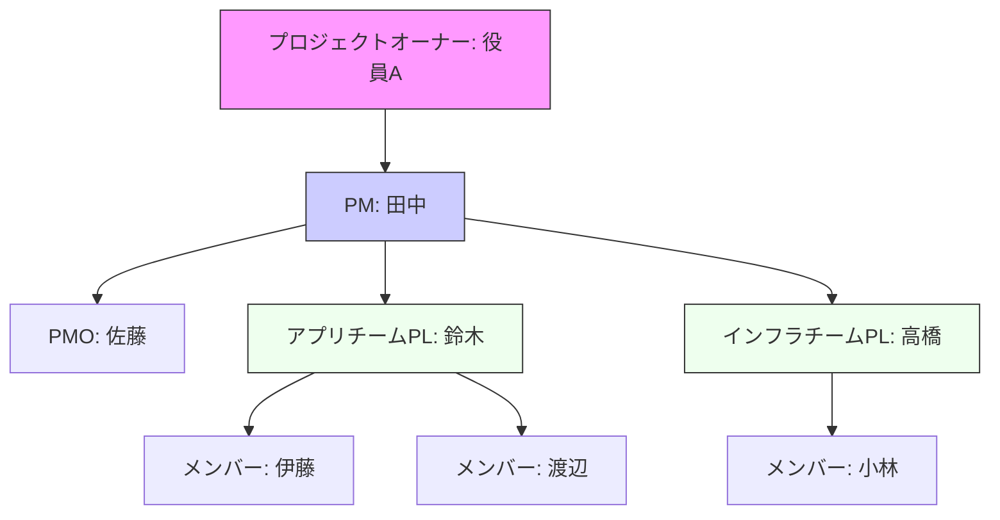
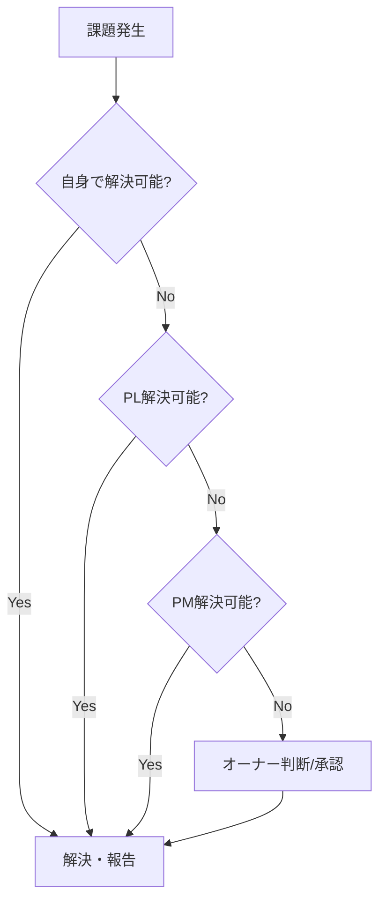
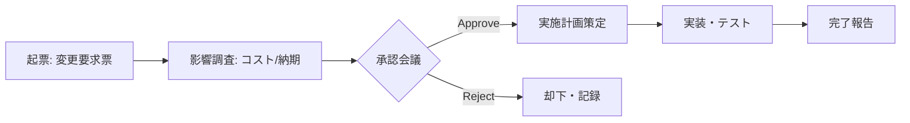
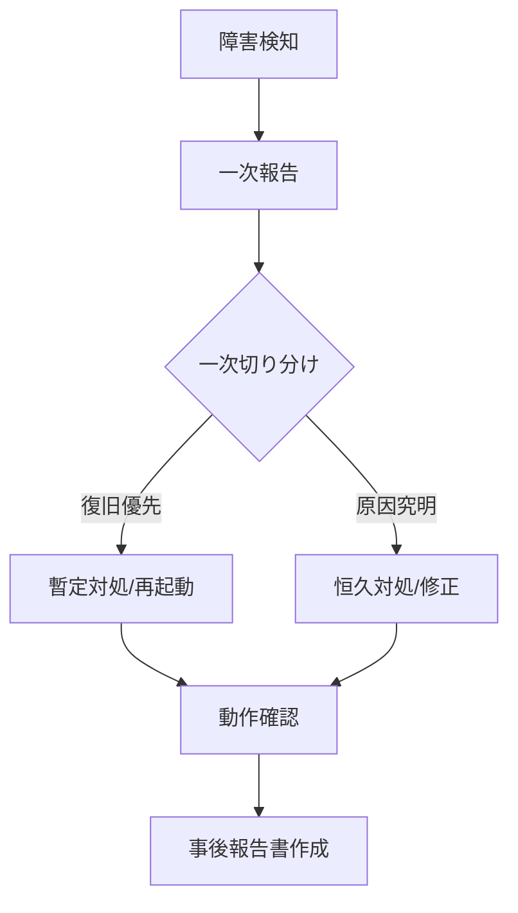

# プロジェクト計画書

## 1. プロジェクト概要
### 1.1 背景・目的
*   **背景**
    *   *記述例: 現行システムは稼働から10年が経過し、保守期限切れ(EOS)が迫っている。また、DX推進のためには現行のモノリシックな構造が足枷となっており、迅速な機能追加が困難である。*
*   **目的 (Object)**
    *   本プロジェクトによって達成すべきゴール (SMARTの法則推奨)。
    *   *記述例: 202X年3月までにAWS上へ新基幹システムを構築し、インフラ維持コストを現状比20%削減するとともに、API連携機能の実装により外部サービスとの連携リードタイムを2週間以内に短縮する。*

### 1.2 スコープ詳細
| 領域 | In-Scope (対象) | Out-Scope (対象外) | 備考 |
| :--- | :--- | :--- | :--- |
| **業務** | 受注管理、在庫管理、出荷管理 | 会計連携、人事労務 | 会計データはCSV出力まで |
| **システム** | Web受注システム、社内管理画面、バッチ処理 | 既存EDIシステム、BIツール | EDIはI/F仕様変更のみ |
| **データ** | 過去3年分のトランザクションデータ | 3年以上前のログデータ | 古いデータはアーカイブ保存 |
| **環境** | 本番環境、Staging環境、開発環境 | 災対(DR)環境 | DR対応はフェーズ2で検討 |

### 1.3 成果物定義
| フェーズ | 成果物名 | 形式 | 備考 |
| :--- | :--- | :--- | :--- |
| **要件定義** | 業務フロー図 | Excel/VPC | 新旧対比含む |
| | 機能要件一覧 | Excel | |
| | 非機能要件一覧 | Excel | IPA非機能要求グレード準拠 |
| **基本設計** | 画面一覧・遷移図 | Pptx | |
| | ER図 / テーブル定義書 | A5M2/Excel | |
| | インターフェース定義書 | Excel/Swagger | |
| **製造・試験** | ソースコード一式 | Git | |
| | 単体テスト仕様書・成績書 | Excel/JUnit | |

---

## 2. プロジェクト体制
### 2.1 体制図・連絡先


### 2.2 役割・責任詳細 (RACI)
| タスク/判断 | オーナー | PM | PL | メンバー | ユーザー |
| :--- | :---: | :---: | :---: | :---: | :---: |
| 予算・重要変更の承認 | **A** | R | I | I | C |
| 進捗・課題管理 | I | **A/R** | C | I | I |
| 要件仕様の決定 | I | C | C | I | **R/A** |
| 設計・実装・テスト | I | I | **A** | **R** | C |
| 受入テスト(UAT) | I | C | S | S | **R/A** |

*   **R**: 実行責任者 (Responsible)
*   **A**: 説明責任者/最終承認者 (Accountable)
*   **C**: 協業・相談先 (Consulted)
*   **I**: 報告・情報共有先 (Informed)

### 2.3 エスカレーションフロー


---

## 3. 進捗管理
### 3.1 マイルストーン定義
| ID | マイルストーン名 | 予定日 | 完了条件 |
| :--- | :--- | :--- | :--- |
| MS1 | キックオフ | 202X/04/01 | 全員参加、計画書合意 |
| MS2 | 要件定義完了 | 202X/05/31 | 要件定義書レビュー承認 |
| MS3 | 基本設計完了 | 202X/07/31 | 画面・DB設計凍結 |
| MS4 | 総合テスト開始 | 202X/10/01 | 結合テスト修正完了 |
| MS5 | リリース判定 | 202X/11/15 | UAT完了、重要課題0件 |
| MS6 | サービスイン | 202X/12/01 | 本番移行完了確認 |

### 3.2 WBS構造・粒度
*   Work Breakdown Structure は以下の階層で管理し、Redmine/Jira等のチケットシステムと同期させる。
    *   **Level 1 (フェーズ)**: 要件定義、設計、製造...
    *   **Level 2 (機能群/工程)**: 受注機能、在庫機能...
    *   **Level 3 (タスク)**: 画面設計、ロジック実装... (担当者アサイン単位、Max 40H)
    *   **Level 4 (サブタスク)**: チェックリスト項目等 (必要に応じて)

### 3.3 工程完了チェックリスト (Phase Exit Criteria)
**【要件定義完了チェックリスト】**
- [ ] 全ての業務フロー図がユーザー部門と合意・承認されている
- [ ] 機能一覧と画面一覧、帳票一覧に不整合がない
- [ ] 非機能要件（性能、セキュリティ、運用）の目標値が定義されている
- [ ] 要件定義書のレビュー指摘事項が全てクローズしている

**【リリース判定チェックリスト】**
- [ ] UAT（ユーザー受入テスト）が完了し、完了報告書が受領されている
- [ ] 残存バグに S/A ランクが存在しないこと
- [ ] Bランク以下の残存バグについて、運用回避策と改修計画が合意されている
- [ ] 本番移行手順書を用いたリハーサルが完了している
- [ ] 切り戻し基準・手順が明確化されている

### 3.4 進捗報告会議アジェンダ
**定例進捗会議 (毎週〇曜 10:00-11:00)**
| 時間 | 内容 | 担当 | 備考 |
| :--- | :--- | :--- | :--- |
| 10:00-10:05 | 前回議事録・ToDo確認 | PM | 未完了ToDoの確認徹底 |
| 10:05-10:20 | チーム進捗報告 | 各PL | 遅延タスクとリカバリ策のみ報告 |
| 10:20-10:40 | 重要課題討議 | PM | 意思決定が必要な課題のみ扱う |
| 10:40-10:50 | リスク共有・アラート | All | 新規リスク、予兆の共有 |
| 10:50-11:00 | 諸連絡・次回確認 | PM | |

---

## 4. コスト管理
### 4.1 予算管理表（概算イメージ）
| 費目 | 予算額 | 執行済 | 残額 | 見込み | 差異 |
| :--- | :--- | :--- | :--- | :--- | :--- |
| **初期開発費** | **30,000,000** | **5,000,000** | **25,000,000** | **32,000,000** | **-2,000,000** |
| 　(内)外部委託 | 20,000,000 | 3,000,000 | 17,000,000 | 20,000,000 | 0 |
| 　(内)HW/SW | 5,000,000 | 2,000,000 | 3,000,000 | 5,500,000 | -500,000 |
| **予備費** | **3,000,000** | **0** | **3,000,000** | **1,000,000** | **+2,000,000** |

---

## 5. 品質管理
### 5.1 定量品質指標
各工程の品質を以下の指標で計測し、許容範囲外の場合は出荷（次工程への移行）を認めない。

| 指標 | 計算式 | 目標値 (基準) | 備考 |
| :--- | :--- | :--- | :--- |
| **レビュー指摘密度** | 指摘件数 / ページ数 (or kStep) | 5～10件 / ページ | 少なすぎ＝形骸化の疑い |
| **テスト試験密度** | テストケース数 / 規模 (kStep) | 40～60件 / kStep | 複雑度により調整 |
| **バグ摘出密度** | バグ数 / 規模 (kStep) | 5～15件 / kStep | 言語・FWにより調整 |
| **バグ修正率** | 修正完了数 / バグ総数 | 100% | S/Aランクバグは必須 |

### 5.2 バグ深刻度・優先度定義
**【深刻度 (Severity)】**
*   **S (Critical)**: システムダウン、データ破損・消失、セキュリティインシデント。回避策なし。
*   **A (Major)**: 主要機能（受注・決済等）が利用不可。業務停止を伴うが、一時的な手運用等の回避策あり。
*   **B (Normal)**: 一部機能が利用不可、または誤動作。業務自体は継続可能。
*   **C (Minor)**: 画面表示崩れ、メッセージ文言の誤り、操作性の軽微な不備。

**【優先度 (Priority)】**
*   **High**: 即時対応（24H以内）。リリース不可。他作業を止めてでも修正。
*   **Medium**: 通常対応。次回の定期リリースまたは計画されたパッチで修正。
*   **Low**: 対応保留可。次期フェーズや保守期間での対応を検討。

---

## 6. コミュニケーション管理
### 6.1 標準フォルダ構成
文書管理ルールの統一のため、ファイルサーバー/クラウドストレージは以下の構成とする。
```text
Project_Root/
├── 00_PMO (管理)
│   ├── 10_計画書・契約書
│   ├── 20_進捗・課題管理 (WBS, 課題管理表)
│   ├── 30_会議議事録
│   └── 90_予算・支払
├── 10_Requirements (要件定義)
├── 20_Design (設計)
│   ├── 10_Basic (基本設計)
│   └── 20_Detail (詳細設計)
├── 30_Dev (製造・単体)
├── 40_Test (テスト)
│   ├── 10_IT (結合)
│   ├── 20_ST (総合)
│   └── 30_UAT (受入)
└── 90_Delivery (納品・リリース)
```

### 6.2 議事録テンプレート
```markdown
# 第X回 定例進捗会議 議事録
*   **日時**: 202X/MM/DD 10:00-11:00
*   **場所**: 大会議室 + Zoom
*   **参加者**: 田中(PM), 鈴木(PL), ... (欠席: 高橋)

## 1. 決定事項 (Decisions)
*   画面Aのレイアウトについて、B案を採用することで合意した。
    *   理由: 操作性が従来の業務フローに近く、教育コストが低いため。

## 2. 議論・共有事項 (Discussion)
*   インフラ構築の遅延について
    *   ハードウェア納入が1週間遅れる見込み。開発環境への影響は軽微だが、ST環境構築にはキャッチアップが必要。

## 3. ToDo (Actions)
*   [ ] 画面Bのモックアップ修正 [期限: MM/DD] (担当: 伊藤)
*   [ ] ハードウェアベンダーへの納期確認 [期限: 本日中] (担当: 高橋)
```

---

## 7. リスク管理
### 7.1 リスク管理台帳テンプレート
| ID | リスク内容 | 発生確率 | 影響度 | スコア | 対応策(プランB) | 担当 | 期限 | ステータス |
| :--- | :--- | :--- | :--- | :--- | :--- | :--- | :--- | :--- |
| R01 | 技術者不足による遅延 | 中(2) | 高(3) | 6 (A) | 代替要員の確保、他部署からの応援要請準備 | PM | 4/30 | 監視中 |
| R02 | API仕様変更の可能性 | 高(3) | 中(2) | 6 (A) | ラッパーを作成し影響範囲を限定する | PL | 5/15 | 対応済 |

---

## 8. 課題管理
### 8.1 課題とリスクの定義
*   **リスク (Risk)**: 未来において発生し得る不確実な事象。発生確率と影響度で管理する。「まだ起きていない」。
*   **課題 (Issue/Problem)**: 既に発生しており、プロジェクトの進行を阻害する解決すべき問題。「既に起きている」。

### 8.2 課題の優先度 (Priority Definition)
課題の影響度(Impact)と緊急度(Urgency)から優先度を決定し、対応スピードを定義する。

| 優先度 | 定義 | 標準対応期限(SLA) |
| :--- | :--- | :--- |
| **High (最高)** | **Project Blocker**. この解決なしにはプロジェクト全体または重要パスが停止する。 | **24時間以内**に対策立案、3営業日以内に解消。 |
| **Medium (高)** | **Major Issue**. 作業に支障が出るが、一時的な迂回策等で凌げる。 | **翌定例会**までに対策立案、1週間以内に解消。 |
| **Low (中)** | **Minor Issue**. 効率は落ちるが作業は可能。または期限まで十分な余裕がある。 | 対策期限を別途設定。 |

### 8.3 課題への対応方法 (Resolution Strategy)
課題への処置は以下の4パターンのいずれかを選択し、曖昧な「検討中」を続けない。

1.  **消化/解決 (Resolve)**
    *   根本原因を取り除き、問題を解消する。最も一般的な対応。
    *   *例: バグを修正する。不足していたサーバーを追加購入する。*
2.  **緩和 (Mitigate)**
    *   完全解決は困難だが、影響を許容範囲内まで抑える暫定対応を行う。
    *   *例: 自動化予定だった処理を、一時的に手動運用でカバーする。*
3.  **受容 (Accept)**
    *   対応コストが効果を上回る場合など、関係者合意の上で「対応しない」ことを決定する。
    *   *例: UIの微細なズレについて、修正リスクが高いためリリース後に対応することとし、現状を受け入れる。*
4.  **却下 (Reject)**
    *   課題の前提が誤っている、スコープ外である等の理由で、課題として却下する。

### 8.4 課題管理台帳テンプレート
| ID | 課題内容 | 起票日 | 優先度 | 期限 | 対応パターン | 対応状況 | 最終処置/解決策 |
| :--- | :--- | :--- | :--- | :--- | :--- | :--- | :--- |
| I01 | 画面Cで検索速度が出ない | 6/10 | High | 6/15 | 緩和 | 対応中 | インデックス追加で一旦対応。根本改修は次期。 |
| I02 | 帳票Dのレイアウト崩れ | 6/12 | Low | 6/30 | 解決 | 未着手 | |

---

## 9. 変更管理
### 9.1 変更管理プロセス


### 9.2 変更要求(CR)フロー内容
変更が発生した場合、メールや口頭で済ませず、必ず以下の「変更要求票」を作成する。

**【変更要求票 (Change Request Form)】**
1.  **変更タイトル**: ○○機能における○○項目の追加
2.  **変更理由**: 法改正に伴い、必須入力項目が増えたため。
3.  **変更内容詳細**:
    *   DBテーブル `T_HOGE` にカラム `col_new` を追加。
    *   画面 `S_HOGE_01` に入力エリアを追加。
4.  **影響範囲**:
    *   スケジュール: 実装+1日、テスト+1日 (予備日で吸収可能)
    *   コスト: 内部工数のみのため追加費用なし
    *   品質: 既存機能への回帰テストが必要
5.  **承認**: [ ] 承認 / [ ] 却下 / [ ] 保留

---

## 10. 調達管理
*   RFP（提案依頼書）の作成からベンダー選定、契約締結までのスケジュール管理。
*   再委託の可否、著作権の帰属、検収基準などを契約時に明確化する。

---

## 11. システム運用・移行計画
### 11.1 移行タイムチャート (Cutover Plan)
分単位のタイムチャートを作成し、役割分担を明確にする。
| 時間 | タスクID | タスク名 | 担当 | 確認者 | 判定 |
| :--- | :--- | :--- | :--- | :--- | :--- |
| **12/01** | | **【移行当日】** | | | |
| 18:00 | MV-01 | 現行システム停止 | 運用 | PM | OK |
| 18:30 | MV-02 | データバックアップ取得 | DB担当 | PL | OK |
| 19:00 | MV-03 | 新サーバーへのDeploy | アプリ | PL | |
| 20:00 | MV-04 | データ移行バッチ実行 | DB担当 | PL | |
| 22:00 | MV-05 | 移行データ検証(件数確認) | ユーザー | PM | **Go/NoGo** |

### 11.2 障害対応フロー

