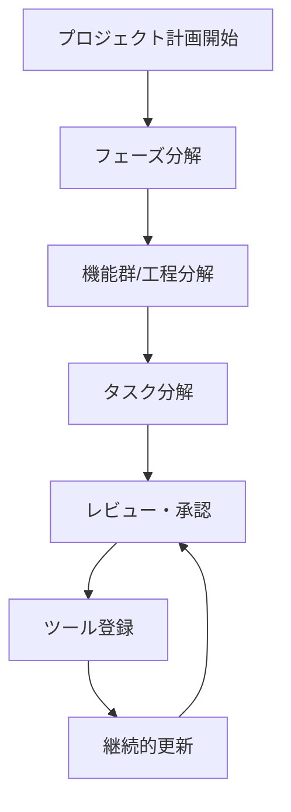
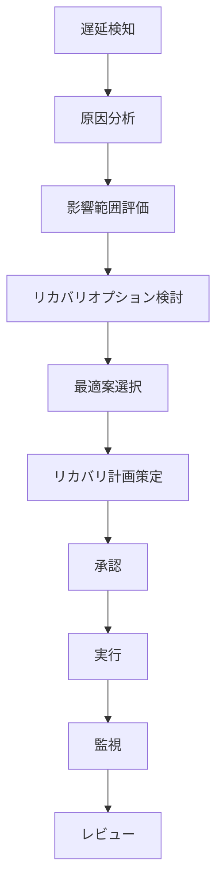

# 進捗管理計画書

## 1. 進捗管理の基本方針

### 1.1 進捗管理の目的
プロジェクトの進捗を正確に把握し、計画との差異を早期に検知することで、適切なリカバリ策を講じ、プロジェクト目標の達成を確実にする。

### 1.2 進捗管理の原則
- **可視化**: 進捗状況を誰もが理解できる形で可視化する
- **定量的**: 主観的な判断ではなく、定量的な指標で評価する
- **リアルタイム**: 遅延や課題を早期に発見し、迅速に対応する
- **透明性**: 進捗情報を関係者全員で共有し、透明性を保つ
- **継続的改善**: 進捗管理プロセス自体を継続的に改善する

### 1.3 進捗管理の対象範囲
- スケジュール進捗（マイルストーン、タスク完了状況）
- 工数進捗（計画工数 vs 実績工数）
- 成果物進捗（成果物の完成度、品質）
- リソース進捗（人員配置、稼働状況）

---

## 2. マイルストーン管理

### 2.1 マイルストーン定義

| ID | マイルストーン名 | 予定日 | 完了条件 | 進捗率 | 依存関係 | クリティカルパス |
| :--- | :--- | :--- | :--- | :--- | :--- | :--- |
| MS1 | キックオフ | 202X/04/01 | 全員参加、計画書合意 | 0% | - | Yes |
| MS2 | 要件定義完了 | 202X/05/31 | 要件定義書レビュー承認 | 0% | MS1 | Yes |
| MS3 | 基本設計完了 | 202X/07/31 | 画面・DB設計凍結 | 0% | MS2 | Yes |
| MS4 | 総合テスト開始 | 202X/10/01 | 結合テスト修正完了 | 0% | MS3 | Yes |
| MS5 | リリース判定 | 202X/11/15 | UAT完了、重要課題0件 | 0% | MS4 | Yes |
| MS6 | サービスイン | 202X/12/01 | 本番移行完了確認 | 0% | MS5 | Yes |

### 2.2 マイルストーン管理プロセス

#### 2.2.1 マイルストーン設定の基準
- **明確な完了条件**: 完了条件は測定可能で、客観的に判定できるものとする
- **適切な間隔**: マイルストーン間は4～8週間程度を目安とする
- **関係者合意**: 全てのステークホルダーがマイルストーンと完了条件に合意していること

#### 2.2.2 マイルストーン達成判定
マイルストーン達成判定は以下の手順で実施する：

1. **事前確認（マイルストーン1週間前）**
   - 完了条件の達成状況を確認
   - 未達成項目があればリカバリ計画を策定

2. **判定会議（マイルストーン当日）**
   - 完了条件の達成状況をレビュー
   - 全条件が満たされている場合のみ「達成」と判定
   - 未達成項目がある場合は「条件付き達成」または「未達成」と判定

3. **事後報告（マイルストーン達成後3日以内）**
   - マイルストーン達成報告書を作成
   - 次のマイルストーンに向けた準備状況を確認

#### 2.2.3 マイルストーン遅延時の対応
- **遅延予測（2週間前）**: 遅延が予測される場合は、リカバリ計画を策定し、関係者に報告
- **遅延発生時**: 遅延の原因分析を行い、影響範囲を評価。必要に応じて後続マイルストーンの調整を検討

### 2.3 クリティカルパス管理

#### 2.3.1 クリティカルパスの特定
プロジェクト全体のスケジュールに影響を与えるクリティカルパスを特定し、重点的に管理する。

```mermaid
gantt
    title クリティカルパス
    dateFormat  YYYY-MM-DD
    section 要件定義
    キックオフ           :crit, ms1, 202X-04-01, 1d
    要件定義作業         :crit, req, 202X-04-02, 60d
    要件定義完了         :crit, ms2, 202X-05-31, 1d
    section 設計
    基本設計作業         :crit, design, 202X-06-01, 61d
    基本設計完了         :crit, ms3, 202X-07-31, 1d
    section 製造・テスト
    製造・結合テスト     :crit, dev, 202X-08-01, 61d
    総合テスト開始       :crit, ms4, 202X-10-01, 1d
    section リリース
    UAT・リリース判定    :crit, release, 202X-10-02, 45d
    サービスイン         :crit, ms6, 202X-12-01, 1d
```

#### 2.3.2 クリティカルパスの監視
- **週次レビュー**: クリティカルパス上のタスクの進捗を週次でレビュー
- **バッファ管理**: クリティカルパス上のバッファを適切に管理し、消費状況を監視
- **リスク管理**: クリティカルパス上のリスクを重点的に管理

---

## 3. WBS（Work Breakdown Structure）管理

### 3.1 WBS構造・粒度

Work Breakdown Structure は以下の階層で管理し、Redmine/Jira等のチケットシステムと同期させる。

- **Level 1 (フェーズ)**: 要件定義、設計、製造、テスト、リリース
- **Level 2 (機能群/工程)**: 受注機能、在庫機能、出荷機能など
- **Level 3 (タスク)**: 画面設計、ロジック実装、単体テストなど（担当者アサイン単位、Max 40H）
- **Level 4 (サブタスク)**: チェックリスト項目等（必要に応じて）

### 3.2 WBS作成手順

#### 3.2.1 WBS作成の基本原則
1. **完全性**: プロジェクトの全作業を漏れなく含める
2. **相互排他性**: タスク間の重複を避ける
3. **適切な粒度**: 管理可能なサイズに分解する（目安：1タスクあたり8～40時間）
4. **成果物指向**: タスクは成果物の完成を目的とする

#### 3.2.2 WBS作成プロセス


#### 3.2.3 WBSタスク定義テンプレート

各タスクには以下の情報を定義する：

| 項目 | 説明 | 例 |
| :--- | :--- | :--- |
| **タスクID** | 一意の識別子 | REQ-001 |
| **タスク名** | タスクの名称 | 受注画面の要件定義 |
| **説明** | タスクの詳細説明 | 受注画面の機能要件、非機能要件を定義する |
| **担当者** | 責任者 | 田中太郎 |
| **見積工数** | 計画工数（時間） | 16時間 |
| **開始日** | 計画開始日 | 202X/04/05 |
| **完了日** | 計画完了日 | 202X/04/12 |
| **依存関係** | 先行タスク | REQ-000（プロジェクトキックオフ） |
| **成果物** | 期待される成果物 | 受注画面要件定義書 |
| **完了条件** | タスク完了の判定基準 | 要件定義書レビュー承認 |

### 3.3 WBS管理方法

#### 3.3.1 タスク管理ツールとの連携
- **Redmine/Jira連携**: WBSをタスク管理ツールに登録し、進捗を自動同期
- **更新頻度**: タスクの進捗は毎日更新、WBS全体は週次でレビュー
- **バージョン管理**: WBSの変更履歴を管理し、変更理由を記録

#### 3.3.2 WBS更新プロセス
1. **変更要求**: タスクの追加・変更・削除が必要な場合、変更要求を提出
2. **影響分析**: 変更による影響範囲（スケジュール、工数、依存関係）を分析
3. **承認**: PMが変更を承認
4. **更新**: WBSとタスク管理ツールを更新
5. **通知**: 関係者に変更内容を通知

### 3.4 ベースラインの変更管理
プロジェクト計画承認時点のスケジュールを「ベースライン」として保存する。
スケジュール変更が発生した場合（遅延の公式なリスケジュール等）、ベースラインの書き換えは変更管理委員会（CCB）の承認を必要とし、独断での変更は認めない。

- **ベースライン設定**: プロジェクト計画承認時に、WBS、マイルストーン、スケジュールをベースラインとして固定
- **ベースライン変更**: ベースラインの変更が必要な場合は、変更管理プロセスに従い、CCBの承認を得る
- **ベースライン比較**: 定期的に実績とベースラインを比較し、差異を分析

---

## 4. 工程完了チェックリスト（Phase Exit Criteria）

### 4.1 要件定義完了チェックリスト

#### 4.1.1 成果物チェック
- [ ] 全ての業務フロー図がユーザー部門と合意・承認されている
- [ ] 機能一覧と画面一覧、帳票一覧に不整合がない
- [ ] 非機能要件（性能、セキュリティ、運用）の目標値が定義されている
- [ ] 要件定義書のレビュー指摘事項が全てクローズしている
- [ ] 要件トレーサビリティマトリクスが作成されている
- [ ] 外部インターフェース要件が定義されている
- [ ] データ移行要件が定義されている

#### 4.1.2 プロセスチェック
- [ ] ステークホルダーレビューが完了している
- [ ] 要件定義書のバージョン管理が適切に行われている
- [ ] 変更管理プロセスに従って要件変更が管理されている

### 4.2 基本設計完了チェックリスト

#### 4.2.1 成果物チェック
- [ ] 画面・遷移図が全て作成され、レビュー承認されている
- [ ] ER図・テーブル定義書が作成され、レビュー承認されている
- [ ] インターフェース定義書（API仕様書）が作成されている
- [ ] 画面設計書とDB設計書の整合性が確認されている
- [ ] 非機能要件（性能、セキュリティ）の設計方針が文書化されている
- [ ] 設計レビュー指摘事項が全てクローズしている

#### 4.2.2 プロセスチェック
- [ ] 設計レビューが完了している
- [ ] 設計書のバージョン管理が適切に行われている
- [ ] 設計変更が変更管理プロセスに従って管理されている

### 4.3 製造完了チェックリスト

#### 4.3.1 成果物チェック
- [ ] 全機能の実装が完了している
- [ ] 単体テストが完了し、テスト成績書が作成されている
- [ ] コードレビューが完了している
- [ ] コーディング規約に準拠している
- [ ] ソースコードがバージョン管理システムに登録されている

#### 4.3.2 プロセスチェック
- [ ] 単体テストのカバレッジが目標値を達成している
- [ ] コードレビュー指摘事項が全て修正されている
- [ ] 結合テスト準備が完了している

### 4.4 結合テスト完了チェックリスト

#### 4.4.1 成果物チェック
- [ ] 結合テスト仕様書が作成されている
- [ ] 結合テストが完了し、テスト成績書が作成されている
- [ ] テストで検出されたバグが修正されている（S/Aランクは必須）
- [ ] 回帰テストが実施されている

#### 4.4.2 プロセスチェック
- [ ] 結合テストのカバレッジが目標値を達成している
- [ ] テスト環境が本番環境と同等の構成になっている
- [ ] 総合テスト準備が完了している

### 4.5 総合テスト完了チェックリスト

#### 4.5.1 成果物チェック
- [ ] 総合テスト仕様書が作成されている
- [ ] 総合テストが完了し、テスト成績書が作成されている
- [ ] 性能テストが実施され、目標値を達成している
- [ ] セキュリティテストが実施されている
- [ ] テストで検出されたバグが修正されている（S/Aランクは必須）

#### 4.5.2 プロセスチェック
- [ ] 総合テスト環境が本番環境と同等の構成になっている
- [ ] UAT準備が完了している

### 4.6 リリース判定チェックリスト

#### 4.6.1 成果物チェック
- [ ] UAT（ユーザー受入テスト）が完了し、完了報告書が受領されている
- [ ] 残存バグに S/A ランクが存在しないこと
- [ ] Bランク以下の残存バグについて、運用回避策と改修計画が合意されている
- [ ] 本番移行手順書が作成されている
- [ ] 切り戻し基準・手順が明確化されている
- [ ] 運用マニュアルが作成されている

#### 4.6.2 プロセスチェック
- [ ] 本番移行手順書を用いたリハーサルが完了している
- [ ] リリース判定会議が開催され、リリース承認が得られている
- [ ] リリース後のサポート体制が整備されている

---

## 5. 進捗測定方法

### 5.1 進捗率の計算方法

主観による「90%シンドローム」（90%から進まない現象）を防ぐため、以下の客観的基準を用いる。

#### 5.1.1 0/100法
着手済みでも完了基準を満たすまでは0%、完了承認されて初めて100%とする。タスク粒度が細かい場合に推奨される方法。

- **適用条件**: タスク期間が短い（1週間以内）場合
- **メリット**: 進捗率の過大評価を防ぐ
- **デメリット**: 途中経過が把握しにくい

#### 5.1.2 マイルストーン加重法
長期間タスクの場合、予め定義した中間ポイント通過で進捗を計上する。

- **適用条件**: タスク期間が長い（1週間以上）場合
- **中間ポイント例**: 
  - 設計着手(10%) -> レビュー依頼(80%) -> レビュー指摘対応完了(100%)
  - 実装開始(20%) -> 単体テスト完了(70%) -> コードレビュー完了(100%)
- **メリット**: 途中経過を把握できる
- **デメリット**: 中間ポイントの定義が必要

#### 5.1.3 タスク完了率
```
タスク完了率 = 完了タスク数 / 全タスク数 × 100
```

#### 5.1.4 工数進捗率
```
工数進捗率 = 実績工数 / 計画工数 × 100
```

#### 5.1.5 成果物進捗率
```
成果物進捗率 = 完成成果物数 / 計画成果物数 × 100
```

#### 5.1.6 マイルストーン進捗率
```
マイルストーン進捗率 = 達成マイルストーン数 / 全マイルストーン数 × 100
```

### 5.2 EVM（Earned Value Management）による進捗測定

#### 5.2.1 EVMの基本指標

| 指標 | 略称 | 説明 | 計算式 |
| :--- | :--- | :--- | :--- |
| **計画価値** | PV (Planned Value) | 計画時点での計画工数の累計 | 計画工数の累計 |
| **出来高** | EV (Earned Value) | 実際に完了した作業の計画工数 | 完了タスクの計画工数の合計 |
| **実コスト** | AC (Actual Cost) | 実際に投入した工数 | 実績工数の合計 |

#### 5.2.2 EVMの差異指標

| 指標 | 略称 | 説明 | 計算式 | 判定基準 |
| :--- | :--- | :--- | :--- | :--- |
| **スケジュール差異** | SV (Schedule Variance) | スケジュールの遅れ・進み | EV - PV | SV > 0: 進んでいる<br>SV < 0: 遅れている |
| **コスト差異** | CV (Cost Variance) | コストの超過・節約 | EV - AC | CV > 0: 節約<br>CV < 0: 超過 |
| **スケジュール効率** | SPI (Schedule Performance Index) | スケジュール効率 | EV / PV | SPI = 1.0: 計画通り<br>SPI > 1.0: 進んでいる<br>SPI < 1.0: 遅れている |
| **コスト効率** | CPI (Cost Performance Index) | コスト効率 | EV / AC | CPI = 1.0: 計画通り<br>CPI > 1.0: 節約<br>CPI < 1.0: 超過 |

#### 5.2.3 EVMによる進捗レポート例

| 指標 | 計画値 | 実績値 | 差異 | 効率 | 評価 |
| :--- | :---: | :---: | :---: | :---: | :--- |
| **PV** | 500H | - | - | - | - |
| **EV** | - | 450H | - | - | - |
| **AC** | - | 480H | - | - | - |
| **SV** | - | - | -50H | - | 遅れ |
| **CV** | - | - | -30H | - | 超過 |
| **SPI** | 1.0 | - | - | 0.90 | 遅れ |
| **CPI** | 1.0 | - | - | 0.94 | 超過 |

#### 5.2.4 EVMによる完了予測

| 指標 | 略称 | 説明 | 計算式 |
| :--- | :--- | :--- | :--- |
| **完了時コスト予測** | EAC (Estimate At Completion) | プロジェクト完了時の総コスト予測 | AC + (BAC - EV) / CPI |
| **完了時スケジュール予測** | SAC (Schedule At Completion) | プロジェクト完了時の総期間予測 | 計画期間 / SPI |
| **残作業コスト予測** | ETC (Estimate To Complete) | 残作業に必要なコスト予測 | (BAC - EV) / CPI |

### 5.3 バーンチャートによる進捗可視化

#### 5.3.1 バーンチャートの作成方法
バーンチャートは以下の情報を含める：

- **計画線**: 計画された進捗（累積）
- **実績線**: 実際の進捗（累積）
- **差異**: 計画と実績の差異を明確に表示

#### 5.3.2 バーンチャートの見方
- **実績線が計画線の上**: 計画より進んでいる
- **実績線が計画線の下**: 計画より遅れている
- **傾き**: 進捗の速度を表す（急な傾き = 速い進捗）

### 5.4 ガントチャートによる進捗可視化

#### 5.4.1 ガントチャートの要素
- **タスク名**: 各タスクの名称
- **期間**: タスクの開始日と終了日
- **進捗率**: タスクの完了率（%）
- **依存関係**: タスク間の依存関係を矢印で表示
- **クリティカルパス**: クリティカルパスを強調表示

#### 5.4.2 ガントチャートの更新頻度
- **日次**: タスクの進捗率を更新
- **週次**: ガントチャート全体をレビューし、必要に応じて調整

---

## 6. 進捗報告

### 6.1 進捗報告会議アジェンダ

#### 6.1.1 週次定例進捗会議 (Weekly Progress Meeting)
**日時**: 毎週 〇曜 10:00-11:00
**参加者**: PM, PL全員, PMO

| 時間 | 内容 | 担当 | 備考 |
| :--- | :--- | :--- | :--- |
| 10:00-10:05 | 前回議事録・ToDo確認 | PM | 未完了ToDoの確認徹底 |
| 10:05-10:10 | 全体進捗概況報告 | PMO | 5分 |
| 10:10-10:30 | チーム別進捗報告 | 各PL | 20分。「順調です」は報告不要。遅延タスク、リスク、課題のみ報告する。 |
| 10:30-10:50 | 重要課題・リスクの討議 | PM | 20分。意思決定が必要な課題のみ扱う |
| 10:50-11:00 | 次週のリソース調整・連絡事項 | PM | 10分 |

#### 6.1.2 進捗報告フロー
- **メンバー -> PL**: 毎日夕会 (Daily Standup) にて、「やったこと」「明日やること」「障害事項(ブロッカー)」を報告。チケットのステータス更新を必須とする。
- **PL -> PM**: 週次でチーム進捗を集計し、PMへ報告。予実差異の原因と対策を添える。
- **PM -> ステアリングコミッティ (オーナー/ユーザー)**: 月次またはマイルストーン毎に、プロジェクト全体の健全性を報告。

### 6.2 進捗報告テンプレート

#### 6.2.1 週次進捗報告書

```markdown
# 第X週 進捗報告書
*   **報告期間**: 202X/MM/DD ～ 202X/MM/DD
*   **報告日**: 202X/MM/DD
*   **報告者**: 田中（PM）

## 1. マイルストーン状況
| マイルストーン | 予定日 | 状況 | 備考 |
| :--- | :--- | :--- | :--- |
| MS2: 要件定義完了 | 202X/05/31 | 進行中 | 予定通り |

## 2. 進捗サマリー
- **全体進捗率**: 35% (前週: 30%)
- **タスク完了率**: 42/120タスク完了 (35%)
- **工数進捗率**: 420H / 1200H (35%)
- **SPI**: 0.95 (やや遅れ)
- **CPI**: 0.98 (やや超過)

## 3. 今週の実績
### 3.1 完了したタスク
- [x] REQ-001: 受注画面の要件定義
- [x] REQ-002: 在庫画面の要件定義

### 3.2 進行中のタスク
- [ ] REQ-003: 出荷画面の要件定義 (進捗率: 60%)
- [ ] REQ-004: 帳票要件定義 (進捗率: 30%)

## 4. 来週の予定
- REQ-003: 出荷画面の要件定義完了
- REQ-004: 帳票要件定義完了
- REQ-005: インターフェース要件定義開始

## 5. 課題・リスク
### 5.1 課題
- **課題1**: ユーザー部門のレビューが遅延している
  - **影響**: 要件定義完了が1週間遅れる見込み
  - **対応策**: ユーザー部門と調整し、レビュー日程を前倒し

### 5.2 リスク
- **リスク1**: 外部API仕様が未確定
  - **影響度**: 中
  - **対応策**: ベンダーと協議し、暫定仕様で進める

## 6. 要支援事項
- ユーザー部門へのレビュー依頼のサポート
```

#### 6.2.2 月次進捗報告書

```markdown
# X月 進捗報告書
*   **報告期間**: 202X年X月
*   **報告日**: 202X/MM/DD
*   **報告者**: 田中（PM）

## 1. プロジェクトサマリー
- **プロジェクト名**: ○○システム開発プロジェクト
- **全体進捗率**: 45%
- **プロジェクト状況**: やや遅れ（SPI: 0.92）

## 2. マイルストーン状況
| マイルストーン | 予定日 | 実績日 | 状況 | 差異 |
| :--- | :--- | :--- | :--- | :--- |
| MS1: キックオフ | 202X/04/01 | 202X/04/01 | 完了 | 0日 |
| MS2: 要件定義完了 | 202X/05/31 | 202X/06/07 | 完了 | +7日 |
| MS3: 基本設計完了 | 202X/07/31 | - | 進行中 | - |

## 3. 進捗詳細
### 3.1 フェーズ別進捗
| フェーズ | 計画工数 | 実績工数 | 進捗率 | 状況 |
| :--- | :---: | :---: | :---: | :--- |
| 要件定義 | 200H | 220H | 100% | 完了 |
| 基本設計 | 300H | 180H | 60% | 進行中 |
| 製造 | 400H | 0H | 0% | 未着手 |
| テスト | 200H | 0H | 0% | 未着手 |
| リリース | 100H | 0H | 0% | 未着手 |
| **合計** | **1200H** | **400H** | **33%** | - |

### 3.2 EVM分析
| 指標 | 値 | 評価 |
| :--- | :---: | :--- |
| PV | 450H | - |
| EV | 414H | - |
| AC | 400H | - |
| SV | -36H | 遅れ |
| CV | +14H | 節約 |
| SPI | 0.92 | やや遅れ |
| CPI | 1.04 | やや節約 |

## 4. 主要成果物
- 要件定義書 v1.0（承認済）
- 基本設計書 v0.8（レビュー中）

## 5. 課題・リスク
### 5.1 重要課題
1. **要件定義の遅延**: ユーザー部門のレビュー遅延により、MS2が7日遅延
2. **設計リソース不足**: 基本設計フェーズでリソースが不足している

### 5.2 重要リスク
1. **外部API仕様未確定**: 影響度中、発生確率中
2. **技術者不足**: 影響度高、発生確率低

## 6. リカバリ計画
- 基本設計フェーズでリソースを追加投入し、遅延を解消
- 外部API仕様について、暫定仕様で進めることを決定

## 7. 次月の計画
- 基本設計完了（MS3達成）
- 製造フェーズ開始準備
```

### 6.3 進捗報告の頻度と対象者

| 報告種別 | 頻度 | 対象者 | 報告内容 |
| :--- | :--- | :--- | :--- |
| **日次進捗** | 毎日 | チーム内 | タスクの進捗状況、ブロッカー |
| **週次進捗** | 毎週 | PM、PL | 週次進捗報告書 |
| **月次進捗** | 毎月 | プロジェクトオーナー、ステークホルダー | 月次進捗報告書、EVM分析 |
| **マイルストーン報告** | マイルストーン達成時 | 全関係者 | マイルストーン達成報告書 |

---

## 7. 遅延時のリカバリ計画

### 7.1 遅延検知の基準

#### 7.1.1 遅延の定義とアクション
進捗遅延が発生した場合、その度合いに応じて以下のレベルで対応を行う。

| レベル | 遅延状況 | 定義 | アクション |
| :--- | :--- | :--- | :--- |
| **Lv 1** | 軽微な遅延 | クリティカルパス以外のタスクで1週間以内の遅延 | 担当者とPL間で残業やタスク順序入替により調整。週次報告で報告。 |
| **Lv 2** | 注意 | クリティカルパス上で遅延発生、または SPI < 0.9 | PM主導でリカバリー策検討（要員追加投入、並行作業化）。オーナーへアラート通知。 |
| **Lv 3** | 重大 | 回復不能な遅延、サービスインへの影響確実 | スコープ縮小（機能削減）、またはリリース日の延期を経営層へ提案・決裁。 |

※SPIが 0.9 を下回った場合、PMは直ちにリカバリープランを策定しなければならない。

#### 7.1.2 遅延検知のタイミング
- **日次**: タスクの進捗を確認し、遅延の予兆を検知
- **週次**: SPIを計算し、遅延の傾向を分析
- **マイルストーン2週間前**: マイルストーン達成の可能性を評価

### 7.2 リカバリ計画の策定プロセス



### 7.3 リカバリオプション

Lv2以上の遅延が発生した場合、PLは以下の項目を含む「キャッチアップ計画書」を作成し、PMの承認を得る。

#### 7.3.1 リソース追加（クラッシング）
コスト（残業代、増員）を投じて期間を短縮する。

- **追加要員の投入**: 遅延しているタスクに追加要員を投入
- **外部リソースの活用**: 必要に応じて外部リソースを活用
- **リソースの再配分**: 優先度の低いタスクからリソースを移動
- **作業時間の延長**: 必要に応じて残業や休日出勤を検討

**メリット**: 確実に期間を短縮できる
**デメリット**: コストが増加する

#### 7.3.2 スケジュール調整（ファストトラッキング）
本来直列に行うタスク（設計と製造など）を並行して行う。手戻りリスクが増える。

- **並行作業の推進**: 依存関係を見直し、並行作業を推進
- **マイルストーンの調整**: 後続マイルストーンを調整

**メリット**: コストを抑えながら期間を短縮できる
**デメリット**: 手戻りリスクが増加する

#### 7.3.3 スコープ調整
- **機能の優先順位付け**: 必須機能を優先し、オプション機能を後回し
- **機能の簡略化**: 機能の一部を簡略化して実装期間を短縮
- **フェーズ分割**: 一部機能を次フェーズに延期
- **スコープ縮小**: 機能削減により期間を短縮

#### 7.3.4 品質・テストの調整
- **テスト範囲の調整**: 優先度の低いテストを省略または簡略化
- **バグ対応方針の調整**: 軽微なバグを次フェーズに延期

#### 7.3.5 キャッチアップ計画書に含める項目
1. **遅延の根本原因**: 技術力不足、仕様未決、突発休暇など
2. **影響範囲**: どのタスクが連鎖的に遅れるか（とくにクリティカルパスへの影響）
3. **対策案**: クラッシング、ファストトラッキング、スコープ調整など
4. **回復予定日**: いつ元通りのスケジュールに戻るか

### 7.4 リカバリ計画テンプレート

```markdown
# リカバリ計画書

## 1. 遅延状況
- **遅延タスク**: REQ-003 出荷画面の要件定義
- **計画完了日**: 202X/05/20
- **予測完了日**: 202X/05/27
- **遅延日数**: 7日
- **遅延原因**: ユーザー部門のレビュー遅延

## 2. 影響範囲
- **影響を受けるタスク**: 
  - REQ-004: 帳票要件定義（依存関係あり）
  - DES-001: 出荷画面の基本設計
- **マイルストーンへの影響**: MS2（要件定義完了）が7日遅延する可能性

## 3. リカバリオプション
| オプション | 内容 | コスト | 効果 | リスク |
| :--- | :--- | :--- | :--- | :--- |
| オプション1 | 追加要員の投入 | +50H | 遅延を3日に短縮 | 低 |
| オプション2 | ユーザー部門との調整 | 0H | レビューを前倒し | 中 |
| オプション3 | 機能の簡略化 | 0H | 実装期間を短縮 | 高 |

## 4. 選択したリカバリ計画
- **選択オプション**: オプション1 + オプション2
- **実施内容**:
  1. 追加要員1名を投入し、並行作業を推進
  2. ユーザー部門と調整し、レビュー日程を前倒し
- **期待効果**: 遅延を3日に短縮し、MS2への影響を最小化

## 5. 実施スケジュール
| 日付 | 実施内容 | 担当 |
| :--- | :--- | :--- |
| 202X/05/21 | 追加要員のアサイン | PM |
| 202X/05/22 | ユーザー部門との調整 | PM |
| 202X/05/23-27 | 並行作業の実施 | チーム |

## 6. 成功基準
- REQ-003が202X/05/24までに完了すること
- MS2が202X/06/03までに達成できること

## 7. 監視計画
- 日次で進捗を確認
- 週次でリカバリ計画の効果を評価
```

---

## 8. 進捗管理ツール

### 8.1 ツール選定基準

進捗管理ツールは以下の基準で選定する：

- **機能要件**:
  - WBS管理機能
  - ガントチャート機能
  - 進捗率の自動計算
  - レポート機能
  - ダッシュボード機能
- **非機能要件**:
  - 使いやすさ
  - パフォーマンス
  - セキュリティ
  - コスト

### 8.2 推奨ツール

#### 8.2.1 プロジェクト管理ツール
- **Redmine**: オープンソース、カスタマイズ性が高い
- **Jira**: 機能が豊富、アジャイル開発に強い
- **Microsoft Project**: ガントチャート機能が充実
- **Asana**: 使いやすさに優れる

#### 8.2.2 進捗可視化ツール
- **Tableau**: 高度なデータ可視化
- **Power BI**: Microsoft製品との連携が容易
- **Excel**: シンプルな進捗管理に適している

### 8.3 ツール活用方法

#### 8.3.1 タスク管理ツールとの連携
- **Redmine / Jira**: 
  - WBSをタスク管理ツールに登録
  - タスクの進捗を日次で更新
  - チケットは必ず「担当者」「期日」を設定する。未設定チケットは放置とみなす。
  - 進捗レポートを自動生成

#### 8.3.2 バージョン管理ツールとの連携
- **Git (GitHub/GitLab)**: 
  - 進捗はコミットログ・マージリクエストと連動して客観的に判断する（コードがないのに進捗100%はあり得ない）
  - コミット頻度と進捗率の整合性を確認

#### 8.3.3 ドキュメント管理ツールとの連携
- **SharePoint / Box / Confluence**: 
  - 最新のスケジュール表（ガントチャート）は常に所定のフォルダに格納し、誰でも閲覧可能にする
  - 進捗報告書を共有

#### 8.3.4 ダッシュボードの活用
- プロジェクトの全体像を一目で把握できるダッシュボードを作成
- 重要指標（SPI、CPI、進捗率）を表示
- 課題・リスクを可視化

---

## 9. 進捗レビュー

### 9.1 進捗レビューの目的
- 進捗状況の正確な把握
- 課題・リスクの早期発見
- リカバリ計画の策定
- 関係者との情報共有

### 9.2 進捗レビューの種類

#### 9.2.1 日次スタンドアップ（朝会）
- **頻度**: 毎日
- **時間**: 9:30-9:45（最大15分）
- **参加者**: 各チーム内（PL + メンバー）
- **目的**: タスクのブロッキング要因（仕事が進まない原因）を即座に発見し、PLが解消に動くため。進捗報告会ではない。
- **内容**: 
  - 昨日完了したタスク
  - 今日実施するタスク
  - ブロッカー（障害事項）
- **ルール**:
  - チケットのステータス更新を必須とする
  - 「やったこと」「明日やること」「障害事項(ブロッカー)」を報告
  - 詳細な議論は別途時間を設ける

#### 9.2.2 週次進捗レビュー
- **頻度**: 毎週
- **時間**: 1時間
- **参加者**: PM、PL、主要メンバー
- **内容**:
  - 週次進捗報告
  - 課題・リスクの討議
  - リカバリ計画の検討

#### 9.2.3 月次ステークホルダーレビュー
- **頻度**: 毎月
- **時間**: 2時間
- **参加者**: プロジェクトオーナー、ステークホルダー、PM、PL
- **内容**:
  - 月次進捗報告
  - EVM分析
  - 重要課題・リスクの報告
  - 意思決定事項の討議

### 9.3 進捗レビューの実施手順

1. **事前準備**
   - 進捗データの収集・分析
   - 進捗レポートの作成
   - 課題・リスクの整理

2. **レビュー実施**
   - 進捗状況の報告
   - 課題・リスクの討議
   - 意思決定事項の確認

3. **事後対応**
   - 議事録の作成・共有
   - アクションアイテムの登録
   - 次回レビューまでの準備

---

## 10. リソース負荷管理

### 10.1 リソース負荷の可視化

#### 10.1.1 リソース負荷チャート
各リソースの負荷状況を可視化し、過負荷やアンダーロードを検知する。

| リソース | 4月 | 5月 | 6月 | 7月 | 8月 | 負荷状況 |
| :--- | :---: | :---: | :---: | :---: | :---: | :--- |
| 田中（PM） | 80% | 100% | 120% | 100% | 80% | 過負荷 |
| 鈴木（PL） | 100% | 100% | 100% | 100% | 100% | 適正 |
| 伊藤（メンバー） | 60% | 80% | 100% | 100% | 80% | 適正 |
| 渡辺（メンバー） | 80% | 100% | 100% | 80% | 60% | 適正 |

#### 10.1.2 負荷状況の判定基準
- **過負荷**: 負荷率 > 120%
- **適正**: 80% ≤ 負荷率 ≤ 120%
- **アンダーロード**: 負荷率 < 80%

### 10.2 リソース負荷の調整

#### 10.2.1 過負荷時の対応
- タスクの再配分
- 追加リソースの投入
- 優先度の低いタスクの延期

#### 10.2.2 アンダーロード時の対応
- 他のタスクへのアサイン
- スキルアップの機会として活用
- 将来のタスクの前倒し

---

## 11. 進捗管理の継続的改善

### 11.1 進捗管理プロセスの見直し

#### 11.1.1 見直しのタイミング
- マイルストーン達成時
- プロジェクト完了時
- 重大な遅延発生時

#### 11.1.2 見直しの観点
- 進捗測定の精度
- 進捗報告の効果
- リカバリ計画の有効性
- ツールの活用状況

### 11.2 ベストプラクティスの共有

#### 11.2.1 成功事例の記録
- 効果的だった進捗管理手法
- 成功したリカバリ計画
- 有用だったツール・テンプレート

#### 11.2.2 教訓の文書化
- 失敗から学んだ教訓
- 改善が必要な点
- 次回プロジェクトへの提言

---

## 付録

### A. 進捗管理チェックリスト

#### A.1 プロジェクト開始時
- [ ] WBSが作成されている
- [ ] マイルストーンが定義されている
- [ ] 進捗管理ツールが設定されている
- [ ] 進捗報告のルールが定義されている
- [ ] 関係者に進捗管理プロセスが説明されている

#### A.2 プロジェクト実行中
- [ ] タスクの進捗が日次で更新されている
- [ ] 週次進捗報告が実施されている
- [ ] SPI/CPIが週次で計算されている
- [ ] 遅延の予兆が早期に検知されている
- [ ] リカバリ計画が適切に策定・実行されている

#### A.3 マイルストーン達成時
- [ ] マイルストーン達成判定が実施されている
- [ ] マイルストーン達成報告書が作成されている
- [ ] 次のマイルストーンに向けた準備が完了している
- [ ] 進捗管理プロセスの見直しが実施されている

### B. 用語集

| 用語 | 説明 |
| :--- | :--- |
| **WBS** | Work Breakdown Structure（作業分解構造） |
| **EVM** | Earned Value Management（出来高管理） |
| **PV** | Planned Value（計画価値） |
| **EV** | Earned Value（出来高） |
| **AC** | Actual Cost（実コスト） |
| **SPI** | Schedule Performance Index（スケジュール効率） |
| **CPI** | Cost Performance Index（コスト効率） |
| **SV** | Schedule Variance（スケジュール差異） |
| **CV** | Cost Variance（コスト差異） |
| **EAC** | Estimate At Completion（完了時コスト予測） |
| **クリティカルパス** | プロジェクト全体のスケジュールに影響を与えるタスクの経路 |

### C. 参考資料

- PMBOK Guide（プロジェクトマネジメント知識体系ガイド）
- IPA/SEC プロジェクトマネジメントガイド
- 各社のプロジェクトマネジメント標準
