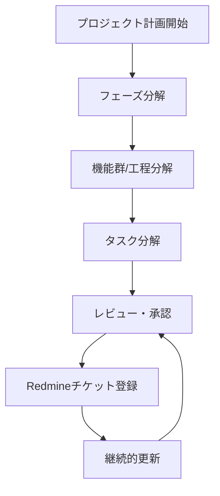
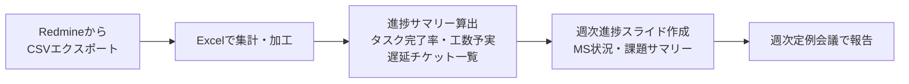
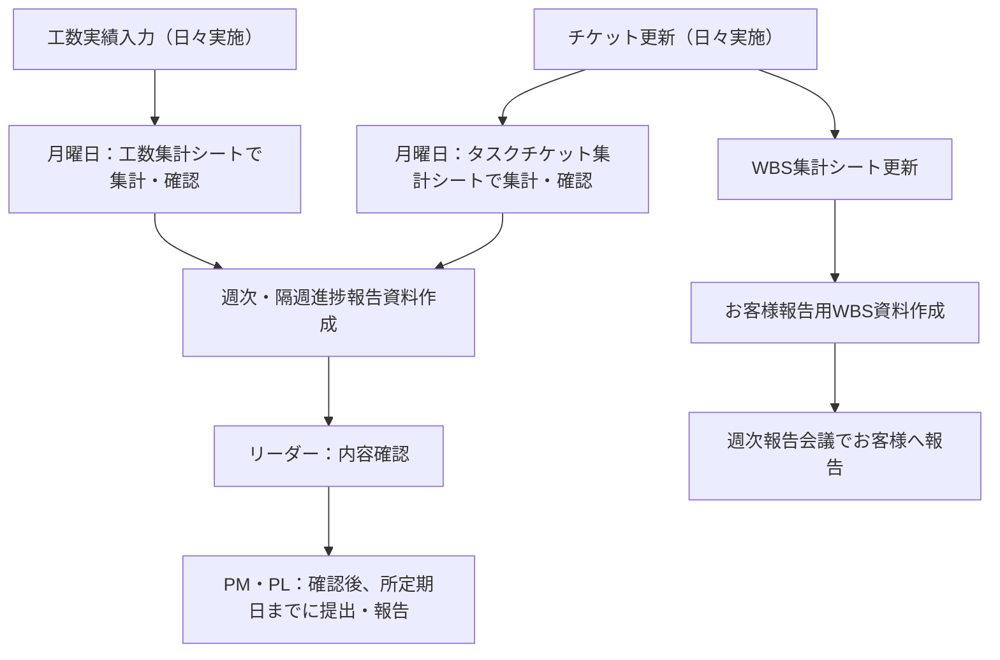
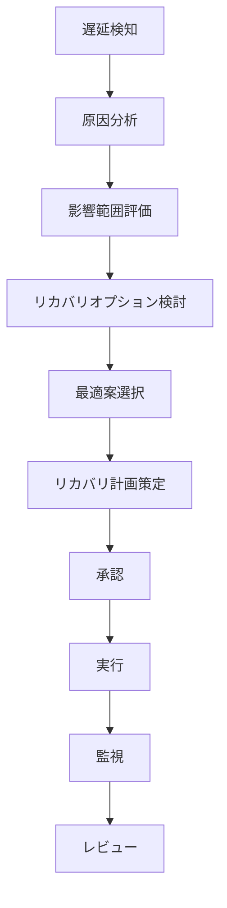
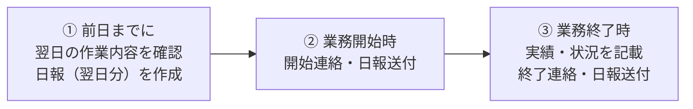
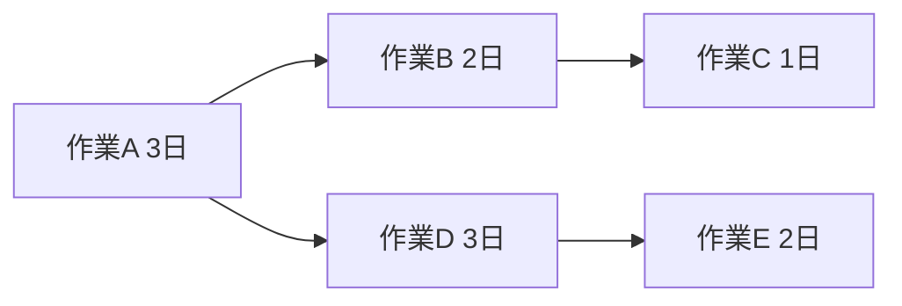

# 進捗管理計画書

## 目次

- [1. 進捗管理の基本方針](#1-進捗管理の基本方針)
  - [1.1 進捗管理の目的](#11-進捗管理の目的)
  - [1.2 進捗管理の原則](#12-進捗管理の原則)
  - [1.3 進捗管理の対象範囲](#13-進捗管理の対象範囲)
  - [1.4 QCDとプロジェクト成功の関係](#14-qcdとプロジェクト成功の関係)
- [2. マイルストーン管理](#2-マイルストーン管理)
  - [2.1 マイルストーン定義](#21-マイルストーン定義)
  - [2.2 マイルストーン管理プロセス](#22-マイルストーン管理プロセス)
    - [2.2.1 マイルストーン設定の基準](#221-マイルストーン設定の基準)
    - [2.2.2 マイルストーン達成判定](#222-マイルストーン達成判定)
    - [2.2.3 マイルストーン遅延時の対応](#223-マイルストーン遅延時の対応)
  - [2.3 クリティカルパス管理](#23-クリティカルパス管理)
    - [2.3.1 クリティカルパスの特定](#231-クリティカルパスの特定)
    - [2.3.2 クリティカルパスの監視](#232-クリティカルパスの監視)
- [3. WBS管理](#3-wbswork-breakdown-structure管理)
  - [3.1 WBS構造・粒度](#31-wbs構造粒度)
  - [3.2 WBS作成手順](#32-wbs作成手順)
    - [3.2.1 WBS作成の基本原則](#321-wbs作成の基本原則)
    - [3.2.2 WBS作成プロセス](#322-wbs作成プロセス)
    - [3.2.3 WBSタスク定義テンプレート](#323-wbsタスク定義テンプレート)
  - [3.3 ベースラインの変更管理](#33-ベースラインの変更管理)
  - [3.4 日程計画の階層（大日程・中日程・小日程）](#34-日程計画の階層大日程中日程小日程)
    - [3.4.1 工数計画](#341-工数計画)
  - [3.5 作業計画時のポイント](#35-作業計画時のポイント)
- [4. Redmineによるチケット管理](#4-redmineによるチケット管理)
  - [4.1 チケット設計方針](#41-チケット設計方針)
  - [4.2 チケット項目の定義と運用ルール](#42-チケット項目の定義と運用ルール)
    - [4.2.1 ステータス管理](#421-ステータス管理)
  - [4.3 進捗率の入力ルール](#43-進捗率の入力ルール)
    - [4.3.1 基本ルール：0/100法](#431-基本ルール0100法)
    - [4.3.2 長期タスクの場合：中間マイルストーン法](#432-長期タスクの場合中間マイルストーン法)
  - [4.4 親チケットによる構造化（推奨構成）](#44-親チケットによる構造化推奨構成)
  - [4.5 Redmineデータを使った進捗集計](#45-redmineデータを使った進捗集計)
    - [4.5.1 基本的な集計指標](#451-基本的な集計指標)
    - [4.5.2 EVM指標とRedmineフィールドの対応](#452-evm指標とredmineフィールドの対応)
    - [4.5.3 Redmine → Excel 集計 → スライド報告フロー](#453-redmine--excel-集計--スライド報告フロー)
- [5. 残工数管理](#5-残工数管理)
  - [5.1 残工数の概念と目的](#51-残工数の概念と目的)
  - [5.2 残工数の計算例](#52-残工数の計算例)
  - [5.3 残工数の入力ルール](#53-残工数の入力ルール)
  - [5.4 残工数の活用方法（管理者視点）](#54-残工数の活用方法管理者視点)
- [6. 工程完了チェックリスト（Phase Exit Criteria）](#6-工程完了チェックリストphase-exit-criteria)
  - [6.1 要件定義完了チェックリスト](#61-要件定義完了チェックリスト)
  - [6.2 基本設計完了チェックリスト](#62-基本設計完了チェックリスト)
  - [6.3 製造完了チェックリスト](#63-製造完了チェックリスト)
  - [6.4 結合テスト完了チェックリスト](#64-結合テスト完了チェックリスト)
  - [6.5 総合テスト完了チェックリスト](#65-総合テスト完了チェックリスト)
  - [6.6 リリース判定チェックリスト](#66-リリース判定チェックリスト)
- [7. 進捗測定方法](#7-進捗測定方法)
  - [7.1 進捗率の計算方法](#71-進捗率の計算方法)
  - [7.2 EVM（Earned Value Management）による進捗測定](#72-evmearned-value-managementによる進捗測定)
  - [7.3 バーンチャートによる進捗可視化](#73-バーンチャートによる進捗可視化)
- [8. 進捗報告](#8-進捗報告)
  - [8.1 進捗管理のツール・フォーマット体系](#81-進捗管理のツールフォーマット体系)
  - [8.2 報告資料作成フロー](#82-報告資料作成フロー)
  - [8.3 進捗報告会議体の種類](#83-進捗報告会議体の種類)
  - [8.4 進捗報告会議アジェンダ](#84-進捗報告会議アジェンダ)
    - [8.4.1 週次定例進捗会議](#841-週次定例進捗会議-weekly-progress-meeting)
    - [8.4.2 進捗報告フロー](#842-進捗報告フロー)
  - [8.5 進捗報告テンプレート](#85-進捗報告テンプレート)
    - [8.5.1 週次進捗報告書](#851-週次進捗報告書)
    - [8.5.2 月次進捗報告書](#852-月次進捗報告書)
  - [8.6 進捗報告の頻度と対象者](#86-進捗報告の頻度と対象者)
- [9. 遅延時のリカバリ計画](#9-遅延時のリカバリ計画)
  - [9.1 遅延検知の基準](#91-遅延検知の基準)
    - [9.1.1 遅延の定義とアクション](#911-遅延の定義とアクション)
    - [9.1.2 遅延検知のタイミング](#912-遅延検知のタイミング)
  - [9.2 リカバリ計画の策定プロセス](#92-リカバリ計画の策定プロセス)
  - [9.3 リカバリオプション](#93-リカバリオプション)
    - [9.3.1 リソース追加（クラッシング）](#931-リソース追加クラッシング)
    - [9.3.2 スケジュール調整（ファストトラッキング）](#932-スケジュール調整ファストトラッキング)
    - [9.3.3 スコープ調整（作業内容の見直し）](#933-スコープ調整作業内容の見直し)
    - [9.3.4 「普通にやっても終わらない場合」の対処フロー](#934-普通にやっても終わらない場合の対処フロー)
    - [9.3.5 キャッチアップ計画書に含める項目](#935-キャッチアップ計画書に含める項目)
  - [9.4 実行中の進捗確認ポイント](#94-実行中の進捗確認ポイント)
- [10. 進捗管理ツール](#10-進捗管理ツール)
  - [10.1 Redmineの活用](#101-redmineの活用)
  - [10.2 その他のツール](#102-その他のツール)
- [11. 進捗レビューと日報運用](#11-進捗レビューと日報運用)
  - [11.1 進捗レビューの種類](#111-進捗レビューの種類)
    - [11.1.1 日次スタンドアップ（夕会）](#1111-日次スタンドアップ夕会)
    - [11.1.2 週次進捗レビュー](#1112-週次進捗レビュー)
    - [11.1.3 月次ステークホルダーレビュー](#1113-月次ステークホルダーレビュー)
  - [11.2 進捗レビューの実施手順](#112-進捗レビューの実施手順)
  - [11.3 日報の運用](#113-日報の運用)
    - [11.3.1 日報の目的](#1131-日報の目的)
    - [11.3.2 日報の運用フロー](#1132-日報の運用フロー)
    - [11.3.3 日報フォーマット（開始時）](#1133-日報フォーマット開始時)
    - [11.3.4 日報フォーマット（終了時）](#1134-日報フォーマット終了時)
- [12. リソース負荷管理](#12-リソース負荷管理)
  - [12.1 リソース負荷の可視化](#121-リソース負荷の可視化)
  - [12.2 リソース負荷の調整](#122-リソース負荷の調整)
- [13. 進捗管理の継続的改善](#13-進捗管理の継続的改善)
  - [13.1 進捗管理プロセスの見直し](#131-進捗管理プロセスの見直し)
  - [13.2 ベストプラクティスの共有](#132-ベストプラクティスの共有)
- [付録](#付録)
  - [A. 進捗管理チェックリスト](#a-進捗管理チェックリスト)
  - [B. Redmineカスタムクエリ例](#b-redmineカスタムクエリ例)
  - [C. 用語集](#c-用語集)
  - [D. 参考資料](#d-参考資料)
  - [E. バッファ管理とCCPM（クリティカルチェーン法）](#e-バッファ管理とccpmクリティカルチェーン法)

---

## 1. 進捗管理の基本方針

### 1.1 進捗管理の目的
プロジェクトの進捗を正確に把握し、計画との差異を早期に検知することで、適切なリカバリ策を講じ、プロジェクト目標の達成を確実にする。

### 1.2 進捗管理の原則
- **可視化**: 進捗状況を誰もが理解できる形で可視化する
- **定量的**: 主観的な判断ではなく、定量的な指標で評価する
- **リアルタイム**: 遅延や課題を早期に発見し、迅速に対応する
- **透明性**: 進捗情報を関係者全員で共有し、透明性を保つ
- **継続的改善**: 進捗管理プロセス自体を継続的に改善する

### 1.3 進捗管理の対象範囲
- スケジュール進捗（マイルストーン、タスク完了状況）
- 工数進捗（計画工数 vs 実績工数）
- 成果物進捗（成果物の完成度、品質）
- リソース進捗（人員配置、稼働状況）

### 1.4 QCDとプロジェクト成功の関係

プロジェクトのGOALは、**Q（品質）・C（コスト）・D（納期）** の3つを守って成果物を届けることにある。進捗管理とは、このGOALを達成するために、計画通りに進んでいるかをチェックし、差異があれば早めに是正する活動である。


```mermaid
graph LR
  A[見積り・受注] --> B[プロジェクト計画] --> C[プロジェクト実行]
```

| 状態 | 結果 |
| :--- | :--- |
| 計画通り＝うまくいっている | 予定通りGOALを迎える |
| 計画通りではない場合 | 納期遅れ・コスト超過・品質低下 |

> [!WARNING]
> 計画と差異が発生しても対策を講じなければ、プロジェクトは失敗する。典型的な失敗例として、製造工程に計画の倍の工数がかかった結果、当初見込んでいた利益がゼロになるケースがある。差異の検知が遅れるほどリカバリコストは増大する。

#### 進捗管理はPDCAサイクルで行う

「管理」とは良い状態を維持する活動である。PDCAサイクルを回すことで、継続的に良い状態を維持する。

| フェーズ | 実施内容 |
| :--- | :--- |
| **PLAN** | 計画値（測定値）・良い状態の基準・チェック方法・差異が出た時の対策を決める |
| **DO** | 計画値の実績を計測・収集する |
| **CHECK** | 計画値と実績の差異を確認・評価する。差異が発生した根本原因を分析する（ムリ・ムラ・ムダは無いか？） |
| **ACT** | 根本原因に対して対策を実施する。プロセス・フォーマットを見直し、再発防止・標準化を行う |

#### 個人の計画遵守がプロジェクト全体を守る

プロジェクト全体の計画は、個人の作業計画の積み上げである。各メンバーが自分の計画（期日・工数）を守ることが、プロジェクト全体の計画を守ることに直結する。

> [!NOTE]
> 計画はリーダーと相談して自分で決めたもの。責任をもってやり遂げる努力をすることが大前提。計画との差異が発生しそうな場合は、まず自分なりに原因と対策を考えた上で、早めにリーダーへ報告・連絡・相談すること。

---

## 2. マイルストーン管理

### 2.1 マイルストーン定義

| ID | マイルストーン名 | 予定日 | 完了条件 | 進捗率 | 依存関係 | クリティカルパス |
| :--- | :--- | :--- | :--- | :--- | :--- | :--- |
| MS1 | キックオフ | 202X/04/01 | 全員参加、計画書合意 | 0% | - | Yes |
| MS2 | 要件定義完了 | 202X/05/31 | 要件定義書レビュー承認 | 0% | MS1 | Yes |
| MS3 | 基本設計完了 | 202X/07/31 | 画面・DB設計凍結 | 0% | MS2 | Yes |
| MS4 | 総合テスト開始 | 202X/10/01 | 結合テスト修正完了 | 0% | MS3 | Yes |
| MS5 | リリース判定 | 202X/11/15 | UAT完了、重要課題0件 | 0% | MS4 | Yes |
| MS6 | サービスイン | 202X/12/01 | 本番移行完了確認 | 0% | MS5 | Yes |

### 2.2 マイルストーン管理プロセス

#### 2.2.1 マイルストーン設定の基準
- **明確な完了条件**: 完了条件は測定可能で、客観的に判定できるものとする
- **適切な間隔**: マイルストーン間は4～8週間程度を目安とする
- **関係者合意**: 全てのステークホルダーがマイルストーンと完了条件に合意していること

#### 2.2.2 マイルストーン達成判定
マイルストーン達成判定は以下の手順で実施する：

1. **事前確認（マイルストーン1週間前）**
   - 完了条件の達成状況を確認
   - 未達成項目があればリカバリ計画を策定

2. **判定会議（マイルストーン当日）**
   - 完了条件の達成状況をレビュー
   - 全条件が満たされている場合のみ「達成」と判定
   - 未達成項目がある場合は「条件付き達成」または「未達成」と判定

3. **事後報告（マイルストーン達成後3日以内）**
   - マイルストーン達成報告書を作成
   - 次のマイルストーンに向けた準備状況を確認

#### 2.2.3 マイルストーン遅延時の対応
- **遅延予測（2週間前）**: 遅延が予測される場合は、リカバリ計画を策定し、関係者に報告
- **遅延発生時**: 遅延の原因分析を行い、影響範囲を評価。必要に応じて後続マイルストーンの調整を検討

### 2.3 クリティカルパス管理

#### 2.3.1 クリティカルパスの特定
プロジェクト全体のスケジュールに影響を与えるクリティカルパスを特定し、重点的に管理する。

```mermaid
gantt
    title クリティカルパス
    dateFormat  YYYY-MM-DD
    section 要件定義
    キックオフ           :crit, ms1, 202X-04-01, 1d
    要件定義作業         :crit, req, 202X-04-02, 60d
    要件定義完了         :crit, ms2, 202X-05-31, 1d
    section 設計
    基本設計作業         :crit, design, 202X-06-01, 61d
    基本設計完了         :crit, ms3, 202X-07-31, 1d
    section 製造・テスト
    製造・結合テスト     :crit, dev, 202X-08-01, 61d
    総合テスト開始       :crit, ms4, 202X-10-01, 1d
    section リリース
    UAT・リリース判定    :crit, release, 202X-10-02, 45d
    サービスイン         :crit, ms6, 202X-12-01, 1d
```

#### 2.3.2 クリティカルパスの監視
- **週次レビュー**: クリティカルパス上のタスクの進捗を週次でレビュー
- **バッファ管理**: クリティカルパス上のバッファを適切に管理し、消費状況を監視
- **リスク管理**: クリティカルパス上のリスクを重点的に管理

---

## 3. WBS（Work Breakdown Structure）管理

### 3.1 WBS構造・粒度

Work Breakdown Structure は以下の階層で管理し、Redmineのチケットと対応させる。

- **Level 1 (フェーズ)**: 要件定義、設計、製造、テスト、リリース
- **Level 2 (機能群/工程)**: 受注機能、在庫機能、出荷機能など
- **Level 3 (タスク)**: 画面設計、ロジック実装、単体テストなど（担当者アサイン単位、標準1週間・最大3週間）
- **Level 4 (サブタスク)**: チェックリスト項目等（必要に応じて）

> [!NOTE]
> Level 3のタスクがRedmineの子チケット（担当者・期日・工数を持つ実作業単位）に対応する。Level 1・2は親チケットとして構造化することで、Redmine上でフェーズ・機能単位の集計が可能になる。

### 3.2 WBS作成手順

#### 3.2.1 WBS作成の基本原則
1. **完全性**: プロジェクトの全作業を漏れなく含める
2. **相互排他性**: タスク間の重複を避ける
3. **適切な粒度**: 管理可能なサイズに分解する（目安：1タスクあたり1週間＝40時間以内）
4. **成果物指向**: タスクは成果物の完成を目的とする

#### 3.2.2 WBS作成プロセス

```mermaid
graph TD
    Start[プロジェクト計画開始] --> Phase[フェーズ分解]
    Phase --> Feature[機能群/工程分解]
    Feature --> Task[タスク分解]
    Task --> Review[レビュー・承認]
    Review --> Register[Redmineチケット登録]
    Register --> Update[継続的更新]
    Update --> Review
```

#### 3.2.3 WBSタスク定義テンプレート

各タスクには以下の情報を定義する：

| 項目 | 説明 | 例 |
| :--- | :--- | :--- |
| **タスクID** | 一意の識別子（Redmineチケット番号） | #1042 |
| **タスク名** | タスクの名称 | 受注画面の要件定義 |
| **説明** | タスクの詳細説明 | 受注画面の機能要件、非機能要件を定義する |
| **担当者** | 責任者（1名） | （担当者名） |
| **予定工数** | 計画工数（時間） | 16時間 |
| **開始日（開始予定）** | 計画開始日 | 202X/04/05 |
| **期日（終了予定）** | 計画完了日 | 202X/04/12 |
| **依存関係** | 先行タスク | #1040（プロジェクトキックオフ） |
| **成果物** | 期待される成果物 | 受注画面要件定義書 |
| **完了条件** | タスク完了の判定基準 | 要件定義書レビュー承認 |

### 3.3 ベースラインの変更管理
プロジェクト計画承認時点のスケジュールを「ベースライン」として保存する。スケジュール変更が発生した場合（遅延の公式なリスケジュール等）、ベースラインの書き換えは変更管理委員会（CCB）の承認を必要とし、独断での変更は認めない。

- **ベースライン設定**: プロジェクト計画承認時に、WBS・マイルストーン・スケジュールをベースラインとして固定
- **ベースライン変更**: 変更管理プロセスに従い、CCBの承認を得る
- **ベースライン比較**: 定期的に実績とベースラインを比較し、差異を分析

### 3.4 日程計画の階層（大日程・中日程・小日程）

日程計画は以下の3階層で構成し、プロジェクト計画フェーズで上位から順に詳細化していく。

| 階層 | 対象範囲 | 主な記載内容 | 管理者 |
| :--- | :--- | :--- | :--- |
| **大日程** | プロジェクト全期間 | 各工程のマイルストーン・クリティカルパス・工程間の依存関係 | PM・PMO |
| **中日程** | 特定フェーズ | 工程内・フェーズ間のスケジュール、中分類タスク、システム間の依存関係 | PM・PMO・リーダー |
| **小日程** | 全タスク | 全タスクの担当者・期日・工数・進捗率・成果物（Redmineチケット） | リーダー・作業者 |

> [!TIP]
> 大日程はプロジェクト計画書に、中日程はフェーズ別スケジュール表に、小日程はRedmineのタスクチケットに対応させると管理の二重化が防げる。見積時に提示したスケジュールをベースとして大日程を確定し、プロジェクト開始後に中日程→小日程へと順次詳細化する。

#### 3.4.1 工数計画

見積時に提示した要員計画をベースに、フェーズ・担当者ごとに予定工数を計画する。

| 計画項目 | 記載内容 | 管理ツール |
| :--- | :--- | :--- |
| **要員計画** | 担当者・役割・フェーズごとの割当工数（人月・時間） | Excel / プロジェクト計画書 |
| **個人別予定工数** | タスクチケットに設定する時間単位の工数 | Redmine |

> [!NOTE]
> 個人別の予定工数は、1日8時間・営業日ベースで計算すること。休日・祝日・想定される会議時間を考慮した上で、実作業に充てられる稼働時間を算出して設定する。

### 3.5 作業計画時のポイント

タスクチケットをRedmineに登録する前に、担当者・リーダーがそれぞれ以下を確認し、責任をもって計画を立てること。

#### 担当者が確認すること

| 確認項目 | 具体的な問い |
| :--- | :--- |
| 作業内容の明確化 | 何をするのか、具体的にわかっているか？ |
| INPUT / OUTPUT | 作業に必要なインプットは何か？完成物（OUTPUT）は何か？ |
| 完了基準 | 何をもって「完了」とするか明確か？ |
| 期限 | いつまでに終わらせる必要があるか？ |
| 作業時間の見積もり | どれくらいの時間がかかるか？ |
| 制約・前提条件 | 他のタスクや外部依存がないか？ |

> [!WARNING]
> 不明点・不安点はリーダーに相談すること。「とりあえず着手してみる」は計画精度を下げ、後で大きな遅延につながる典型的なパターン。

#### リーダーが確認すること

| 確認項目 | 具体的な問い |
| :--- | :--- |
| 計画の実現可能性 | 担当者の計画に無理はないか？ |
| スキル適性 | タスクに対してスキルが適切か？ |
| チーム内の平準化 | 特定メンバーに負荷が集中していないか？ |
| 期日・工数の妥当性 | 期日と工数は整合しているか？ |
| 稼働時間の前提 | 1日8時間・営業日ベースで計画されているか？ |
| 成果物の網羅性 | 成果物に漏れはないか？ |

> [!TIP]
> リーダーはチーム全体の計画をPJT計画と照らし合わせ、変更が必要な場合はPMと早めに対応を検討すること。個人の計画がプロジェクト全体の計画に整合していない場合、後から調整するほど影響が大きくなる。

---

## 4. Redmineによるチケット管理

### 4.1 チケット設計方針

本プロジェクトでは、Redmineのタスクチケットを進捗管理の中心に置く。

**基本原則**:
- **1チケット = 1担当者 × 1タスク**: 複数人で行う作業は、担当者ごとにチケットを分割する
- **標準粒度は1週間（〜40時間）**: 作業の見通しが立てやすく、週次定例でのレビューに適した粒度
- **最大3週間（〜120時間）まで**: それ以上になる場合はタスク分割を検討する

> [!TIP]
> チケットの粒度が大きすぎると「やっているが終わらない」状態が長く続き、遅延の検知が遅れる。「2週間経っても進捗50%のまま」という状況になった時点で手遅れになりやすい。分割できない大きなタスクには、中間チェックポイントをコメントで定義しておくと週次確認がしやすい。

### 4.2 チケット項目の定義と運用ルール

| Redmine項目 | 意味 | 更新者 | 運用ルール |
| :--- | :--- | :--- | :--- |
| **開始日**（開始予定） | 作業を開始する計画日 | リーダー・担当者 | 計画時に必ず設定する。変更した場合はコメントに理由を残す |
| **期日**（終了予定） | 作業を完了する計画日 | リーダー・担当者 | 計画時に必ず設定する。ベースラインとして機能するため安易に変更しない |
| **開始日実績** | 実際に作業に着手した日 | 担当者 | 着手した当日に入力する |
| **終了日実績** | 実際に作業が完了した日 | 担当者 | ステータスを「完了」にする際に入力する |
| **予定工数** | 計画段階で見積もった工数（時間） | リーダー・PMO | 計画時に設定し、着手後は変更しない（ベースライン管理） |
| **作業時間** | 実際に費やした作業時間 | 担当者 | 作業日ごとに記録する（最低週次） |
| **残工数** | 計画工数−（現在までの実績工数＋この後完了するまでの見込み工数） | 担当者 | 毎日作業終了時に更新する。差異がなければ未入力でよい |
| **作業分類** | 該当する工程・作業の種別 | 担当者 | チケット更新時に適切な工程を選択する |

> [!WARNING]
> 「期日」と「予定工数」は着手後に変更しないことが重要。変更してしまうと計画値が失われ、予実比較ができなくなる。遅延が発生した場合は期日を変更するのではなく、コメントで遅延状況・原因・対策と新たな完了見込み日を記録する運用を推奨する。

#### 4.2.1 ステータス管理

| ステータス | 意味 | 条件 |
| :--- | :--- | :--- |
| **新規** | 未着手。計画済みチケット | 開始日前、または開始日になっても着手前 |
| **進行中** | 作業着手済み | 開始日実績を入力するタイミングで変更する |
| **フィードバック** | レビュー待ち・確認待ち | 成果物を提出しレビュアーの確認待ち状態 |
| **完了** | 作業完了・確認済み | 終了日実績を入力し、レビュー承認済みのもの |
| **却下** | 対象外・不要と判断 | スコープ変更等でタスクが不要になった場合 |

> [!NOTE]
> 「完了」は作業が終わっただけでなく、成果物のレビューが承認された状態を指す。「自分の作業は終わった」状態は「フィードバック」で止め、レビュー承認後に「完了」へ移行させる。これによりレビュー待ち件数が可視化できる。

### 4.3 進捗率の入力ルール

主観的な「90%シンドローム」（90%から進まない現象）を防ぐため、以下の客観的基準を使用する。

#### 4.3.1 基本ルール：0/100法

原則として、完了基準を満たすまでは 0%、完了承認されて初めて 100% とする。

- **適用条件**: 1週間以内のタスク
- **Redmineでの運用**: ステータスが「完了」になった時点で進捗率を100%にする。それ以外は0%のまま

#### 4.3.2 長期タスクの場合：中間マイルストーン法

2週間以上のタスクは、予め中間チェックポイントを定義して進捗を計上する。

| タスク種別 | 中間ポイントの例 |
| :--- | :--- |
| 設計タスク | 着手(0%) → ドラフト作成完了(50%) → レビュー依頼(80%) → 指摘対応完了(100%) |
| 実装タスク | 着手(0%) → 実装完了(60%) → 単体テスト完了(80%) → コードレビュー完了(100%) |
| テストタスク | 着手(0%) → テストケース作成完了(30%) → テスト実施完了(80%) → バグ修正完了(100%) |

### 4.4 親チケットによる構造化（推奨構成）

フェーズ全体の進捗や工程の終了を把握しやすくするため、以下の親チケット構造を推奨する。

```
[親チケット] フェーズ / 機能群
  ├── [子チケット] 個別タスク（担当者・期日・工数あり）
  ├── [子チケット] 個別タスク
  └── [子チケット] 工程終了チェック（フェーズ完了判定用・最後に配置）
```

**親チケットの活用ポイント**:
- 子チケットの進捗率を自動集計することでフェーズ全体の進捗が把握できる
- 「工程終了チェック」チケットを最後に配置することで、フェーズ完了の確認漏れを防げる
- Redmineのガントチャートビューで親子構造が視覚的に確認できる

> [!TIP]
> 親チケットの期日はそのフェーズ・機能群のマイルストーン日に合わせる。子チケットが全て完了しても親チケットは手動で完了にするため、「親チケットの完了 = フェーズ完了判定会議の承認」として運用するとマイルストーン管理と連動しやすい。

### 4.5 Redmineデータを使った進捗集計

#### 4.5.1 基本的な集計指標

Redmineのチケット情報から以下の指標を算出する。

| 指標 | 算出方法 |
| :--- | :--- |
| **タスク完了率** | 完了チケット数 ÷ 全チケット数 × 100 |
| **工数進捗率（計画ベース）** | 完了チケットの予定工数合計 ÷ 全チケットの予定工数合計 × 100 |
| **工数消化率（実績ベース）** | 全チケットの作業時間合計 ÷ 全チケットの予定工数合計 × 100 |
| **遅延チケット数** | 期日を過ぎてステータスが完了でないチケットの数 |

#### 4.5.2 EVM指標とRedmineフィールドの対応

設計・製造工程ではEVM（Earned Value Management）による進捗測定を補助的に活用する。

| EVM指標 | Redmineデータからの算出方法 |
| :--- | :--- |
| **PV（計画価値）** | 基準日時点で期日が到来しているチケットの「予定工数」の合計 |
| **EV（出来高）** | 基準日時点で完了しているチケットの「予定工数」の合計 |
| **AC（実コスト）** | 基準日時点での全チケットの「作業時間」の合計 |

```
SPI（スケジュール効率） = EV ÷ PV　（1.0未満で遅延）
CPI（コスト効率）       = EV ÷ AC　（1.0未満で工数超過）
```

> [!NOTE]
> EVMは設計・製造フェーズのように作業量が大きく計測しやすい工程で特に有効。要件定義のような成果物の完成度が見えにくいフェーズでは、タスク完了率やマイルストーン達成状況で補完する。

#### 4.5.3 Redmine → Excel 集計 → スライド報告フロー


```mermaid
graph LR
    A[Redmineから\nCSVエクスポート] --> B[Excelで集計・加工]
    B --> C[進捗サマリー算出\nタスク完了率・工数予実\n遅延チケット一覧]
    C --> D[週次進捗スライド作成\nMS状況・課題サマリー]
    D --> E[週次定例会議で報告]
```

**Excelでの集計項目（推奨シート構成）**:

| シート | 内容 |
| :--- | :--- |
| **サマリー** | 全体タスク完了率・工数予実・EVM指標（SPI/CPI） |
| **遅延チケット一覧** | 期日超過チケット（担当者・遅延日数・原因・対策） |
| **担当者別負荷** | 担当者ごとの予定工数・作業時間・残工数 |
| **マイルストーン状況** | 各MSの予定日・見込み日・差異 |
| **週別進捗グラフ** | 予定進捗率（点線）と実績進捗率（実線）の推移 |

> [!TIP]
> RedmineのCSVエクスポートで全フィールドを出力し、集計列をExcelで固定化しておけば、毎週CSVを貼り付けるだけで集計が自動更新される形にできる。報告作業の省力化に効果的。エクスポート対象フィールドは「チケット番号・題名・担当者・開始日・期日・開始日実績・終了日実績・予定工数・作業時間・残工数・ステータス・進捗率」を基本とする。

---

## 5. 残工数管理

### 5.1 残工数の概念と目的

**残工数**とは、あるタスクを完了させるために「今後さらに必要な工数」と計画工数とのズレを示す指標である。日々残工数を更新することで、計画との差異を早期に検知し、対策を講じることができる。

```
残工数 ＝ 計画工数 ― （現在までの実績工数 ＋ この後完了するまでの見込み工数）
```

- **残工数 = 0（マイナスに近い）**: 計画通り、または計画より早く終わる見込み
- **残工数 < 0**: 計画より工数が超過する見込み → 早急な原因分析と対策が必要
- **残工数 > 0**: 計画より工数が少なく済む見込み → 計画誤り・スコープ漏れの可能性を確認

> [!TIP]
> 管理者は担当者別の残工数を集計するだけで、プロジェクト全体の健全性を把握できる。EVM（バーンダウンチャート等）と組み合わせると、完了見込み日をより正確に予測できる。

### 5.2 残工数の計算例

#### 例1：計画に対して工数が不足する場合（コスト超過・納期遅延の兆候）

| | |
| :--- | :--- |
| 計画工数 | 10h |
| 現在の実績工数 | 5h |
| この後の見込み工数 | 10h |

```
残工数 = 10h ― (5h + 10h) = ―5h
```

→ 計画に対して5時間の工数超過が見込まれる。コスト超過・納期遅れへの対策が必要。

#### 例2：計画に対して余剰が発生する場合

| | |
| :--- | :--- |
| 計画工数 | 20h |
| 現在の実績工数 | 5h |
| この後の見込み工数 | 5h |

```
残工数 = 20h ― (5h + 5h) = 10h
```

→ 計画に対して10hの余剰。生産性向上・計画誤り・スコープ漏れのいずれかを確認する。

### 5.3 残工数の入力ルール

**作業担当者は、毎日作業終了時に以下の基準で入力する。**

| 状況 | 残工数の入力値 |
| :--- | :--- |
| 予定工数通りに終わる見込み | 未入力（0）でOK |
| 予定工数より5時間多くかかりそう | `-5` を入力 |
| 予定工数より2時間早く終わりそう | `2` を入力 |

**思考プロセスの例**:

> この作業は20時間の計画だな
> 今日まで10時間やった
> でもまだ半分もできていない
> 予定より5時間多くかかりそう → 残工数に `-5` を入力
> その後さらに遅れている → 残工数を `-10` に更新

> [!WARNING]
> 計画との差異が大きくなりそう（残業しても期日を守れない、自分の力ではどうにもならない）な場合は、速やかにリーダーへ報告・連絡・相談すること。ただし、計画はリーダーとも相談して自分で決めたもの。責任をもって自分でやり遂げる努力を惜しまないことが前提。

### 5.4 残工数の活用方法（管理者視点）

リーダー・PMは、残工数を定期的に確認することで以下の観点でチェックを行う。

| チェック観点 | 確認内容 | 対応アクション |
| :--- | :--- | :--- |
| **工数不足の検知** | 残工数がマイナスのチケットを抽出 | 担当者にヒアリング、クラッシング・ファストトラッキング等を検討 |
| **余剰の確認** | 残工数が大きくプラスのチケットを抽出 | スコープ漏れ・計画誤りの確認、他タスクへのリソース配分を検討 |
| **全体工数見通し** | 担当者ごとの残工数合計を集計 | プロジェクト完了までの総工数見通しを算出 |

> [!NOTE]
> Redmineのカスタムクエリで担当者・期間を絞り込み、残工数フィールドを表示することで、チームの残工数状況を一覧で確認できる。週次の進捗確認ルーティンに組み込むことを推奨する。

---

## 6. 工程完了チェックリスト（Phase Exit Criteria）

### 6.1 要件定義完了チェックリスト

#### 6.1.1 成果物チェック
- [ ] 全ての業務フロー図がユーザー部門と合意・承認されている
- [ ] 機能一覧と画面一覧、帳票一覧に不整合がない
- [ ] 非機能要件（性能、セキュリティ、運用）の目標値が定義されている
- [ ] 要件定義書のレビュー指摘事項が全てクローズしている
- [ ] 要件トレーサビリティマトリクスが作成されている
- [ ] 外部インターフェース要件が定義されている
- [ ] データ移行要件が定義されている

#### 6.1.2 プロセスチェック
- [ ] ステークホルダーレビューが完了している
- [ ] 要件定義書のバージョン管理が適切に行われている
- [ ] 変更管理プロセスに従って要件変更が管理されている
- [ ] Redmineの当フェーズチケットが全て完了している

### 6.2 基本設計完了チェックリスト

#### 6.2.1 成果物チェック
- [ ] 画面・遷移図が全て作成され、レビュー承認されている
- [ ] ER図・テーブル定義書が作成され、レビュー承認されている
- [ ] インターフェース定義書（API仕様書）が作成されている
- [ ] 画面設計書とDB設計書の整合性が確認されている
- [ ] 非機能要件（性能、セキュリティ）の設計方針が文書化されている
- [ ] 設計レビュー指摘事項が全てクローズしている

#### 6.2.2 プロセスチェック
- [ ] 設計レビューが完了している
- [ ] 設計書のバージョン管理が適切に行われている
- [ ] 設計変更が変更管理プロセスに従って管理されている
- [ ] Redmineの当フェーズチケットが全て完了している

### 6.3 製造完了チェックリスト

#### 6.3.1 成果物チェック
- [ ] 全機能の実装が完了している
- [ ] 単体テストが完了し、テスト成績書が作成されている
- [ ] コードレビューが完了している
- [ ] コーディング規約に準拠している
- [ ] ソースコードがバージョン管理システムに登録されている

#### 6.3.2 プロセスチェック
- [ ] 単体テストのカバレッジが目標値を達成している
- [ ] コードレビュー指摘事項が全て修正されている
- [ ] 結合テスト準備が完了している
- [ ] Redmineの当フェーズチケットが全て完了している

### 6.4 結合テスト完了チェックリスト

#### 6.4.1 成果物チェック
- [ ] 結合テスト仕様書が作成されている
- [ ] 結合テストが完了し、テスト成績書が作成されている
- [ ] テストで検出されたバグが修正されている（S/Aランクは必須）
- [ ] 回帰テストが実施されている

#### 6.4.2 プロセスチェック
- [ ] 結合テストのカバレッジが目標値を達成している
- [ ] テスト環境が本番環境と同等の構成になっている
- [ ] 総合テスト準備が完了している
- [ ] Redmineの当フェーズチケットが全て完了している

### 6.5 総合テスト完了チェックリスト

#### 6.5.1 成果物チェック
- [ ] 総合テスト仕様書が作成されている
- [ ] 総合テストが完了し、テスト成績書が作成されている
- [ ] 性能テストが実施され、目標値を達成している
- [ ] セキュリティテストが実施されている
- [ ] テストで検出されたバグが修正されている（S/Aランクは必須）

#### 6.5.2 プロセスチェック
- [ ] 総合テスト環境が本番環境と同等の構成になっている
- [ ] UAT準備が完了している
- [ ] Redmineの当フェーズチケットが全て完了している

### 6.6 リリース判定チェックリスト

#### 6.6.1 成果物チェック
- [ ] UAT（ユーザー受入テスト）が完了し、完了報告書が受領されている
- [ ] 残存バグに S/A ランクが存在しないこと
- [ ] Bランク以下の残存バグについて、運用回避策と改修計画が合意されている
- [ ] 本番移行手順書が作成されている
- [ ] 切り戻し基準・手順が明確化されている
- [ ] 運用マニュアルが作成されている

#### 6.6.2 プロセスチェック
- [ ] 本番移行手順書を用いたリハーサルが完了している
- [ ] リリース判定会議が開催され、リリース承認が得られている
- [ ] リリース後のサポート体制が整備されている

---

## 7. 進捗測定方法

### 7.1 進捗率の計算方法

主観による「90%シンドローム」（90%から進まない現象）を防ぐため、以下の客観的基準を用いる。

#### 7.1.1 0/100法
着手済みでも完了基準を満たすまでは0%、完了承認されて初めて100%とする。タスク粒度が細かい（1週間以内）場合に推奨される方法。

#### 7.1.2 マイルストーン加重法
長期間タスクの場合、予め定義した中間ポイント通過で進捗を計上する。（詳細は [4.3.2](#432-長期タスクの場合中間マイルストーン法) を参照）

#### 7.1.3 タスク完了率
```
タスク完了率 = 完了タスク数 / 全タスク数 × 100
```

#### 7.1.4 工数進捗率
```
工数進捗率（計画ベース） = 完了タスクの予定工数合計 / 全タスクの予定工数合計 × 100
工数消化率（実績ベース） = 作業時間合計 / 全タスクの予定工数合計 × 100
```

> [!NOTE]
> 工数消化率が工数進捗率を大きく上回っている場合（例：消化率60%・進捗率40%）、作業効率が計画より低いことを示す。逆に工数消化率が進捗率を大きく下回る場合は、Redmineへの作業時間の記録漏れを疑う。

#### 7.1.5 成果物進捗率
```
成果物進捗率 = 完成成果物数 / 計画成果物数 × 100
```

#### 7.1.6 マイルストーン進捗率
```
マイルストーン進捗率 = 達成マイルストーン数 / 全マイルストーン数 × 100
```

### 7.2 EVM（Earned Value Management）による進捗測定

#### 7.2.1 EVMの基本指標

| 指標 | 略称 | 説明 | Redmineデータからの算出 |
| :--- | :--- | :--- | :--- |
| **計画価値** | PV | 計画時点での計画工数の累計 | 期日が基準日以前のチケットの予定工数合計 |
| **出来高** | EV | 実際に完了した作業の計画工数 | 完了チケットの予定工数合計 |
| **実コスト** | AC | 実際に投入した工数 | 全チケットの作業時間合計 |

#### 7.2.2 EVMの差異指標

| 指標 | 略称 | 説明 | 計算式 | 判定基準 |
| :--- | :--- | :--- | :--- | :--- |
| **スケジュール差異** | SV | スケジュールの遅れ・進み | EV - PV | SV > 0: 進んでいる / SV < 0: 遅れている |
| **コスト差異** | CV | コストの超過・節約 | EV - AC | CV > 0: 節約 / CV < 0: 超過 |
| **スケジュール効率** | SPI | スケジュール効率 | EV / PV | 1.0が計画通り。0.9を下回ったらリカバリ検討 |
| **コスト効率** | CPI | コスト効率 | EV / AC | 1.0が計画通り。1.0を下回ったら工数超過 |

#### 7.2.3 EVMによる進捗レポート例

| 指標 | 計画値 | 実績値 | 差異 | 効率 | 評価 |
| :--- | :---: | :---: | :---: | :---: | :--- |
| **PV** | 500H | - | - | - | - |
| **EV** | - | 450H | - | - | - |
| **AC** | - | 480H | - | - | - |
| **SV** | - | - | -50H | - | 遅れ |
| **CV** | - | - | -30H | - | 超過 |
| **SPI** | 1.0 | - | - | 0.90 | 遅れ |
| **CPI** | 1.0 | - | - | 0.94 | 超過 |

#### 7.2.4 EVMによる完了予測

| 指標 | 略称 | 説明 | 計算式 |
| :--- | :--- | :--- | :--- |
| **完了時コスト予測** | EAC | プロジェクト完了時の総コスト予測 | AC + (BAC - EV) / CPI |
| **完了時スケジュール予測** | SAC | プロジェクト完了時の総期間予測 | 計画期間 / SPI |
| **残作業コスト予測** | ETC | 残作業に必要なコスト予測 | (BAC - EV) / CPI |

### 7.3 バーンチャートによる進捗可視化

バーンチャートは以下の情報を含める：

- **計画線**: 計画された進捗（累積）
- **実績線**: 実際の進捗（累積）
- **差異**: 計画と実績の差異を明確に表示

実績線が計画線の下にある場合は遅延、上にある場合は計画より進んでいることを示す。傾きが急なほど進捗が速い。

---

## 8. 進捗報告

### 8.1 進捗管理のツール・フォーマット体系

プロジェクト開始時に以下のツール・フォーマットを準備し、役割ごとに活用する。

| 管理対象 | ツール・フォーマット | 作業者 | リーダー | PM・PMO |
| :--- | :--- | :---: | :---: | :---: |
| 大日程スケジュール | プロジェクト計画書（スライド/ドキュメント） | | | ○ |
| 中日程スケジュール | フェーズ別スケジュール表（Excel等） | | ○ | ○ |
| 小日程スケジュール | Redmineタスクチケット | ○ | ○ | ○ |
| 週次進捗報告 | 週次進捗報告書（Excel/スライド） | | ○ | ○ |
| チケット進捗集計 | Redmine CSV → Excel集計シート | | ○ | ○ |
| 工数実績管理 | Redmine 作業時間（またはプロジェクト工数管理システム） | ○ | ○ | ○ |
| 要員計画 | 要員計画表（Excel） | | | ○ |
| 日報 | 日報フォーマット（Excel/ドキュメント） | ○ | ○ | |

### 8.2 報告資料作成フロー


```mermaid
graph TD
  A[工数実績入力（日々実施）] --> B[月曜日：工数集計シートで集計・確認]
  C[チケット更新（日々実施）] --> D[月曜日：タスクチケット集計シートで集計・確認]
  B --> E[週次・隔週進捗報告資料作成]
  D --> E
  E --> F[リーダー：内容確認]
  F --> G[PM・PL：確認後、所定期日までに提出・報告]

  C --> H[WBS集計シート更新]
  H --> I[お客様報告用WBS資料作成]
  I --> J[週次報告会議でお客様へ報告]
```

### 8.3 進捗報告会議体の種類

プロジェクトの規模・体制に応じて、以下の会議体を設定する。

| 会議体 | 目的・内容 | 実施サイクル | 参加者 | 主な資料 |
| :--- | :--- | :--- | :--- | :--- |
| **チーム内朝会・夕会** | 個人の当日作業予定・実績確認、お困りごと相談、チーム内共有事項 | 日次（開始時・終了時） | チーム担当者全員 | Redmineチケット、日報 |
| **内部進捗会議** | チーム間の進捗・課題状況の共有と確認 | 週次 | リーダー以上 | Redmineチケット、進捗報告書 |
| **PJT全体進捗会議** | 全体進捗・課題・リスクの報告と意思決定 | 週次 | PM・PMO・PL全員 | 週次進捗報告書、EVM分析 |
| **ステークホルダー報告** | プロジェクト全体の健全性の報告と意思決定 | 月次またはMS毎 | プロジェクトオーナー・PM | 月次進捗報告書 |

> [!TIP]
> 朝会・夕会は15分以内を目安にする。「昨日やったこと」「今日やること」「困っていること」の3点のみ報告させ、詳細な議論は別途時間を取るルールにすると時間超過を防げる。

### 8.4 進捗報告会議アジェンダ

#### 8.4.1 週次定例進捗会議 (Weekly Progress Meeting)
**日時**: 毎週 〇曜 10:00-11:00
**参加者**: PM, PL全員, PMO

| 時間 | 内容 | 担当 | 備考 |
| :--- | :--- | :--- | :--- |
| 10:00-10:05 | 前回議事録・ToDo確認 | PM | 未完了ToDoの確認徹底 |
| 10:05-10:10 | 全体進捗概況報告 | PMO | 5分 |
| 10:10-10:30 | チーム別進捗報告 | 各PL | 20分。「順調です」は報告不要。遅延タスク・リスク・課題のみ報告する |
| 10:30-10:50 | 重要課題・リスクの討議 | PM | 20分。意思決定が必要な課題のみ扱う |
| 10:50-11:00 | 次週のリソース調整・連絡事項 | PM | 10分 |

#### 8.4.2 進捗報告フロー
- **メンバー → PL**: 毎日夕会（Daily Standup）にて「やったこと」「明日やること」「障害事項（ブロッカー）」を報告。Redmineチケットのステータス・作業時間・残工数の更新を必須とする
- **PL → PM**: 週次でチーム進捗を集計し、PMへ報告。予実差異の原因と対策を添える
- **PM → ステアリングコミッティ（オーナー/ユーザー）**: 月次またはマイルストーン毎に、プロジェクト全体の健全性を報告

### 8.5 進捗報告テンプレート

#### 8.5.1 週次進捗報告書

```markdown
# 第X週 進捗報告書
- **報告期間**: 202X/MM/DD ～ 202X/MM/DD
- **報告日**: 202X/MM/DD
- **報告者**: （PM名）

## 1. マイルストーン状況
| マイルストーン | 予定日 | 状況 | 備考 |
| :--- | :--- | :--- | :--- |
| MS2: 要件定義完了 | 202X/05/31 | 進行中 | 予定通り |

## 2. 進捗サマリー
- **全体タスク完了率**: 42/120チケット完了（35%）
- **工数進捗率**: 420H / 1200H（35%）
- **工数消化率**: 450H / 1200H（37.5%）※作業時間がやや多め
- **SPI**: 0.95（やや遅れ）/ **CPI**: 0.93（やや超過）
- **遅延チケット数**: 3件（担当者・原因・対策は別紙参照）

## 3. 今週の実績
### 完了したチケット（主要）
- [x] #1042 受注画面の要件定義
- [x] #1043 在庫画面の要件定義

### 進行中の主要チケット
- [ ] #1044 出荷画面の要件定義（進捗率: 60%・期日: 5/20）
- [ ] #1045 帳票要件定義（進捗率: 30%・期日: 5/22）

## 4. 来週の予定
- #1044 出荷画面の要件定義完了
- #1045 帳票要件定義完了
- #1046 インターフェース要件定義開始

## 5. 課題・リスク
### 課題
- **課題1**: #1044 出荷画面の要件定義がユーザー部門のレビュー待ちで停滞
  - **影響**: 期日（5/20）に間に合わない可能性
  - **対応策**: ユーザー部門と調整し、レビュー日程を5/17に前倒し依頼中

## 6. 要支援事項
- ユーザー部門へのレビュー日程確保のサポート
```

#### 8.5.2 月次進捗報告書

```markdown
# X月 進捗報告書
- **報告期間**: 202X年X月
- **報告日**: 202X/MM/DD
- **報告者**: （PM名）

## 1. プロジェクトサマリー
- **全体タスク完了率**: 45%（54/120チケット）
- **プロジェクト状況**: やや遅れ（SPI: 0.92）

## 2. マイルストーン状況
| マイルストーン | 予定日 | 実績日 | 状況 | 差異 |
| :--- | :--- | :--- | :--- | :--- |
| MS1: キックオフ | 202X/04/01 | 202X/04/01 | 完了 | 0日 |
| MS2: 要件定義完了 | 202X/05/31 | 202X/06/07 | 完了 | +7日 |
| MS3: 基本設計完了 | 202X/07/31 | - | 進行中 | - |

## 3. 進捗詳細
### フェーズ別進捗
| フェーズ | 計画工数 | 実績工数 | 完了チケット | 全チケット | 工数進捗率 |
| :--- | :---: | :---: | :---: | :---: | :---: |
| 要件定義 | 200H | 220H | 30 | 30 | 100% |
| 基本設計 | 300H | 180H | 24 | 40 | 60% |
| 製造 | 400H | 0H | 0 | 30 | 0% |
| テスト | 200H | 0H | 0 | 15 | 0% |
| リリース | 100H | 0H | 0 | 5 | 0% |
| **合計** | **1200H** | **400H** | **54** | **120** | **33%** |

### EVM分析
| 指標 | 値 | 評価 |
| :--- | :---: | :--- |
| PV | 450H | - |
| EV | 414H | - |
| AC | 400H | - |
| SV | -36H | 遅れ |
| CV | +14H | 節約 |
| SPI | 0.92 | やや遅れ |
| CPI | 1.04 | やや節約 |

## 4. リカバリ計画
- 基本設計フェーズでリソースを追加投入し、遅延を解消予定
```

### 8.6 進捗報告の頻度と対象者

| 報告種別 | 頻度 | 対象者 | 報告内容 |
| :--- | :--- | :--- | :--- |
| **日次進捗** | 毎日 | チーム内 | Redmineチケット更新・残工数更新・ブロッカー共有（朝会・夕会） |
| **週次進捗** | 毎週 | PM、PL | 週次進捗報告書（チケット集計ベース） |
| **月次進捗** | 毎月 | プロジェクトオーナー・ステークホルダー | 月次進捗報告書・EVM分析 |
| **マイルストーン報告** | MS達成時 | 全関係者 | マイルストーン達成報告書 |

---

## 9. 遅延時のリカバリ計画

### 9.1 遅延検知の基準

#### 9.1.1 遅延の定義とアクション

進捗遅延が発生した場合、その度合いに応じて以下のレベルで対応を行う。

| レベル | 遅延状況 | 定義 | アクション |
| :--- | :--- | :--- | :--- |
| **Lv 1** | 軽微な遅延 | クリティカルパス以外のタスクで1週間以内の遅延 | 担当者とPL間で残業やタスク順序入替により調整。週次報告で報告 |
| **Lv 2** | 注意 | クリティカルパス上で遅延発生、または SPI < 0.9 | PM主導でリカバリ策検討（要員追加、並行作業化）。オーナーへアラート通知 |
| **Lv 3** | 重大 | 回復不能な遅延、サービスインへの影響確実 | スコープ縮小（機能削減）またはリリース日の延期を経営層へ提案・決裁 |

> [!TIP]
> Redmineでは「期日 < 今日 かつ ステータス ≠ 完了」のカスタムクエリを保存しておくと、遅延チケットを週次報告前に即座に把握できる。このクエリを週次の確認ルーティンに組み込むことを推奨する。

#### 9.1.2 遅延検知のタイミング
- **日次**: Redmineチケットの期日超過・残工数のマイナスを確認し、遅延の予兆を検知
- **週次**: SPI/CPIを計算し、遅延の傾向を分析
- **マイルストーン2週間前**: 親チケットの完了状況からMS達成可能性を評価

### 9.2 リカバリ計画の策定プロセス


```mermaid
graph TD
    Detect[遅延検知] --> Analyze[原因分析]
    Analyze --> Impact[影響範囲評価]
    Impact --> Option[リカバリオプション検討]
    Option --> Select[最適案選択]
    Select --> Plan[リカバリ計画策定]
    Plan --> Approve[承認]
    Approve --> Execute[実行]
    Execute --> Monitor[監視]
    Monitor --> Review[レビュー]
```

### 9.3 リカバリオプション

Lv2以上の遅延が発生した場合、PLは以下の項目を含む「キャッチアップ計画書」を作成し、PMの承認を得る。

#### 9.3.1 リソース追加（クラッシング）
コスト（残業代、増員）を投じて期間を短縮する。
- **追加要員の投入**: 遅延しているタスクに追加要員を投入（Redmineで担当者を追加・チケット分割）
- **リソースの再配分**: 優先度の低いタスクからリソースを移動
- **作業時間の延長**: 必要に応じて残業や休日出勤を検討

> [!WARNING]
> クラッシングはコスト超過を招く可能性がある。また、当初計画にない要員追加は他チームへの影響も出るため、後続タスクへの波及を必ず確認すること。「10時間の遅れ → 1日2時間の残業で1週間で取り戻す」のように、回復の具体的なめどを明示した計画を立てること。

#### 9.3.2 スケジュール調整（ファストトラッキング）
本来直列に行うタスクを並行して行う。手戻りリスクが増えるため慎重に適用する。
- Redmineの依存関係を見直し、並行可能なチケットを特定する

> [!WARNING]
> 先行後行関係があるタスクを無理に並行させると、手戻りが発生し結果的に遅れが取り戻せない可能性がある。依存関係の強いタスクへの適用は慎重に判断すること。

#### 9.3.3 スコープ調整（作業内容の見直し）
- **機能の優先順位付け**: 必須機能を優先し、オプション機能を後回し
- **フェーズ分割**: 一部機能を次フェーズに延期（対象チケットを「却下」にし、新フェーズの親チケット配下に移動）
- **品質面の優先度調整**: 一部テストを後工程に委ねるなど、作業内容を圧縮する

> [!WARNING]
> 品質・コスト・納期はトレードオフの関係にある。全てを同時に満たすことは困難であり、どれを優先するかを経営判断として明確にした上で対策を選択すること。品質を下げると後続工程での手戻りが発生し、結果的に納期遅れ・コスト超過につながるリスクがあることを忘れないこと。
>
> | 調整方向 | メリット | デメリット |
> | :--- | :--- | :--- |
> | 品質重視 | 後工程の手戻りを減らせる | コスト増・納期延伸 |
> | コスト重視 | 収益を守れる | 品質低下・納期延伸リスク |
> | 納期重視 | 契約上のリスクを回避できる | コスト増・品質低下リスク |

#### 9.3.4 「普通にやっても終わらない場合」の対処フロー

タスク量が多すぎて、計画通りの作業ペースでは期日に間に合わないことが判明した場合、以下のアプローチを検討する。

**① タスクの圧縮（一部を後工程で担保）**
- 例: 単体テストの一部は結合テストでも担保できると判断し、単体ではスキップする
- ただし、前工程での品質を高めておく方が結果的に全体工数は下がることが多い

**② タスクの後回し（優先度による取捨選択）**
- 期日までに必ず完了すべきタスクとそうでないタスクを明確にし、後者を後回しにする
- ただし、次工程に入るとそちらの作業も優先度が上がるため、後回しタスクは埋もれやすい。明示的に管理すること

> [!WARNING]
> 「様子を見ながら少しずつ進める」アプローチは最もリスクが高い。気づいた時には納期に間に合わない状況になっている典型的なパターン。早い段階で「このペースでは終わらない」と判断し、対策を講じることが重要。

#### 9.3.5 キャッチアップ計画書に含める項目
1. **遅延の根本原因**: 技術力不足、仕様未決、突発休暇など
2. **影響範囲**: どのチケットが連鎖的に遅れるか（クリティカルパスへの影響）
3. **対策案**: クラッシング、ファストトラッキング、スコープ調整など
4. **後続作業への影響**: 自チーム・他チーム・PJT全体への連鎖的な影響
5. **回復予定日**: いつ元通りのスケジュールに戻るか

### 9.4 実行中の進捗確認ポイント

遅延を早期検知するために、担当者・リーダーそれぞれが日次・週次で以下を確認する。

#### 担当者が確認すること（日次）

- [ ] 進捗状況にあわせてチケット更新しているか（ステータス・開始終了実績・作業時間）
- [ ] あと何時間で終わる見込みか（残工数を更新しているか）
- [ ] 遅れがある場合、自分なりに理由と対策を考えているか
- [ ] 計画と大きく乖離しそうな場合、リーダーへ報告・連絡・相談しているか

#### リーダーが確認すること（週次）

- [ ] 担当者間で稼働率に偏りはないか
- [ ] スキル不足が原因で特定のタスクが止まっていないか
- [ ] 当初計画から割り込みタスクが増えていないか
- [ ] 計画値（予定工数・期日）の設定は妥当だったか
- [ ] ボトルネックになっているタスクはないか
- [ ] 時間外作業が想定より多く発生していないか
- [ ] ステータスに不整合はないか（例：「フィードバック」のままレビュー未依頼）
- [ ] 計画工数超過のチケットがないか
- [ ] 残工数がマイナスのチケットの原因と対策は確認済みか

---

## 10. 進捗管理ツール

### 10.1 Redmineの活用

本プロジェクトにおける進捗管理の中心ツールとしてRedmineを使用する。

| 機能 | 活用方法 |
| :--- | :--- |
| **チケット管理** | タスクの登録・担当者アサイン・期日管理・進捗率入力 |
| **ガントチャート** | フェーズ・機能単位の全体スケジュール確認 |
| **時間管理** | 作業時間の記録（予定工数との比較） |
| **カスタムクエリ** | 「期日超過チケット」「担当者別未完了チケット」等を保存・活用 |
| **CSVエクスポート** | 週次報告のためのデータ集計元として活用 |

**Redmineの運用ルール**:
- チケットには必ず「担当者」「期日」「予定工数」を設定する。未設定チケットは放置とみなす
- 作業時間・残工数は最低週次（毎週金曜日）で記録する
- ステータス変更時にはコメントで状況を一言残す（「レビュー依頼済み」「○○待ちのため保留」等）
- コードがないのに進捗100%はあり得ない。Gitのコミット状況と整合性を確認する

### 10.2 その他のツール

| ツール | 活用場面 |
| :--- | :--- |
| **Excel** | RedmineのCSVエクスポートをもとに集計・EVM算出・報告スライドのデータ作成 |
| **Microsoft Project** | 大規模プロジェクトでのガントチャート詳細管理 |
| **Jira** | アジャイル開発・スクラム管理が必要な場合 |

---

## 11. 進捗レビューと日報運用

### 11.1 進捗レビューの種類

#### 11.1.1 日次スタンドアップ（夕会）
- **頻度**: 毎日
- **時間**: 最大15分
- **参加者**: 各チーム内（PL + メンバー）
- **目的**: タスクのブロッキング要因を即座に発見し、PLが解消に動くため。進捗報告会ではない
- **内容**: 昨日完了したタスク / 今日実施するタスク / ブロッカー（障害事項）
- **ルール**: Redmineチケットのステータス・作業時間・残工数の更新を必須とする

#### 11.1.2 週次進捗レビュー
- **頻度**: 毎週
- **時間**: 1時間
- **参加者**: PM、PL、主要メンバー
- **内容**: Redmine集計ベースの週次進捗報告・課題・リスクの討議・リカバリ計画の検討

#### 11.1.3 月次ステークホルダーレビュー
- **頻度**: 毎月
- **時間**: 2時間
- **参加者**: プロジェクトオーナー、ステークホルダー、PM、PL
- **内容**: 月次進捗報告・EVM分析・重要課題・リスクの報告・意思決定事項の討議

### 11.2 進捗レビューの実施手順

1. **事前準備**: RedmineからCSVエクスポート → Excelで集計 → 進捗レポート作成 → 課題・リスクの整理
2. **レビュー実施**: 進捗状況の報告 → 課題・リスクの討議 → 意思決定事項の確認
3. **事後対応**: 議事録の作成・共有 → Redmineへのアクションアイテム登録 → 次回レビューまでの準備

### 11.3 日報の運用

#### 11.3.1 日報の目的

日報は単なる作業記録ではなく、以下の目的で運用する。

- 作業の進捗状況を共有・報告することで、計画見直し等の早期対策を可能にする
- 個人の工数意識を高め、作業のムリ・ムダ・ムラを減らして生産性向上を図る
- 遅れが発生した場合、原因と対策を個人が自ら考えることで今後の作業計画に活かす

#### 11.3.2 日報の運用フロー


```mermaid
graph LR
  A["① 前日までに\n翌日の作業内容を確認\n日報（翌日分）を作成"] --> B["② 業務開始時\n開始連絡・日報送付"]
  B --> C["③ 業務終了時\n実績・状況を記載\n終了連絡・日報送付"]
```

| 役割 | 前日まで | 業務開始時 | 業務終了時 |
| :--- | :--- | :--- | :--- |
| 担当者 | 翌日以降の作業内容を計画 | 開始連絡・日報送付 | 実績記載・終了連絡・日報送付 |
| リーダー | 翌日の作業内容を確認 | 内容確認 | 必要に応じて報連相・内容確認 |

> [!TIP]
> 開始・終了の連絡はチャット（Teams等）やメールで送付する運用が一般的。「日報」という形式にとらわれず、プロジェクトの規模や文化に合わせて簡素化してもよい。重要なのは「計画→実績→差異の原因と対策」の流れを毎日回すことにある。

#### 11.3.3 日報フォーマット（開始時）

作業開始時に、当日実施する予定の内容を記載して送付する。

| 作業日 | 工程 | 作業内容 | 作業GOAL（完了基準） | 予定(h) |
| :--- | :--- | :--- | :--- | :--- |
| MM/DD(月) | 内部設計 | ○○画面の内部設計書作成 | 作成完了・内部レビュー実施 | 2.0 |
| MM/DD(月) | PGM製造 | △△画面のプログラム作成 | 50%作成完了 | 4.0 |

**各項目の記載ルール（開始時）**:

| 項目 | ルール |
| :--- | :--- |
| **工程** | 実施している作業の適切な工程（要件定義・設計・製造・テスト等）を記載 |
| **作業内容** | 第三者が客観的に見てもわかるように具体的に記載（チケット番号・タイトルも記載すること） |
| **作業GOAL** | 当日の完了基準を可能な限り定量的に記載（「着手した」ではなく「○○まで作成完了」等） |
| **予定時間** | 作業予定時間を時間単位で記載 |

#### 11.3.4 日報フォーマット（終了時）

作業終了時に、実績・状況・遅れがある場合の理由と対策を追記して送付する。

| 作業日 | 工程 | 作業内容 | 作業GOAL | 予定(h) | 実績(h) | 状況 | 遅れがある場合、理由と対策 |
| :--- | :--- | :--- | :--- | :--- | :--- | :--- | :--- |
| MM/DD(月) | 内部設計 | ○○画面の内部設計書作成 | 作成完了・内部レビュー実施 | 2.0 | 2.0 | ○ | |
| MM/DD(月) | PGM製造 | △△画面のプログラム作成 | 50%作成完了 | 4.0 | 3.0 | × | レビュー指摘の修正に想定より時間がかかり遅れ。明日、本日完了分も含めて対応完了見込み |

**各項目の記載ルール（終了時）**:

| 項目 | ルール |
| :--- | :--- |
| **実績時間** | 実際に作業した時間を時間単位で記載 |
| **状況** | ○：完了 / ×：未完了 のいずれかで記載 |
| **遅れの理由と対策** | 遅れた理由・完了見込み日・残の作業時間・どうすれば完了できるか（残業対応か別の策か）を第三者にもわかるように記載する。自分で計画を立てた上でまず自分なりに考えてから記載すること |

> [!WARNING]
> 遅れが見込まれる場合は、業務終了前（遅くとも17時頃）までに作業管理者へ相談すること。終業間際や翌朝の報告では対策が間に合わないケースが多い。

> [!NOTE]
> 残工数（予定工数に対してどのくらい遅れる・早く終わる）はRedmineチケットに記録するため、日報では記載不要。日報では「計画と差異が発生した場合の理由と対策」を中心に確認する。

---

## 12. リソース負荷管理

### 12.1 リソース負荷の可視化

Redmineの担当者別チケット一覧・予定工数を集計することで、リソース負荷を把握する。

| リソース | 4月 | 5月 | 6月 | 7月 | 8月 | 負荷状況 |
| :--- | :---: | :---: | :---: | :---: | :---: | :--- |
| PM | 80% | 100% | 120% | 100% | 80% | 過負荷 |
| PL-A | 100% | 100% | 100% | 100% | 100% | 適正 |
| メンバーB | 60% | 80% | 100% | 100% | 80% | 適正 |
| メンバーC | 80% | 100% | 100% | 80% | 60% | 適正 |

**負荷状況の判定基準**:
- **過負荷**: 負荷率 > 120%
- **適正**: 80% ≤ 負荷率 ≤ 120%
- **アンダーロード**: 負荷率 < 80%

> [!TIP]
> Redmineで担当者フィルタを使い「未完了チケット」を担当者別に一覧して期日と予定工数の合計を確認すると、過負荷状態を早期に検知できる。特定の担当者に期日が近いチケットが集中している場合は早めにタスクの再配分を検討する。

### 12.2 リソース負荷の調整

**過負荷時の対応**:
- タスクの再配分（Redmineで担当者を変更）
- 追加リソースの投入
- 優先度の低いタスクの延期

**アンダーロード時の対応**:
- 他のタスクへのアサイン
- スキルアップの機会として活用
- 将来のタスクの前倒し

---

## 13. 進捗管理の継続的改善

### 13.1 進捗管理プロセスの見直し

**見直しのタイミング**:
- マイルストーン達成時
- プロジェクト完了時
- 重大な遅延発生時

**見直しの観点**:
- Redmineチケットの粒度・構造は適切だったか
- 作業時間・残工数の記録が適切に行われたか（記録漏れが多かったか）
- 集計・報告の工数は適切だったか（省力化の余地はあったか）
- 遅延の早期検知に有効なメトリクスは何だったか

### 13.2 ベストプラクティスの共有

- 効果的だったRedmineのカスタムクエリ・設定を記録する
- Excelの集計テンプレートを改善し、次プロジェクトへ引き継ぐ
- 遅延パターンと有効だったリカバリ策を文書化する

---

## 付録

### A. 進捗管理チェックリスト

#### A.1 プロジェクト開始時
- [ ] WBSが作成されている
- [ ] 大日程・中日程・小日程の日程計画が作成されている
- [ ] 要員計画・工数計画が作成されている
- [ ] Redmineにチケットが登録されている（担当者・期日・予定工数が全て設定済み）
- [ ] 親チケット構造（フェーズ・機能群）が設定されている
- [ ] マイルストーンが定義されている
- [ ] 進捗報告のルール（Redmine更新頻度・日報・集計タイミング等）が周知されている
- [ ] ExcelテンプレートがRedmineエクスポート形式に合わせて準備されている
- [ ] 会議体（朝会・夕会・週次会議等）のスケジュールが設定されている

#### A.2 プロジェクト実行中（週次確認）
- [ ] Redmineチケットのステータス・作業時間が更新されている
- [ ] 残工数がマイナスのチケットに対して原因と対策が確認されている
- [ ] 期日超過チケットが確認されている
- [ ] 週次進捗報告が実施されている
- [ ] SPI/CPIが計算されている
- [ ] 担当者間の負荷に偏りがないか確認されている
- [ ] リカバリ計画が適切に策定・実行されている

#### A.3 マイルストーン達成時
- [ ] 当フェーズのRedmineチケットが全て完了している
- [ ] 工程完了チェックリストが満たされている
- [ ] マイルストーン達成報告書が作成されている
- [ ] 次フェーズのRedmineチケットが準備されている

### B. Redmineカスタムクエリ例

#### B.1 基本クエリ一覧

| クエリ名 | フィルタ条件 | 用途 |
| :--- | :--- | :--- |
| **期日超過チケット** | 期日 < 今日 AND ステータス ≠ 完了 | 遅延チケットの即時把握 |
| **今週期日のチケット** | 期日 = 今週 AND ステータス ≠ 完了 | 週次の確認優先チケット |
| **担当者別未完了** | ステータス ≠ 完了 でグループ化（担当者別） | 負荷・進捗の担当者別確認 |
| **フェーズ別進捗** | 親チケット = 各フェーズ | フェーズ単位の完了状況確認 |
| **作業時間未記録** | 作業時間 = 0 AND ステータス = 進行中 | 記録漏れチケットの検出 |
| **残工数マイナスチケット** | 残工数 < 0 AND ステータス ≠ 完了 | 工数超過懸念チケットの把握 |

#### B.2 計画確認時のフィルター設定例

担当者別の作業計画を確認する際のフィルター例：

| フィルター項目 | 設定値 |
| :--- | :--- |
| ステータス | 「新規」「進行中」「フィードバック」（完了・却下を除く） |
| トラッカー | タスク管理トラッカーを選択 |
| 担当者 | 確認対象の担当者を選択 |
| 開始日 | 対象期間の開始日 |
| 期日 | 対象期間の終了日 |

**確認ポイント**: 担当者・対象期間で抽出し、1日8時間（週40時間）ベースで計画工数の合計が妥当かチェックする。

#### B.3 実行時のフィルター設定例（週次確認）

| フィルター項目 | 設定値 | 確認目的 |
| :--- | :--- | :--- |
| ステータス | 未完了 | 未完了タスクを対象にする |
| トラッカー | タスク管理トラッカー | 対象トラッカーに絞る |
| 担当者 | 対象担当者または「すべて」 | 個人別 or チーム全体で確認 |
| 期日 | 今週以前（期日超過を確認） | 遅延タスクの抽出 |

**実行時の確認ポイント**:
- ステータスに不整合はないか？（例：開始日を過ぎているのに「新規」のまま）
- レビュー待ちでレビュー未計画のチケットはないか？
- 計画工数に対して作業時間が大幅に超過していないか？
- 残工数がマイナスのチケットに対して、原因確認と対策が取られているか？
- 開始予定に対して開始が遅れているチケットはないか？

#### B.4 チーム・フェーズ単位の集計確認例

フィルターの抽出単位で集計し、「作業時間合計」「計画工数合計」「残工数合計」を確認することで、チームやフェーズ単位の工数状況を把握できる。

```
例：フェーズ「内部設計」、チーム「管理系」で絞り込み
  作業時間: 251h　計画工数: 367h　残工数: ―24h
  → 計画工数の約68%消化、残工数がマイナスなので工数超過の懸念あり → 原因分析が必要
```

### C. 用語集

| 用語 | 説明 |
| :--- | :--- |
| **WBS** | Work Breakdown Structure（作業分解構造） |
| **EVM** | Earned Value Management（出来高管理） |
| **PV** | Planned Value（計画価値） |
| **EV** | Earned Value（出来高） |
| **AC** | Actual Cost（実コスト） |
| **SPI** | Schedule Performance Index（スケジュール効率） |
| **CPI** | Cost Performance Index（コスト効率） |
| **SV** | Schedule Variance（スケジュール差異） |
| **CV** | Cost Variance（コスト差異） |
| **BAC** | Budget At Completion（完成時総予算） |
| **EAC** | Estimate At Completion（完了時コスト予測） |
| **CCPM** | Critical Chain Project Management（クリティカルチェーン・プロジェクトマネジメント） |
| **クリティカルパス** | プロジェクト全体のスケジュールに影響を与えるタスクの経路 |
| **予定工数** | Redmineチケットに設定する計画工数。着手後は変更しない |
| **作業時間** | Redmineに記録する実際の作業時間の累計 |
| **残工数** | 計画工数 ― (実績工数 + 完了までの見込み工数)。マイナスは工数超過の兆候 |
| **QCD** | Quality（品質）・Cost（コスト）・Delivery（納期）。プロジェクト成功の3指標 |
| **大日程** | プロジェクト全期間を対象とした高レベルのスケジュール |
| **中日程** | 特定フェーズを対象とした中分類のスケジュール |
| **小日程** | 全タスクを記載した詳細スケジュール（Redmineチケット単位） |

### D. 参考資料

- PMBOK Guide（プロジェクトマネジメント知識体系ガイド）
- IPA/SEC プロジェクトマネジメントガイド
- Redmine公式ドキュメント

### E. バッファ管理とCCPM（クリティカルチェーン法）

#### E.1 タスクごとのバッファが機能しない理由

タスクごとに「実際の作業量 + バッファ」を計画した場合、以下の2つの行動パターンによりバッファが消費されてしまう。

**① 学生症候群（開始を遅らせる）**

```
タスクA（作業予定）：[実際の作業量][バッファ]

実際の進め方：
→ ひとまず見てみよう → さて着手しよう → 本腰を入れてやるか → 明日までか… → やばい終わらない？
```

**② パーキンソンの法則（期限に合わせて終了を遅らせる）**

```
タスクA（作業予定）：[実際の作業量][バッファ]

実際の進め方：
→ さて着手しよう → よしいい感じ → だいたい終わった → 期限まで見直ししよう → 最終日もう少し見直そう
```

この結果、本当にバッファが必要な場面（予期せぬトラブル）で余裕がなくなる。

```
タスクA：[実際の作業量][バッファ消費]
タスクB：             [実際の作業量][バッファ消費]
タスクC：                          [作業量→トラブル発生][バッファ必要だが使えない] ✗
```

#### E.2 CCPMによるバッファの集約

CCPMでは、各タスクからバッファを取り除いた上で、プロジェクト全体のバッファをまとめて後ろに配置する。

```
タスクA：[実際の作業量]
タスクB：               [実際の作業量]
タスクC：                             [実際の作業量]
                                                    → [プロジェクトバッファ]
                                                      （必要な時に必要な分だけ使う）
```

> [!TIP]
> プロジェクト全体では、個々のタスクバッファを廃止した分だけ全体スケジュールが短縮される。バッファを集約することで「本当に必要な時」に使えるバッファが確保され、プロジェクト全体のリスクを下げられる。

#### E.3 クリティカルパスの特定方法

**ステップ1: タスクの洗い出し**

| タスク | 内容 | 所要日数 |
| :--- | :--- | :--- |
| 作業A | PGM作成 | 3日 |
| 作業B | 機能Bテスト | 2日 |
| 作業C | 機能Cテスト | 1日 |
| 作業D | 機能Dテスト | 3日 |
| 作業E | 機能Eテスト | 2日 |

**ステップ2: 先行後行関係の確認**


```mermaid
graph LR
  A[作業A 3日] --> B[作業B 2日] --> C[作業C 1日]
  A --> D[作業D 3日] --> E[作業E 2日]
```

**ステップ3: クリティカルパスの特定**

- 経路1：作業A(3日) → 作業B(2日) → 作業C(1日) ＝ **6日**
- 経路2：作業A(3日) → 作業D(3日) → 作業E(2日) ＝ **8日** ← **クリティカルパス**

**クリティカルパス管理のポイント**:

| 観点 | 内容 |
| :--- | :--- |
| 遅延の影響 | クリティカルパス上の遅延は、そのままプロジェクト全体の納期遅延につながる |
| 短縮の効果 | クリティカルパスを短縮することでプロジェクト全体の納期を前倒しできる |
| リソース集中 | 期日を短縮したい場合、クリティカルパス上のタスクへのリソース集中が最も効果的 |
| 対策の選択肢 | リソース増員・1日の作業量増加（稼働増）・作業量の圧縮・後回しの判断（QCD優先度考慮）|
