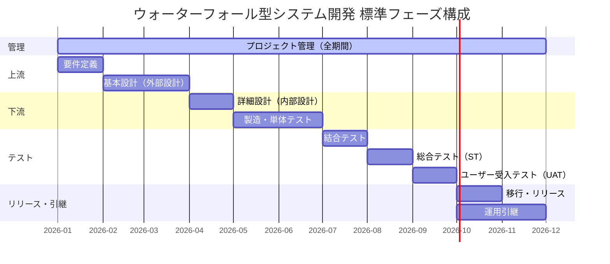

# WBS標準一覧（ウォーターフォール型システム開発）

| 項目 | 内容 |
| :--- | :--- |
| 文書番号 | PM-020-WBS-001 |
| バージョン | 1.0 |
| 作成日 | 2026-02-26 |
| 分類 | 標準テンプレート |

---

## 目次

- [1. 本書の目的と使い方](#1-本書の目的と使い方)
  - [1.1 目的](#11-目的)
  - [1.2 WBS番号体系](#12-wbs番号体系)
  - [1.3 各列の定義](#13-各列の定義)
  - [1.4 主担当ロール凡例](#14-主担当ロール凡例)
- [2. フェーズ構成と標準スケジュールイメージ](#2-フェーズ構成と標準スケジュールイメージ)
- [3. WBS標準一覧](#3-wbs標準一覧)
  - [1. プロジェクト管理（全期間）](#1-プロジェクト管理全期間)
  - [2. 要件定義](#2-要件定義)
  - [3. 基本設計（外部設計）](#3-基本設計外部設計)
  - [4. 詳細設計（内部設計）](#4-詳細設計内部設計)
  - [5. 製造・単体テスト](#5-製造単体テスト)
  - [6. 結合テスト](#6-結合テスト)
  - [7. 総合テスト（システムテスト）](#7-総合テストシステムテスト)
  - [8. ユーザー受入テスト（UAT）](#8-ユーザー受入テストuat)
  - [9. 移行・リリース](#9-移行リリース)
  - [10. 運用引継](#10-運用引継)
- [4. カスタマイズガイド](#4-カスタマイズガイド)
- [付録：成果物チェックリスト](#付録成果物チェックリスト)

---

## 1. 本書の目的と使い方

### 1.1 目的

本書はウォーターフォール型システム開発における**標準WBS（Work Breakdown Structure）**を定義するテンプレートである。
新規プロジェクト開始時にこの一覧を起点として、プロジェクト固有の事情に合わせて追加・削除・調整を行い、プロジェクト計画書およびRedmineチケット構造の基礎として活用する。

> [!TIP]
> WBSはコピーして使うのではなく、「削る」ところから始めるのがうまくいくやり方。全項目を残そうとすると管理コストが膨らむ。まず不要な行に取り消し線を引き、残った行でスケジュールを組む。

> [!NOTE]
> 本WBSはフェーズ型（工程直列）のウォーターフォールを前提にしている。アジャイルとのハイブリッドや並行開発を採用する場合は、フェーズ構成から見直すこと。

### 1.2 WBS番号体系

```
[フェーズ番号].[中項目番号].[小項目番号]

例: 3.2.3 = 基本設計 > 画面設計 > 画面遷移図作成
```

| レベル | 呼称 | 説明 | Redmine対応 |
| :--- | :--- | :--- | :--- |
| レベル1（フェーズ） | 大項目 | 工程・フェーズ単位 | 親チケット（工程） |
| レベル2 | 中項目 | 作業グループ単位 | 親チケット（サブグループ）|
| レベル3 | 小項目 | 実際に担当者がこなす作業単位 | **実作業チケット** |

> [!NOTE]
> Redmineでは小項目（レベル3）に工数・期日・担当者を設定する。大項目・中項目は集計用の親チケットとして使い、工数は入力しない。

### 1.3 各列の定義

| 列名 | 説明 |
| :--- | :--- |
| WBS番号 | 階層番号（フェーズ.中項目.小項目） |
| 小項目（アクティビティ） | 実際の作業内容。動詞＋名詞の形で記述 |
| 主担当 | 主に作業を担う役割（凡例参照） |
| 主な成果物 | 作業完了の証拠となる成果物・資料名 |
| 備考 | 注意事項・依存関係・省略可否など |

### 1.4 主担当ロール凡例

| 略称 | ロール名 | 主な責務 |
| :--- | :--- | :--- |
| PM | プロジェクトマネージャー | 全体計画・意思決定・顧客折衝 |
| PMO | PMOスタッフ | 管理プロセス運営・資料作成 |
| PL | プロジェクトリーダー | 開発チームのとりまとめ・技術判断 |
| SE | システムエンジニア | 要件定義・設計 |
| PG | プログラマー | 製造・単体テスト |
| Infra | インフラエンジニア | インフラ設計・構築・運用 |
| QA | 品質保証担当 | テスト計画・品質測定 |
| User | ユーザー担当者 | 要件提供・承認・受入テスト |

---

## 2. フェーズ構成と標準スケジュールイメージ



> [!WARNING]
> 上記は相対的な期間比率のイメージであり、実際のスケジュールはシステム規模・開発方式・体制によって大きく変わる。設計に対してテスト期間が短すぎる計画は品質リスクになるため注意する。

---

## 3. WBS標準一覧

### 1. プロジェクト管理（全期間）

> プロジェクト全期間を通じて継続する管理作業。フェーズ横断で実施するため、別立ての管理チケット群として運用する。

| WBS番号 | 中項目 | 小項目（アクティビティ） | 主担当 | 主な成果物 | 備考 |
| :--- | :--- | :--- | :--- | :--- | :--- |
| 1.1.1 | プロジェクト立上げ | プロジェクト計画書（PMP）作成 | PM | プロジェクト計画書 | 最初のベースライン |
| 1.1.2 | プロジェクト立上げ | 体制構築・役割分担表作成 | PM | 体制図、役割分担表 | |
| 1.1.3 | プロジェクト立上げ | キックオフ会議準備・実施 | PM/PMO | キックオフ議事録 | |
| 1.1.4 | プロジェクト立上げ | 各種管理ルール策定（命名規則・ブランチ戦略・レビュープロセス等） | PL | 開発規約書 | |
| 1.1.5 | プロジェクト立上げ | 開発ツール・環境の選定・調達・ライセンス確認 | PL/Infra | ツール構成表 | |
| 1.1.6 | プロジェクト立上げ | WBS・スケジュール初版作成 | PM/PMO | WBS、ガントチャート | |
| 1.2.1 | 進捗管理 | 週次進捗会議の企画・運営 | PMO | 会議体定義書、議事録 | 毎週継続 |
| 1.2.2 | 進捗管理 | 進捗報告書（週次・月次）作成 | PMO | 進捗報告書 | 毎週/毎月継続 |
| 1.2.3 | 進捗管理 | WBS・スケジュール更新・メンテナンス | PMO | WBS最新版 | 毎週継続 |
| 1.2.4 | 進捗管理 | 遅延検知・リカバリ計画策定 | PM/PMO | リカバリ計画書 | 必要時 |
| 1.3.1 | 品質管理 | 品質計画書作成（レビュー計画・テスト計画の大枠） | PM/QA | 品質計画書 | |
| 1.3.2 | 品質管理 | 各工程レビュー実施・指摘対応確認 | PL/QA | レビュー記録 | 各工程完了時 |
| 1.3.3 | 品質管理 | 品質メトリクス収集・分析（バグ密度・レビュー指摘件数等） | PMO/QA | 品質管理表 | 毎月継続 |
| 1.4.1 | 課題・リスク管理 | 課題管理台帳の運用（Redmine課題チケット） | PMO | 課題管理台帳 | 毎週継続 |
| 1.4.2 | 課題・リスク管理 | リスク管理台帳の運用・リスク評価更新 | PMO | リスク管理台帳 | 毎月継続 |
| 1.4.3 | 課題・リスク管理 | エスカレーション対応（上位ステークホルダーへの報告） | PM | エスカレーション記録 | 必要時 |
| 1.5.1 | コミュニケーション管理 | ステークホルダー一覧作成・更新 | PM/PMO | ステークホルダー一覧 | |
| 1.5.2 | コミュニケーション管理 | 各種会議体の定義・招集・議事録作成・配布 | PMO | 議事録 | 毎会議 |
| 1.5.3 | コミュニケーション管理 | 顧客・関係者への定期報告（月次ステークホルダーレビュー） | PM | 月次報告資料 | 毎月継続 |
| 1.6.1 | 変更管理 | 変更要求受付・記録・番号採番 | PMO | 変更要求票 | 必要時 |
| 1.6.2 | 変更管理 | 変更による影響分析（スコープ・スケジュール・コスト・品質） | PM/PL | 影響分析書 | 必要時 |
| 1.6.3 | 変更管理 | 変更審議・承認（変更管理委員会） | PM | 変更承認記録 | 必要時 |
| 1.7.1 | 構成管理 | ソースコードリポジトリ管理（Git運用ルール徹底） | PL | Git運用規約 | |
| 1.7.2 | 構成管理 | ドキュメント管理台帳の維持・更新 | PMO | 文書管理台帳 | 毎月継続 |
| 1.7.3 | 構成管理 | 成果物バージョン管理・ベースライン設定 | PMO | ベースライン記録 | 各工程完了時 |
| 1.8.1 | プロジェクト完了 | プロジェクト完了報告書作成 | PM | 完了報告書 | |
| 1.8.2 | プロジェクト完了 | 振返り（KPT・ポストモーテム）実施 | PM/PMO | 振返り議事録、教訓集 | |
| 1.8.3 | プロジェクト完了 | 成果物・ドキュメントアーカイブ | PMO | アーカイブ済み成果物一式 | |

---

### 2. 要件定義

| WBS番号 | 中項目 | 小項目（アクティビティ） | 主担当 | 主な成果物 | 備考 |
| :--- | :--- | :--- | :--- | :--- | :--- |
| 2.1.1 | 現状調査・ヒアリング | ビジネス要件・目標のヒアリング実施 | SE/PM | ヒアリング記録 | |
| 2.1.2 | 現状調査・ヒアリング | 現行業務フロー（As-Is）調査・整理 | SE | 現行業務フロー図 | |
| 2.1.3 | 現状調査・ヒアリング | 現行システム調査（機能・データ・連携先） | SE | 現行システム調査書 | 既存システム有りの場合 |
| 2.1.4 | 現状調査・ヒアリング | 課題・ニーズ一覧整理 | SE | 課題一覧 | |
| 2.2.1 | 要件分析・整理 | 新業務フロー（To-Be）作成 | SE | 新業務フロー図 | |
| 2.2.2 | 要件分析・整理 | 機能要件一覧作成（画面・機能・権限） | SE | 機能要件一覧 | |
| 2.2.3 | 要件分析・整理 | 非機能要件定義（性能・可用性・セキュリティ・拡張性等） | SE/Infra | 非機能要件定義書 | |
| 2.2.4 | 要件分析・整理 | データ要件整理（主要エンティティ・データ量見積もり） | SE | データ要件書 | |
| 2.2.5 | 要件分析・整理 | ユースケース・業務シナリオ記述 | SE | ユースケース一覧 | 複雑な業務ロジックの場合 |
| 2.3.1 | 要件定義書作成 | 要件定義書（ドラフト）作成 | SE | 要件定義書（ドラフト） | |
| 2.3.2 | 要件定義書作成 | 概要レベルの画面遷移図・ワイヤーフレーム作成 | SE | 画面遷移図（概要）、ワイヤーフレーム | |
| 2.3.3 | 要件定義書作成 | 外部インターフェース要件整理（連携システム一覧） | SE | IF要件書 | 外部連携がある場合 |
| 2.4.1 | レビュー・承認 | 内部レビュー実施（PM・PL・SE） | PL/SE | レビュー記録 | |
| 2.4.2 | レビュー・承認 | ユーザーレビュー実施・フィードバック対応 | SE/User | レビュー記録、指摘対応一覧 | 複数回実施が一般的 |
| 2.4.3 | レビュー・承認 | 要件定義書の最終化・承認取得・ベースライン設定 | PM | 承認済み要件定義書 | スコープ凍結の起点 |

> [!WARNING]
> 要件定義の手戻りは後工程への影響が最大になる。「とりあえず次へ進もう」という圧力に屈して承認を急ぐと、設計・製造フェーズで大量の変更要求が発生する。不明点は必ずこのフェーズで解消すること。

---

### 3. 基本設計（外部設計）

| WBS番号 | 中項目 | 小項目（アクティビティ） | 主担当 | 主な成果物 | 備考 |
| :--- | :--- | :--- | :--- | :--- | :--- |
| 3.1.1 | システム方式設計 | システムアーキテクチャ設計（構成図・技術スタック決定） | PL/SE | アーキテクチャ設計書、システム構成図 | |
| 3.1.2 | システム方式設計 | 技術スタック・フレームワーク選定・評価 | PL | 技術選定記録 | |
| 3.1.3 | システム方式設計 | インフラ・ネットワーク構成設計 | Infra | インフラ設計書、ネットワーク構成図 | |
| 3.1.4 | システム方式設計 | セキュリティ方針・認証・認可設計 | SE/Infra | セキュリティ設計書 | |
| 3.1.5 | システム方式設計 | 開発・テスト・本番 環境方針定義 | PL/Infra | 環境定義書 | |
| 3.2.1 | 画面設計 | 画面一覧作成（全画面洗い出し） | SE | 画面一覧 | |
| 3.2.2 | 画面設計 | 画面レイアウト設計（全画面） | SE | 画面設計書（レイアウト） | |
| 3.2.3 | 画面設計 | 画面遷移図作成（詳細版） | SE | 画面遷移図 | |
| 3.2.4 | 画面設計 | 入力チェック仕様・バリデーションルール定義 | SE | バリデーション仕様書 | |
| 3.3.1 | データベース設計（論理） | エンティティ設計・ER図作成 | SE | ER図 | |
| 3.3.2 | データベース設計（論理） | テーブル定義書作成（論理） | SE | テーブル定義書（論理） | |
| 3.3.3 | データベース設計（論理） | データ移行方針策定（移行元/移行先マッピング） | SE | データ移行方針書 | 既存データ移行がある場合 |
| 3.4.1 | API・IF設計 | API一覧定義（エンドポイント・HTTP メソッド・認証方式） | SE | API一覧 | |
| 3.4.2 | API・IF設計 | 外部システム連携設計（IF仕様書） | SE | IF仕様書 | 外部連携がある場合 |
| 3.4.3 | API・IF設計 | 帳票・帳票出力設計（帳票一覧・レイアウト） | SE | 帳票設計書 | 帳票出力がある場合 |
| 3.5.1 | バッチ設計 | バッチ処理一覧定義（処理内容・実行タイミング） | SE | バッチ一覧 | バッチ処理がある場合 |
| 3.5.2 | バッチ設計 | ジョブスケジュール設計 | SE/Infra | ジョブスケジュール定義書 | バッチ処理がある場合 |
| 3.6.1 | レビュー・承認 | 内部レビュー実施（PL・SE・Infra） | PL | レビュー記録 | |
| 3.6.2 | レビュー・承認 | ユーザーレビュー実施（画面・業務フロー確認） | SE/User | レビュー記録 | |
| 3.6.3 | レビュー・承認 | 基本設計書最終化・承認取得 | PM | 承認済み基本設計書 | |

> [!TIP]
> 画面設計はユーザーが一番意見を言いやすいポイント。ここでのレビューを手厚くすると、製造後の「やっぱり違う」を大幅に削減できる。モックアップツール（Figma等）を使えるならこの段階で使う。

---

### 4. 詳細設計（内部設計）

| WBS番号 | 中項目 | 小項目（アクティビティ） | 主担当 | 主な成果物 | 備考 |
| :--- | :--- | :--- | :--- | :--- | :--- |
| 4.1.1 | 画面詳細設計 | 画面項目定義（全項目の型・桁・必須・初期値等） | SE | 画面詳細設計書 | |
| 4.1.2 | 画面詳細設計 | バリデーション詳細定義（チェック内容・エラーメッセージ） | SE | バリデーション詳細仕様書 | |
| 4.1.3 | 画面詳細設計 | エラーメッセージ一覧作成 | SE | エラーメッセージ一覧 | |
| 4.2.1 | 処理ロジック詳細設計 | クラス・モジュール構成設計（クラス図） | PL/SE | クラス図 | |
| 4.2.2 | 処理ロジック詳細設計 | メソッド・関数仕様定義（処理フロー記述） | SE | 処理設計書 | |
| 4.2.3 | 処理ロジック詳細設計 | シーケンス図・アクティビティ図作成（複雑なフロー） | SE | シーケンス図 | 複雑なロジックのみ |
| 4.2.4 | 処理ロジック詳細設計 | 共通部品・ライブラリ設計 | PL | 共通部品設計書 | |
| 4.3.1 | データベース詳細設計（物理） | 物理テーブル設計（データ型・制約・文字コード等） | SE | テーブル定義書（物理） | |
| 4.3.2 | データベース詳細設計（物理） | インデックス設計 | SE | インデックス設計書 | |
| 4.3.3 | データベース詳細設計（物理） | ストアドプロシージャ・ビュー・トリガー設計 | SE | ストアド設計書 | 採用する場合 |
| 4.4.1 | API詳細設計 | API仕様書作成（リクエスト/レスポンス詳細・ステータスコード） | SE | API仕様書（詳細） | |
| 4.4.2 | API詳細設計 | エラーコード一覧定義 | SE | エラーコード一覧 | |
| 4.5.1 | バッチ詳細設計 | バッチ処理フロー詳細定義（入出力・処理ステップ） | SE | バッチ詳細設計書 | バッチ処理がある場合 |
| 4.5.2 | バッチ詳細設計 | バッチエラーハンドリング・リランポリシー設計 | SE | バッチ運用設計書 | バッチ処理がある場合 |
| 4.6.1 | テスト計画（下流） | 単体テスト計画書作成（テスト方針・カバレッジ目標） | PL/QA | 単体テスト計画書 | |
| 4.6.2 | テスト計画（下流） | 結合テスト計画書作成（テスト範囲・テスト観点） | PL/QA | 結合テスト計画書 | |
| 4.7.1 | レビュー・承認 | 内部レビュー実施（PL・SE） | PL | レビュー記録 | |
| 4.7.2 | レビュー・承認 | 詳細設計書最終化・承認取得 | PL | 承認済み詳細設計書 | |

> [!NOTE]
> 詳細設計フェーズで「テスト計画書」を作成するのは、設計と同時に「何をテストすべきか」を整理することで、製造後のテスト漏れを防ぐためである。後回しにするとテスト観点の抜けが多くなりやすい。

---

### 5. 製造・単体テスト

| WBS番号 | 中項目 | 小項目（アクティビティ） | 主担当 | 主な成果物 | 備考 |
| :--- | :--- | :--- | :--- | :--- | :--- |
| 5.1.1 | 環境構築 | 開発環境構築（OS・ミドルウェア・フレームワーク・IDE等） | PG/Infra | 開発環境構築手順書 | |
| 5.1.2 | 環境構築 | テスト環境構築（単体テスト用） | PG/Infra | テスト環境構築手順書 | |
| 5.1.3 | 環境構築 | CI/CDパイプライン設定（ビルド・自動テスト・静的解析） | PL/Infra | CI/CD設定ファイル、パイプライン定義 | |
| 5.1.4 | 環境構築 | 開発用DBセットアップ・テストデータ（初期）投入 | PG | 開発用DB | |
| 5.2.1 | コーディング | 共通基盤・フレームワーク設定実装 | PL/PG | 共通基盤コード | |
| 5.2.2 | コーディング | 画面（フロントエンド）実装 | PG | 画面実装コード | |
| 5.2.3 | コーディング | ビジネスロジック（サービス層）実装 | PG | ビジネスロジックコード | |
| 5.2.4 | コーディング | データアクセス層（リポジトリ・DAO）実装 | PG | データアクセスコード | |
| 5.2.5 | コーディング | API実装（コントローラー・ルーティング） | PG | APIコード | |
| 5.2.6 | コーディング | バッチ処理実装 | PG | バッチコード | バッチ処理がある場合 |
| 5.2.7 | コーディング | インフラ設定・IaC（Infrastructure as Code）実装 | Infra | IaCコード、設定ファイル | |
| 5.3.1 | 単体テスト | 単体テスト仕様書（テストケース）作成 | PG | 単体テスト仕様書 | |
| 5.3.2 | 単体テスト | テストコード作成（自動テスト） | PG | テストコード | |
| 5.3.3 | 単体テスト | 単体テスト実施・結果記録 | PG | 単体テスト結果表 | |
| 5.3.4 | 単体テスト | 不具合修正・再テスト | PG | 修正済みコード | |
| 5.4.1 | コードレビュー | コードレビュー実施（プルリクエスト/マージリクエスト） | PL/PG | レビュー記録（PR） | |
| 5.4.2 | コードレビュー | 指摘対応・コード修正 | PG | 修正済みコード | |
| 5.5.1 | 製造完了確認 | テスト結果集計・カバレッジ確認 | PL/QA | テスト結果報告書 | |
| 5.5.2 | 製造完了確認 | 静的解析・セキュリティスキャン実施・指摘対応 | PL | 静的解析レポート | |
| 5.5.3 | 製造完了確認 | 製造工程完了確認・チェックリスト実施 | PL | 製造完了チェックリスト | |

> [!TIP]
> コーディングをPGに丸投げしてPLが進捗を週1回確認するだけでは詰まりの発見が遅れる。製造フェーズこそ日次の夕会で「何で詰まっているか」を把握する。設計の抜けが製造段階で発覚することも多い。

> [!WARNING]
> CIが通っているからOKとはならない。テストコードの品質も管理対象。テストコードを書かずに「手動確認済み」で単体テスト完了にするとデグレ検知ができなくなる。

---

### 6. 結合テスト

| WBS番号 | 中項目 | 小項目（アクティビティ） | 主担当 | 主な成果物 | 備考 |
| :--- | :--- | :--- | :--- | :--- | :--- |
| 6.1.1 | テスト準備 | 結合テスト仕様書作成（テストシナリオ・テストケース詳細） | SE/QA | 結合テスト仕様書 | |
| 6.1.2 | テスト準備 | テストデータ作成・投入 | PG/SE | テストデータ | |
| 6.1.3 | テスト準備 | 結合テスト環境セットアップ・動作確認 | Infra/PG | テスト環境 | |
| 6.2.1 | テスト実施 | 機能テスト実施（正常系・準正常系） | SE/PG | テスト実施記録 | |
| 6.2.2 | テスト実施 | インターフェーステスト実施（外部システム連携・API間連携） | SE/PG | テスト実施記録 | 連携がある場合 |
| 6.2.3 | テスト実施 | バッチ処理テスト実施 | PG | テスト実施記録 | バッチ処理がある場合 |
| 6.2.4 | テスト実施 | 異常系・エラー系テスト実施 | SE/PG | テスト実施記録 | |
| 6.2.5 | テスト実施 | データ移行テスト実施（移行ツール・データ検証） | SE/PG | 移行テスト結果 | データ移行がある場合 |
| 6.3.1 | 不具合管理 | 不具合票起票・重要度/優先度設定（Redmine課題チケット） | テスト担当 | 不具合票（Redmineチケット） | |
| 6.3.2 | 不具合管理 | 不具合修正（開発側） | PG | 修正済みコード | |
| 6.3.3 | 不具合管理 | 修正確認テスト（再テスト）実施 | テスト担当 | 再テスト記録 | |
| 6.4.1 | 完了確認 | テスト結果集計・不具合件数分析 | PMO/QA | テスト結果報告書 | |
| 6.4.2 | 完了確認 | 完了基準チェック（未解決不具合の残件確認） | PL/QA | 完了基準チェックリスト | |
| 6.4.3 | 完了確認 | 結合テスト完了報告・承認 | PM | 結合テスト完了報告書 | |

---

### 7. 総合テスト（システムテスト）

| WBS番号 | 中項目 | 小項目（アクティビティ） | 主担当 | 主な成果物 | 備考 |
| :--- | :--- | :--- | :--- | :--- | :--- |
| 7.1.1 | テスト準備 | 総合テスト仕様書作成（エンドtoエンドシナリオ） | SE/QA | 総合テスト仕様書 | |
| 7.1.2 | テスト準備 | 本番相当テストデータ作成・投入 | SE/PG | テストデータ | |
| 7.1.3 | テスト準備 | 総合テスト環境セットアップ（本番相当構成） | Infra | テスト環境 | |
| 7.2.1 | テスト実施 | 機能総合テスト実施（全業務フロー） | SE/QA | テスト実施記録 | |
| 7.2.2 | テスト実施 | 非機能テスト実施（性能・負荷・ストレステスト） | Infra/QA | 性能テスト結果 | 非機能要件がある場合 |
| 7.2.3 | テスト実施 | セキュリティテスト実施（脆弱性診断） | Infra/QA | セキュリティ診断レポート | 必要に応じて外部委託 |
| 7.2.4 | テスト実施 | 回帰テスト実施（過去の不具合修正確認） | QA/PG | 回帰テスト記録 | |
| 7.2.5 | テスト実施 | データ移行リハーサル実施・手順確認 | SE/PG | 移行リハーサル記録 | データ移行がある場合 |
| 7.3.1 | 不具合管理 | 不具合票起票・重要度/優先度設定 | テスト担当 | 不具合票 | |
| 7.3.2 | 不具合管理 | 不具合修正（開発側） | PG | 修正済みコード | |
| 7.3.3 | 不具合管理 | 修正確認テスト（再テスト）実施 | テスト担当 | 再テスト記録 | |
| 7.4.1 | 完了確認 | テスト結果集計・品質メトリクス評価 | PMO/QA | テスト結果報告書 | |
| 7.4.2 | 完了確認 | 完了基準チェック（残件確認・リスク評価） | PL/QA | 完了基準チェックリスト | |
| 7.4.3 | 完了確認 | 総合テスト完了報告・承認 | PM | 総合テスト完了報告書 | |

> [!NOTE]
> 性能・負荷テストは規模が大きいと専用ツール（JMeter・k6等）と専門知識が必要。プロジェクト立上げ段階で実施するかどうかを決め、必要なら体制・ツール・テストシナリオを早めに準備する。

---

### 8. ユーザー受入テスト（UAT）

| WBS番号 | 中項目 | 小項目（アクティビティ） | 主担当 | 主な成果物 | 備考 |
| :--- | :--- | :--- | :--- | :--- | :--- |
| 8.1.1 | テスト準備 | UATシナリオ・テスト仕様書作成（ユーザーとの合意） | SE/User | UATシナリオ書 | ユーザーが主体 |
| 8.1.2 | テスト準備 | テストデータ準備（ユーザー側データ含む） | User/SE | テストデータ | |
| 8.1.3 | テスト準備 | UAT環境セットアップ・ユーザーへの利用方法説明 | Infra/SE | 環境、操作説明書 | |
| 8.2.1 | テスト実施支援 | UAT実施（ユーザー主体） | User | UATテスト結果 | 開発側は立会い・支援 |
| 8.2.2 | テスト実施支援 | テクニカルサポート（操作方法・データ問合せ対応） | SE/PG | QA記録 | |
| 8.2.3 | テスト実施支援 | 質問・問合せ対応・FAQ整備 | SE | FAQ一覧 | |
| 8.3.1 | 指摘対応 | 指摘事項受付・分類（不具合 / 仕様変更要求 / 操作ミスの切り分け） | PMO/SE | 指摘管理票 | |
| 8.3.2 | 指摘対応 | 不具合修正対応 | PG | 修正済みコード | |
| 8.3.3 | 指摘対応 | 仕様変更要求の変更管理処理（変更審議・採否判断） | PM | 変更要求票 | |
| 8.3.4 | 指摘対応 | 修正確認・ユーザーへの修正完了報告 | SE | 修正完了報告 | |
| 8.4.1 | 受入完了 | UAT完了確認・残件整理 | PM/User | 残件一覧 | |
| 8.4.2 | 受入完了 | 受入承認書（受入完了確認書）取得 | PM | 受入承認書 | リリースの前提 |

> [!WARNING]
> UATでの指摘を「仕様変更か不具合か」の判断なしに全部修正しようとすると、際限なく対応が広がる。ここで仕様変更扱いにするものは変更管理プロセスに乗せ、スコープを守る。

---

### 9. 移行・リリース

| WBS番号 | 中項目 | 小項目（アクティビティ） | 主担当 | 主な成果物 | 備考 |
| :--- | :--- | :--- | :--- | :--- | :--- |
| 9.1.1 | 移行計画・準備 | 移行計画書作成（移行手順・日程・役割分担） | PM/SE | 移行計画書 | |
| 9.1.2 | 移行計画・準備 | 移行手順書作成（作業手順・確認方法の詳細） | SE/Infra | 移行手順書 | |
| 9.1.3 | 移行計画・準備 | ロールバック計画作成（切戻し手順・判断基準） | SE/Infra | ロールバック手順書 | 必須 |
| 9.1.4 | 移行計画・準備 | 移行リハーサル実施・手順改善 | SE/Infra | 移行リハーサル結果 | 本番移行前に必ず実施 |
| 9.2.1 | 本番環境構築 | 本番インフラ構築（サーバー・ネットワーク・セキュリティ） | Infra | 本番インフラ | |
| 9.2.2 | 本番環境構築 | 本番環境設定（アプリケーション設定・環境変数等） | Infra/PL | 本番設定ファイル | |
| 9.2.3 | 本番環境構築 | 本番環境セキュリティ設定・脆弱性対策確認 | Infra | セキュリティ設定確認記録 | |
| 9.3.1 | データ移行 | データ移行ツール最終確認・本番用調整 | SE/PG | データ移行ツール（確定版） | |
| 9.3.2 | データ移行 | 本番データ移行実施 | SE/PG | 移行済みデータ | |
| 9.3.3 | データ移行 | 移行データ検証（件数・整合性確認） | SE | データ検証結果 | |
| 9.4.1 | リリース作業 | リリース判定会議実施（GO/NO-GO判定） | PM | リリース判定記録 | |
| 9.4.2 | リリース作業 | 本番デプロイ実施 | PL/Infra | デプロイ記録 | |
| 9.4.3 | リリース作業 | 本番稼働確認（スモークテスト・疎通確認） | SE/PG | スモークテスト結果 | |
| 9.4.4 | リリース作業 | 関係者・ユーザーへの稼働開始連絡 | PM | 稼働開始通知 | |
| 9.5.1 | 移行後対応 | 移行後モニタリング（エラーログ・性能・異常検知） | Infra/PG | モニタリング記録 | 稼働直後は集中監視 |
| 9.5.2 | 移行後対応 | ユーザーサポート・初動対応（移行後の問合せ・不具合対応） | SE/PM | 問合せ対応記録 | |
| 9.5.3 | 移行後対応 | 移行完了報告書作成・提出 | PM | 移行完了報告書 | |

> [!TIP]
> リリース作業は「手順書の手順を上から順に読み上げ、1ステップずつ実施して完了チェックを入れる」形式で実施する。作業者と確認者を分けて実施するとミスが大幅に減る。

> [!WARNING]
> ロールバック手順は「作成した」だけでは不十分。移行リハーサルの中でロールバックも実際に試して動作確認まで行うこと。本番でいきなりロールバックを実施して手順が動かないのが最悪のシナリオ。

---

### 10. 運用引継

| WBS番号 | 中項目 | 小項目（アクティビティ） | 主担当 | 主な成果物 | 備考 |
| :--- | :--- | :--- | :--- | :--- | :--- |
| 10.1.1 | ドキュメント整備 | 運用マニュアル作成（日常運用手順・定期作業一覧） | SE/Infra | 運用マニュアル | |
| 10.1.2 | ドキュメント整備 | 障害対応手順書作成（障害フロー・エスカレーション先） | SE/Infra | 障害対応手順書 | |
| 10.1.3 | ドキュメント整備 | 運用設計書作成（バックアップ・監視・リストア方法） | Infra | 運用設計書 | |
| 10.1.4 | ドキュメント整備 | システム構成最終版ドキュメント整備（As-Built） | Infra/SE | As-Built構成図・設計書 | |
| 10.2.1 | 引継準備 | 運用引継計画書策定（引継スケジュール・チェックリスト） | PM | 運用引継計画書 | |
| 10.2.2 | 引継準備 | 運用チームへのトレーニング・教育実施 | SE/Infra | トレーニング実施記録 | |
| 10.3.1 | 引継実施 | 運用引継実施（並走期間中の同行対応） | SE/Infra | 引継記録 | |
| 10.3.2 | 引継実施 | 引継完了確認・運用チームによる承認取得 | PM | 運用引継完了確認書 | |

---

## 4. カスタマイズガイド

### 規模別の省略ガイドライン

| プロジェクト規模 | 省略可能な主なアクティビティ |
| :--- | :--- |
| **小規模**（3ヶ月以内、3名以下） | 1.5.3月次レポート, 1.7.x構成管理の一部, 4.2.3シーケンス図, 7.2.2性能テスト, 7.2.3セキュリティテスト |
| **中規模**（6ヶ月前後、5〜10名） | 標準のまま活用、過不足に応じて追加・削除 |
| **大規模**（1年超、10名超） | そのまま使用し、必要に応じてサブチケットでさらにブレイクダウン |

> [!NOTE]
> 規模にかかわらず**省略してはいけないアクティビティ**がある。
> `1.3.2 各工程レビュー`, `2.4.3 要件定義書承認`, `9.1.3 ロールバック計画`, `9.4.1 リリース判定会議`
> これらを省くと後で深刻な問題になる可能性が高い。

### プロジェクト特性による追加アクティビティ例

| 特性 | 追加検討アクティビティ |
| :--- | :--- |
| クラウド移行あり | インフラ移行計画、クラウドコスト試算、IaC整備 |
| 外部APIとの連携 | API接続検証（PoC）、IF仕様合意、疎通テスト |
| 個人情報/機密情報取扱い | セキュリティ設計レビュー（外部有識者）、プライバシー影響評価（PIA） |
| 既存システムリプレース | 並行稼働計画、移行判定基準策定、旧システム廃止作業 |
| 多言語対応 | 国際化設計（i18n/l10n）、翻訳作業、ロケールテスト |
| モバイルアプリ | ストア申請・審査対応、デバイス/OS互換テスト |

### Redmineへのインポート手順

1. 本一覧の「大項目（フェーズ）」を **プロジェクト全体の親チケット**（バージョン or 親チケット）として作成する
2. 「中項目」を親チケットの子チケットとして作成する（工数・期日は入力不要）
3. 「小項目」を実作業チケットとして作成し、担当者・開始日・期日・予定工数を入力する
4. プロジェクト固有の追加作業は適切な親チケットの下に子チケットとして追加する

---

## 付録：成果物チェックリスト

各工程での主要成果物と確認ポイントをまとめる。リリース前の成果物レビュー時に活用する。

| フェーズ | 成果物 | 承認者 | 備考 |
| :--- | :--- | :--- | :--- |
| 要件定義 | 要件定義書 | PM・ユーザー代表 | スコープのベースライン |
| 基本設計 | 基本設計書（アーキテクチャ・画面・DB・API・バッチ） | PM・PL | |
| 詳細設計 | 詳細設計書、テスト計画書 | PL | |
| 製造・単体テスト | ソースコード、単体テスト結果 | PL | コードレビュー完了が条件 |
| 結合テスト | 結合テスト結果報告書 | PM・PL | |
| 総合テスト | 総合テスト結果報告書、性能テスト結果 | PM | |
| UAT | 受入承認書 | ユーザー代表・PM | リリースのGO/NO-GO判断材料 |
| 移行・リリース | 移行完了報告書 | PM・ユーザー代表 | |
| 運用引継 | 運用マニュアル、障害対応手順書、引継完了確認書 | PM・運用チーム | |
