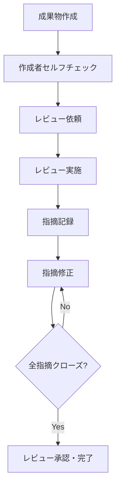

# 品質管理計画書

| 文書番号 | バージョン | 作成日 | 最終更新日 |
| --- | --- | --- | --- |
| P-QUA-001 | 1.0 | 202X/XX/XX | 202X/XX/XX |

---

## 目次

1. [品質管理の基本方針](#1-品質管理の基本方針)
2. [品質目標・指標（KQI）](#2-品質目標指標kqi)
3. [レビュープロセス](#3-レビュープロセス)
4. [品質ゲート（フェーズ移行条件）](#4-品質ゲートフェーズ移行条件)
5. [欠陥管理](#5-欠陥管理)
6. [品質測定・分析](#6-品質測定分析)
7. [品質改善プロセス](#7-品質改善プロセス)
8. [ツールと手法](#8-ツールと手法)
9. [役割と責任](#9-役割と責任)
10. [付録](#付録)

---

## 1. 品質管理の基本方針

### 1.1 品質管理の目的

本計画書は、プロジェクトにおいてシステムの品質目標を達成するために、品質管理活動の方針・プロセス・基準を定めることを目的とする。

**品質管理の3つの柱**:

1. **品質の作り込み**: 各工程で欠陥を混入させない設計・レビューを実施する
2. **欠陥の早期発見**: 後工程に欠陥を持ち込まないための早期検出を実施する
3. **継続的改善**: メトリクスを分析し、プロセスを継続的に改善する

### 1.2 品質管理の対象範囲

| 対象 | 内容 |
| :--- | :--- |
| **プロセス品質** | 各工程の作業プロセス自体の品質 |
| **成果物品質** | 設計書、コード、テストケースなど成果物の品質 |
| **プロダクト品質** | リリースするシステムの機能・非機能品質 |

### 1.3 品質管理の基本原則

- **シフトレフト**: 欠陥は発見が遅れるほど修正コストが増加する。早期工程でのレビューを徹底する
- **定量化**: 「感覚」ではなく数値で品質を評価する
- **トレーサビリティ**: 要件→設計→製造→テストの追跡可能性を確保する
- **独立性**: 開発者とテスト担当者を分離し、客観性を確保する
- **予防優先**: 欠陥の検出よりも、欠陥の混入防止を優先する

### 1.4 品質管理計画を立てる際の注意点

品質管理が機能しないプロジェクトに共通する根本原因のひとつは、**「ユーザー（発注側）が品質の定義に関与していない」**ことである。開発側だけで品質目標を設定しても、リリース判定や受入テストの場で「思っていたものと違う」という議論が発生しやすい。

> [!TIP]
> キックオフ時に品質目標と品質ゲートの条件をユーザーと合意しておくことを必須とする。特に「どのランクのバグが何件残っていたらリリース不可か」という判定基準は、後で必ず揉める。プロジェクト計画書または契約書に明記しておくことを推奨する。

---

## 2. 品質目標・指標（KQI）

### 2.1 各工程の品質指標（基準値）

プロジェクト規模・技術スタックにより適宜調整する。

#### 2.1.1 レビュー指標

| 指標 | 計算式 | 目標値（目安） | 備考 |
| :--- | :--- | :--- | :--- |
| **レビュー実施率** | レビュー実施成果物数 / 全成果物数 × 100 | 100% | 全成果物にレビューを実施 |
| **指摘件数（設計書）** | 指摘件数 / ページ数 | 3〜10件/ページ | 少なすぎ=レビュー形骸化の疑い |
| **指摘件数（コード）** | 指摘件数 / kStep | 5〜15件/kStep | |
| **指摘クローズ率** | クローズ指摘件数 / 全指摘件数 × 100 | 100% | 次工程移行前に全クローズ |

#### 2.1.2 テスト指標

| 指標 | 計算式 | 目標値（目安） | 備考 |
| :--- | :--- | :--- | :--- |
| **テスト試験密度** | テストケース数 / 規模（kStep） | 40〜60件/kStep | 複雑度により調整 |
| **バグ摘出密度** | バグ数 / 規模（kStep） | 5〜15件/kStep | 言語・FWにより調整 |
| **バグ修正率** | 修正完了バグ数 / バグ総数 × 100 | 100%（S/Aランク） | Bランク以下は計画的対応可 |
| **テスト実施率** | 実施済テストケース数 / 全テストケース数 × 100 | 100% | |
| **テスト合格率** | 合格テストケース数 / 実施済テストケース数 × 100 | 95%以上（総合テスト） | |
| **コードカバレッジ** | テストカバレッジ率（行/分岐） | 行カバレッジ80%以上 | プロジェクト方針により調整 |

> [!NOTE]
> テスト試験密度はフレームワーク・言語によって大幅に変わる。モダンなWebフレームワーク採用案件では自動テスト（UT）で密度を補うことを前提に、手動テストケースの目標密度を引き下げるのが現実的。画面数・ビジネスロジックの複雑度も密度に影響するため、過去の類似プロジェクトの実績値を参照して調整することを推奨する。

#### 2.1.3 プロダクト品質指標

| 指標 | 目標値（例） | 備考 |
| :--- | :--- | :--- |
| **レスポンスタイム** | 95パーセンタイル：3秒以内 | 通常トランザクション |
| **スループット** | ○○トランザクション/秒以上 | ピーク時を想定 |
| **可用性** | 99.9%以上（年間停止8.7時間以内） | サービスイン後 |
| **MTTR（平均復旧時間）** | 4時間以内（障害発生から復旧まで） | Sランク障害 |
| **セキュリティ** | 脆弱性スキャン：重大・高リスクゼロ | OWASPトップ10準拠 |

> [!TIP]
> 非機能要件の目標値でよくある落とし穴は「平均値」で合意してしまうこと。レスポンスタイムは「平均1秒以内」ではなく「95パーセンタイルで3秒以内」のように計測方法まで定義しないと、テスト時の判定が曖昧になる。可用性も「月次」「年次」どちらで計算するかをあわせて明記しておく。

### 2.2 品質ステータス信号機

| ステータス | 条件 | 対応 |
| :--- | :--- | :--- |
| 🟢 **Green（正常）** | 全KQI目標値内 | 定常管理を継続 |
| 🟡 **Yellow（注意）** | 1つ以上のKQIが目標値を外れた | 原因分析・対策立案 |
| 🔴 **Red（警告）** | 重要KQIが目標値を大きく下回るか、複数KQIが逸脱 | PM/PMOへ即時報告・対策実行 |

---

## 3. レビュープロセス

### 3.1 レビューの種類と適用工程

| レビュー種別 | 対象工程 | 目的 | 主な実施方法 |
| :--- | :--- | :--- | :--- |
| **ウォークスルー** | 要件定義 | 要件の理解合わせ・抜け漏れ確認 | 作成者が説明、参加者がコメント |
| **インスペクション** | 設計・製造 | 欠陥の体系的検出 | チェックリスト使用、記録者を配置 |
| **コードレビュー** | 製造 | コーディング規約準拠・ロジック確認 | Pull Request / ペアプログラミング |
| **テスト仕様書レビュー** | テスト準備 | テスト網羅性・妥当性確認 | 設計者・テスト担当者間でクロスレビュー |

### 3.2 レビュープロセスフロー



### 3.3 レビュー実施ルール

**事前準備（レビュイー）**:
- レビュー対象成果物を少なくともレビュー前日に配布する
- セルフチェックリストを用いた自己チェックを完了させてからレビューに出す
- レビュー観点・チェックポイントを事前に明示する

**レビュー実施（レビュアー）**:
- チェックリストに基づき指摘を記録する
- 指摘は「問題点と根拠」をセットで記載する（「〇〇が不明確。〜の観点で△△の記述が必要」）
- 「指摘」と「提案・質問」を明確に区別する

**事後対応（レビュイー）**:
- 全指摘に対して対応方針（修正/保留/却下）を記載する
- 修正完了後、レビュアーに確認を依頼する
- 指摘内容・対応結果はレビュー記録として保管する

#### レビュー形骸化を見抜くサイン

レビューが形骸化しているプロジェクトでよく見られるパターンと対処を以下に示す。

| サイン | 疑われる原因 | 対処 |
| :--- | :--- | :--- |
| 指摘件数が常に0〜1件 | 「指摘すると角が立つ」文化、または読んでいない | レビュー記録に「レビューに要した時間」を必須記入項目として追加し、記録させる。2分以内のレビューは実質未実施と判断する |
| 指摘が全て「誤字・表記ゆれ」のみ | ロジック・設計観点でのレビューができていない | チェックリストを観点別（論理・整合性・セキュリティ等）に整備し、観点ごとに記入させる |
| 毎回「保留」のまま次工程へ | 指摘に対する対応完了確認のプロセスが抜けている | 指摘クローズ率100%を次工程移行条件に組み込む |

> [!TIP]
> 指摘件数が少ない状態が続いた場合、レビュアー全員に「レビューに何分かけたか」を口頭で確認するだけで実態が把握できることが多い。短時間で終わっている場合はレビュー品質の問題であり、長時間かけても指摘が少ない場合は成果物の品質が高い可能性がある。数値と実態を組み合わせて判断する。

### 3.4 レビュー記録テンプレート

| No | 指摘箇所 | 指摘内容 | 種別 | 対応方針 | 対応結果 | 確認者 |
| :--- | :--- | :--- | :--- | :--- | :--- | :--- |
| 1 | 3.2.1項 | 処理フローの分岐条件が不明確 | 指摘 | 修正 | フローを修正・追記済み | 鈴木 |
| 2 | 図2 | 類似の既存ロジックを流用することを提案 | 提案 | 保留 | 次フェーズで検討 | - |

---

## 4. 品質ゲート（フェーズ移行条件）

各フェーズを完了し次フェーズへ移行するためには、以下の条件を全て満たすこと。未達の場合は移行を認めない。

### 4.1 要件定義完了ゲート

- [ ] 全業務フロー図がユーザー部門と合意・承認されている
- [ ] 機能一覧・画面一覧・帳票一覧に不整合がない
- [ ] 非機能要件（性能・セキュリティ・運用）の目標値が定義されている
- [ ] 要件定義書のレビュー指摘が全てクローズしている
- [ ] 要件トレーサビリティマトリクスが作成されている
- [ ] 外部インターフェース要件が定義されている
- [ ] データ移行要件が定義されている

### 4.2 基本設計完了ゲート

- [ ] 画面遷移図が全て作成され、レビュー承認されている
- [ ] ER図・テーブル定義書が作成され、レビュー承認されている
- [ ] インターフェース定義書（API仕様書）が作成されている
- [ ] 非機能要件の設計方針が文書化されている
- [ ] 設計レビュー指摘が全てクローズしている
- [ ] テスト計画書（上位）が作成されている

### 4.3 詳細設計完了ゲート

- [ ] 全画面・機能の詳細設計書が作成されている
- [ ] 詳細設計レビュー指摘が全てクローズしている
- [ ] 単体テスト計画・仕様書が作成されている

### 4.4 製造完了ゲート

- [ ] 全機能の実装が完了している
- [ ] 単体テストが完了し、テスト成績書が作成されている
- [ ] コードレビューが完了し、指摘が全て対応されている
- [ ] コーディング規約に準拠している
- [ ] コードカバレッジが目標値を達成している
- [ ] ソースコードがバージョン管理システムに登録されている

### 4.5 結合テスト完了ゲート

- [ ] 結合テスト仕様書が作成されている
- [ ] 全テストケースを実施し、テスト成績書が作成されている
- [ ] S/Aランクバグが全て修正されている
- [ ] Bランク以下のバグに対する対応方針が合意されている
- [ ] 回帰テストが実施されている
- [ ] 総合テスト環境の準備が完了している

### 4.6 総合テスト完了ゲート

- [ ] 総合テスト仕様書が作成されている
- [ ] 全テストケースを実施し、テスト成績書が作成されている
- [ ] 性能テストが実施され、目標値を達成している
- [ ] セキュリティテストが実施されている（主要リスク対応済み）
- [ ] S/Aランクバグが全て修正されている
- [ ] UAT準備（環境・テストシナリオ・受入担当者）が完了している

### 4.7 リリース判定ゲート

- [ ] UAT（ユーザー受入テスト）が完了し、完了報告書が受領されている
- [ ] 残存バグにS/Aランクが存在しない
- [ ] Bランク以下の残存バグについて、運用回避策と改修計画が合意されている
- [ ] 本番移行手順書を用いたリハーサルが完了している
- [ ] 切り戻し基準・手順が明確化されている
- [ ] 運用マニュアル・監視設定が完了している

### 4.8 品質ゲートを実効性のあるものにするために

品質ゲートは条件を定義するだけでは機能しない。特にリリース判定ゲートはGo/NoGoの判断が最も揉める場面になりやすく、事前準備が重要となる。

> [!WARNING]
> 「残存Bランクバグが多い状態でのリリース判定」は、プロジェクト終盤で最も議論が紛糾しやすいポイント。「S/Aランクゼロ」は明確な条件だが、Bランクは件数・内容によって判断が分かれる。プロジェクト開始時または総合テスト開始時点で「Bランク残存バグの許容上限数」をユーザーと事前合意しておくことで、リリース判定の混乱を防げる。

> [!TIP]
> 品質ゲートに「条件付きPass」を設ける場合は、残存リスクと対応計画を文書化したうえでPMとユーザー双方の署名を取ることを推奨する。口頭での「まあいいか」は後から責任の所在が曖昧になる。

---

## 5. 欠陥管理

### 5.1 バグ深刻度（Severity）定義

| 深刻度 | 記号 | 定義 | 例 |
| :--- | :---: | :--- | :--- |
| **Critical** | S | システムダウン、データ破損・消失、セキュリティインシデント。回避策なし。 | ログインできない、データが消える |
| **Major** | A | 主要機能が利用不可。業務停止を伴うが、一時的な回避策あり。 | 受注処理ができない（手入力で対応可） |
| **Normal** | B | 一部機能が利用不可または誤動作。業務自体は継続可能。 | 検索結果の並び順が誤り |
| **Minor** | C | 画面表示崩れ、文言誤り、操作性の軽微な不備。 | ラベル文言のタイポ |

> [!NOTE]
> SランクとAランクの境界は現場で必ず議論になる。定義表の「回避策の有無」を判定基準として明示することで揉めにくくなる。回避策が手動・煩雑であっても存在すればAランクとするのが現実的な運用。「回避策はあるが業務負荷が高すぎる」ケースは、優先度をHighにしてAランクのまま扱うことを推奨する。

### 5.2 バグ優先度（Priority）定義

| 優先度 | 定義 | 対応期限の目安 |
| :--- | :--- | :--- |
| **High** | 即時対応。リリース不可。他作業を止めてでも修正。 | 24時間以内に着手 |
| **Medium** | 通常対応。次回の定期リリースまたは計画パッチで修正。 | 1週間以内に対応 |
| **Low** | 対応保留可。次期フェーズや保守期間での対応を検討。 | 期限を別途設定 |

> [!NOTE]
> 深刻度と優先度は原則として連動する（S→High、A→High、B→Medium、C→Low）が、ビジネス影響度を考慮して優先度を調整することができる。調整した場合はその理由を記録する。

### 5.3 バグライフサイクル

```mermaid
stateDiagram-v2
    [*] --> 新規(Open): バグ起票
    新規(Open) --> 対応中(In Progress): 担当者アサイン
    対応中(In Progress) --> 修正済(Fixed): 修正完了
    修正済(Fixed) --> 再テスト中(Re-test): 再テスト実施
    再テスト中(Re-test) --> クローズ(Closed): 再テスト合格
    再テスト中(Re-test) --> 対応中(In Progress): 再テスト不合格（再オープン）
    新規(Open) --> 保留(Deferred): 対応延期決定
    新規(Open) --> 却下(Rejected): スコープ外・誤報告
    保留(Deferred) --> 対応中(In Progress): 対応再開
    クローズ(Closed) --> [*]
    却下(Rejected) --> [*]
```

### 5.4 バグ件数が増大してカオスになった場合の対処

テスト後半でバグ件数が急増し管理が追いつかなくなるケースがある。このような場合、以下の対処が有効である。

1. **トリアージ会議の実施**: S/Aランクのみを対象に毎朝15分の判定会議を設け、優先対応対象を絞り込む
2. **「対応しないバグ」の明示的な管理**: 保留・却下ステータスを積極的に活用し、管理対象を絞る。「全件対応する」前提を崩すことで担当者の心理的負荷も下がる
3. **修正バッチの設定**: 個別対応ではなく「Bランク以下は週1回まとめて修正・確認」のサイクルにすることでコンテキストスイッチを減らす

### 5.5 バグ報告テンプレート

```markdown
## バグ報告書

**ID**: BUG-XXXX
**報告日**: 202X/MM/DD
**報告者**: [氏名]
**深刻度**: S / A / B / C
**優先度**: High / Medium / Low

### 再現環境
- **OS**: Windows 11
- **ブラウザ**: Chrome 120
- **テスト環境**: ST環境（サーバー: st-app-01）
- **テストデータ**: [使用したデータの概要]

### バグ概要
[バグの簡潔な説明]

### 再現手順
1. ○○画面を開く
2. △△を入力して送信ボタンをクリック
3. □□が表示される

### 期待結果
正常に受注が登録されること

### 実際の結果
「エラー500: Internal Server Error」が表示される

### 添付資料
- スクリーンショット：[ファイル名]
- エラーログ：[ファイル名]

### 対応状況
- **担当者**: [氏名]
- **原因**: [特定した場合のみ]
- **修正内容**: [修正が完了した場合]
- **修正コミット**: [Gitコミットハッシュ]
```

---

## 6. 品質測定・分析

### 6.1 品質メトリクスの収集と分析

#### 6.1.1 収集タイミングと担当

| メトリクス | 収集タイミング | 収集担当 | 分析担当 |
| :--- | :--- | :--- | :--- |
| レビュー指摘数 | レビュー完了時 | レビュアー | PMO |
| コードカバレッジ | 単体テスト完了時 | 開発担当 | PL |
| バグ発生数・深刻度分布 | 日次 | テスト担当 | PM/PMO |
| バグ修正率 | 週次 | PMO | PM |
| テスト実施率・合格率 | 日次 | テスト担当 | PMO |
| 性能テスト結果 | 総合テスト時 | インフラ担当 | PL |

> [!TIP]
> 「バグ修正率」よりも「バグ残存数（ランク別）」で管理するほうがリリース判定の議論がしやすい。修正率100%でも残存Bランクが50件ある状況はリリース判定に影響するが、修正率という指標では直感的に伝わらない。週次レポートには残存件数をランク別に必ず掲載する。

#### 6.1.2 品質レポートの内容

**週次品質レポート（PMOが作成、PM・PLに配布）**:

```markdown
# 第X週 品質レポート
**期間**: 202X/MM/DD ～ 202X/MM/DD

## 1. 品質ステータス: 🟡 Yellow（注意）

## 2. バグ状況
| 深刻度 | 新規 | クローズ | 残存 |
|--------|------|----------|------|
| S | 0 | 0 | 0 |
| A | 2 | 1 | 3 |
| B | 8 | 5 | 15 |
| C | 5 | 3 | 10 |
| **合計** | **15** | **9** | **28** |

## 3. テスト進捗
- テストケース総数: 350件
- 実施済み: 280件（80%）
- 合格: 252件（90%）
- 未実施: 70件（20%）

## 4. 特記事項
- Aランクバグ「○○機能でデータが重複登録される」が未解決
- 原因：トランザクション管理の不備（調査中）
- 影響：総合テスト完了が2日遅れる見込み

## 5. 来週の計画
- Aランクバグの修正・再テスト完了
- 残テストケースの完了（70件）
```

### 6.2 欠陥傾向分析（バグ分析）

#### 6.2.1 分析観点

- **発生工程別**: どの工程（設計/製造/テスト）で混入したか
- **機能別**: どの機能・モジュールにバグが集中しているか（ホットスポット分析）
- **原因別**: 論理ミス、仕様誤解、テスト不足など
- **時系列推移**: バグの発生・解決トレンド（Sカーブ）

ホットスポット分析でバグが集中するモジュールが見つかった場合、その特徴として以下のようなものが多い。単にバグを修正するだけでなく、根本的な対策を検討する。

- 複数の担当者が短期間に交互に修正を行ったモジュール（一貫性が失われやすい）
- 仕様変更が多く入ったモジュール（設計と実装の乖離が起きやすい）
- 単体テストが薄いモジュール（CI/CDのカバレッジレポートで確認できる）

#### 6.2.2 品質の収束判定

テスト後半でバグ発生数が収束していることが品質の高さを示す指標となる。

```
バグ収束の目安（総合テスト最終週）:
- 新規バグ発生数が全体の5%以内
- S/Aランクバグの新規発生がゼロ
```

> [!WARNING]
> バグ件数が収束しているように見えても「テストをやめたから件数が減った」というケースがある。テスト実施率・合格率とあわせて確認し、未実施テストケースが多い場合は収束と判断しない。

---

## 7. 品質改善プロセス

### 7.1 根本原因分析（RCA）

S/Aランクバグや品質目標未達が発生した場合、根本原因分析を実施する。

**5 Whys（なぜなぜ分析）の例**:

| Why | 内容 |
| :--- | :--- |
| **事象** | 本番環境でデータが重複登録される |
| **Why 1** | 二重送信が発生していたから |
| **Why 2** | 送信ボタンの二重クリック制御が実装されていなかったから |
| **Why 3** | 設計書に二重送信対策の記述がなかったから |
| **Why 4** | 非機能要件として二重送信対策が定義されていなかったから |
| **Why 5（根本原因）** | 非機能要件定義時に、WebアプリのUI標準チェックリストが活用されなかったから |
| **対策** | 非機能要件定義チェックリストにUI標準項目を追加し、次回プロジェクトから適用する |

なぜなぜ分析を実施する際は、以下の点に注意する。

> [!WARNING]
> なぜなぜ分析は「個人の責任追及」の場になりやすい。「田中さんがチェックしなかったから」で止まる分析は根本原因ではなく、属人的な対策（「田中さんが今後気をつける」）しか生まれない。分析の着地点を「プロセスや仕組みの問題」に誘導することがファシリテーターの役割。Why4〜5のレベルで「チェックリストが存在しなかった」「レビューで見逃せる状態だった」まで掘り下げることを目標にする。

### 7.2 是正処置・予防処置（CAPA）

| 種別 | 定義 | 例 |
| :--- | :--- | :--- |
| **是正処置（CA）** | 発生した不適合の原因を除去する処置 | バグを修正し、同様のバグがないか全件レビューを実施 |
| **予防処置（PA）** | 起こりうる不適合の原因を除去する処置 | チェックリストにUI標準項目を追加し、設計レビューで確認 |

予防処置として整備したチェックリストや標準は、次のプロジェクトに確実に引き継がれなければ意味がない。「同じバグが別プロジェクトで再発した」というケースは珍しくなく、その原因の多くは横展開の仕組みがないことにある。予防処置の内容は組織の標準テンプレート・チェックリストとして登録し、プロジェクト開始時にインプットとして使われる仕組みを作ることが重要である。

---

## 8. ツールと手法

### 8.1 静的解析ツール

| 目的 | ツール例 | 適用タイミング |
| :--- | :--- | :--- |
| コーディング規約チェック | Checkstyle, ESLint, Pylint | コミット時（CI/CD連携） |
| バグ静的検出 | SonarQube, FindBugs | ビルド時（CI連携） |
| 脆弱性スキャン | OWASP Dependency-Check, Snyk | リリース前 |
| コードカバレッジ計測 | JaCoCo, Istanbul | 単体テスト完了後 |

> [!TIP]
> SonarQube等の静的解析ツールはデフォルトのルールセットをそのまま適用するとノイズが多く、開発者が警告を無視する習慣が定着してしまう。初期導入時は「Blocker」「Critical」のみをCIの失敗条件とし、「Major」以下は警告扱いにして段階的にルールを締めていく方法が定着しやすい。全ルールを一度に適用すると、違反件数が数百件になってチームが疲弊する。

### 8.2 テスト支援ツール

| 目的 | ツール例 | 備考 |
| :--- | :--- | :--- |
| テスト管理 | TestRail, Zephyr（Jira連携） | テストケース管理・実績記録 |
| 自動テスト（単体） | JUnit, Pytest, Jest | 継続的テストに活用 |
| 自動テスト（E2E） | Selenium, Playwright, Cypress | UI回帰テストに活用 |
| 負荷テスト | Apache JMeter, Gatling | 性能テストに活用 |
| セキュリティテスト | OWASP ZAP, Burp Suite | ペネトレーションテスト |
| バグ管理 | Jira, Redmine, Backlog | バグのライフサイクル管理 |

> [!NOTE]
> E2E自動テスト（Selenium, Playwright等）はUI変更のたびにメンテナンスコストが発生する。導入の費用対効果を得やすいのは「リグレッションテストの工数が大きいプロジェクト」や「継続的にリリースが続く保守フェーズ」。単発の新規開発プロジェクトで終盤にE2Eを整備しても、ROIが出ないケースが多い。自動化の対象は「繰り返し実行される」テストに絞ることを推奨する。

### 8.3 品質管理手法

| 手法 | 概要 | 活用場面 |
| :--- | :--- | :--- |
| **チェックリスト** | 確認すべき項目を事前に定義 | レビュー、テスト設計、フェーズ移行判定 |
| **デシジョンテーブル** | 条件と結果の組み合わせを表形式で整理 | 複雑な分岐ロジックのテスト設計 |
| **境界値分析** | 境界値付近をテスト | 数値入力、文字数制限のテスト |
| **同値クラス分割** | 同じ動作をするグループに分割してテスト | 入力値のカテゴリ分けテスト |
| **状態遷移テスト** | 状態の遷移をテスト | ワークフロー・ステータス管理機能 |
| **ペアワイズテスト** | パラメータの組み合わせを効率的に網羅 | 多パラメータの組み合わせテスト |

---

## 9. 役割と責任

| 役割 | 品質管理上の責任 |
| :--- | :--- |
| **PM** | 品質管理計画の承認・品質ゲートでのGo/NoGo判断・品質未達時のリスカ決定 |
| **PMO** | 品質メトリクスの収集・分析・週次品質レポートの作成・品質プロセスの管理 |
| **PL** | 担当チームのレビュー実施・バグ修正の優先付け・コードカバレッジの管理 |
| **メンバー（開発）** | コーディング規約の遵守・セルフチェック実施・レビュー指摘への対応 |
| **メンバー（テスト）** | テストケース作成・実施・バグ報告・再テスト実施 |
| **ユーザー担当** | UATの実施・受入可否の判定 |

### 9.1 体制上の注意点

**小規模プロジェクトでのPMO役割について**

5名以下の小規模プロジェクトでは「PMO」専任を置けないことが多い。その場合でも、品質メトリクスの収集・分析・レポートはPMまたはPLが担う前提でプロセスを設計し、**工数として計画に組み込む**ことが重要である。「なりゆき」でこなそうとすると、テスト佳境の忙しい時期に品質管理が後回しになり、問題の発見が遅れる。

**開発担当者がテストを兼任する体制について**

開発者が自分で書いたコードをテストする体制は、コスト上の理由でよく採用されるが、以下のリスクがある。

- 自分の思い込みによる見落としが発生しやすい（特に正常系に偏ったテスト）
- バグを発見しても「後で直す」と先送りになりやすい

この体制を取る場合は、少なくともテスト仕様書のレビューを別担当者が行う、または異なる機能を担当するメンバー間でクロステストを実施するなどの補完措置を設ける。

**ユーザーUAT参加の促進について**

ユーザー部門がUATに積極的に関与しないプロジェクトはリリース後の「こんなはずじゃなかった」リスクが高い。UAT参加を促進するには以下が効果的である。

- テストシナリオをユーザーの業務フローに沿って作成し、「業務を確認するための作業」として位置づける
- UAT計画をプロジェクト計画書に明記し、ユーザー側のリソース確保を早期に依頼する
- 参加が難しい場合は、画面録画や議事録による確認に切り替えるなど現実的な代替案を提示する

---

## 付録

### A. 品質チェックリスト（工程別サンプル）

#### A.1 要件定義書レビューチェックリスト

- [ ] 要件は「〜できること」等、動詞で表現されているか
- [ ] 要件に曖昧な表現（「適切に」「十分に」など）が含まれていないか
- [ ] 各要件に一意のIDが付番されているか
- [ ] 業務フローと機能一覧の整合性が取れているか
- [ ] 非機能要件（性能・セキュリティ・保守性など）が定義されているか
- [ ] 外部システムとのインターフェースが定義されているか

#### A.2 コードレビューチェックリスト

- [ ] コーディング規約に準拠しているか
- [ ] 単体テストが実装されているか（カバレッジ目標値以上）
- [ ] SQLインジェクションなどセキュリティ脆弱性がないか
- [ ] ハードコード（マジックナンバー、パスワード直書き等）がないか
- [ ] 例外処理が適切に実装されているか
- [ ] ログ出力が適切に実装されているか
- [ ] 不要なデバッグコードやコメントが残っていないか

### B. 用語集

| 用語 | 説明 |
| :--- | :--- |
| **KQI** | Key Quality Indicator（重要品質指標） |
| **品質ゲート** | 次工程への移行を許可するための品質基準 |
| **シフトレフト** | テストや品質確認を早い工程（左）に移動させる考え方 |
| **CAPA** | Corrective Action and Preventive Action（是正処置・予防処置） |
| **RCA** | Root Cause Analysis（根本原因分析） |
| **kStep** | キロステップ（1,000ステップ）。ソフトウェア規模の単位 |
| **コードカバレッジ** | テストによって実行されたコードの割合 |
| **バグ収束** | テスト後半でバグ発生数が減少し、安定した状態 |

### C. 参考資料

- JIS X 25010（ISO/IEC 25010）ソフトウェア品質モデル
- IPA/SEC ソフトウェア開発データ白書
- JSTQB テスト技術者資格制度 Foundation Level シラバス
- PMBOK Guide 品質マネジメント章
