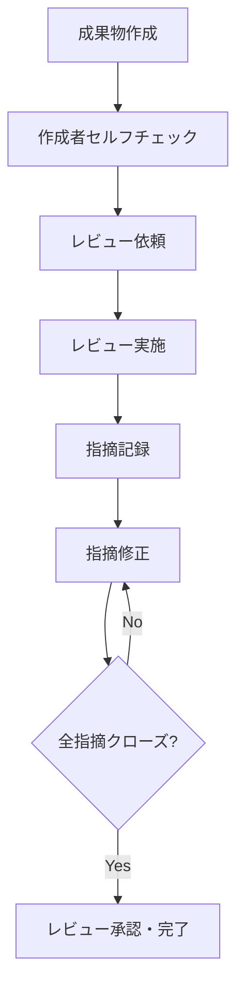
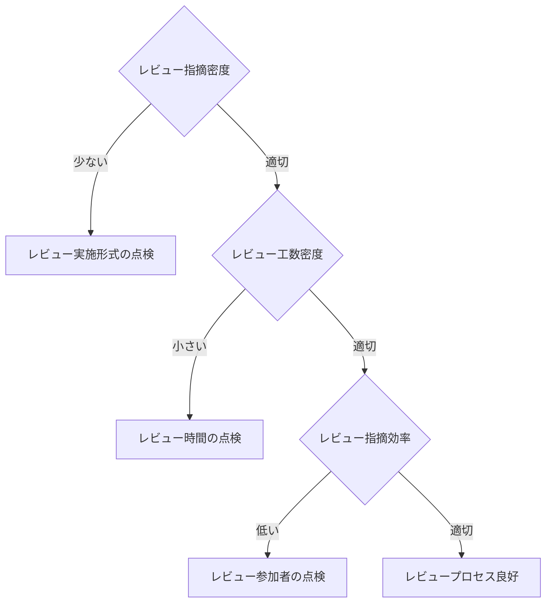

# 品質管理計画書


## 目次

- [1. 品質管理の基本方針](#1-品質管理の基本方針)
- [2. 品質目標・指標（KQI）](#2-品質目標指標kqi)
- [3. レビュープロセス](#3-レビュープロセス)
- [4. 品質ゲート（フェーズ移行条件）](#4-品質ゲートフェーズ移行条件)
- [5. 欠陥管理（バグ管理）](#5-欠陥管理バグ管理)
- [6. 品質測定・分析](#6-品質測定分析)
- [7. 品質改善プロセス](#7-品質改善プロセス)
- [8. ツールと手法](#8-ツールと手法)
- [9. 役割と責任](#9-役割と責任)
- [10. 付録](#付録)
---

## 1. 品質管理の基本方針

### 1.1 品質管理の目的

本計画書は、プロジェクトにおいてシステムの品質目標を達成するために、品質管理活動の方針・プロセス・基準を定めることを目的とする。

**品質とは**: システム・製品などを使うユーザーが求めるものを充たしているかの「度合い」である。「求めるもの」を明確にすることが難しく（ユーザー自身が分かっていない・複数存在する・時間とともに変化する）、それを継続的に充たし続けることが品質管理の本質である。

**品質管理の3つの柱**:

1. **品質の作り込み**: 各工程で欠陥を混入させない設計・レビューを実施する
2. **欠陥の早期発見**: 後工程に欠陥を持ち込まないための早期検出を実施する
3. **継続的改善**: メトリクスを分析し、プロセスを継続的に改善する

### 1.2 品質管理の対象範囲

| 対象 | 内容 |
| :--- | :--- |
| **プロセス品質** | 各工程の作業プロセス自体の品質 |
| **成果物品質** | 設計書、コード、テストケースなど成果物の品質 |
| **プロダクト品質** | リリースするシステムの機能・非機能品質 |

### 1.3 品質管理の基本原則

- **シフトレフト**: 欠陥は発見が遅れるほど修正コストが増加する。早期工程でのレビューを徹底する
- **定量化**: 「感覚」ではなく数値で品質を評価する（事実に基づく管理：現場・現物・現実の三現主義でデータを収集する）
- **トレーサビリティ**: 要件→設計→製造→テストの追跡可能性を確保する
- **独立性**: 開発者とテスト担当者を分離し、客観性を確保する
- **予防優先**: 欠陥の検出よりも、欠陥の混入防止を優先する
- **プロセスアプローチ**: 成果物自体の品質を高めることを目的とするのではなく、成果物を作るプロセスの品質を高める。プロセスを良い状態に作り込んだ結果として成果物の品質が高まるという考え方
- **後工程はお客様**: 「まだ設計フェーズだから…」「次工程でどうにかしよう…」ではなく、次工程はすぐお客様へ納品されるという意識を持つ。品質は上流工程・設計工程で作り込む

**手戻りコストの法則（シフトレフトの根拠）**

欠陥の修正コストは、発見が遅れるほど指数関数的に増加する。

| 発見フェーズ | 基本設計 | 単体テスト | システムテスト | リリース後 |
| :--- | :---: | :---: | :---: | :---: |
| 修正コスト比 | 1 | 10 | 40 | 100以上 |

> [!TIP]
> テストフェーズに品質向上を頼るだけでは不十分。上流工程でいかに品質を作り込むかが、品質管理はもとよりコストコントロールのポイントになる。

### 1.4 品質管理計画を立てる際の注意点

品質管理が機能しないプロジェクトに共通する根本原因のひとつは、**「ユーザー（発注側）が品質の定義に関与していない」**ことである。開発側だけで品質目標を設定しても、リリース判定や受入テストの場で「思っていたものと違う」という議論が発生しやすい。

> [!TIP]
> キックオフ時に品質目標と品質ゲートの条件をユーザーと合意しておくことを必須とする。特に「どのランクのバグが何件残っていたらリリース不可か」という判定基準は、後で必ず揉める。プロジェクト計画書または契約書に明記しておくことを推奨する。

---

## 2. 品質目標・指標（KQI）

### 2.1 各工程の品質指標（基準値）

プロジェクト規模・技術スタックにより適宜調整する。

#### 2.1.1 レビュー指標

| 指標 | 計算式 | 目標値（目安） | 備考 |
| :--- | :--- | :--- | :--- |
| **レビュー実施率** | レビュー実施成果物数 / 全成果物数 × 100 | 100% | 全成果物にレビューを実施 |
| **指摘件数（設計書）** | 指摘件数 / ページ数 | 3〜10件/ページ | 少なすぎ=レビュー形骸化の疑い |
| **指摘件数（コード）** | 指摘件数 / kStep | 5〜15件/kStep | |
| **指摘クローズ率** | クローズ指摘件数 / 全指摘件数 × 100 | 100% | 次工程移行前に全クローズ |

**工程別レビュー指標 参考値**（社内標準・過去プロジェクト実績をもとに設定）

| 指標 | 外部設計 | 内部設計 | 製造UT | 結合テスト | システムテスト |
| :--- | :---: | :---: | :---: | :---: | :---: |
| **レビュー指摘密度**（件/頁） | 1.3 | 1.0 | 0.8 | 0.6 | 0.5 |
| **レビュー工数密度**（時間/頁） | 4.37 | 3.77 | 4.05 | 5.85 | 8.33 |
| **レビュー指摘効率**（件/時間） | 0.30 | 0.27 | 0.20 | 0.10 | 0.06 |
| **レビュー工数比率**（%） | 8.3% | 8.0% | 5.3% | 5.0% | 5.0% |

> [!NOTE]
> 上記は参考値であり、プロジェクトの規模・複雑度・チームの習熟度によって変動する。初めてのプロジェクトでは過去の類似案件の実績値を出発点とし、プロジェクト内で継続的に更新していく。

#### 2.1.2 テスト指標

| 指標 | 計算式 | 目標値（目安） | 備考 |
| :--- | :--- | :--- | :--- |
| **テスト試験密度** | テストケース数 / 規模（kStep） | 40〜60件/kStep | 複雑度により調整 |
| **バグ摘出密度** | バグ数 / 規模（kStep） | 5〜15件/kStep | 言語・FWにより調整 |
| **バグ修正率** | 修正完了バグ数 / バグ総数 × 100 | 100%（S/Aランク） | Bランク以下は計画的対応可 |
| **テスト実施率** | 実施済テストケース数 / 全テストケース数 × 100 | 100% | |
| **テスト合格率** | 合格テストケース数 / 実施済テストケース数 × 100 | 95%以上（総合テスト） | |
| **コードカバレッジ** | テストカバレッジ率（行/分岐） | 行カバレッジ80%以上 | プロジェクト方針により調整 |

**工程別テスト指標 参考値**

| 指標 | 外部設計 | 製造UT | 結合テスト |
| :--- | :---: | :---: | :---: |
| **テスト密度**（件/KS） | 102（下限92〜上限204） | 68（下限61〜上限136） | 20（下限18〜上限40） |
| **エラー・不具合密度**（件/KS） | 2.6（下限1.3〜上限2.86） | 1.3（下限0.65〜上限1.43） | 0.25（下限0.125〜上限0.275） |

- 業界の一般参考値：エラー・不具合密度 **2.5件/KLOC**

> [!NOTE]
> テスト試験密度はフレームワーク・言語によって大幅に変わる。モダンなWebフレームワーク採用案件では自動テスト（UT）で密度を補うことを前提に、手動テストケースの目標密度を引き下げるのが現実的。画面数・ビジネスロジックの複雑度も密度に影響するため、過去の類似プロジェクトの実績値を参照して調整することを推奨する。

#### 2.1.3 プロダクト品質指標

| 指標 | 目標値（例） | 備考 |
| :--- | :--- | :--- |
| **レスポンスタイム** | 95パーセンタイル：3秒以内 | 通常トランザクション |
| **スループット** | ○○トランザクション/秒以上 | ピーク時を想定 |
| **可用性** | 99.9%以上（年間停止8.7時間以内） | サービスイン後 |
| **MTTR（平均復旧時間）** | 4時間以内（障害発生から復旧まで） | Sランク障害 |
| **セキュリティ** | 脆弱性スキャン：重大・高リスクゼロ | OWASPトップ10準拠 |

> [!TIP]
> 非機能要件の目標値でよくある落とし穴は「平均値」で合意してしまうこと。レスポンスタイムは「平均1秒以内」ではなく「95パーセンタイルで3秒以内」のように計測方法まで定義しないと、テスト時の判定が曖昧になる。可用性も「月次」「年次」どちらで計算するかをあわせて明記しておく。

### 2.2 品質指標の測定・分析・評価（PDCA）

各工程ごとにPDCAサイクルを回し、良い状態を維持する。

| | PLAN（計画する値・算出方法） | DO（計測する値） | CHECK（分析・対策検討手法） | ACT（対策） |
| :--- | :--- | :--- | :--- | :--- |
| **設計工程**（テスト仕様書含む） | レビュー指摘密度<br>レビュー工数密度<br>レビュー指摘効率 | レビュー指摘件数<br>レビュー頁数<br>レビュー時間<br>指摘分類<br>改修規模（STEP数） | ゾーン分析<br>管理図<br>パレート図<br>トレンド分析<br>チェックリスト | プロセス・フォーマット見直し<br>再発防止・標準化（教育） |
| **テスト工程** | テスト密度<br>エラー・不具合密度 | テスト対象規模（STEP数）<br>テスト項目数<br>テスト不具合数<br>テスト不具合内容 | ゾーン分析<br>信頼度成長曲線<br>パレート図 | バグ対応優先度付け<br>テスト計画の見直し |

### 2.3 品質ステータス信号機

| ステータス | 条件 | 対応 |
| :--- | :--- | :--- |
| 🟢 **Green（正常）** | 全KQI目標値内 | 定常管理を継続 |
| 🟡 **Yellow（注意）** | 1つ以上のKQIが目標値を外れた | 原因分析・対策立案 |
| 🔴 **Red（警告）** | 重要KQIが目標値を大きく下回るか、複数KQIが逸脱 | PM/PMOへ即時報告・対策実行 |

---

## 3. レビュープロセス

### 3.1 レビューの目的と種類

#### 3.1.1 レビューの4つの目的

| 目的 | 内容 |
| :--- | :--- |
| **内容理解** | 資料の内容理解・認識合わせ・資料説明。後工程での生産性向上・品質向上につなげる（要件定義内容の理解、引継ぎ書の説明など） |
| **欠陥検出** | 設計不備・矛盾の確認をし、不備による後工程の手戻り・品質低下を防ぐ（表記ミス、記述漏れ、記述相違など） |
| **妥当性確認** | インプットとなる資料通りに設計されているかを確認。設計書が目的通り（ユーザーの求めるもの）か確認し不足があれば近づける |
| **判断・承認** | 工程完了時などにPJTとして工程完了してよいか・後工程に進んでよいかを判断する。社外提出前に内部責任者によるチェック・承認 |

#### 3.1.2 レビューの種類

| 種別 | 対象 | 目的 | 実施方法 |
| :--- | :--- | :--- | :--- |
| **ピアレビュー（成果物レビュー）** | 内部メンバー同士 | 成果物の検証と妥当性確認 | ウォークスルー / パスアラウンド / ピアデスクチェック 等 |
| **公式レビュー（承認レビュー）** | PM・PL・PMO ← 顧客 | PJT計画で規定された承認行為。工程完了・顧客レビューなど | インスペクション。次工程への移行判定 |
| **第3者レビュー** | PJT外の独立した組織 | 成果物・プロセスの検証・妥当性確認。社内プロセス遵守の確認 | 社内QAレビュー、監査、有識者レビュー |

#### 3.1.3 ピアレビューの手法（軽→重の順）

| 手法 | 内容 |
| :--- | :--- |
| **アドホックレビュー** | 必要に応じて身近な同僚や手すきの仲間に成果物を見てもらう非公式レビュー |
| **ピアデスクチェック** | 成果物担当者とレビュー担当者の2人だけで行うレビュー。内部レビュー前の事前チェックなど |
| **パスアラウンド** | レビュー対象成果物をメール等で複数のレビュアに配布・回覧しフィードバックを求めるレビュー |
| **ウォークスルー** | 成果物作成担当者が主体となって開催するレビュー（内容確認・理解・欠陥検出・検証・妥当性確認） |
| **インスペクション** | レビューの手順や形式・参加者の役割が予め定められている公式なレビュー（工程完了確認・内部承認） |

> [!NOTE]
> アドホックレビューが最も軽量・自由度が高く、インスペクションが最もフォーマル。重要成果物・工程完了判定にはインスペクションを使い、日常の確認作業にはウォークスルーやピアデスクチェックを使い分けることで効率が上がる。

#### 3.1.4 成果物の重要度とレビュー必須度

成果物一覧（構成管理フォルダ参照）に重要度（A/B/C）を設定し、それに応じてレビューの実施範囲を決定する。

| 重要度 | 定義 | ピアレビュー | 承認レビュー | 第3者レビュー |
| :---: | :--- | :---: | :---: | :---: |
| **A（超重要）** | 要件定義書・基本設計書・契約関連 | ○必須 | ○必須 | ○必須 |
| **B（重要）** | 詳細設計書・テスト仕様書 | ○必須 | △必要に応じて | △必要に応じて |
| **C（通常）** | 内部資料・補足説明資料 | ○必須 | | |

### 3.2 レビュープロセスフロー

#### 3.2.1 基本フロー



#### 3.2.2 各役割の実施内容

**成果物作成者（レビュイー）の流れ**:
1. タスクチケット起票
2. 成果物作成
3. セルフチェック（チェックリストがあれば活用）
4. レビュー依頼調整
5. レビューシート作成（対象成果物・ページ数・実施日等）
6. 指摘事項修正

**レビューア（基本：PM・PL・要件定義経験者との内部レビューを最低1回）の流れ**:
- 必要に応じて以下の追加レビューも実施
  - 業務観点でのサブシステム経験者による有識者レビュー
  - パッケージの作りとしての観点・PGM・実装技術観点など
- レビュー手法を使い分けて実施
- 内部レビュー実施 → 指摘結果確認
- ※修正結果の確認はレビューアの負担にならない工夫（差分確認のみ等）をする

**品質管理担当（PMO）の流れ**:
- 成果物確認（不整合がないか・ムリがないか・規約違反・構成管理ルール違反がないか）
- タスクチケット確認
- レビュー状況確認（レビューシート記載チェック・集計・分析・是正）
- 指摘対応漏れがないか確認・品質分析結果をPM/PL/PMO内で承認
- 評価シート承認

#### 3.2.3 内部設計工程のレビューフロー（補足）

内部設計では「設計後にPGM開発→単体テスト前動作確認」という流れがあるが、設計者のPGM開発後・単体テスト前の動作確認で検知した不具合をレビュー指摘として扱う運用が効果的。

**内部設計レビューの対象と記録**

| レビュー対象 | レビュー記録 |
| :--- | :--- |
| ①内部設計書 or 外部設計書追記版 | レビューシート |
| ②事前動作確認（PGM開発後の動作確認） | 単体バグ一覧に記載し、後でPMOがまとめてレビューシートに反映 |
| ③PGMソースレビュー（任意） | レビューシート |

**単体テストレビューの対象と記録**

| レビュー対象 | レビュー記録 |
| :--- | :--- |
| ④単体テスト仕様書レビュー（テスト前） | レビューシート |
| ⑤単体テスト結果レビュー（テスト後） | 単体バグ一覧 |

### 3.3 レビュー実施ルール

#### 3.3.1 基本ルール

**事前準備（レビュイー）**:
- レビュー対象成果物を少なくともレビュー前日に配布する
- セルフチェックリストを用いた自己チェックを完了させてからレビューに出す
- レビュー観点・チェックポイントを事前に明示する

**レビュー実施（レビュアー）**:
- チェックリストに基づき指摘を記録する
- 指摘は「問題点と根拠」をセットで記載する（「〇〇が不明確。〜の観点で△△の記述が必要」）
- 「指摘」と「提案・質問」を明確に区別する

**事後対応（レビュイー）**:
- 全指摘に対して対応方針（修正/保留/却下）を記載する
- 修正完了後、レビュアーに確認を依頼する
- 指摘内容・対応結果はレビュー記録として保管する

#### 3.3.2 NG なレビューパターン

レビューが形骸化・逆効果になるパターンとして以下を認識しておく。

| NGパターン | 内容 |
| :--- | :--- |
| **思いつき** | レビュアの観点がバラバラ・各自の得意分野のみで指摘。全体ゴールが不明確。誤字脱字のような軽微な修正のみを指摘 |
| **数字合わせ** | 指摘件数を増やすことだけに注力。大事な問題を深堀りしない。目標件数に達したらやめてしまう |
| **吊るし上げ** | 問題を指摘するにつれて、成果物作成者の人格・仕事の進め方・態度などの否定に転化。成果物以外のことをどんどん指摘していく |
| **自慢話** | 成果物の指摘から逸れて、レビュアの経験談・技術知識のひけらかし。「私ならこうする」という成果物作成者目線でなく自分視点に |
| **時間切れ** | レビュー対象が多い場合、全体を表面だけ見ることで時間がなくなる。重要箇所の深いレビューができない |

#### 3.3.3 レビュー観点の絞り方

効果的なレビューのために観点を明確にする。

**確認の優先度をつける（レビュイー）**:
- 「ここだけは重点的に確認してほしい」という箇所を事前にレビュイー自身が特定する
- レビューの流れ（どの順番で確認するか）を事前に計画しておく

**確認の範囲を絞る（レビュアー）**:
- レビュアーの経験値に基づき、今回のレビューで確認する範囲を明確にしておく（この機能・この機能間の整合性など）
- 重点的に見ておくべき観点に絞ってレビューを行う

**重点箇所の共有（品質管理者）**:
- 過去の事例・類似システム・技術で発生した不具合を参考に、必要そうなレビュー観点・傾向を共有する
- レビュー実施傾向からサブシステム間のバラツキなどを確認し共有・観点として必要性がないか確認する

#### 3.3.4 レビュー形骸化を見抜くサイン

レビューが形骸化しているプロジェクトでよく見られるパターンと対処を以下に示す。

| サイン | 疑われる原因 | 対処 |
| :--- | :--- | :--- |
| 指摘件数が常に0〜1件 | 「指摘すると角が立つ」文化、または読んでいない | レビュー記録に「レビューに要した時間」を必須記入項目として追加し、記録させる。2分以内のレビューは実質未実施と判断する |
| 指摘が全て「誤字・表記ゆれ」のみ | ロジック・設計観点でのレビューができていない | チェックリストを観点別（論理・整合性・セキュリティ等）に整備し、観点ごとに記入させる |
| 毎回「保留」のまま次工程へ | 指摘に対する対応完了確認のプロセスが抜けている | 指摘クローズ率100%を次工程移行条件に組み込む |

> [!TIP]
> 指摘件数が少ない状態が続いた場合、レビュアー全員に「レビューに何分かけたか」を口頭で確認するだけで実態が把握できることが多い。短時間で終わっている場合はレビュー品質の問題であり、長時間かけても指摘が少ない場合は成果物の品質が高い可能性がある。数値と実態を組み合わせて判断する。

### 3.4 レビュー記録

#### 3.4.1 指摘区分の定義

指摘は以下の区分で分類して記録する。この分類が品質指標の分析に使われる。

| 指摘区分 | 内容 |
| :--- | :--- |
| **1. 記述漏れ** | 必要な機能が書かれていない / 記述すべきことが書かれていない / 対処しないと次工程以降に影響を及ぼすもの |
| **2. 記述相違** | 必要な機能またはそれを実現するための記述が間違っている / 記述内容のつじつまが合わない / 対処しないと次工程以降に間違えた影響を及ぼすもの |
| **3. 表記上ミス** | 誤字・脱字、図表のミスなど |
| **4. その他** | 上記全てに該当しないもの（その他分類もレビュー指摘数としてカウントする） |
| **5. 確認事項** | レビューの席上では正否の判断ができず、レビュー後に確認作業を必要とするもの ※確認の結果、対応が必要な場合は他の区分へ変更すること |

> [!NOTE]
> 「2.記述相違」が多い場合は設計不良・前工程設計の理解不足が疑われる。「1.記述漏れ」が多い場合は要件の理解不足や設計観点の不足が疑われる。指摘区分の傾向分析はプロセス改善の有効なインプットになる。

#### 3.4.2 レビューシートの必須記載項目

品質指標値の集計として以下の項目は必ず入力する（レビュアー・レビュイーどちらが記載してもよい）。

| 項目 | 内容（例） |
| :--- | :--- |
| レビュー対象ファイル | 改修仕様書（詳細）〇〇機能 |
| レビューページ枚数（印刷時枚数） | 14 |
| レビューア（する人） | 氏名 |
| レビューイ（される人） | 氏名 |
| レビュー実施日 | YYYY/MM/DD |
| レビュー実施時間（h） | 1.0 |
| レビュー人数 | 2 |
| 集計値（自動計算） | 指摘：5件 ／ 対応済み：1件 ／ 対応残：4件 |

#### 3.4.3 保管ルール

- レビューシートはいったんファイルサーバーに格納する
- 設計書フォルダにはレビューシートを格納しない（**成果物とレビュー記録は分けて管理する**）
- 各工程ごとのフォルダ・サブシステムフォルダごとに格納する
- レビューシートの作成単位は、1回のレビューで1ブックでよい（1回で複数成果物をまとめてレビューした場合も1ブック）

#### 3.4.4 レビュー記録テンプレート

| No | 指摘箇所 | 指摘内容 | 区分 | 対応方針 | 対応結果 | 確認者 |
| :--- | :--- | :--- | :--- | :--- | :--- | :--- |
| 1 | 3.2.1項 | 処理フローの分岐条件が不明確 | 2.記述相違 | 修正 | フローを修正・追記済み | 鈴木 |
| 2 | 図2 | 類似の既存ロジックを流用することを提案 | 4.その他 | 保留 | 次フェーズで検討 | - |

### 3.5 レビュー評価・品質分析

#### 3.5.1 評価の進め方

レビュー完了後にレビューシートの指摘事項・対応残の有無を確認し、合わせてレビュー評価シートで目標値との差異をチェックする。

1. **指摘対応の確認**：レビューシートの指摘事項に対応残がないことを確認する
2. **工数・密度の確認**：目標値と実績値の差異をレビュー評価シートで確認する
3. **指摘内容の傾向確認**：指摘区分に偏りがないか（「記述相違」ばかり、「確認事項」が多すぎる等）を確認する
4. **工程完了時の最終評価**：PM・PL・PMOにて最終評価・承認を実施する

> [!TIP]
> PMO・PM・PLは週次でレビュー実施状況をチェックし、計画値と差異がある場合は対策を行う。「指摘が少なすぎる」と「指摘が多すぎる」の両方に対応が必要で、どちらも品質リスクを示している。

#### 3.5.2 ゾーン分析

レビュー工数密度（横軸）とレビュー指摘密度（縦軸）のマトリクスで品質状況を評価する。

| ゾーン | 評価 | 対処の方向性 |
| :---: | :--- | :--- |
| ① | 一応品質は良好 | 継続 |
| ② | レビューの進め方、体制の点検要 | レビューア・手法を見直す |
| ③ | レビューの進め方、体制、漏れの点検要 | レビュー体制を強化 |
| ④ | レビュー効率悪い　進め方、体制、漏れの点検要 | レビュー工数の配分を見直す |
| ⑤ | 設計不良　前工程設計不良、検討不足の点検要 | 前工程の成果物品質を確認 |
| ⑥ | 設計不良　前工程設計不良、検討不足の点検要 | 設計書の品質を根本から見直す |
| ⑦ | レビュー不足　進め方、体制、漏れの点検要 | レビュー実施時間・体制を増強 |
| ⑧ | レビュー不足、品質不良　設計・レビュー点検要 | 設計・レビューの両方を見直す |
| ⑨ | レビュー不足　追加レビューで指摘増の可能性 | 追加レビューを実施 |

#### 3.5.3 品質分析手法一覧

| 手法 | 評価の目的 | 主な活用シーン |
| :--- | :--- | :--- |
| **(1) 管理図分析** | ドキュメント単位で、作成能力や欠陥検出能力などの特異点を検出する | ドキュメント作成能力の監視 / レビュー実施状況の監視 |
| **(2) ゾーン分析** | ドキュメント毎の品質状況とその対策を見極める | ドキュメント品質の状況把握と対策の判定 |
| **(3) 信頼度成長曲線** | 設計フェーズ完了時点の最終欠陥数を推定する | 設計・テストフェーズの品質目標達成予測 |
| **(4) 回帰モデル** | 回帰曲線と実績データの比較から、母集団から外れているドキュメントやレビューチームを検出する | ドキュメント作成プロセスの監視 |
| **(5) トレンドモデル** | 設計レビューの欠陥検出の予測モデルとの比較により、ドキュメントの品質を予測する | ドキュメントのマクロ的な品質評価 |
| **(6) パレート図** | ドキュメント品質の課題・障害の原因を特定する | ドキュメント品質の問題点の絞込み |

#### 3.5.4 評価フロー（決定木）



#### 3.5.5 分析評価項目

| 分類 | 評価項目 | 評価観点 |
| :--- | :--- | :--- |
| レビュープロセス | レビュー工数密度（人時/ページ数） | レビュー対象のボリュームに見合ったレビュー工数をかけているか / 期待値と比べて極端に時間をかけていないか or かけすぎていないか |
| レビュープロセス | レビュー体制と品質目標 | 必要なメンバーがレビューに参加しているか / 品質目標値を達成しているか |
| レビュー成果物 | レビュー指摘密度（件/ページ数） | レビュー対象のボリュームに見合った指摘件数か / 期待値と比べて格別に高い・低い原因は何か |
| レビュー成果物 | 指摘分類 | 適切なレベルの指摘が使われているか / 欠陥が作り込まれたのはどこか / 欠陥の影響範囲はどのくらいか |

---

## 4. 品質ゲート（フェーズ移行条件）

各フェーズを完了し次フェーズへ移行するためには、以下の条件を全て満たすこと。未達の場合は移行を認めない。

### 4.1 要件定義完了ゲート

- [ ] 全業務フロー図がユーザー部門と合意・承認されている
- [ ] 機能一覧・画面一覧・帳票一覧に不整合がない
- [ ] 非機能要件（性能・セキュリティ・運用）の目標値が定義されている
- [ ] 要件定義書のレビュー指摘が全てクローズしている
- [ ] 要件トレーサビリティマトリクスが作成されている
- [ ] 外部インターフェース要件が定義されている
- [ ] データ移行要件が定義されている

### 4.2 基本設計完了ゲート

- [ ] 画面遷移図が全て作成され、レビュー承認されている
- [ ] ER図・テーブル定義書が作成され、レビュー承認されている
- [ ] インターフェース定義書（API仕様書）が作成されている
- [ ] 非機能要件の設計方針が文書化されている
- [ ] 設計レビュー指摘が全てクローズしている
- [ ] テスト計画書（上位）が作成されている

### 4.3 詳細設計完了ゲート

- [ ] 全画面・機能の詳細設計書が作成されている
- [ ] 詳細設計レビュー指摘が全てクローズしている
- [ ] 単体テスト計画・仕様書が作成されている

### 4.4 製造完了ゲート

- [ ] 全機能の実装が完了している
- [ ] 単体テストが完了し、テスト成績書が作成されている
- [ ] コードレビューが完了し、指摘が全て対応されている
- [ ] コーディング規約に準拠している
- [ ] コードカバレッジが目標値を達成している
- [ ] ソースコードがバージョン管理システムに登録されている

### 4.5 結合テスト完了ゲート

- [ ] 結合テスト仕様書が作成されている
- [ ] 全テストケースを実施し、テスト成績書が作成されている
- [ ] S/Aランクバグが全て修正されている
- [ ] Bランク以下のバグに対する対応方針が合意されている
- [ ] 回帰テストが実施されている
- [ ] 総合テスト環境の準備が完了している

### 4.6 総合テスト完了ゲート

- [ ] 総合テスト仕様書が作成されている
- [ ] 全テストケースを実施し、テスト成績書が作成されている
- [ ] 性能テストが実施され、目標値を達成している
- [ ] セキュリティテストが実施されている（主要リスク対応済み）
- [ ] S/Aランクバグが全て修正されている
- [ ] UAT準備（環境・テストシナリオ・受入担当者）が完了している

### 4.7 リリース判定ゲート

- [ ] UAT（ユーザー受入テスト）が完了し、完了報告書が受領されている
- [ ] 残存バグにS/Aランクが存在しない
- [ ] Bランク以下の残存バグについて、運用回避策と改修計画が合意されている
- [ ] 本番移行手順書を用いたリハーサルが完了している
- [ ] 切り戻し基準・手順が明確化されている
- [ ] 運用マニュアル・監視設定が完了している

### 4.8 品質ゲートを実効性のあるものにするために

品質ゲートは条件を定義するだけでは機能しない。特にリリース判定ゲートはGo/NoGoの判断が最も揉める場面になりやすく、事前準備が重要となる。

> [!WARNING]
> 「残存Bランクバグが多い状態でのリリース判定」は、プロジェクト終盤で最も議論が紛糾しやすいポイント。「S/Aランクゼロ」は明確な条件だが、Bランクは件数・内容によって判断が分かれる。プロジェクト開始時または総合テスト開始時点で「Bランク残存バグの許容上限数」をユーザーと事前合意しておくことで、リリース判定の混乱を防げる。

> [!TIP]
> 品質ゲートに「条件付きPass」を設ける場合は、残存リスクと対応計画を文書化したうえでPMとユーザー双方の署名を取ることを推奨する。口頭での「まあいいか」は後から責任の所在が曖昧になる。

---

## 5. 欠陥管理（バグ管理）

> [!NOTE]
> 欠陥管理（バグチケットの起票・ライフサイクル管理・重大度定義・根本原因分析・Redmine運用等）の詳細は **[PJT計画補足-障害管理.md](../80.障害管理/PJT計画補足-障害管理.md)** を参照。本章では品質管理の観点から必要な概念のみを簡潔に記載する。

### 5.1 バグ深刻度（Severity）の考え方

品質ゲートの判定やリリース可否の判断のために、バグの深刻度ランクを定義する。詳細な定義・目標対応時間・運用ルールは障害管理計画書を参照。

| 深刻度 | 記号 | 概要 |
| :--- | :---: | :--- |
| **Critical** | S | システムダウン、データ破損・消失、セキュリティインシデント。回避策なし。 |
| **Major** | A | 主要機能が利用不可。業務停止を伴うが、一時的な回避策あり。 |
| **Normal** | B | 一部機能が利用不可または誤動作。業務自体は継続可能。 |
| **Minor** | C | 画面表示崩れ、文言誤り、操作性の軽微な不備。 |

### 5.2 品質管理とバグ管理の関係

品質管理の観点では、個別バグの管理よりも以下の**傾向指標**に注目する。

- **バグ密度**（件数/KLOC or KSTEP）：品質指標として2章で定義した目標値との比較
- **バグ収束傾向**：テスト後半での新規バグ発生数の減少（→ 6章で詳述）
- **発生フェーズ分布**：どの工程で見つかったかの傾向（上流で多いほど良い）
- **残存バグのランク別内訳**：品質ゲート判定に使用

> [!TIP]
> 「バグ修正率」よりも「バグ残存数（ランク別）」で管理するほうがリリース判定の議論がしやすい。週次レポートには残存件数をランク別に必ず掲載する。

---

## 6. 品質測定・分析

### 6.1 品質メトリクスの収集と分析

#### 6.1.1 収集タイミングと担当

| メトリクス | 収集タイミング | 収集担当 | 分析担当 |
| :--- | :--- | :--- | :--- |
| レビュー指摘数 | レビュー完了時 | レビュアー | PMO |
| コードカバレッジ | 単体テスト完了時 | 開発担当 | PL |
| バグ発生数・深刻度分布 | 日次 | テスト担当 | PM/PMO |
| バグ修正率 | 週次 | PMO | PM |
| テスト実施率・合格率 | 日次 | テスト担当 | PMO |
| 性能テスト結果 | 総合テスト時 | インフラ担当 | PL |

> [!TIP]
> 「バグ修正率」よりも「バグ残存数（ランク別）」で管理するほうがリリース判定の議論がしやすい。修正率100%でも残存Bランクが50件ある状況はリリース判定に影響するが、修正率という指標では直感的に伝わらない。週次レポートには残存件数をランク別に必ず掲載する。

#### 6.1.2 品質レポートの内容

**週次品質レポート（PMOが作成、PM・PLに配布）**:

```markdown
# 第X週 品質レポート
**期間**: 202X/MM/DD ～ 202X/MM/DD

## 1. 品質ステータス: 🟡 Yellow（注意）

## 2. バグ状況
| 深刻度 | 新規 | クローズ | 残存 |
|--------|------|----------|------|
| S | 0 | 0 | 0 |
| A | 2 | 1 | 3 |
| B | 8 | 5 | 15 |
| C | 5 | 3 | 10 |
| **合計** | **15** | **9** | **28** |

## 3. テスト進捗
- テストケース総数: 350件
- 実施済み: 280件（80%）
- 合格: 252件（90%）
- 未実施: 70件（20%）

## 4. 特記事項
- Aランクバグ「○○機能でデータが重複登録される」が未解決
- 原因：トランザクション管理の不備（調査中）
- 影響：総合テスト完了が2日遅れる見込み

## 5. 来週の計画
- Aランクバグの修正・再テスト完了
- 残テストケースの完了（70件）
```

### 6.2 欠陥傾向分析（バグ分析）

#### 6.2.1 分析観点

- **発生工程別**: どの工程（設計/製造/テスト）で混入したか
- **機能別**: どの機能・モジュールにバグが集中しているか（ホットスポット分析）
- **原因別**: 論理ミス、仕様誤解、テスト不足など
- **時系列推移**: バグの発生・解決トレンド（Sカーブ）

ホットスポット分析でバグが集中するモジュールが見つかった場合、その特徴として以下のようなものが多い。単にバグを修正するだけでなく、根本的な対策を検討する。

- 複数の担当者が短期間に交互に修正を行ったモジュール（一貫性が失われやすい）
- 仕様変更が多く入ったモジュール（設計と実装の乖離が起きやすい）
- 単体テストが薄いモジュール（CI/CDのカバレッジレポートで確認できる）

#### 6.2.2 品質の収束判定

テスト後半でバグ発生数が収束していることが品質の高さを示す指標となる。

```
バグ収束の目安（総合テスト最終週）:
- 新規バグ発生数が全体の5%以内
- S/Aランクバグの新規発生がゼロ
```

> [!WARNING]
> バグ件数が収束しているように見えても「テストをやめたから件数が減った」というケースがある。テスト実施率・合格率とあわせて確認し、未実施テストケースが多い場合は収束と判断しない。

#### 6.2.3 品質分析モデルの活用

設計・テスト工程の品質分析に使用する主要な統計的手法を示す。詳細は3.5.3節も参照。

| 手法 | 工程 | 主な活用目的 |
| :--- | :--- | :--- |
| **ゾーン分析** | 設計 | レビュー工数密度×指摘密度のマトリクスで品質状況を評価 |
| **管理図分析（UCL/LCL）** | 設計・テスト | 時系列データの外れ値検出。品質不良の予測に使用 |
| **信頼度成長曲線** | テスト | バグ収束の予測。テスト終了判定の根拠に使用 |
| **パレート図** | 設計・テスト | 指摘区分・バグ原因の上位集中化を可視化 |
| **トレンドモデル** | 設計 | 設計レビューの欠陥検出傾向を予測モデルと比較 |

> [!NOTE]
> 管理図のUCL（上部管理限界線）・LCL（下部管理限界線）を設定しておくと、週次レビューで「この値は正常か異常か」をデータで判断できる。主観的な「多い気がする」から脱却するための有効なツール。

---

## 7. 品質改善プロセス

### 7.1 根本原因分析（RCA）

S/Aランクバグや品質目標未達が発生した場合、根本原因分析を実施する。

**5 Whys（なぜなぜ分析）の例**:

| Why | 内容 |
| :--- | :--- |
| **事象** | 本番環境でデータが重複登録される |
| **Why 1** | 二重送信が発生していたから |
| **Why 2** | 送信ボタンの二重クリック制御が実装されていなかったから |
| **Why 3** | 設計書に二重送信対策の記述がなかったから |
| **Why 4** | 非機能要件として二重送信対策が定義されていなかったから |
| **Why 5（根本原因）** | 非機能要件定義時に、WebアプリのUI標準チェックリストが活用されなかったから |
| **対策** | 非機能要件定義チェックリストにUI標準項目を追加し、次回プロジェクトから適用する |

なぜなぜ分析を実施する際は、以下の点に注意する。

> [!WARNING]
> なぜなぜ分析は「個人の責任追及」の場になりやすい。「田中さんがチェックしなかったから」で止まる分析は根本原因ではなく、属人的な対策（「田中さんが今後気をつける」）しか生まれない。分析の着地点を「プロセスや仕組みの問題」に誘導することがファシリテーターの役割。Why4〜5のレベルで「チェックリストが存在しなかった」「レビューで見逃せる状態だった」まで掘り下げることを目標にする。

### 7.2 是正処置・予防処置（CAPA）

| 種別 | 定義 | 例 |
| :--- | :--- | :--- |
| **是正処置（CA）** | 発生した不適合の原因を除去する処置 | バグを修正し、同様のバグがないか全件レビューを実施 |
| **予防処置（PA）** | 起こりうる不適合の原因を除去する処置 | チェックリストにUI標準項目を追加し、設計レビューで確認 |

予防処置として整備したチェックリストや標準は、次のプロジェクトに確実に引き継がれなければ意味がない。「同じバグが別プロジェクトで再発した」というケースは珍しくなく、その原因の多くは横展開の仕組みがないことにある。予防処置の内容は組織の標準テンプレート・チェックリストとして登録し、プロジェクト開始時にインプットとして使われる仕組みを作ることが重要である。

---

## 8. ツールと手法

### 8.1 静的解析ツール

| 目的 | ツール例 | 適用タイミング |
| :--- | :--- | :--- |
| コーディング規約チェック | Checkstyle, ESLint, Pylint | コミット時（CI/CD連携） |
| バグ静的検出 | SonarQube, FindBugs | ビルド時（CI連携） |
| 脆弱性スキャン | OWASP Dependency-Check, Snyk | リリース前 |
| コードカバレッジ計測 | JaCoCo, Istanbul | 単体テスト完了後 |

> [!TIP]
> SonarQube等の静的解析ツールはデフォルトのルールセットをそのまま適用するとノイズが多く、開発者が警告を無視する習慣が定着してしまう。初期導入時は「Blocker」「Critical」のみをCIの失敗条件とし、「Major」以下は警告扱いにして段階的にルールを締めていく方法が定着しやすい。全ルールを一度に適用すると、違反件数が数百件になってチームが疲弊する。

### 8.2 テスト支援ツール

| 目的 | ツール例 | 備考 |
| :--- | :--- | :--- |
| テスト管理 | TestRail, Zephyr（Jira連携） | テストケース管理・実績記録 |
| 自動テスト（単体） | JUnit, Pytest, Jest | 継続的テストに活用 |
| 自動テスト（E2E） | Selenium, Playwright, Cypress | UI回帰テストに活用 |
| 負荷テスト | Apache JMeter, Gatling | 性能テストに活用 |
| セキュリティテスト | OWASP ZAP, Burp Suite | ペネトレーションテスト |
| バグ管理 | Jira, Redmine, Backlog | バグのライフサイクル管理 |

> [!NOTE]
> E2E自動テスト（Selenium, Playwright等）はUI変更のたびにメンテナンスコストが発生する。導入の費用対効果を得やすいのは「リグレッションテストの工数が大きいプロジェクト」や「継続的にリリースが続く保守フェーズ」。単発の新規開発プロジェクトで終盤にE2Eを整備しても、ROIが出ないケースが多い。自動化の対象は「繰り返し実行される」テストに絞ることを推奨する。

### 8.3 品質管理手法

| 手法 | 概要 | 活用場面 |
| :--- | :--- | :--- |
| **チェックリスト** | 確認すべき項目を事前に定義 | レビュー、テスト設計、フェーズ移行判定 |
| **デシジョンテーブル** | 条件と結果の組み合わせを表形式で整理 | 複雑な分岐ロジックのテスト設計 |
| **境界値分析** | 境界値付近をテスト | 数値入力、文字数制限のテスト |
| **同値クラス分割** | 同じ動作をするグループに分割してテスト | 入力値のカテゴリ分けテスト |
| **状態遷移テスト** | 状態の遷移をテスト | ワークフロー・ステータス管理機能 |
| **ペアワイズテスト** | パラメータの組み合わせを効率的に網羅 | 多パラメータの組み合わせテスト |

---

## 9. 役割と責任

| 役割 | 品質管理上の責任 |
| :--- | :--- |
| **PM** | 品質管理計画の承認・品質ゲートでのGo/NoGo判断・品質未達時のリスカ決定 |
| **PMO** | 品質メトリクスの収集・分析・週次品質レポートの作成・品質プロセスの管理 |
| **PL** | 担当チームのレビュー実施・バグ修正の優先付け・コードカバレッジの管理 |
| **メンバー（開発）** | コーディング規約の遵守・セルフチェック実施・レビュー指摘への対応 |
| **メンバー（テスト）** | テストケース作成・実施・バグ報告・再テスト実施 |
| **ユーザー担当** | UATの実施・受入可否の判定 |

### 9.1 体制上の注意点

**小規模プロジェクトでのPMO役割について**

5名以下の小規模プロジェクトでは「PMO」専任を置けないことが多い。その場合でも、品質メトリクスの収集・分析・レポートはPMまたはPLが担う前提でプロセスを設計し、**工数として計画に組み込む**ことが重要である。「なりゆき」でこなそうとすると、テスト佳境の忙しい時期に品質管理が後回しになり、問題の発見が遅れる。

**開発担当者がテストを兼任する体制について**

開発者が自分で書いたコードをテストする体制は、コスト上の理由でよく採用されるが、以下のリスクがある。

- 自分の思い込みによる見落としが発生しやすい（特に正常系に偏ったテスト）
- バグを発見しても「後で直す」と先送りになりやすい

この体制を取る場合は、少なくともテスト仕様書のレビューを別担当者が行う、または異なる機能を担当するメンバー間でクロステストを実施するなどの補完措置を設ける。

**ユーザーUAT参加の促進について**

ユーザー部門がUATに積極的に関与しないプロジェクトはリリース後の「こんなはずじゃなかった」リスクが高い。UAT参加を促進するには以下が効果的である。

- テストシナリオをユーザーの業務フローに沿って作成し、「業務を確認するための作業」として位置づける
- UAT計画をプロジェクト計画書に明記し、ユーザー側のリソース確保を早期に依頼する
- 参加が難しい場合は、画面録画や議事録による確認に切り替えるなど現実的な代替案を提示する

---

## 付録

### A. 品質チェックリスト（工程別サンプル）

#### A.1 要件定義書レビューチェックリスト

- [ ] 要件は「〜できること」等、動詞で表現されているか
- [ ] 要件に曖昧な表現（「適切に」「十分に」など）が含まれていないか
- [ ] 各要件に一意のIDが付番されているか
- [ ] 業務フローと機能一覧の整合性が取れているか
- [ ] 非機能要件（性能・セキュリティ・保守性など）が定義されているか
- [ ] 外部システムとのインターフェースが定義されているか

#### A.2 コードレビューチェックリスト

- [ ] コーディング規約に準拠しているか
- [ ] 単体テストが実装されているか（カバレッジ目標値以上）
- [ ] SQLインジェクションなどセキュリティ脆弱性がないか
- [ ] ハードコード（マジックナンバー、パスワード直書き等）がないか
- [ ] 例外処理が適切に実装されているか
- [ ] ログ出力が適切に実装されているか
- [ ] 不要なデバッグコードやコメントが残っていないか

#### A.3 工程別 漏れが発生しやすい観点チェックリスト

設計レビューで特に見落とされやすい観点を工程別にまとめる。

**要件定義**
- [ ] 業務フローの開始条件・終了条件が明記されているか
- [ ] 性能・信頼性・セキュリティなどの非機能要件が定義されているか
- [ ] システム境界（何をシステムが行い、何を手動で行うか）が定義されているか
- [ ] 追加↔削除のように対になるべき要件が両方定義されているか

**外部設計（基本設計）**
- [ ] 全ての要件が実現されているか（特定要件に着目して他要件の考慮漏れがないか）
- [ ] システム運用の設計（ログ出力・運用監視）が含まれているか
- [ ] 機能間の依存関係が整理されているか
- [ ] ユーザーからの入力・出力（画面・帳票・データ）が全て定義されているか
- [ ] 機能配置の考慮がされているか

**詳細設計**
- [ ] 例外処理（エラー時・異常値入力時の動作）が定義されているか
- [ ] データ定義（型・桁数・必須/任意・デフォルト値）が明記されているか
- [ ] データの取りうる値の範囲（上限・下限・境界値）が定義されているか
- [ ] リソース取得・解放のタイミングが定義されているか
- [ ] 機能の物理配置（どのサーバーで動くか等）が明確になっているか

#### A.4 曖昧さチェックリスト

設計書に以下の表現が含まれていた場合、意図が明確かどうかを確認する。

| 曖昧な表現 | 問題点 | 対処 |
| :--- | :--- | :--- |
| **など** | 「など」に該当する要素が何か明確でない場合がある | 該当するものを全て書き出す |
| **これら、それら** | 何を指しているか明確でない場合がある | 指し示す言葉を具体的に記載する |
| **処理する、対応する** | 具体的に何をするのか不明確な場合がある | 入出力の内容・具体的処理内容を記載する |
| **考慮する、踏まえる** | どの程度加味するかがはっきりしない | 加味する情報を具体的に記載する |
| **通常、基本的に** | 「通常でない」「基本的でない」ケースが何かわからない | 例外のケースを具体的に記載する |
| **できる限り、可能な限り** | 許容範囲が具体的でない | 定量的な基準（件数・時間等）を記載する |
| **すぐに、ただちに** | 直後なのか多少の時間をおいてもよいのか不明 | そのタイミングを具体的に記載する |
| **現状どおり** | 現状がどんな状態かわからない。みんなが知っているとは限らない | 現状の説明を具体的に記載する |

### B. 用語集

| 用語 | 説明 |
| :--- | :--- |
| **KQI** | Key Quality Indicator（重要品質指標） |
| **品質ゲート** | 次工程への移行を許可するための品質基準 |
| **シフトレフト** | テストや品質確認を早い工程（左）に移動させる考え方 |
| **プロセスアプローチ** | 成果物品質ではなく、成果物を生み出すプロセスの品質を高めることで結果として成果物品質を向上させる考え方 |
| **三現主義** | 現場・現物・現実の3つを直接確認することで事実に基づいた管理を行う考え方 |
| **ゾーン分析** | レビュー工数密度と指摘密度のマトリクスでレビュー品質を評価する手法 |
| **信頼度成長曲線** | テストの進行に伴うバグ発見数の累積を曲線でモデル化し、品質収束を予測する手法 |
| **CAPA** | Corrective Action and Preventive Action（是正処置・予防処置） |
| **RCA** | Root Cause Analysis（根本原因分析） |
| **kStep / KLOC** | キロステップ / キロ行。ソフトウェア規模の単位 |
| **コードカバレッジ** | テストによって実行されたコードの割合 |
| **バグ収束** | テスト後半でバグ発生数が減少し、安定した状態 |
| **レビュー指摘密度** | レビュー指摘件数 ÷ レビューページ数。設計品質の測定指標 |
| **レビュー工数密度** | レビュー時間 ÷ レビューページ数。レビューの質の測定指標 |
| **テスト密度** | テストケース数 ÷ 規模（kStep）。テストカバレッジの測定指標 |

### C. 参考資料

- JIS X 25010（ISO/IEC 25010）ソフトウェア品質モデル
- IPA/SEC ソフトウェア開発データ白書
- JSTQB テスト技術者資格制度 Foundation Level シラバス
- PMBOK Guide 品質マネジメント章
