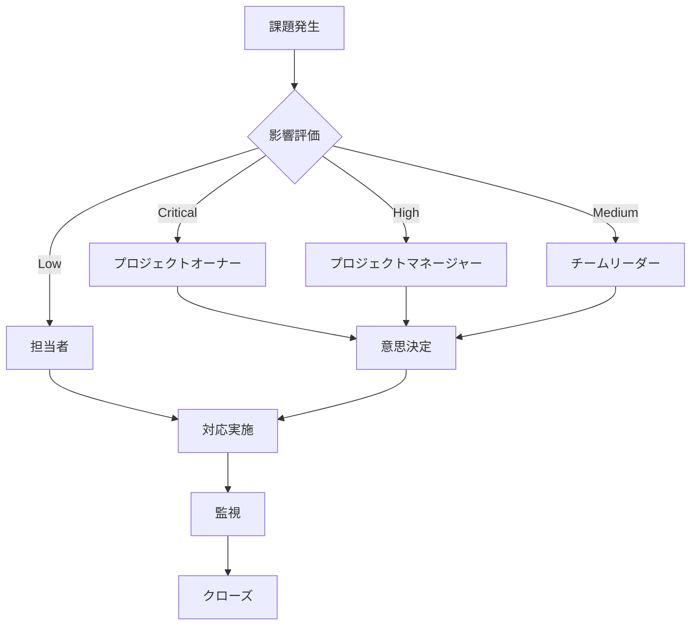

# プロジェクト課題マネジメント 実践ガイドライン

## 1. はじめに：課題管理の本質

課題管理とは、単に発生したトラブルを記録することではなく、**「プロジェクトの目標達成を阻害する要因を組織的に捕捉・評価し、迅速に解消するためのガバナンス・プロセス」**です。課題管理の成否は、QCDS（品質・コスト・スケジュール・スコープ）の維持に直結します。

### 1.1 課題管理がプロジェクト成功に与える影響

| 指標 | 課題管理が適切な場合 | 課題管理が不適切な場合 |
| :--- | :--- | :--- |
| **プロジェクト成功率** | 85%以上 | 40%以下 |
| **スケジュール遅延** | 平均5%以内 | 平均30%以上 |
| **コスト超過** | 平均3%以内 | 平均25%以上 |
| **チームのモチベーション** | 高い | 低い（課題の隠蔽が発生） |

### 1.2 課題管理の3つの目的

1. **早期発見・早期対応**: 課題を早期に発見し、影響を最小限に抑える
2. **意思決定の加速**: 課題解決のための意思決定を迅速に行う
3. **組織学習**: 課題から学び、将来のプロジェクトに活かす

---

## 2. 概念的基盤：用語の厳密な定義

現場での混乱を防ぐため、以下の3つを明確に区別します。

| 用語 | 定義 | 時間軸 | 特徴 | 例 |
| --- | --- | --- | --- | --- |
| **リスク (Risk)** | 将来起こるかもしれない不確実な事象 | 未来 | 発生を「予防」し、起きた時の「備え」をするもの。 | 「外部APIの仕様変更の可能性がある」 |
| **問題 (Problem)** | 既に発生した負の事象、予期せぬトラブル | 現在 | 目に見えている「困りごと」。 | 「外部APIがエラーを返している」 |
| **課題 (Issue)** | プロジェクト目標達成のために**解決すべき具体的な事項** | 現在 | 問題を解決するための「具体的なアクション」が含まれる。 | 「外部APIエラーにより結合テストが停滞している。API仕様を確認し、修正対応を実施する必要がある」 |

> [!TIP]
> **「リスク」が顕在化すると「課題」になります。** 課題には必ず「期限」と「担当者」が必要です。

### 2.1 課題とバグの違い

| 項目 | 課題 (Issue) | バグ (Bug) |
| :--- | :--- | :--- |
| **定義** | プロジェクト目標達成を阻害する要因 | システムの不具合・誤動作 |
| **範囲** | 技術的・非技術的を含む | 技術的な不具合のみ |
| **例** | リソース不足、仕様未確定、環境構築遅延 | 画面表示崩れ、計算結果の誤り |
| **管理** | 課題管理台帳 | バグ管理システム（Jira、Redmine等） |

> [!NOTE]
> バグがプロジェクトの進行を阻害する場合は課題としても管理する。例：「Sランクバグが10件発生し、リリース判定ができない」

---

## 3. 課題の分類と種類

### 3.1 課題の分類方法

#### 3.1.1 影響領域による分類

| 分類 | 説明 | 例 |
| :--- | :--- | :--- |
| **スケジュール課題** | 納期・マイルストーンに影響する課題 | 開発環境構築遅延、レビュー遅延 |
| **コスト課題** | 予算・工数に影響する課題 | 追加リソースが必要、外部ツールの追加費用 |
| **品質課題** | 品質目標に影響する課題 | テストカバレッジ不足、バグ多発 |
| **スコープ課題** | 機能・要件に影響する課題 | 要件不明確、スコープクリープ |
| **リソース課題** | 人員・環境に影響する課題 | 要員不足、サーバーリソース不足 |
| **技術課題** | 技術的な制約・問題 | パフォーマンス問題、技術的制約 |
| **コミュニケーション課題** | 情報共有・連携に影響する課題 | 情報共有不足、意思決定遅延 |

#### 3.1.2 発生源による分類

| 分類 | 説明 | 例 |
| :--- | :--- | :--- |
| **内部課題** | プロジェクトチーム内で発生 | スキル不足、コミュニケーション不足 |
| **外部課題** | プロジェクト外から発生 | ベンダー納期遅延、ユーザー部門のレビュー遅延 |
| **環境課題** | 開発環境・インフラから発生 | サーバーダウン、ネットワーク障害 |
| **依存課題** | 他プロジェクト・外部システムに依存 | 外部API仕様未確定、他システムの遅延 |

#### 3.1.3 解決可能性による分類

| 分類 | 説明 | 対応方針 |
| :--- | :--- | :--- |
| **解決可能** | 現実的な対応策がある | 解決策を立案し、実行 |
| **緩和可能** | 完全解決は困難だが影響を軽減できる | 暫定対応を実施 |
| **受容可能** | 対応コストが効果を上回る | 関係者合意の上で受容 |
| **却下** | 前提が誤っている、スコープ外 | 課題として却下 |

---

## 4. 課題管理のライフサイクル・プロセス

### 4.1 ステップ1：識別と起票（Identification & Logging）

#### 4.1.1 課題発見のタイミング

課題は以下のタイミングで発見される：

- **定例会議**: 週次・月次定例での進捗報告時
- **レビュー**: コードレビュー、設計レビュー時
- **テスト**: テスト実施中に発見
- **日常業務**: 開発作業中に発見
- **エスカレーション**: リスクが顕在化した時
- **監視**: メトリクス・KPIの異常値検知時

#### 4.1.2 起票のルール

**基本原則**:
- **「誰でも・いつでも」起票できる文化を作る**
- **起票を責めない**: 課題を発見した人を責めず、発見を評価する
- **即座に記録**: 発見した瞬間に記録する（「後で書く」は忘れる）

**起票の判断基準**:
- プロジェクトの目標達成に影響するか？
- 解決に具体的なアクションが必要か？
- 期限と担当者が明確にできるか？

#### 4.1.3 記述のコツ（Condition & Impact）

**NG例**:
- 「ネットワークが遅い」
- 「バグが多い」
- 「レビューが遅れている」

**OK例**:
- 「開発環境のネットワーク遅延により（事象）、予定していた結合テストの完了が2日遅れる（影響）。」
- 「Sランクバグが10件発生し（事象）、リリース判定ができない状態になっている（影響）。」
- 「ユーザー部門のレビューが1週間遅延し（事象）、要件定義完了マイルストーンが遅れる見込み（影響）。」

**記述の必須要素**:
1. **事象 (What)**: 何が起きているか
2. **影響 (Impact)**: プロジェクトにどのような影響があるか
3. **背景 (Context)**: なぜ起きたか（可能な範囲で）
4. **緊急度**: いつまでに対応が必要か

#### 4.1.4 粒度の管理

**課題の粒度**:
- **適切な粒度**: 1つの課題が1つの解決策で対応できる
- **細かすぎる**: 複数の課題に分割する必要がない
- **大きすぎる**: 解決にWBSが作れるほど大きなものは「タスク」や「サブプロジェクト」へ切り出す

**粒度の判断基準**:
- 1つの担当者で対応できるか？
- 1つの解決策で対応できるか？
- 1つの期限で管理できるか？

### 4.2 ステップ2：評価と優先順位付け（Evaluation）

#### 4.2.1 優先順位付けの重要性

全ての課題に全力投球はできません。限られたリソースを最適配分するため、優先順位付けが重要です。

#### 4.2.2 アイゼンハワー・マトリクス

「緊急度」×「重要度」で4象限に分類します。

| | **重要度高** | **重要度低** |
| :--- | :--- | :--- |
| **緊急度高** | **第1象限：最優先**<br>即座に対応<br>例：システムダウン、リリースブロッカー | **第2象限：緊急だが重要でない**<br>可能な限り早く対応<br>例：軽微なUI不具合 |
| **緊急度低** | **第3象限：重要だが緊急でない**<br>計画的に対応<br>例：技術的負債の解消 | **第4象限：低優先度**<br>余裕がある時に対応<br>例：ドキュメント整備 |

#### 4.2.3 影響度スコアリング

コスト、スケジュール、品質への影響を1〜5点で数値化します。

**スコアリング基準**:

| スコア | スケジュール影響 | コスト影響 | 品質影響 |
| :--- | :--- | :--- | :--- |
| **5点** | マイルストーン遅延、リリース延期 | 予算の20%超過 | リリース不可 |
| **4点** | 1週間以上の遅延 | 予算の10%超過 | 重要機能に影響 |
| **3点** | 3日〜1週間の遅延 | 予算の5%超過 | 一部機能に影響 |
| **2点** | 1〜3日の遅延 | 予算の2%超過 | 軽微な影響 |
| **1点** | 1日以内の遅延 | 予算の1%未満 | 影響なし |

**総合スコアの計算**:
```
総合スコア = (スケジュール影響 × 2) + (コスト影響 × 1.5) + (品質影響 × 2.5)
```

**優先度の判定**:
- **Critical (S)**: 総合スコア 15点以上
- **High (A)**: 総合スコア 10〜14点
- **Medium (B)**: 総合スコア 5〜9点
- **Low (C)**: 総合スコア 5点未満

#### 4.2.4 優先度の定義と対応期限（SLA）

| 優先度 | 定義 | 標準対応期限(SLA) | エスカレーション先 |
| :--- | :--- | :--- | :--- |
| **Critical (S)** | **Project Blocker**. この解決なしにはプロジェクト全体または重要パスが停止する。 | **24時間以内**に対策立案、3営業日以内に解消。 | ステアリング委員会 |
| **High (A)** | **Major Issue**. 作業に支障が出るが、一時的な迂回策等で凌げる。 | **翌定例会**までに対策立案、1週間以内に解消。 | プロジェクトマネージャー |
| **Medium (B)** | **Minor Issue**. 効率は落ちるが作業は可能。または期限まで十分な余裕がある。 | 対策期限を別途設定。 | チームリーダー |
| **Low (C)** | **Trivial Issue**. 影響が軽微で、対応しなくても問題ない。 | 余裕がある時に対応。 | 担当者 |

### 4.3 ステップ3：対策立案と実行（Resolution）

#### 4.3.1 担当者の明確化

**責任者 (Owner) の役割**:
- 課題解決の最終責任を持つ
- 解決策の立案と実行を主導
- 進捗状況を報告

**実行者 (Assignee) の役割**:
- 実際の作業を実施
- 進捗を報告

**重要**: 責任者は1名に限定する。複数の責任者がいると責任が曖昧になる。

#### 4.3.2 アクションプランの作成

**アクションプランに含める項目**:

1. **目標**: 何を達成するか
2. **アクション**: 具体的な作業内容
3. **担当者**: 誰が実施するか
4. **期限**: いつまでに実施するか
5. **成果物**: 何を成果物とするか
6. **成功基準**: どうなれば完了か

**アクションプランの例**:

| アクション | 担当者 | 期限 | 成果物 | 成功基準 |
| :--- | :--- | :--- | :--- | :--- |
| API仕様書の確認 | 田中 | 6/15 | API仕様書レビュー結果 | 仕様が確定している |
| エラー原因の調査 | 鈴木 | 6/16 | 原因分析レポート | 原因が特定されている |
| 修正対応の実施 | 鈴木 | 6/20 | 修正コード | テストが通る |

#### 4.3.3 課題への対応方法（Resolution Strategy）

課題への処置は以下の4パターンのいずれかを選択し、曖昧な「検討中」を続けない。

##### 1. 消化/解決 (Resolve)
根本原因を取り除き、問題を解消する。最も一般的な対応。

**例**:
- バグを修正する
- 不足していたサーバーを追加購入する
- 仕様を明確化する

**適用条件**:
- 根本原因が明確
- 解決が現実的
- コストと効果が見合う

##### 2. 緩和 (Mitigate)
完全解決は困難だが、影響を許容範囲内まで抑える暫定対応を行う。

**例**:
- 自動化予定だった処理を、一時的に手動運用でカバーする
- パフォーマンス問題を、キャッシュで一時的に改善する
- リソース不足を、残業で一時的に補う

**適用条件**:
- 完全解決に時間がかかる
- 暫定対応で影響を軽減できる
- 根本解決の計画がある

##### 3. 受容 (Accept)
対応コストが効果を上回る場合など、関係者合意の上で「対応しない」ことを決定する。

**例**:
- UIの微細なズレについて、修正リスクが高いためリリース後に対応することとし、現状を受け入れる
- 軽微なパフォーマンス問題を、許容範囲内として受け入れる

**適用条件**:
- 影響が許容範囲内
- 対応コストが効果を上回る
- 関係者が合意している

##### 4. 却下 (Reject)
課題の前提が誤っている、スコープ外である等の理由で、課題として却下する。

**例**:
- 要件定義書に記載されていない機能要求
- プロジェクトスコープ外の要望

**適用条件**:
- 前提が誤っている
- スコープ外である
- 関係者が合意している

### 4.4 ステップ4：監視とクローズ（Monitoring & Closure）

#### 4.4.1 定例での確認

**確認項目**:
- 期限切れの課題
- 停滞している課題（1週間以上更新がない）
- 優先度の高い課題
- エスカレーションが必要な課題

**確認頻度**:
- **日次**: Critical課題
- **週次**: High課題
- **月次**: Medium/Low課題

#### 4.4.2 完了の定義

単に作業が終わっただけでなく、「当初の影響が解消されたこと」を関係者が合意してクローズします。

**完了確認チェックリスト**:
- [ ] 当初の影響が解消されている
- [ ] 成果物が確認されている
- [ ] 関係者が合意している
- [ ] 再発防止策が検討されている（必要に応じて）
- [ ] 教訓が記録されている（必要に応じて）

#### 4.4.3 クローズ後のフォローアップ

**フォローアップ項目**:
- 再発の有無
- 教訓の共有
- プロセス改善の検討

---

## 5. エスカレーション・プロトコル

現場で解決できない課題を上位層へ引き上げるための「安全装置」です。

### 5.1 エスカレーションの判断基準

**エスカレーションが必要な場合**:
- チーム内で解決できない
- 権限・予算が不足している
- 他部門・外部との調整が必要
- プロジェクト全体に影響する

### 5.2 課題重要度マトリクス

| レベル | 影響範囲 | 判断者 | 対応目安 | エスカレーション先 |
| --- | --- | --- | --- | --- |
| **極めて重大 (Critical)** | 全工程の停止、予算の20%超過、リリース延期 | ステアリング委員会 | 24時間以内に初動判断 | プロジェクトオーナー、経営層 |
| **重大 (High)** | 特定マイルストーンの遅延、重要機能の未達、予算の10%超過 | プロジェクトマネージャー | 3営業日以内に方針決定 | PM、ステアリング委員会 |
| **通常 (Medium)** | 代替案がある軽微な遅延、内部調整可能事項 | チームリーダー | 週次定例にて報告 | PL、PM |
| **軽微 (Low)** | 影響が軽微、チーム内で対応可能 | 担当者 | 通常業務として対応 | なし |

### 5.3 エスカレーションフロー



### 5.4 エスカレーション時の情報提供

エスカレーション時には以下の情報を提供します：

1. **課題の概要**: 何が起きているか
2. **影響範囲**: プロジェクトにどのような影響があるか
3. **これまでの対応**: 何を試したか、なぜ解決できなかったか
4. **提案**: どうしたいか（複数案がある場合は全て提示）
5. **必要な支援**: 何が必要か（予算、権限、リソース等）
6. **期限**: いつまでに判断が必要か

---

## 6. 課題管理の運用プロセス

### 6.1 課題管理の会議体

#### 6.1.1 日次課題レビュー

**目的**: Critical課題の進捗確認

**参加者**: PM、PL、課題担当者

**時間**: 15分

**アジェンダ**:
1. Critical課題の進捗確認（5分）
2. ブロッカーの確認（5分）
3. エスカレーションの必要性確認（5分）

#### 6.1.2 週次課題レビュー

**目的**: High課題の進捗確認と優先順位の見直し

**参加者**: PM、PL全員

**時間**: 30分

**アジェンダ**:
1. High課題の進捗確認（10分）
2. 期限切れ課題の確認（5分）
3. 新規課題の評価（10分）
4. 優先順位の見直し（5分）

#### 6.1.3 月次課題レビュー

**目的**: 課題管理の全体像の把握と改善

**参加者**: PM、PL、ステアリング委員会

**時間**: 1時間

**アジェンダ**:
1. 課題管理のサマリー報告（10分）
2. 重要課題の報告（20分）
3. 課題管理のKPIレビュー（10分）
4. プロセス改善の検討（20分）

### 6.2 課題管理のKPIとメトリクス

#### 6.2.1 課題管理のKPI

| KPI | 定義 | 目標値 | 測定頻度 |
| :--- | :--- | :--- | :--- |
| **課題解決率** | 解決した課題数 / 総課題数 | 90%以上 | 週次 |
| **平均解決時間** | 課題解決までの平均日数 | Critical: 3日以内<br>High: 7日以内<br>Medium: 14日以内 | 週次 |
| **期限遵守率** | 期限内に解決した課題数 / 総課題数 | 80%以上 | 週次 |
| **エスカレーション率** | エスカレーションした課題数 / 総課題数 | 20%以下 | 月次 |
| **課題再発率** | 再発した課題数 / 解決した課題数 | 5%以下 | 月次 |

#### 6.2.2 課題管理のメトリクス

**課題の発生状況**:
- 週次・月次の課題発生数
- 課題の種類別発生数
- 課題の優先度別発生数

**課題の解決状況**:
- 週次・月次の課題解決数
- 課題の解決方法別内訳
- 課題の解決時間分布

**課題の傾向分析**:
- 課題の発生源別分析
- 課題の影響領域別分析
- 課題の発生時期別分析

### 6.3 課題管理のダッシュボード

**ダッシュボードに表示する情報**:

1. **課題のサマリー**
   - オープン課題数（優先度別）
   - 期限切れ課題数
   - 今週の新規課題数
   - 今週の解決課題数

2. **課題のトレンド**
   - 課題数の推移グラフ
   - 解決時間の推移グラフ
   - 優先度別の課題数推移

3. **重要課題一覧**
   - Critical課題のリスト
   - High課題のリスト（上位10件）

4. **KPI**
   - 課題解決率
   - 平均解決時間
   - 期限遵守率

---

## 7. 課題管理ツールの選定と活用

### 7.1 ツール選定基準

#### 7.1.1 機能要件

| 機能 | 必須 | 推奨 | 説明 |
| :--- | :---: | :---: | :--- |
| **課題の登録・編集** | ✓ | | 基本的なCRUD操作 |
| **優先度・ステータス管理** | ✓ | | 優先度とステータスの設定・変更 |
| **担当者アサイン** | ✓ | | 課題の担当者設定 |
| **コメント・履歴管理** | ✓ | | 課題の履歴とコメント |
| **ファイル添付** | ✓ | | 関連資料の添付 |
| **検索・フィルタ** | ✓ | | 課題の検索とフィルタリング |
| **ダッシュボード** | | ✓ | 課題の可視化 |
| **レポート機能** | | ✓ | 課題管理のレポート生成 |
| **通知機能** | | ✓ | 課題の更新通知 |
| **API連携** | | ✓ | 他ツールとの連携 |

#### 7.1.2 非機能要件

| 要件 | 説明 |
| :--- | :--- |
| **使いやすさ** | 直感的なUI、学習コストが低い |
| **パフォーマンス** | 大量の課題でも快適に動作 |
| **セキュリティ** | アクセス制御、データ保護 |
| **コスト** | ライセンス費用、運用コスト |
| **サポート** | サポート体制、ドキュメント |

### 7.2 推奨ツール

#### 7.2.1 プロジェクト管理ツール

| ツール | 特徴 | 適用プロジェクト |
| :--- | :--- | :--- |
| **Jira** | 機能が豊富、カスタマイズ性が高い | 大規模プロジェクト、アジャイル開発 |
| **Redmine** | オープンソース、カスタマイズ性が高い | 中規模プロジェクト |
| **Backlog** | 日本語対応、使いやすい | 中小規模プロジェクト |
| **GitHub Issues** | Git連携、シンプル | オープンソース、小規模プロジェクト |
| **Azure DevOps** | Microsoft製品との連携 | Microsoft環境のプロジェクト |

#### 7.2.2 スプレッドシート

| ツール | 特徴 | 適用プロジェクト |
| :--- | :--- | :--- |
| **Excel** | 柔軟性が高い、学習コストが低い | 小規模プロジェクト、初期段階 |
| **Google Sheets** | 共同編集、クラウド保存 | 小規模プロジェクト、リモートワーク |

### 7.3 ツール活用のベストプラクティス

#### 7.3.1 課題管理表の設計

**必須項目**:
- ID（一意の番号）
- 起票日・起票者
- タイトル（事象 + 影響）
- ステータス（未着手 / 進行中 / 保留 / 完了）
- 優先度（Critical / High / Medium / Low）
- 責任者（Owner）
- 実行者（Assignee）
- 解決期限
- 対応策・進捗状況
- 完了確認（確認者と日付）

**推奨項目**:
- 影響領域（スケジュール / コスト / 品質 / スコープ）
- 発生源（内部 / 外部 / 環境 / 依存）
- 対応方法（解決 / 緩和 / 受容 / 却下）
- 関連課題・リスク
- エスカレーション先
- 教訓・再発防止策

#### 7.3.2 ステータスの管理

**ステータスの定義**:

| ステータス | 定義 | 次のステータス |
| :--- | :--- | :--- |
| **新規 (New)** | 課題が起票された | 対応中 / 保留 / 却下 |
| **対応中 (In Progress)** | 対応を実施している | 保留 / 解決済み |
| **保留 (On Hold)** | 一時的に対応を保留 | 対応中 / 却下 |
| **解決済み (Resolved)** | 対応が完了した | クローズ済み / 再オープン |
| **クローズ済み (Closed)** | 確認済みでクローズ | - |
| **却下 (Rejected)** | 課題として却下 | - |

**ステータス変更のルール**:
- ステータス変更時にはコメントを必須とする
- 「対応中」に変更する際は担当者を設定する
- 「解決済み」に変更する際は解決策を記録する
- 「クローズ済み」に変更する際は確認者を記録する

#### 7.3.3 自動化の活用

**自動化できる処理**:

1. **通知の自動化**
   - 課題が起票されたら関係者に通知
   - 期限が近づいたら担当者に通知
   - 期限を過ぎたらPMに通知

2. **ステータスの自動更新**
   - 関連するタスクが完了したら課題を「解決済み」に変更
   - 一定期間更新がない課題を「保留」に変更

3. **レポートの自動生成**
   - 週次・月次の課題管理レポートを自動生成
   - ダッシュボードを自動更新

---

## 8. 形骸化（形だけの運用）を防ぐ3つの鉄則

多くのプロジェクトで課題管理が失敗する原因は、運用が「目的化」することにあります。

### 8.1 鉄則1：「昨日までの実態」を反映させる

**問題**: 更新負荷が高いと放置される

**対策**:
- 入力項目を最小限に絞る
- ツール（Jira, Backlog等）でステータス変更を容易にする
- 日次・週次の定例で課題管理表を確認する
- 更新を怠った場合のペナルティを設ける（例：定例で報告を求める）

### 8.2 鉄則2：会議の主旨を「報告」から「意思決定」へ

**問題**: 「今週の進捗は…」という報告だけで終わる

**対策**:
- 会議のアジェンダを「意思決定事項」に絞る
- 「この課題を解決するために、A案とB案どちらで行くか決めてください」という場にする
- 報告は事前に資料で共有し、会議では意思決定に集中する
- 意思決定ができない場合は、次回までに検討事項を明確にする

### 8.3 鉄則3：バッファの適切な管理

**問題**: 無理な計画は課題の隠蔽を生む

**対策**:
- 現実的なバッファを設ける
- 課題が発生しても吸収できる余地を持たせる
- 課題を隠蔽せず、早期に報告する文化を作る
- 課題の発生を前提とした計画を立てる

---

## 9. よくある失敗パターンと対策

### 9.1 失敗パターン1：課題の隠蔽

**症状**: 課題を報告せず、後で大きな問題になる

**原因**:
- 課題を報告すると責められる文化
- 課題を報告すると評価が下がる

**対策**:
- 課題の発見を評価する文化を作る
- 課題を報告した人を責めない
- 課題の早期発見を表彰する
- 課題の隠蔽を防ぐ仕組みを作る（定例での確認等）

### 9.2 失敗パターン2：優先順位の曖昧さ

**症状**: 全ての課題を同じ優先度で扱う

**原因**:
- 優先順位付けの基準が不明確
- 優先順位を変更する仕組みがない

**対策**:
- 優先順位付けの基準を明確にする
- 定期的に優先順位を見直す
- 優先順位の高い課題にリソースを集中する

### 9.3 失敗パターン3：責任者の曖昧さ

**症状**: 誰が責任者か不明確で、課題が放置される

**原因**:
- 責任者が複数いる
- 責任者が不在

**対策**:
- 責任者は1名に限定する
- 責任者が不在の場合は、代理を明確にする
- 責任者の役割を明確にする

### 9.4 失敗パターン4：解決策の曖昧さ

**症状**: 「検討中」が続き、課題が解決しない

**原因**:
- 解決策が明確でない
- 解決策の実行が進まない

**対策**:
- 解決策を具体的にする（誰が・いつまでに・何をするか）
- 解決策の実行を監視する
- 解決策が進まない場合は、エスカレーションする

### 9.5 失敗パターン5：完了確認の不備

**症状**: 課題が「解決済み」になっているが、実際には解決していない

**原因**:
- 完了確認が不十分
- 関係者の合意がない

**対策**:
- 完了確認のチェックリストを作る
- 関係者の合意を得てからクローズする
- 完了確認者を明確にする

---

## 10. 最新のAI・ツール活用戦略

2025-26年時点での推奨アプローチです。

### 10.1 AIエージェントの活用

#### 10.1.1 Atlassian Intelligence / AIエージェントの活用

**要約機能**:
- 膨大なコメントのやり取りから「現在のボトルネック」をAIに抽出させる
- 課題の要約を自動生成する

**自動化機能**:
- 「期限が1日過ぎた課題の担当者を自動でメンションする」
- 「類似の過去課題を提示させる」
- 「課題の優先度を自動判定する」

#### 10.1.2 ChatGPT / Claude の活用

**活用例**:
- 課題の記述を改善する（曖昧な記述を明確にする）
- 解決策のアイデアを生成する
- 過去の類似課題を検索する

### 10.2 ナレッジ管理の活用

#### 10.2.1 NotebookLMによるナレッジ活用

過去のプロジェクトの「課題管理表」を読み込ませ、現在発生している課題に対する「過去の成功事例」をアドバイザーとして提案させる。

**活用方法**:
1. 過去のプロジェクトの課題管理表をNotebookLMに読み込む
2. 現在の課題を入力する
3. 過去の類似課題と解決策を提案させる
4. 提案された解決策を参考に、現在の課題に対応する

#### 10.2.2 ナレッジベースの構築

**構築方法**:
- 解決した課題をナレッジベースに蓄積する
- 課題の種類別に分類する
- 解決策をテンプレート化する
- 定期的にナレッジベースを更新する

### 10.3 自動化の活用

#### 10.3.1 通知の自動化

**設定例**:
- 課題が起票されたら関係者にSlack通知
- 期限が3日前になったら担当者にメール通知
- 期限を過ぎたらPMにメール通知

#### 10.3.2 レポートの自動生成

**設定例**:
- 週次課題管理レポートを自動生成
- 月次課題管理レポートを自動生成
- ダッシュボードを自動更新

---

## 11. 課題管理のテンプレートとチェックリスト

### 11.1 課題管理表テンプレート

#### 11.1.1 基本テンプレート

| 項目 | 説明 | 例 |
| :--- | :--- | :--- |
| **ID** | 一意の番号 | ISS-001 |
| **起票日** | 課題が起票された日 | 202X/06/10 |
| **起票者** | 課題を起票した人 | 田中太郎 |
| **タイトル** | 課題のタイトル（事象 + 影響） | 開発環境のネットワーク遅延により結合テストが2日遅れる |
| **ステータス** | 課題のステータス | 対応中 |
| **優先度** | 課題の優先度 | High |
| **影響領域** | 影響を受ける領域 | スケジュール |
| **発生源** | 課題の発生源 | 環境 |
| **責任者** | 課題解決の責任者 | 鈴木花子 |
| **実行者** | 実際の作業を実施する人 | 佐藤次郎 |
| **解決期限** | 課題を解決する期限 | 202X/06/15 |
| **事象** | 何が起きているか | 開発環境のネットワークが遅延している |
| **影響** | プロジェクトにどのような影響があるか | 結合テストの完了が2日遅れる見込み |
| **対応策** | どのように対応するか | ネットワーク設定を確認し、必要に応じてインフラチームに依頼 |
| **進捗状況** | 現在の進捗状況 | ネットワーク設定を確認中 |
| **対応方法** | 解決 / 緩和 / 受容 / 却下 | 解決 |
| **完了確認** | 完了確認者と日付 | 田中太郎 202X/06/15 |
| **教訓** | この課題から学んだこと | 開発環境のネットワーク監視を強化する必要がある |

#### 11.1.2 詳細テンプレート（Excel形式）

```excel
課題管理表

| ID | 起票日 | 起票者 | タイトル | ステータス | 優先度 | 影響領域 | 発生源 | 責任者 | 実行者 | 解決期限 | 事象 | 影響 | 対応策 | 進捗状況 | 対応方法 | 完了確認 | 教訓 |
|----|--------|--------|----------|------------|--------|----------|--------|--------|--------|----------|------|------|--------|----------|----------|----------|------|
| ISS-001 | 202X/06/10 | 田中 | 開発環境のネットワーク遅延により結合テストが2日遅れる | 対応中 | High | スケジュール | 環境 | 鈴木 | 佐藤 | 202X/06/15 | 開発環境のネットワークが遅延している | 結合テストの完了が2日遅れる見込み | ネットワーク設定を確認し、必要に応じてインフラチームに依頼 | ネットワーク設定を確認中 | 解決 | - | - |
```

### 11.2 課題管理チェックリスト

#### 11.2.1 起票時のチェックリスト

- [ ] **ID**: 一意の番号が設定されている
- [ ] **起票日 / 起票者**: 起票日と起票者が記録されている
- [ ] **タイトル**: 事象と影響が明確に記述されている
- [ ] **ステータス**: ステータスが設定されている（通常は「新規」）
- [ ] **優先度**: 優先度が設定されている
- [ ] **影響領域**: 影響を受ける領域が明確になっている
- [ ] **発生源**: 課題の発生源が明確になっている
- [ ] **事象**: 何が起きているかが明確に記述されている
- [ ] **影響**: プロジェクトにどのような影響があるかが明確に記述されている

#### 11.2.2 評価時のチェックリスト

- [ ] **優先度**: 優先度が適切に設定されている
- [ ] **影響度スコア**: 影響度スコアが計算されている
- [ ] **解決期限**: 解決期限が設定されている
- [ ] **責任者**: 責任者が1名設定されている
- [ ] **実行者**: 実行者が設定されている（責任者と異なる場合）

#### 11.2.3 対応時のチェックリスト

- [ ] **対応策**: 具体的な対応策が記述されている
- [ ] **アクションプラン**: アクションプランが作成されている
- [ ] **進捗状況**: 進捗状況が定期的に更新されている
- [ ] **対応方法**: 解決 / 緩和 / 受容 / 却下が選択されている

#### 11.2.4 完了時のチェックリスト

- [ ] **当初の影響が解消されている**: 当初の影響が解消されている
- [ ] **成果物が確認されている**: 成果物が確認されている
- [ ] **関係者が合意している**: 関係者が合意している
- [ ] **完了確認者**: 完了確認者が記録されている
- [ ] **完了日**: 完了日が記録されている
- [ ] **教訓**: 教訓が記録されている（必要に応じて）

---

## 12. 実践的な事例とケーススタディ

### 12.1 ケーススタディ1：リソース不足の課題

**状況**:
- プロジェクトの開発フェーズで、要員が1名不足している
- スケジュールに影響が出始めている

**課題の記述**:
- **タイトル**: 開発要員不足により、開発フェーズのスケジュールが1週間遅れる見込み
- **事象**: 開発要員が1名不足している
- **影響**: 開発フェーズのスケジュールが1週間遅れる見込み
- **優先度**: High

**対応策**:
1. **解決**: 追加要員を確保する（最優先）
2. **緩和**: 現有要員の残業で対応する（暫定対応）
3. **受容**: スケジュールを1週間延期する（最終手段）

**結果**:
- 追加要員を確保し、スケジュール遅延を回避

**教訓**:
- リソース計画を早期に確認し、不足が予測される場合は早期に対応する

### 12.2 ケーススタディ2：外部API仕様未確定の課題

**状況**:
- 外部APIの仕様が未確定で、開発が進められない
- 仕様確定の見通しが立っていない

**課題の記述**:
- **タイトル**: 外部API仕様未確定により、開発が停滞している
- **事象**: 外部APIの仕様が未確定で、開発が進められない
- **影響**: 開発が停滞し、スケジュールに影響が出る可能性がある
- **優先度**: High

**対応策**:
1. **解決**: ベンダーと協議し、暫定仕様で進める
2. **緩和**: モックを作成し、開発を進める
3. **受容**: 仕様確定まで待つ（スケジュール調整が必要）

**結果**:
- 暫定仕様で開発を進め、仕様確定後に修正対応

**教訓**:
- 外部依存がある場合は、早期に仕様確定の見通しを確認する

### 12.3 ケーススタディ3：パフォーマンス問題の課題

**状況**:
- システムのパフォーマンスが目標値を下回っている
- リリース判定に影響する可能性がある

**課題の記述**:
- **タイトル**: システムのパフォーマンスが目標値を下回り、リリース判定に影響する可能性がある
- **事象**: システムのパフォーマンスが目標値を下回っている
- **影響**: リリース判定に影響する可能性がある
- **優先度**: High

**対応策**:
1. **解決**: パフォーマンスチューニングを実施する
2. **緩和**: キャッシュを導入し、一時的に改善する
3. **受容**: 目標値を調整する（最終手段）

**結果**:
- パフォーマンスチューニングを実施し、目標値を達成

**教訓**:
- パフォーマンステストを早期に実施し、問題を早期に発見する

---

## 13. チーム文化の醸成

### 13.1 課題を報告しやすい文化を作る

**施策**:
- 課題の発見を評価する
- 課題を報告した人を責めない
- 課題の早期発見を表彰する
- 課題の隠蔽を防ぐ仕組みを作る

### 13.2 課題解決を支援する文化を作る

**施策**:
- 課題解決をチーム全体で支援する
- 課題解決の成功を共有する
- 課題解決の失敗から学ぶ
- 課題解決のプロセスを改善する

### 13.3 課題管理を継続的に改善する

**施策**:
- 定期的に課題管理のプロセスを見直す
- 課題管理のKPIを監視する
- 課題管理のベストプラクティスを共有する
- 課題管理のツールを改善する

---

## 付録：課題管理表の必須項目チェックリスト

### A. 必須項目

- [ ] **ID**: 一意の番号
- [ ] **起票日 / 起票者**: 起票日と起票者が記録されている
- [ ] **タイトル**: 事象と影響が明確に記述されている
- [ ] **ステータス**: ステータスが設定されている
- [ ] **優先度**: 優先度が設定されている
- [ ] **責任者 (Owner)**: 1名に限定されている
- [ ] **解決期限**: 明確な日付が設定されている
- [ ] **対応策 / 進捗状況**: 履歴が残されている
- [ ] **完了確認**: 確認者と日付が記録されている

### B. 推奨項目

- [ ] **影響領域**: 影響を受ける領域が明確になっている
- [ ] **発生源**: 課題の発生源が明確になっている
- [ ] **実行者**: 実行者が設定されている
- [ ] **対応方法**: 解決 / 緩和 / 受容 / 却下が選択されている
- [ ] **関連課題・リスク**: 関連する課題・リスクが記録されている
- [ ] **エスカレーション先**: エスカレーション先が記録されている
- [ ] **教訓・再発防止策**: 教訓・再発防止策が記録されている

---

## まとめ

このガイドラインは、システム開発における課題管理の運用とポイントを詳細にまとめたものです。単なる管理表の書き方ではなく、**「意思決定を加速させ、プロジェクトを停滞させないためのガバナンス」**に焦点を当てています。

### 重要なポイント

1. **課題管理の本質**: プロジェクトの目標達成を阻害する要因を組織的に捕捉・評価し、迅速に解消する
2. **用語の明確化**: リスク、問題、課題を明確に区別する
3. **プロセスの徹底**: 識別→評価→対策→監視のサイクルを徹底する
4. **優先順位付け**: 限られたリソースを最適配分する
5. **エスカレーション**: 現場で解決できない課題を上位層へ引き上げる
6. **形骸化の防止**: 運用が目的化しないよう、実態を反映させる
7. **ツールの活用**: 適切なツールを選定し、効果的に活用する
8. **文化の醸成**: 課題を報告しやすい文化を作る

### 次のステップ

このMarkdownをコピーし、貴社の標準ドキュメントとして保存してください。まずは「課題管理」モジュールを構築し、次に「進捗管理」「品質管理」へと横展開していくことをお勧めします。

---

**最終更新日**: 2026年2月1日  
**バージョン**: 1.0
