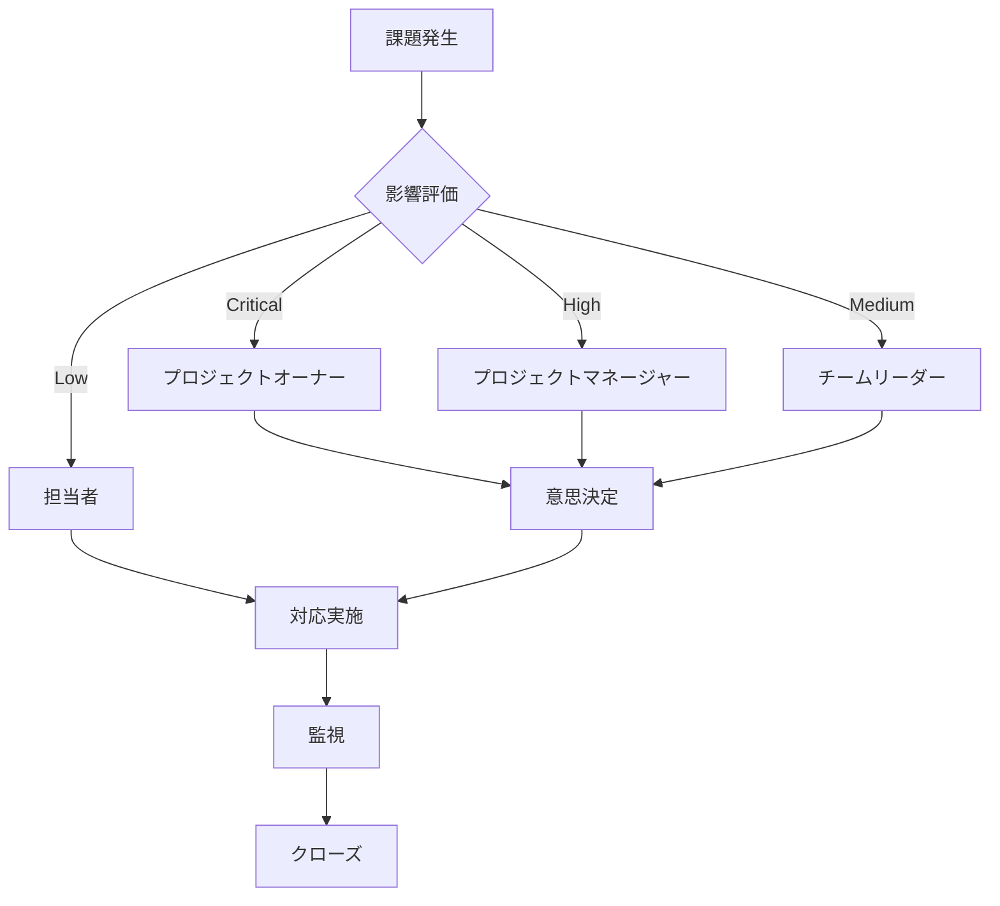
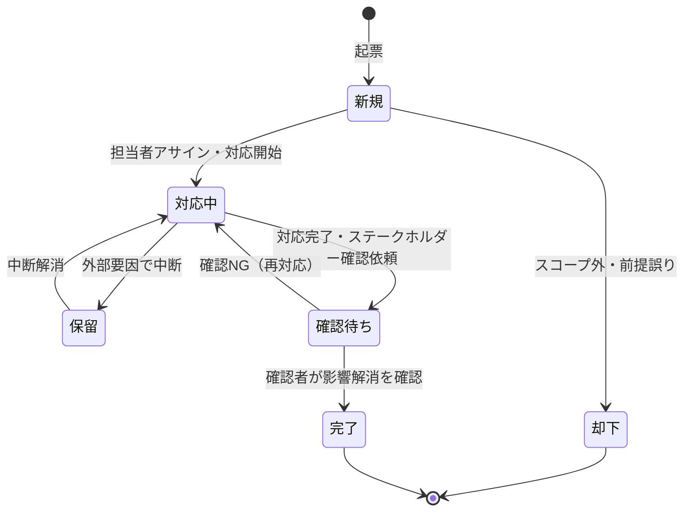
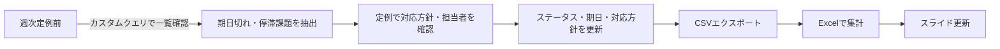

# プロジェクト課題マネジメント 実践ガイドライン

| 項目 | 内容 |
| :--- | :--- |
| 文書番号 | PMO-STD-004 |
| バージョン | 2.1 |
| 作成日 | 2026-02-23 |
| 対象者 | PM・PL・PMO担当者 |

---

## 目次

- [1. はじめに：課題管理の本質](#1-はじめに課題管理の本質)
- [2. 概念的基盤：用語の厳密な定義](#2-概念的基盤用語の厳密な定義)
- [3. 課題の分類と種類](#3-課題の分類と種類)
- [4. 課題管理のライフサイクル・プロセス](#4-課題管理のライフサイクルプロセス)
- [5. エスカレーション・プロトコル](#5-エスカレーションプロトコル)
- [6. 課題管理の運用プロセス](#6-課題管理の運用プロセス)
- [7. 課題管理ツールの選定と活用](#7-課題管理ツールの選定と活用)
- [8. Redmineによる課題チケット管理](#8-redmineによる課題チケット管理)
  - [8.6 作業時間の登録](#86-作業時間の登録)
- [9. 形骸化（形だけの運用）を防ぐ鉄則](#9-形骸化形だけの運用を防ぐ鉄則)
- [10. よくある失敗パターンと対策](#10-よくある失敗パターンと対策)
- [11. 課題管理のテンプレートとチェックリスト](#11-課題管理のテンプレートとチェックリスト)
- [12. 実践的な事例とケーススタディ](#12-実践的な事例とケーススタディ)
- [付録A: 課題管理表の必須項目チェックリスト](#付録a-課題管理表の必須項目チェックリスト)
- [付録B: Redmineカスタムクエリ例](#付録b-redmineカスタムクエリ例)
  - [B.2 本プロジェクトの標準カスタムクエリ](#b2-本プロジェクトの標準カスタムクエリ50課題管理トラッカー)

---

## 1. はじめに：課題管理の本質

課題管理とは、単に発生したトラブルを記録することではなく、**「プロジェクトの目標達成を阻害する要因を組織的に捕捉・評価し、迅速に解消するためのガバナンス・プロセス」**です。課題管理の成否は、QCDS（品質・コスト・スケジュール・スコープ）の維持に直結します。

### 1.1 課題管理がプロジェクト成功に与える影響

| 指標 | 課題管理が適切な場合 | 課題管理が不適切な場合 |
| :--- | :--- | :--- |
| **プロジェクト成功率** | 85%以上 | 40%以下 |
| **スケジュール遅延** | 平均5%以内 | 平均30%以上 |
| **コスト超過** | 平均3%以内 | 平均25%以上 |
| **チームのモチベーション** | 高い | 低い（課題の隠蔽が発生） |

### 1.2 課題管理の3つの目的

1. **早期発見・早期対応**: 課題を早期に発見し、影響を最小限に抑える
2. **意思決定の加速**: 課題解決のための意思決定を迅速に行う
3. **組織学習**: 課題から学び、将来のプロジェクトに活かす

> [!TIP]
> 課題管理は「記録の場」ではなく「意思決定の場」。定例会議での課題確認は、進捗報告より意思決定に時間を使うことを意識する。課題一覧を見ながら「誰が・何を・いつまでに決めるか」を確認する場にする。

---

## 2. 概念的基盤：用語の厳密な定義

現場での混乱を防ぐため、以下の3つを明確に区別します。

| 用語 | 定義 | 時間軸 | 特徴 | 例 |
| --- | --- | --- | --- | --- |
| **リスク (Risk)** | 将来起こるかもしれない不確実な事象 | 未来 | 発生を「予防」し、起きた時の「備え」をするもの。 | 「外部APIの仕様変更の可能性がある」 |
| **問題 (Problem)** | 既に発生した負の事象、予期せぬトラブル | 現在 | 目に見えている「困りごと」。 | 「外部APIがエラーを返している」 |
| **課題 (Issue)** | プロジェクト目標達成のために**解決すべき具体的な事項** | 現在 | 問題を解決するための「具体的なアクション」が含まれる。 | 「外部APIエラーにより結合テストが停滞。API仕様を確認し、修正対応を実施する必要がある」 |

> [!TIP]
> **「リスク」が顕在化すると「課題」になります。** リスク管理台帳に記載していたリスクが実際に起きた瞬間、課題チケットに転記する運用にすると、対応漏れを防ぎやすい。課題には必ず「期限」と「担当者」が必要です。

### 2.1 課題とバグの違い

| 項目 | 課題 (Issue) | バグ (Bug) |
| :--- | :--- | :--- |
| **定義** | プロジェクト目標達成を阻害する要因 | システムの不具合・誤動作 |
| **範囲** | 技術的・非技術的を含む | 技術的な不具合のみ |
| **例** | リソース不足、仕様未確定、環境構築遅延 | 画面表示崩れ、計算結果の誤り |
| **管理** | 課題管理台帳（または課題トラッカー） | バグ管理システム（Jira、Redmine等） |

> [!NOTE]
> バグがプロジェクトの進行を阻害する場合は課題としても管理する。例：「Sランクバグが10件発生し、リリース判定ができない」。この場合はバグチケットと課題チケットを両方起票し、課題チケットから関連バグチケットへリンクを張る。

---

## 3. 課題の分類と種類

### 3.1 課題の分類方法

#### 3.1.1 影響領域による分類

| 分類 | 説明 | 例 |
| :--- | :--- | :--- |
| **スケジュール課題** | 納期・マイルストーンに影響する課題 | 開発環境構築遅延、レビュー遅延 |
| **コスト課題** | 予算・工数に影響する課題 | 追加リソースが必要、外部ツールの追加費用 |
| **品質課題** | 品質目標に影響する課題 | テストカバレッジ不足、バグ多発 |
| **スコープ課題** | 機能・要件に影響する課題 | 要件不明確、スコープクリープ |
| **リソース課題** | 人員・環境に影響する課題 | 要員不足、サーバーリソース不足 |
| **技術課題** | 技術的な制約・問題 | パフォーマンス問題、技術的制約 |
| **コミュニケーション課題** | 情報共有・連携に影響する課題 | 情報共有不足、意思決定遅延 |

#### 3.1.2 発生源による分類

| 分類 | 説明 | 例 |
| :--- | :--- | :--- |
| **内部課題** | プロジェクトチーム内で発生 | スキル不足、コミュニケーション不足 |
| **外部課題** | プロジェクト外から発生 | ベンダー納期遅延、ユーザー部門のレビュー遅延 |
| **環境課題** | 開発環境・インフラから発生 | サーバーダウン、ネットワーク障害 |
| **依存課題** | 他プロジェクト・外部システムに依存 | 外部API仕様未確定、他システムの遅延 |

#### 3.1.3 解決可能性による分類

| 分類 | 説明 | 対応方針 |
| :--- | :--- | :--- |
| **解決可能** | 現実的な対応策がある | 解決策を立案し、実行 |
| **緩和可能** | 完全解決は困難だが影響を軽減できる | 暫定対応を実施 |
| **受容可能** | 対応コストが効果を上回る | 関係者合意の上で受容 |
| **却下** | 前提が誤っている、スコープ外 | 課題として却下 |

---

## 4. 課題管理のライフサイクル・プロセス

### 4.1 ステップ1：識別と起票（Identification & Logging）

#### 4.1.1 課題発見のタイミング

課題は以下のタイミングで発見される：

- **定例会議**: 週次・月次定例での進捗報告時
- **レビュー**: コードレビュー、設計レビュー時
- **テスト**: テスト実施中に発見
- **日常業務**: 開発作業中に発見
- **エスカレーション**: リスクが顕在化した時
- **監視**: メトリクス・KPIの異常値検知時

#### 4.1.2 起票のルール

**基本原則**:
- **「誰でも・いつでも」起票できる文化を作る**
- **起票を責めない**: 課題を発見した人を責めず、発見を評価する
- **即座に記録**: 発見した瞬間に記録する（「後で書く」は忘れる）

**起票の判断基準**:
- プロジェクトの目標達成に影響するか？
- 解決に具体的なアクションが必要か？
- 期限と担当者が明確にできるか？

> [!TIP]
> 起票時点で「何をもって課題が解決・完了となるか」の終了条件を明記しておく。個人の主観ではなく、第三者が客観的に確認できる完了基準にする。「○○が確認できた時点で完了」という形で記載すること。

> [!WARNING]
> 「後で書く」「次の定例で話す」は最大の敵。課題は発見した瞬間にタイトルと影響だけでも最低限記録し、詳細は後から補完する運用が現実的。Redmineならモバイルからでも起票できる。

#### 4.1.3 記述のコツ（Condition & Impact）

**NG例**:
- 「ネットワークが遅い」
- 「バグが多い」
- 「レビューが遅れている」

**OK例**:
- 「開発環境のネットワーク遅延により（事象）、予定していた結合テストの完了が2日遅れる（影響）。」
- 「Sランクバグが10件発生し（事象）、リリース判定ができない状態になっている（影響）。」
- 「ユーザー部門のレビューが1週間遅延し（事象）、要件定義完了マイルストーンが遅れる見込み（影響）。」

**記述の必須要素**:
1. **事象 (What)**: 何が起きているか
2. **影響 (Impact)**: プロジェクトにどのような影響があるか
3. **背景 (Context)**: なぜ起きたか（可能な範囲で）
4. **緊急度**: いつまでに対応が必要か

> [!TIP]
> 課題タイトルは「事象＋影響」の形式で書くと定例での共有が速くなる。例：「○○により△△マイルストーンが1週間遅れる見込み」。タイトルを見ただけで重要度と影響が伝わる形にする。

#### 4.1.4 粒度の管理

**課題の粒度**:
- **適切な粒度**: 1つの課題が1つの解決策で対応できる
- **細かすぎる**: 複数の課題にまたがらなければ管理不要
- **大きすぎる**: 解決にWBSが作れるほど大きなものは「タスク」や「サブプロジェクト」へ切り出す

**粒度の判断基準**:
- 1つの担当者で対応できるか？
- 1つの解決策で対応できるか？
- 1つの期限で管理できるか？

> [!NOTE]
> 原因が特定されており「○○すれば解決できる」と明確で、調整・協議が不要な場合は、課題チケットではなくタスクチケットで対応する。課題トラッカーを「解決方法を協議・調整する必要があるもの」に限定することで、課題一覧の見通しがよくなる。

### 4.2 ステップ2：評価と優先順位付け（Evaluation）

#### 4.2.1 優先順位付けの重要性

全ての課題に全力投球はできません。限られたリソースを最適配分するため、優先順位付けが重要です。

#### 4.2.2 アイゼンハワー・マトリクス

「緊急度」×「重要度」で4象限に分類します。

| | **重要度高** | **重要度低** |
| :--- | :--- | :--- |
| **緊急度高** | **第1象限：最優先**<br>即座に対応<br>例：システムダウン、リリースブロッカー | **第2象限：緊急だが重要でない**<br>可能な限り早く対応<br>例：軽微なUI不具合 |
| **緊急度低** | **第3象限：重要だが緊急でない**<br>計画的に対応<br>例：技術的負債の解消 | **第4象限：低優先度**<br>余裕がある時に対応<br>例：ドキュメント整備 |

#### 4.2.2b Redmineフィールド値と優先度判断の対応

理論的なアイゼンハワー・マトリクスをRedmineの入力値と対応付けると以下のようになる。

| | **緊急度（高）**<br>Redmine優先度：04.急いで / 05.今すぐ | **緊急度（低）**<br>Redmine優先度：01.低め / 02.通常 |
| :--- | :--- | :--- |
| **重要度（大）**<br>Redmine重要度：1.大 | **第1象限：最優先**<br>今すぐ着手。最初にさっさと対応する | **第3象限：重要だが急がない**<br>計画を立てて確実に実施する |
| **重要度（小）**<br>Redmine重要度：3.小 | **第2象限：緊急だが影響軽微**<br>可能なら早めに対応する | **第4象限：低優先**<br>余裕があれば対応。受容・却下も積極的に検討する |

> [!TIP]
> 重要度と優先度の組み合わせで「今すぐやるべきことは何か」を一目で判断できる。特に第3象限（重要だが緊急でない）は先送りになりがちなので、定例での計画的な確認が必要。

#### 4.2.3 影響度スコアリング

コスト、スケジュール、品質への影響を1〜5点で数値化します。

**スコアリング基準**:

| スコア | スケジュール影響 | コスト影響 | 品質影響 |
| :--- | :--- | :--- | :--- |
| **5点** | マイルストーン遅延、リリース延期 | 予算の20%超過 | リリース不可 |
| **4点** | 1週間以上の遅延 | 予算の10%超過 | 重要機能に影響 |
| **3点** | 3日〜1週間の遅延 | 予算の5%超過 | 一部機能に影響 |
| **2点** | 1〜3日の遅延 | 予算の2%超過 | 軽微な影響 |
| **1点** | 1日以内の遅延 | 予算の1%未満 | 影響なし |

**総合スコアの計算**:
```
総合スコア = (スケジュール影響 × 2) + (コスト影響 × 1.5) + (品質影響 × 2.5)
```

**重要度（スコア）の判定**:
- **Critical (S)**: 総合スコア 15点以上
- **High (A)**: 総合スコア 10〜14点
- **Medium (B)**: 総合スコア 5〜9点
- **Low (C)**: 総合スコア 5点未満

> [!NOTE]
> スコアリングは「議論の基準」として使う。数値で重要度を議論できるようになるだけで、主観的な「なんとなく重要」という判断を排除できる。ただし、状況に応じて加重係数は調整する。Redmineのカスタムフィールド「重要度」にこの判定結果を入力する（Section 8.2.2参照）。

#### 4.2.4 優先度の定義と対応期限（SLA）

| 優先度 | 定義 | 標準対応期限(SLA) | エスカレーション先 |
| :--- | :--- | :--- | :--- |
| **Critical (S)** | **Project Blocker**. この解決なしにはプロジェクト全体または重要パスが停止する。 | **24時間以内**に対策立案、3営業日以内に解消。 | ステアリング委員会 |
| **High (A)** | **Major Issue**. 作業に支障が出るが、一時的な迂回策等で凌げる。 | **翌定例会**までに対策立案、1週間以内に解消。 | プロジェクトマネージャー |
| **Medium (B)** | **Minor Issue**. 効率は落ちるが作業は可能。または期限まで十分な余裕がある。 | 対策期限を別途設定。 | チームリーダー |
| **Low (C)** | **Trivial Issue**. 影響が軽微で、対応しなくても問題ない。 | 余裕がある時に対応。 | 担当者 |

### 4.3 ステップ3：対策立案と実行（Resolution）

#### 4.3.1 担当者の明確化

**責任者 (Owner) の役割**:
- 課題解決の最終責任を持つ
- 解決策の立案と実行を主導
- 進捗状況を報告

**実行者 (Assignee) の役割**:
- 実際の作業を実施
- 進捗を報告

> [!WARNING]
> 責任者は1名に限定する。複数の責任者がいると責任が曖昧になり、課題が放置される最大の原因になる。「Aさんが主担当でBさんが支援」という形にし、Redmineの担当者フィールドには主担当者を1名のみ設定する。

#### 4.3.2 アクションプランの作成

**アクションプランに含める項目**:

1. **目標**: 何を達成するか
2. **アクション**: 具体的な作業内容
3. **担当者**: 誰が実施するか
4. **期限**: いつまでに実施するか
5. **成果物**: 何を成果物とするか
6. **成功基準**: どうなれば完了か

**アクションプランの例**:

| アクション | 担当者 | 期限 | 成果物 | 成功基準 |
| :--- | :--- | :--- | :--- | :--- |
| API仕様書の確認 | 田中 | 6/15 | API仕様書レビュー結果 | 仕様が確定している |
| エラー原因の調査 | 鈴木 | 6/16 | 原因分析レポート | 原因が特定されている |
| 修正対応の実施 | 鈴木 | 6/20 | 修正コード | テストが通る |

#### 4.3.3 課題への対応方法（Resolution Strategy）

課題への処置は以下の4パターンのいずれかを選択し、曖昧な「検討中」を続けない。

##### 1. 消化/解決 (Resolve)
根本原因を取り除き、問題を解消する。最も一般的な対応。

**例**:
- バグを修正する
- 不足していたサーバーを追加購入する
- 仕様を明確化する

##### 2. 緩和 (Mitigate)
完全解決は困難だが、影響を許容範囲内まで抑える暫定対応を行う。

**例**:
- 自動化予定だった処理を、一時的に手動運用でカバーする
- パフォーマンス問題を、キャッシュで一時的に改善する
- リソース不足を、残業で一時的に補う

> [!NOTE]
> 「緩和」は最終的な解決を前提とした暫定対応。「いつまでに根本解決するか」の計画を同時に立てないと、永遠に暫定対応が続く「緩和の固定化」に陥る。Redmineのコメント欄に「暫定対応完了、根本解決期限：〇〇日」と記録しておく。

##### 3. 受容 (Accept)
対応コストが効果を上回る場合など、関係者合意の上で「対応しない」ことを決定する。

**例**:
- UIの微細なズレについて、修正リスクが高いためリリース後に対応することとし、現状を受け入れる
- 軽微なパフォーマンス問題を、許容範囲内として受け入れる

##### 4. 却下 (Reject)
課題の前提が誤っている、スコープ外である等の理由で、課題として却下する。

**例**:
- 要件定義書に記載されていない機能要求
- プロジェクトスコープ外の要望

### 4.4 ステップ4：監視とクローズ（Monitoring & Closure）

#### 4.4.1 定例での確認

**確認項目**:
- 期限切れの課題
- 停滞している課題（1週間以上更新がない）
- 優先度の高い課題
- エスカレーションが必要な課題

**確認頻度**:
- **日次**: Critical課題
- **週次**: High課題
- **月次**: Medium/Low課題

#### 4.4.2 完了の定義

単に作業が終わっただけでなく、「当初の影響が解消されたこと」を関係者が合意してクローズします。

**完了確認チェックリスト**:
- [ ] 当初の影響が解消されている
- [ ] 成果物が確認されている
- [ ] 関係者が合意している
- [ ] 再発防止策が検討されている（必要に応じて）
- [ ] 教訓が記録されている（必要に応じて）

#### 4.4.3 クローズ後のフォローアップ

**フォローアップ項目**:
- 再発の有無
- 教訓の共有
- プロセス改善の検討

---

## 5. エスカレーション・プロトコル

現場で解決できない課題を上位層へ引き上げるための「安全装置」です。

### 5.1 エスカレーションの判断基準

**エスカレーションが必要な場合**:
- チーム内で解決できない
- 権限・予算が不足している
- 他部門・外部との調整が必要
- プロジェクト全体に影響する

> [!WARNING]
> エスカレーションが遅すぎると「もっと早く言ってくれれば」になる。「自分で解決できるはず」と抱え込むのが最大の失敗パターン。「3営業日以内に解決できそうにない」と感じた時点でエスカレーションを検討する。上位者への相談は「弱さ」ではなく「仕事の進め方」として文化として根付かせる。

### 5.2 課題重要度マトリクス

| レベル | 影響範囲 | 判断者 | 対応目安 | エスカレーション先 |
| --- | --- | --- | --- | --- |
| **極めて重大 (Critical)** | 全工程の停止、予算の20%超過、リリース延期 | ステアリング委員会 | 24時間以内に初動判断 | プロジェクトオーナー、経営層 |
| **重大 (High)** | 特定マイルストーンの遅延、重要機能の未達、予算の10%超過 | プロジェクトマネージャー | 3営業日以内に方針決定 | PM、ステアリング委員会 |
| **通常 (Medium)** | 代替案がある軽微な遅延、内部調整可能事項 | チームリーダー | 週次定例にて報告 | PL、PM |
| **軽微 (Low)** | 影響が軽微、チーム内で対応可能 | 担当者 | 通常業務として対応 | なし |

### 5.3 エスカレーションフロー


```mermaid
graph TD
    Issue[課題発生] --> Assess{影響評価}
    Assess -->|Critical| Owner[プロジェクトオーナー]
    Assess -->|High| PM[プロジェクトマネージャー]
    Assess -->|Medium| PL[チームリーダー]
    Assess -->|Low| Assignee[担当者]
    Owner --> Decision[意思決定]
    PM --> Decision
    PL --> Decision
    Assignee --> Action[対応実施]
    Decision --> Action
    Action --> Monitor[監視]
    Monitor --> Close[クローズ]
```

### 5.4 エスカレーション時の情報提供

エスカレーション時には以下の情報を提供します：

1. **課題の概要**: 何が起きているか
2. **影響範囲**: プロジェクトにどのような影響があるか
3. **これまでの対応**: 何を試したか、なぜ解決できなかったか
4. **提案**: どうしたいか（複数案がある場合は全て提示）
5. **必要な支援**: 何が必要か（予算、権限、リソース等）
6. **期限**: いつまでに判断が必要か

> [!TIP]
> エスカレーション時は「問題の報告」ではなく「判断の依頼」として伝える。「このような状況で困っています」ではなく「A案とB案があります。B案を推奨しますが、〇〇日までにご判断をいただけますか」の形式にすると、上位者の意思決定が速くなる。

---

## 6. 課題管理の運用プロセス

### 6.1 課題管理の会議体

#### 6.1.1 日次課題レビュー

**目的**: Critical課題の進捗確認

**参加者**: PM、PL、課題担当者

**時間**: 15分

**アジェンダ**:
1. Critical課題の進捗確認（5分）
2. ブロッカーの確認（5分）
3. エスカレーションの必要性確認（5分）

#### 6.1.2 週次課題レビュー

**目的**: High課題の進捗確認と優先順位の見直し

**参加者**: PM、PL全員

**時間**: 30分

**アジェンダ**:
1. High課題の進捗確認（10分）
2. 期限切れ課題の確認（5分）
3. 新規課題の評価（10分）
4. 優先順位の見直し（5分）

> [!TIP]
> 週次定例では「Redmineの未解決課題（期日昇順）」をスクリーンに映し、1件ずつ確認するだけでも効果的。資料作成不要で20分以内に終わる。Redmineのカスタムクエリ「未解決課題（Critical/High）」を活用する（付録B参照）。

#### 6.1.3 月次課題レビュー

**目的**: 課題管理の全体像の把握と改善

**参加者**: PM、PL、ステアリング委員会

**時間**: 1時間

**アジェンダ**:
1. 課題管理のサマリー報告（10分）
2. 重要課題の報告（20分）
3. 課題管理のKPIレビュー（10分）
4. プロセス改善の検討（20分）

### 6.2 課題管理のKPIとメトリクス

#### 6.2.1 課題管理のKPI

| KPI | 定義 | 目標値 | 測定頻度 |
| :--- | :--- | :--- | :--- |
| **課題解決率** | 解決した課題数 / 総課題数 | 90%以上 | 週次 |
| **平均解決時間** | 課題解決までの平均日数 | Critical: 3日以内<br>High: 7日以内<br>Medium: 14日以内 | 週次 |
| **期限遵守率** | 期限内に解決した課題数 / 総課題数 | 80%以上 | 週次 |
| **エスカレーション率** | エスカレーションした課題数 / 総課題数 | 20%以下 | 月次 |
| **課題再発率** | 再発した課題数 / 解決した課題数 | 5%以下 | 月次 |

#### 6.2.2 課題の傾向分析

**課題の発生状況**:
- 週次・月次の課題発生数
- 課題の種類別・影響領域別発生数
- 課題の重要度別発生数

**課題の解決状況**:
- 週次・月次の課題解決数
- 対応方針（解決/緩和/受容/却下）別内訳
- 課題の解決時間分布

**Redmineを使った可視化の実践例**:

- **担当者別×ステータス別の課題保持状況**：担当者単位で課題を持ちすぎていないか・偏りがないかを確認し、速やかな解消につなげる（カスタムクエリ「担当者別オープン課題」を活用）
- **滞留チケットの確認**：期日遅れで放置されているチケットの全体状況を確認する（「5-02.課題管理-期日遅れ」クエリを活用）
- **時系列推移の管理**：週次で「発生数累計」「完了数累計」「残チケット数」「遅れチケット数」の4指標を集計し、発生が落ち着いているか・順調に解消しているか・遅れチケットが増えていないかを確認する。残チケット数が増加傾向にある場合や遅れチケットが連続して増えている場合は対応強化のサインと判断する

### 6.3 ステークホルダーへの報告

**週次報告に含める情報**:

1. **課題のサマリー**
   - オープン課題数（重要度別）
   - 期限切れ課題数
   - 今週の新規課題数
   - 今週の解決課題数

2. **重要課題一覧**
   - Critical課題のリスト
   - High課題のリスト（上位10件）

3. **KPI**
   - 課題解決率
   - 平均解決時間
   - 期限遵守率

> [!NOTE]
> RedmineのCSVエクスポートをExcelで集計し、スライドに貼り付けるフローが実務では最もシンプルで確実。集計の詳細はSection 8.4を参照。

---

## 7. 課題管理ツールの選定と活用

### 7.1 主要ツールの比較

| ツール | 特徴 | 適用プロジェクト |
| :--- | :--- | :--- |
| **Redmine** | オープンソース、カスタムフィールド対応、タスク管理と一元化できる | 中規模プロジェクト（本ガイドの標準環境） |
| **Jira** | 機能が豊富、カスタマイズ性が高い | 大規模プロジェクト、アジャイル開発 |
| **Backlog** | 日本語対応、使いやすい | 中小規模プロジェクト |
| **GitHub Issues** | Git連携、シンプル | オープンソース、小規模プロジェクト |
| **Excel / Googleスプレッドシート** | 柔軟性が高い、学習コストが低い | 小規模・初期段階 |

### 7.2 ツール選定基準

| 機能 | 必須 | 推奨 | 説明 |
| :--- | :---: | :---: | :--- |
| **課題の登録・編集** | ✓ | | 基本的なCRUD操作 |
| **重要度・ステータス管理** | ✓ | | 重要度とステータスの設定・変更 |
| **担当者アサイン** | ✓ | | 課題の担当者設定 |
| **コメント・履歴管理** | ✓ | | 課題の履歴とコメント |
| **ファイル添付** | ✓ | | 関連資料の添付 |
| **検索・フィルタ** | ✓ | | 課題の検索とフィルタリング |
| **カスタムフィールド** | | ✓ | 影響範囲・重要度など独自項目の追加 |
| **レポート / CSV出力** | | ✓ | 課題管理のレポート生成 |
| **通知機能** | | ✓ | 課題の更新通知 |

### 7.3 課題管理表の必須・推奨項目（ツール共通）

**必須項目**:
- ID（一意の番号）、起票日・起票者
- タイトル（事象 + 影響）
- ステータス（新規 / 対応中 / 保留 / 解決済み / クローズ / 却下）
- **重要度**（Critical / High / Medium / Low）
- **優先度**（01.低め / 02.通常 / 03.高め / 04.急いで / 05.今すぐ）
- **影響範囲**（スケジュール / コスト / 品質 / スコープ / リソース / 技術）
- 責任者（Owner）、解決期限
- **課題内容**（事象・背景・影響の詳細）
- **対応方針**（解決 / 緩和 / 受容 / 却下）、対応状況・経緯
- 完了確認（確認者と日付）

**推奨項目**:
- 発生源（内部 / 外部 / 環境 / 依存）
- 関連課題・リスク、エスカレーション先
- 教訓・再発防止策

---

## 8. Redmineによる課題チケット管理

Redmineはタスク管理（進捗管理）と課題管理を同一プラットフォームで運用できる。ただし、**トラッカーを分けることが運用品質を保つ鍵**となる。

### 8.1 課題管理専用トラッカーの設定

**トラッカーの分離が必要な理由**:
- タスクチケットと課題チケットではステータス遷移・フィールド・確認フローが異なる
- 混在すると課題の見落としや重要度の錯誤が発生しやすい

**推奨トラッカー構成**:

| トラッカー名 | 用途 |
| :--- | :--- |
| タスク | 工程内の作業単位（WBS対応） |
| **50.課題管理** | プロジェクトの目標達成を阻害する事項 |
| バグ | テスト工程で検出した不具合 |

> [!NOTE]
> バグチケットはバグ管理専用で運用し、プロジェクトの進行を阻害する深刻なバグのみ「課題」として二重管理する。例：Sランクバグの未解決がリリース判定に影響する場合、バグチケットを参照した課題チケットを起票する。

> [!TIP]
> **チケット起票手順：** 共通Redmineにログイン → 担当プロジェクトの画面へ遷移 → 「チケット」タブ → 「新しいチケット」を押下 → トラッカーで「50.課題管理」を選択。

### 8.2 チケット項目の定義と活用

#### 8.2.1 標準フィールドの活用

| Redmineフィールド | 課題管理での使い方 |
| :--- | :--- |
| **題名 (Subject)** | 「事象＋影響」の形式で記載。例：「○○遅延により△△マイルストーンが1週間遅れる見込み」 |
| **説明 (Description)** | 課題内容（事象・背景・影響詳細）を記載。対応経緯はノート（コメント欄）で追記する |
| **ステータス** | 新規→対応中→解決済み→クローズ（Section 8.3参照） |
| **優先度** | Redmine標準優先度を**対応の緊急度**として使用：01.低め / 02.通常 / 03.高め / 04.急いで / 05.今すぐ |
| **担当者** | 課題解決の責任者（Owner）を1名設定 |
| **期日** | 対応期限（SLAに基づいて設定） |

#### 8.2.2 推奨カスタムフィールド

| カスタムフィールド名 | 型 | 選択肢 / 入力規則 | 対応する管理概念 |
| :--- | :--- | :--- | :--- |
| **重要度** | リスト | Critical / High / Medium / Low | 課題の影響の大きさ（Section 4.2.3のスコア判定結果） |
| **影響範囲** | リスト（複数選択可） | スケジュール / コスト / 品質 / スコープ / リソース / 技術 | 課題が影響を及ぼす領域 |
| **対応方針** | リスト | 解決 / 緩和 / 受容 / 却下 / 検討中 | 処置の方向性（Section 4.3.3参照） |
| **課題分類** | リスト | 01.仕様課題 / 02.技術課題 / 03.体制課題 / 04.スケジュール課題 / 05.外部調整 / 06.環境課題 / 07.品質課題 / 90.その他 | 課題の発生源・性質による分類 |
| **課題範囲** | リスト | 01.重要課題 / 02.全体課題 / 03.チーム課題 | PJT内の影響スコープ・管理レベル |
| **サブシステム** | リスト | プロジェクト固有のサブシステム一覧 | 課題解決を担当するサブシステムの特定 |
| **発生日** | 日付 | — | 課題が実際に発生した日付（起票日と区別して記録） |
| **回答者** | ユーザー | — | 課題に対して回答・方針決定した担当者 |
| **回答日** | 日付 | — | 回答・方針決定が行われた日付 |
| **回答・対応内容** | テキスト | — | 回答内容・対応方針の記録（経緯はコメント欄と併用） |

> [!NOTE]
> 本プロジェクトのRedmineでの**重要度**設定値は「1.大 / 2.中 / 3.小」の3段階。1.大 = Critical相当（マイルストーンに影響・次タスクへの着手不可）、2.中 = High/Medium相当（暫定対応を行えば次タスクに着手可）、3.小 = Low相当（他作業への影響なし）。

> [!NOTE]
> **課題分類**の意味：01.仕様課題 = 仕様面でPJT計画に影響する課題 / 02.技術課題 = 実装困難・技術的不明点・新技術が必要等 / 03.体制課題 = 人員不足・スキル不足・役割不明確等 / 04.スケジュール課題 = タスク遅延・追加タスク・依存関係等の進捗影響 / 05.外部調整 = 外部ベンダー・他システム・依頼停滞等 / 06.環境課題 = 検証環境整備・必要ツール利用不可等 / 07.品質課題 = バグ多発・レビュー不備・品質基準未達等 / 90.その他 = 上記以外。**課題範囲**の意味：01.重要課題 = PJT内で意思決定が困難または遂行に多大な影響を与えるもの / 02.全体課題 = PJT全体・複数システムに横断して解決すべき課題 / 03.チーム課題 = 各ベンダー・チーム内で対応可能な課題。

> [!TIP]
> **重要度と優先度は別物**。重要度はビジネスインパクトの大きさ（Critical/High/Medium/Low）、優先度はいつ対応するかの緊急度（01.低め/02.通常/03.高め/04.急いで/05.今すぐ）。両方を設定することで「重要度は高いが外部要因待ちのため今週は着手できない」という状況を正確に記録できる。

> [!WARNING]
> カスタムフィールドは必要最小限に絞る。入力項目が多いほど起票コストが上がり、課題の隠蔽につながる。まず「重要度」「影響範囲」「対応方針」の3つから始め、運用が定着してから追加を検討する。

#### 8.2.3 課題チケットの記述例

**チケット題名**:
```
【外部API仕様未確定】結合テストが停滞し、リリースが2週間遅延する見込み
```

**説明欄（課題内容）**:
```
## 事象
○○社提供の決済APIの仕様書が未提出（確認依頼から2週間経過）。
モック環境でのテストは完了しているが、本番API接続テストに着手できない状態。

## 影響
- 結合テストフェーズ全体が停滞（現時点で3営業日の遅れ）
- このまま解決しない場合、リリース予定日（6/30）の2週間遅延が見込まれる

## 対応方針
緩和: ○○社との協議で暫定仕様を確定し、暫定仕様に基づいて接続テストを開始
根本解決: 6/10までに正式仕様書を受領する
```

**コメント（対応経緯）**:
```
5/20: ○○社に仕様書提出を依頼
5/27: 未提出のため催促メールを送付
6/01: 未提出継続のため本課題チケットを起票。PMへエスカレーション済み
```

#### 8.2.4 チケット入力例（全フィールド）

実際のRedmineチケット起票時の全項目と入力ポイントを示す。

| 項目（※は必須） | 入力例 | ポイント |
| :--- | :--- | :--- |
| トラッカー ※ | 50.課題管理 | — |
| 題名 ※ | 【マスタ管理】連携マスタに必要なコード情報が不足している | 第三者にも一目で課題内容がわかるように記載。かつ簡潔でわかりやすく |
| ステータス ※ | 01.新規 | — |
| 優先度 ※ | 02.通常 | 課題の優先度（緊急度）と重要度（影響度）をあわせて選択し、着手順序を明確にする |
| 担当者 ※ | 自分に割り当て | — |
| 重要度 | 1.大 | — |
| サブシステム | 対象サブシステム名 | — |
| 発生日 ※ | 2025/05/01 | — |
| 起票者 | 起票した担当者名 | — |
| 開始日 | 2025/05/01 | — |
| 期日 | 2025/05/05 | — |
| 予定工数 | 5時間 | — |
| 回答日 | 2025/05/03 | — |
| 回答者 | 方針決定者名 | — |
| 課題分類 ※ | 01.仕様課題 | — |
| 課題内容 | 連携元システムから受け取るマスタデータに必要なコード情報が不足しているため、DDコードで判別するか連携元システムで追加してもらうか検討が必要 | 発生経緯・影響範囲・可能であれば解決案・解決完了基準を明確に記載する |
| 回答・対応内容 | 連携元システムでコードを追加することに決定（2025/05/03全体会議） | 日付とともに課題の進捗・対応状況も記載してよい |

### 8.3 ステータスの定義と遷移ルール


```mermaid
stateDiagram-v2
    [*] --> 新規: 起票
    新規 --> 対応中: 担当者アサイン・対応開始
    新規 --> 却下: スコープ外・前提誤り
    対応中 --> 保留: 外部要因で中断
    保留 --> 対応中: 中断解消
    対応中 --> 確認待ち: 対応完了・ステークホルダー確認依頼
    確認待ち --> 完了: 確認者が影響解消を確認
    確認待ち --> 対応中: 確認NG（再対応）
    却下 --> [*]
    完了 --> [*]
```

| ステータス（概念） | Redmineでの設定値 | 定義 | 遷移時の必須アクション |
| :--- | :--- | :--- | :--- |
| **新規** | 01.新規 | 起票直後 | 重要度・優先度・影響範囲・対応方針を設定する |
| **対応中** | 03.対応中 | 担当者が対応中 | 担当者と期日を確定する |
| **確認待ち** | 06.確認待ち | 対応は完了しているが、ステークホルダーでの確認待ち状態 | コメントに確認依頼先と期限を記載 |
| **保留** | 95.対応保留中 | 外部要因等で一時中断 | コメントに中断理由と再開見込み日を記載 |
| **完了** | 90.完了 | 確認者が影響解消を確認してクローズ | 確認者と完了日をコメントに記録 |
| **却下** | 98.却下/完了 | 課題として不成立または取り下げ完了 | コメントに却下理由を記載 |

> [!WARNING]
> 「解決済み」に変更してそのまま放置するのが最悪のパターン。「解決済み」になったら最大3営業日以内にPM/PLが確認してクローズ判定を行う運用ルールを設ける。Redmineの通知機能を使って「解決済みに変更されたら担当PLに通知」を設定すると確認漏れを防ぎやすい。

### 8.4 課題管理の週次サイクル

> [!NOTE]
> Redmineを課題管理に使うことの主なメリット：**台帳機能** = 記録の抜け漏れ防止・期日/優先度設定・変更履歴が残る・Web上での競合防止 / **メール通知** = 担当割り当てによる放置防止・連絡ミス削減・ウォッチャー機能で情報共有 / **カスタムクエリ** = 対応遅れの早期検知・要員別状況確認と負荷分散・課題分類別での傾向分析と再発防止。


```mermaid
graph LR
    A[週次定例前] -->|カスタムクエリで一覧確認| B[期日切れ・停滞課題を抽出]
    B --> C[定例で対応方針・担当者を確認]
    C --> D[ステータス・期日・対応方針を更新]
    D --> E[CSVエクスポート]
    E --> F[Excelで集計]
    F --> G[スライド更新]
```

**週次集計の推奨Excelシート構成**:

| シート名 | 内容 |
| :--- | :--- |
| 課題サマリー | 重要度別件数、解決率、期限遵守率 |
| Critical / High一覧 | タイトル・担当者・期日・対応方針・対応状況 |
| 今週クローズ | 今週解決した課題と教訓 |

> [!TIP]
> RedmineのCSVエクスポートはカスタムフィールドも出力できる。「重要度」「影響範囲」「対応方針」をカスタムフィールドとして設定しておけば、Excelでのピボット集計が容易になる。エクスポート条件は「未解決＋今週クローズ」を含めると変化量も把握できる。

### 8.5 カスタムクエリの活用

よく使うカスタムクエリをあらかじめ保存しておくことで、課題確認の手間を大幅に削減できる。推奨クエリは付録Bを参照。

> [!TIP]
> カスタムクエリを「マイフィルタ」として保存し、週次定例前に必ずこのフィルタで確認するルーティンを作る。「Redmineを開いたら最初にこの画面」が習慣化するだけで、課題の見落としが激減する。

### 8.6 作業時間の登録

#### 8.6.1 登録の目的

- 各工程での課題管理対応時間を集計し、今後の開発・保守の見積もり精度向上に活用する
- 要員別・課題分類別の作業時間を把握し、作業負荷の平準化・保守工数の見直し・要員計画の見直しを実施する
- 予定工数（参考値）と実績の差異を把握し、今後の計画精度向上に活用する

#### 8.6.2 登録方法

- チケット更新時に対応した時間を「時間を記録」セクションで入力する
- **作業分類は「172.課題管理」を選択する**
- コメントは任意

> [!TIP]
> 作業時間の登録はチケット更新のついでに行うのが習慣化しやすい。「更新したら時間を記録する」を一動作として定着させることで、後から遡って記録する（記憶が不正確になりがち）状況を防ぐ。

---

## 9. 形骸化（形だけの運用）を防ぐ鉄則

多くのプロジェクトで課題管理が失敗する原因は、運用が「目的化」することにあります。

> [!WARNING]
> **形骸化のサイン**：「全員、特になし」で週次定例が終わる / チケットが2週間以上更新されていない / 全課題の重要度が「High」になっている / 担当者が「未定」の課題が複数ある。1つでも当てはまったら運用を見直す。

### 9.1 鉄則1：「昨日までの実態」を反映させる

**問題**: 更新負荷が高いと放置される

**対策**:
- 入力項目を最小限に絞る
- Redmineでのステータス変更・コメント追記を容易にする
- 週次定例でRedmineの課題一覧を画面共有しながら確認する
- 更新がない課題は定例で担当者に口頭確認し、PMが代わりに記録する

### 9.2 鉄則2：会議の主旨を「報告」から「意思決定」へ

**問題**: 「今週の進捗は…」という報告だけで終わる

**対策**:
- 会議のアジェンダを「意思決定事項」に絞る
- 「この課題を解決するために、A案とB案どちらで行くか決めてください」という場にする
- 報告は事前に資料で共有し、会議では意思決定に集中する
- 意思決定ができない場合は、次回までに検討事項を明確にする

### 9.3 鉄則3：バッファの適切な管理

**問題**: 無理な計画は課題の隠蔽を生む

**対策**:
- 現実的なバッファを設ける
- 課題が発生しても吸収できる余地を持たせる
- 課題を隠蔽せず、早期に報告する文化を作る
- 課題の発生を前提とした計画を立てる

### 9.4 課題を報告しやすい文化を作る

**施策**:
- 課題の発見を評価する（「よく報告してくれた」とポジティブなフィードバックを返す）
- 課題を報告した人を責めない
- 課題を隠していた事実が発覚した方がペナルティになる仕組みにする
- 「課題ゼロ」を良しとしない（課題がゼロなのは管理できていない証拠かもしれない）

---

## 10. よくある失敗パターンと対策

### 10.1 失敗パターン1：課題の隠蔽

**症状**: 課題を報告せず、後で大きな問題になる

**原因**:
- 課題を報告すると責められる文化
- 課題を報告すると評価が下がる

**対策**:
- 課題の発見を評価する文化を作る
- 課題を報告した人を責めない
- 定例での確認で「課題なし」が続く場合は実態を疑う

### 10.2 失敗パターン2：優先順位の曖昧さ

**症状**: 全ての課題を同じ重要度で扱う、または全て「High」になる

**原因**:
- 優先順位付けの基準が不明確
- 「重要度を下げると責任を問われる」という心理

**対策**:
- Section 4.2.3のスコアリング基準を使って客観的に判定する
- 定期的に優先順位を見直す（状況は変わる）
- 重要度Lowは積極的に却下・受容を検討し、リストを絞り込む

### 10.3 失敗パターン3：責任者の曖昧さ

**症状**: 誰が責任者か不明確で、課題が放置される

**原因**:
- 担当者欄が「チーム」になっている
- 責任者が複数いる

**対策**:
- 責任者は必ず1名に限定する
- Redmineの担当者フィールドに個人名を必ず設定する
- 担当者未設定のチケットをカスタムクエリで抽出し、定例で割り当てる

### 10.4 失敗パターン4：「検討中」の長期放置

**症状**: 対応方針が「検討中」のまま何週間も経過する

**原因**:
- 解決策が明確でない
- 意思決定者が決断を先送りにしている

**対策**:
- 「検討中」は最大1週間を目安に、次回定例で方針を確定する
- 方針が決まらない場合はエスカレーションをセットで行う
- Redmineのコメントに「〇〇日までに方針確定」と記録し、次回の確認を促す

### 10.5 失敗パターン5：完了確認の不備

**症状**: 課題が「解決済み」になっているが、実際には解決していない

**原因**:
- 担当者が自己判断でクローズする
- 完了確認が不十分

**対策**:
- 「解決済み」への変更は担当者が行い、「クローズ」への変更はPM/PLが行う役割分担を徹底する
- Section 4.4.2の完了確認チェックリストを活用する

---

## 11. 課題管理のテンプレートとチェックリスト

### 11.1 課題管理表テンプレート（スプレッドシート用）

| 項目 | 説明 | 例 |
| :--- | :--- | :--- |
| **ID** | 一意の番号 | ISS-001 |
| **起票日** | 課題が起票された日 | 202X/06/10 |
| **起票者** | 課題を起票した人 | 田中太郎 |
| **タイトル** | 課題のタイトル（事象 + 影響） | 開発環境のネットワーク遅延により結合テストが2日遅れる |
| **ステータス** | 課題のステータス | 対応中 |
| **重要度** | 課題の影響の大きさ | High |
| **優先度** | 対応の緊急度 | 03.高め |
| **影響範囲** | 影響を受ける領域 | スケジュール |
| **責任者** | 課題解決の責任者 | 鈴木花子 |
| **解決期限** | 課題を解決する期限 | 202X/06/15 |
| **課題内容** | 事象・影響・背景の詳細 | 開発環境のネットワークが遅延。結合テストの完了が2日遅れる見込み。 |
| **対応方針** | 解決 / 緩和 / 受容 / 却下 | 解決 |
| **対応状況・経緯** | 現在の進捗と履歴 | ネットワーク設定を確認中（6/12 インフラ担当に依頼済み） |
| **完了確認** | 確認者と日付 | 田中太郎 202X/06/15 |
| **教訓** | この課題から学んだこと | 開発環境のネットワーク監視を強化する必要がある |

### 11.2 課題管理チェックリスト

#### 11.2.1 起票時のチェックリスト

- [ ] **ID**: 一意の番号が設定されている
- [ ] **起票日 / 起票者**: 起票日と起票者が記録されている
- [ ] **タイトル**: 事象と影響が明確に記述されている
- [ ] **ステータス**: ステータスが設定されている（通常は「新規」）
- [ ] **重要度**: 重要度が設定されている
- [ ] **優先度**: 優先度が設定されている
- [ ] **影響範囲**: 影響を受ける領域が明確になっている
- [ ] **課題内容**: 何が起きているか、プロジェクトへの影響が明確に記述されている

#### 11.2.2 評価時のチェックリスト

- [ ] **重要度**: スコアリング基準に基づいて適切に設定されている
- [ ] **解決期限**: SLAに基づいた期限が設定されている
- [ ] **責任者**: 責任者が1名設定されている
- [ ] **対応方針**: 解決 / 緩和 / 受容 / 却下が選択されている

#### 11.2.3 対応時のチェックリスト

- [ ] **対応状況**: 具体的な対応策が記述されている
- [ ] **進捗更新**: 定例ごとに進捗状況が更新されている
- [ ] **ステータス**: 実態に合ったステータスに更新されている

#### 11.2.4 完了時のチェックリスト

- [ ] **当初の影響が解消されている**: 課題起票時の影響が解消されている
- [ ] **関係者が合意している**: 完了について関係者が合意している
- [ ] **完了確認者**: 確認者（PM/PL）が記録されている
- [ ] **完了日**: 完了日が記録されている
- [ ] **教訓**: 再発防止・改善点が記録されている（必要に応じて）

---

## 12. 実践的な事例とケーススタディ

### 12.1 ケーススタディ1：リソース不足の課題

**状況**:
- プロジェクトの開発フェーズで、要員が1名不足している
- スケジュールに影響が出始めている

**課題の記述**:
- **タイトル**: 開発要員不足により、開発フェーズのスケジュールが1週間遅れる見込み
- **重要度**: High
- **影響範囲**: スケジュール / リソース
- **対応方針**: 緩和（暫定）→ 解決（追加要員確保）

**対応策**:
1. **解決**: 追加要員を確保する（最優先）
2. **緩和**: 現有要員の残業で対応する（暫定対応）
3. **受容**: スケジュールを1週間延期する（最終手段）

**結果**:
- 追加要員を確保し、スケジュール遅延を回避

**教訓**:
- リソース計画を早期に確認し、不足が予測される場合は早期に対応する

### 12.2 ケーススタディ2：外部API仕様未確定の課題

**状況**:
- 外部APIの仕様が未確定で、開発が進められない
- 仕様確定の見通しが立っていない

**課題の記述**:
- **タイトル**: 外部API仕様未確定により結合テストが停滞。このまま継続すると2週間の遅延が発生する
- **重要度**: Critical（リリース判定に影響）
- **影響範囲**: スケジュール / 品質
- **対応方針**: 緩和（暫定仕様で開発継続）

**対応策**:
1. **緩和**: ベンダーと協議し、暫定仕様で進める
2. **緩和**: モックを作成し、開発を継続する
3. **受容**: 仕様確定まで待つ（スケジュール調整が必要）

**結果**:
- 暫定仕様で開発を進め、仕様確定後に修正対応

**教訓**:
- 外部依存がある場合は、要件定義段階からベンダーへの仕様確定期限を契約で定めておく

### 12.3 ケーススタディ3：パフォーマンス問題の課題

**状況**:
- システムのパフォーマンスが目標値を下回っている
- リリース判定に影響する可能性がある

**課題の記述**:
- **タイトル**: 画面表示速度が目標値（3秒以内）を大幅に超過し、リリース判定基準を満たしていない
- **重要度**: High（リリース判定基準に抵触）
- **影響範囲**: 品質 / スケジュール
- **対応方針**: 解決（チューニング実施）

**対応策**:
1. **解決**: パフォーマンスチューニングを実施する
2. **緩和**: キャッシュを導入し、一時的に改善する
3. **受容**: 目標値を調整する（最終手段）

**結果**:
- SQLのN+1問題を解消し、目標値を達成

**教訓**:
- パフォーマンステストを開発早期から実施することで、リリース直前での発覚を防ぐ

---

## 付録A: 課題管理表の必須項目チェックリスト

### A.1 必須項目

- [ ] **ID**: 一意の番号
- [ ] **起票日 / 起票者**: 起票日と起票者が記録されている
- [ ] **タイトル**: 事象と影響が明確に記述されている
- [ ] **ステータス**: ステータスが設定されている
- [ ] **重要度**: 重要度が設定されている
- [ ] **優先度**: 優先度（緊急度）が設定されている
- [ ] **責任者 (Owner)**: 1名に限定されている
- [ ] **解決期限**: 明確な日付が設定されている
- [ ] **対応方針**: 解決 / 緩和 / 受容 / 却下が選択されている
- [ ] **課題内容 / 対応状況**: 経緯が残されている
- [ ] **完了確認**: 確認者と日付が記録されている

### A.2 推奨項目

- [ ] **影響範囲**: 影響を受ける領域が明確になっている
- [ ] **発生源**: 課題の発生源が明確になっている
- [ ] **関連課題・リスク**: 関連する課題・リスクが記録されている
- [ ] **エスカレーション先**: エスカレーション先が記録されている
- [ ] **教訓・再発防止策**: 教訓・再発防止策が記録されている

---

## 付録B: Redmineカスタムクエリ例

課題管理トラッカー向けの推奨カスタムクエリ。Redmineの「チケット」→「フィルタを追加」で設定し、名前をつけて保存する。

| クエリ名 | フィルタ条件 | ソート | 用途 |
| :--- | :--- | :--- | :--- |
| **未解決課題（Critical/High）** | トラッカー=課題、ステータス≠クローズ/却下、重要度=Critical OR High | 重要度降順、期日昇順 | 週次定例での重点確認 |
| **期日超過課題** | トラッカー=課題、ステータス≠クローズ/却下、期日＜本日 | 期日昇順 | 毎朝チェック・エスカレーション判断 |
| **今週期日の課題** | トラッカー=課題、ステータス≠クローズ/却下、期日=今週 | 期日昇順 | 週初めの計画確認 |
| **担当者別オープン課題** | トラッカー=課題、ステータス≠クローズ/却下 | 担当者昇順、重要度降順 | リソース負荷確認 |
| **2週間以上更新なし** | トラッカー=課題、ステータス=対応中/保留、更新日＜2週間前 | 更新日昇順 | 停滞課題の棚卸し |
| **対応方針：検討中** | トラッカー=課題、ステータス≠クローズ/却下、対応方針=検討中 | 期日昇順 | 方針未確定課題の確認 |
| **今週クローズした課題** | トラッカー=50.課題管理、ステータス=90.完了、更新日=今週 | 更新日降順 | 週次報告のクローズ件数確認 |

### B.2 本プロジェクトの標準カスタムクエリ（50.課題管理トラッカー）

各プロジェクトで同一単位の標準クエリを設定し、どのプロジェクトも同じ軸・観点で情報抽出・評価・対策を行えるようにする。

| クエリ名 | 主な抽出項目・条件 | 確認内容とアクション |
| :--- | :--- | :--- |
| **50-01.課題管理-サブ別** | サブシステム単位で集約。ステータス / 題名 / 担当 / 期日 / 優先度 / 重要度 / 予定工数 / 合計時間 / 残工数 | サブシステム単位の発生状況・対応状況・予定工数を確認し、作業計画・解決対応を進めやすくする |
| **5-02.課題管理-期日遅れ** | 期日遅れチケットを担当者別に集約。ステータス / 題名 / 担当 / 期日 / 優先度 / 重要度 / 予定工数 / 合計時間 / 残工数 | 担当者へ状況を確認しやすくし、速やかな解決につなげる |
| **5-03.課題管理-優先度別** | 対応優先度（緊急度）別に集約。重要度 / ステータス / 題名 / 担当 / 期日 / 予定工数 / 合計時間 / 残工数 | 優先度・重要度でソートし、着手順序を明確にする |
