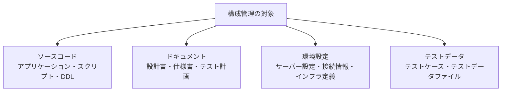
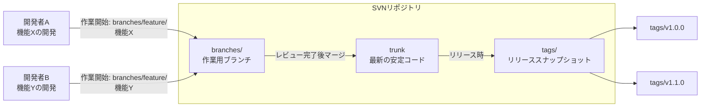
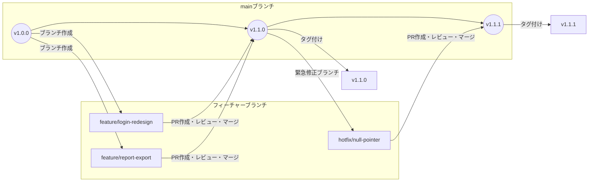
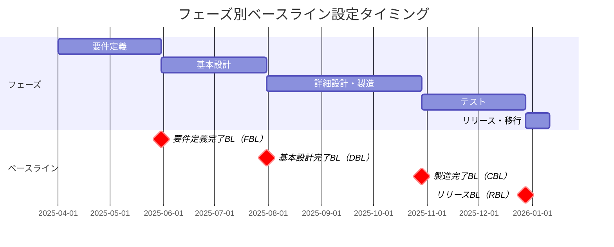
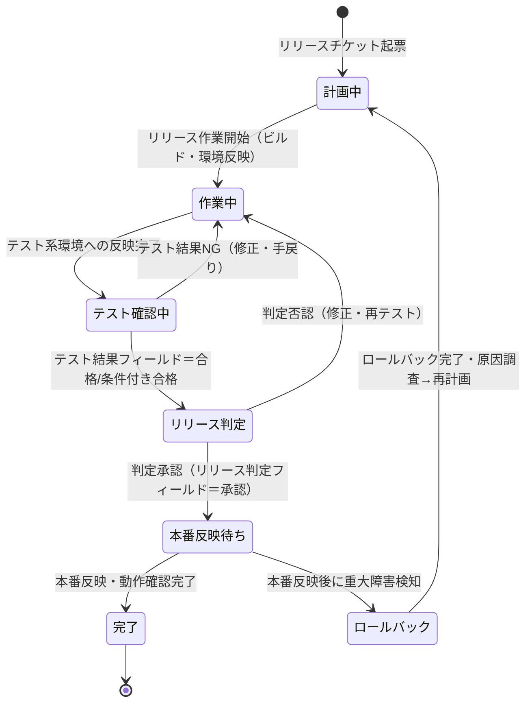
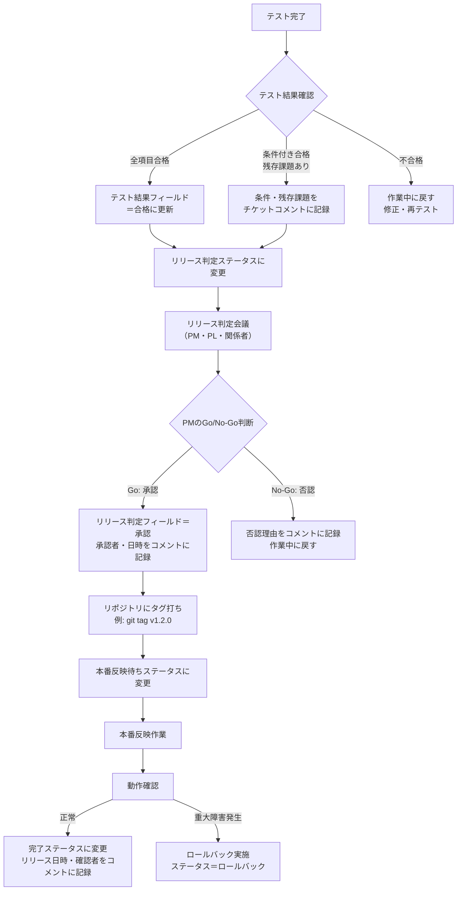
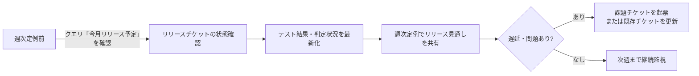
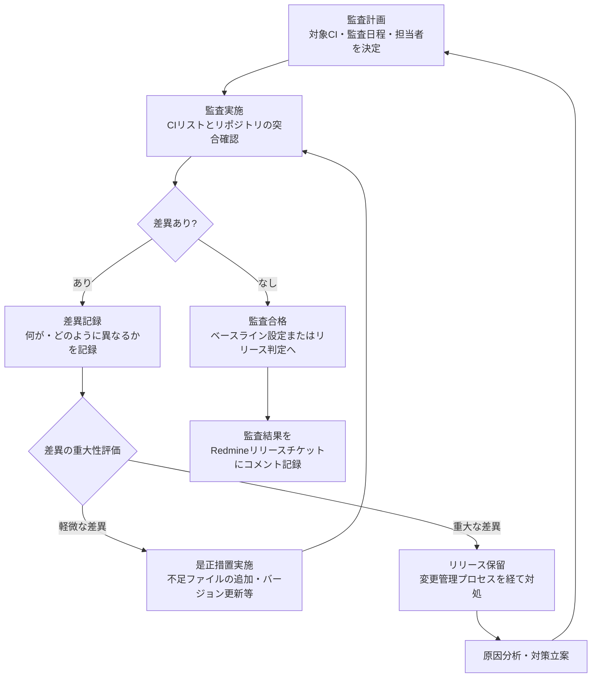

# プロジェクト構成管理計画書


## 目次

- [1. はじめに：構成管理の本質](#1-はじめに構成管理の本質)
  - [1.1 構成管理の目的と位置づけ](#11-構成管理の目的と位置づけ)
  - [1.2 構成管理の対象範囲](#12-構成管理の対象範囲)
  - [1.3 「変更管理」との役割分担](#13-変更管理との役割分担)
  - [1.4 構成管理が機能しないプロジェクトの共通パターン](#14-構成管理が機能しないプロジェクトの共通パターン)
- [2. 構成アイテム（CI）の定義と識別](#2-構成アイテムciの定義と識別)
  - [2.1 構成アイテムとは何か](#21-構成アイテムとは何か)
  - [2.2 管理対象の分類：4つのカテゴリ](#22-管理対象の分類4つのカテゴリ)
  - [2.3 構成アイテム一覧表（CIリスト）テンプレート](#23-構成アイテム一覧表ciリストテンプレート)
  - [2.4 識別スキーム（命名規則・バージョン番号体系）](#24-識別スキーム命名規則バージョン番号体系)
- [3. バージョン管理の方針と運用](#3-バージョン管理の方針と運用)
  - [3.1 バージョン番号体系の設計](#31-バージョン番号体系の設計)
  - [3.2 ブランチ戦略：SVNの場合](#32-ブランチ戦略svnの場合)
  - [3.3 ブランチ戦略：Git（GitHub Flow）の場合](#33-ブランチ戦略gitgithub-flowの場合)
  - [3.4 コミット・チェックインルール](#34-コミットチェックインルール)
  - [3.5 タグ・ラベル運用](#35-タグラベル運用)
- [4. 成果物別の管理方針](#4-成果物別の管理方針)
  - [4.1 ソースコード管理](#41-ソースコード管理)
  - [4.2 設計書・ドキュメント管理](#42-設計書ドキュメント管理)
  - [4.3 環境設定・インフラ構成管理](#43-環境設定インフラ構成管理)
  - [4.4 テストデータ・テストケース管理](#44-テストデータテストケース管理)
- [5. ベースライン管理](#5-ベースライン管理)
  - [5.1 ベースラインとは何か](#51-ベースラインとは何か)
  - [5.2 プロジェクトフェーズ別ベースライン定義](#52-プロジェクトフェーズ別ベースライン定義)
  - [5.3 ベースラインの設定・変更・解除プロセス](#53-ベースラインの設定変更解除プロセス)
- [6. 構成変更の識別と記録](#6-構成変更の識別と記録)
  - [6.1 変更識別の運用概要](#61-変更識別の運用概要)
  - [6.2 変更履歴の記録ルール](#62-変更履歴の記録ルール)
- [7. Redmineによるリリース管理チケット運用](#7-redmineによるリリース管理チケット運用)
  - [7.1 リリース管理チケットの目的と設計方針](#71-リリース管理チケットの目的と設計方針)
  - [7.2 チケット項目の定義](#72-チケット項目の定義)
  - [7.3 ステータス遷移](#73-ステータス遷移)
  - [7.4 リリース判定フロー](#74-リリース判定フロー)
  - [7.5 週次・リリース時の運用サイクル](#75-週次リリース時の運用サイクル)
  - [7.6 カスタムクエリの活用](#76-カスタムクエリの活用)
- [8. 構成管理監査（構成監査）](#8-構成管理監査構成監査)
  - [8.1 構成監査の種類](#81-構成監査の種類)
  - [8.2 監査の実施タイミングと手順](#82-監査の実施タイミングと手順)
- [9. 構成管理の役割と責任](#9-構成管理の役割と責任)
  - [9.1 役割定義（RACIマトリクス）](#91-役割定義raciマトリクス)
  - [9.2 CCB設置の判断基準](#92-ccb設置の判断基準)
- [10. よくある失敗パターンと対策](#10-よくある失敗パターンと対策)
- [付録A: 構成管理チェックリスト（フェーズ別）](#付録a-構成管理チェックリストフェーズ別)
- [付録B: Redmineカスタムクエリ例](#付録b-redmineカスタムクエリ例)
- [付録C: 用語集（SCM用語）](#付録c-用語集scm用語)

---

## 1. はじめに：構成管理の本質

### 1.1 構成管理の目的と位置づけ

構成管理（CM: Configuration Management）とは、プロジェクトで生産するあらゆる成果物（ソースコード・設計書・環境設定ファイル・テストデータ等）を**識別・記録・管理**し、「いつでも任意の時点の状態を正確に再現できる」状態を保つための管理活動である。

PMBOK® Guide では、構成管理はプロジェクト統合マネジメントの一部として位置づけられており、変更管理と密接に連動する。

**構成管理が達成する3つの目的**

| 目的 | 説明 |
| :--- | :--- |
| **再現性の確保** | 過去のリリース物件を正確に再現できる。障害時のロールバック、ある時点のソースコード状態への復帰が可能になる |
| **変更の追跡可能性** | 「誰が・いつ・何を・なぜ変えたか」を記録し、障害の原因特定や影響分析に活かせる |
| **整合性の維持** | ソースコード・設計書・環境設定が乖離なく同期された状態を保ち、「動いている環境のどのバージョンか誰も分からない」状況を防ぐ |

> [!NOTE]
> 構成管理は「ファイルを保存する行為」ではなく「**再現性と追跡可能性を担保する仕組みを整える活動**」である。リポジトリを作るだけでは構成管理とは言えない。命名規則・ブランチ戦略・タグ運用・リリース記録といったルールが機能して初めて意味を持つ。

### 1.2 構成管理の対象範囲

本計画書では、以下の4カテゴリを構成管理の対象とする。



各カテゴリの詳細な管理方針は [第4章](#4-成果物別の管理方針) で述べる。

### 1.3 「変更管理」との役割分担

構成管理と変更管理は混同されやすいが、役割は明確に異なる。

| 観点 | 構成管理（本ファイル） | 変更管理（70.変更管理参照） |
| :--- | :--- | :--- |
| **主な関心** | 「今何が正式な状態か」「過去の状態に戻せるか」 | 「変更を承認すべきか」「変更の影響は何か」 |
| **主な活動** | CI識別・バージョン管理・ベースライン設定・リリース記録 | 変更要求の受付・影響分析・承認・実装・クローズ |
| **タイミング** | 常時（開発中・リリース時・保守時を通じて継続） | 変更が発生したとき（スポット） |

> [!NOTE]
> 本ファイルでは「変更の識別と記録」（第6章）まで扱い、変更の承認・コントロールの詳細は `00.管理/70.変更管理/PJT計画補足-変更管理.md` を参照すること。

### 1.4 構成管理が機能しないプロジェクトの共通パターン

現場でよく見られる「構成管理が崩壊したプロジェクト」のパターンと、その結果引き起こされる問題を示す。

| 崩壊パターン | 結果として起きる問題 |
| :--- | :--- |
| ブランチを切らずに直接mainへコミット | 開発中の未完成コードが本番リリースに混入する |
| タグ・ラベルを打たないまま本番反映 | 「あのリリースに何が含まれていたか」が確認できない |
| 本番環境の設定ファイルが担当者のローカルにしかない | 担当者退場後に本番設定が再現不能になる |
| 設計書がリポジトリ外（個人PCの共有フォルダ等）で管理される | ソースコードと設計書の整合性が崩れ、保守工数が倍増する |
| リリース物件の一覧記録がない | 障害時に「どのファイルを戻せばいいか」が特定できない |

> [!WARNING]
> 「バージョン管理ツールを導入した = 構成管理ができている」という誤解が最も多い。ツールを入れるだけでは不十分で、**ルールと運用フローの整備**が本質である。特に小規模プロジェクトでは「コミットが雑になる」「タグを打ち忘れる」という問題が起きやすい。

---

## 2. 構成アイテム（CI）の定義と識別

### 2.1 構成アイテムとは何か

**構成アイテム（CI: Configuration Item）**とは、構成管理の対象として識別・管理される最小単位の成果物を指す。CIは以下の条件を満たすものを対象とする。

- バージョン管理が必要なもの（変更履歴を追跡すべきもの）
- 他のCIとの依存関係があるもの（変更が他に影響するもの）
- リリース物件に含まれるもの（本番環境に反映されるもの）

すべてのファイルをCIとして管理する必要はない。一時ファイル・作業メモ・個人ツール等は対象外でよい。

### 2.2 管理対象の分類：4つのカテゴリ

| カテゴリ | 対象の例 | 主な管理ツール |
| :--- | :--- | :--- |
| **ソースコード** | アプリケーションコード、ストアドプロシージャ、DDL（テーブル定義）、シェルスクリプト、バッチプログラム | SVN / Git |
| **ドキュメント** | 要件定義書、基本設計書、詳細設計書、テスト計画書、テスト仕様書、操作マニュアル | SVN / Git / ファイルサーバー |
| **環境設定** | サーバー設定ファイル（httpd.conf等）、アプリケーション設定ファイル（properties等）、接続情報、インフラ構成定義 | SVN / Git / 専用管理台帳 |
| **テストデータ** | テストケース一覧、テスト入力データ、期待値定義、テスト環境スキーマ | SVN / Git / ファイルサーバー |

> [!TIP]
> DDL（テーブル定義SQL）は見落とされやすいが、**必ずバージョン管理ツールで管理する**。「本番DBのスキーマとソースコードのバージョンが合わない」という状況は、DDLをExcel管理・メール添付で運用しているプロジェクトで頻発する。Flyway / Liquibase等のDBマイグレーションツールが使えない場合でも、SQLファイルをリポジトリに格納し、適用版数を記録するルールを設けること。

> [!NOTE]
> **環境設定ファイルの機密情報（パスワード・APIキー等）は平文でリポジトリに入れてはならない**。別途シークレット管理の仕組み（環境変数・Vault等）を使い、リポジトリには「設定ファイルのテンプレート（値を除いた構造のみ）」を格納するアプローチが現実的。

### 2.3 構成アイテム一覧表（CIリスト）テンプレート

プロジェクト開始時にCIリストを作成し、フェーズ進行に伴って更新する。

| CI-ID | CI名称 | カテゴリ | 格納場所（リポジトリパス） | 担当者 | 最新バージョン | 備考 |
| :--- | :--- | :--- | :--- | :--- | :--- | :--- |
| CI-001 | ○○業務APソース一式 | ソースコード | `/trunk/src/` または `/src/main/` | 田中（PL） | v1.2.0 | Javaアプリ |
| CI-002 | テーブル定義DDL | ソースコード | `/trunk/db/ddl/` | 山田 | v1.2.0 | |
| CI-003 | 基本設計書 | ドキュメント | `/trunk/docs/design/` | 鈴木 | 2.3 | Word形式 |
| CI-004 | AP設定ファイル（本番） | 環境設定 | 設定管理台帳（別紙） | 佐藤（インフラ） | 1.2.0対応版 | 機密情報含む |
| CI-005 | 結合テストケース | テストデータ | `/trunk/test/integration/` | 田中 | フェーズ3版 | |

> [!TIP]
> CIリストはExcelや専用ツールで管理してもよいが、**最低限「CI-ID・格納場所・担当者・最新バージョン」の4項目**を揃えておくだけで、有事の際の検索性が劇的に向上する。フェーズ移行前に必ず更新し、ベースライン設定とセットで見直す運用が効果的。

### 2.4 識別スキーム（命名規則・バージョン番号体系）

#### 2.4.1 ドキュメントの命名規則

```
{文書種別}-{内容}-v{メジャー}.{マイナー}.{改訂}.{拡張子}

例:
  設計書-基本設計-v1.0.docx          → 初版
  設計書-基本設計-v1.1.docx          → 軽微な改訂
  設計書-基本設計-v2.0.docx          → 大幅改訂（フェーズ変更等）
```

#### 2.4.2 ソースコード・リリースのバージョン番号体系

セマンティックバージョニング（SemVer）を推奨する。

```
v{MAJOR}.{MINOR}.{PATCH}

  MAJOR: 後方互換性が壊れる大きな変更（API変更・DB再設計等）
  MINOR: 後方互換性を保った機能追加
  PATCH: バグ修正・軽微な改修

例:
  v1.0.0  → 初回リリース
  v1.1.0  → 新機能追加
  v1.1.1  → バグ修正
  v2.0.0  → 大規模改修
```

> [!NOTE]
> MAJOR/MINOR/PATCHの区別が難しい場合は、**「計画リリース = MINORアップ、緊急修正 = PATCHアップ」**というシンプルなルールから始めると定着しやすい。社内リリースや特定顧客向けの場合はSemVerにこだわらず、`YYYY.MM`（年月ベース）のバージョニングも有効な選択肢。

---

## 3. バージョン管理の方針と運用

### 3.1 バージョン番号体系の設計

本章では、バージョン管理ツール上での「コードの管理方法」すなわちブランチ戦略とコミットルールを定義する。プロジェクトが使用するツール（SVNまたはGit）に合わせて [3.2節](#32-ブランチ戦略svnの場合) または [3.3節](#33-ブランチ戦略gitgithub-flowの場合) を参照すること。

**共通の基本方針**

- 本番リリース済みのコードは常に特定可能な状態（タグ/ラベル）に保つ
- 開発中のコードと安定コードを分離する（ブランチを用いる）
- コミット/チェックインは「1目的=1コミット」を原則とする

### 3.2 ブランチ戦略：SVNの場合

SVNでは `trunk / branches / tags` の3ディレクトリ構造を基本とする。



**SVN ブランチ命名規則の例**

| ブランチ種別 | 命名規則 | 例 |
| :--- | :--- | :--- |
| 機能開発 | `branches/feature/{機能名または課題ID}` | `branches/feature/login-redesign` |
| バグ修正 | `branches/fix/{バグ番号または内容}` | `branches/fix/issue-456` |
| リリース準備 | `branches/release/{バージョン}` | `branches/release/v1.2.0` |
| 緊急修正 | `branches/hotfix/{バージョン}-{内容}` | `branches/hotfix/v1.1.1-nullpointer` |

> [!TIP]
> SVNの場合、`trunk` は常に「レビュー済みのコードのみ」が入る状態を維持することが重要。**未完成コードを `trunk` に直接コミットするのは禁止**とし、すべての開発作業は `branches/feature/` から始めるルールを徹底する。小規模なバグ修正でもブランチを切る習慣を持つチームは、リリース時の混入事故が劇的に減る。

> [!WARNING]
> 「急いでいるから trunk に直接コミットする」という行動が最大のリスク。一度でも許容すると全員がやるようになる。特に「リリース直前の緊急修正」の場面で発生しやすいため、`hotfix` ブランチの使い方をあらかじめチームに教育しておくこと。

### 3.3 ブランチ戦略：Git（GitHub Flow）の場合

GitHub Flowは、`main` ブランチ＋フィーチャーブランチのシンプルな構成で、継続的デリバリーを前提とした軽量な戦略である。



**GitHub Flow の基本フロー**

1. `main` から作業ブランチを切る（`git checkout -b feature/機能名`）
2. 作業ブランチで開発・コミットを行う
3. Pull Request（PR）を作成してレビューを依頼する
4. レビュー承認後、`main` にマージする
5. **即座にタグを打つ**（`git tag v1.1.0`）
6. リリース物件をデプロイする

> [!TIP]
> GitHub Flowでは「mainにマージ = リリース可能な状態」という原則がある。ただし実務では「staging環境での確認期間」を設けるため、**「mainへのマージ」と「本番デプロイ」の間にリリース判定プロセスを挟む**のが現実的。Redmineのリリース管理チケット（第7章参照）でその橋渡しをする。

### 3.4 コミット・チェックインルール

| ルール | 内容 | 理由 |
| :--- | :--- | :--- |
| **1コミット1目的** | 機能追加とバグ修正を1つのコミットに混在させない | 後からrevertやcherry-pickが困難になる |
| **Redmineチケット番号を含める** | コミットメッセージ先頭に `#チケット番号 ` を付ける | 変更の「なぜ」を追跡可能にする |
| **コメントは「何を変えたか」より「なぜ変えたか」** | `ログイン処理を修正` よりも `#234 セッションタイムアウト後の二重ログインを防止` | 数ヶ月後に読んでも意図が分かるメッセージにする |
| **ビルドが壊れる状態でコミットしない** | コンパイルエラー・明らかなテスト失敗を含むコミットを禁止 | チームの作業を阻害する |

**コミットメッセージの例**

```
OK例:
  #1234 ログイン画面：セッションタイムアウト後の二重サブミット防止
  #1256 fix: CSVエクスポートで日本語ファイル名が文字化けする問題を修正
  #1301 refactor: ユーザー認証ロジックをAuthServiceに集約

NG例:
  修正
  update
  色々直した
  テスト用（コミットメッセージが後から見て意味不明なもの）
```

### 3.5 タグ・ラベル運用

**タグ（Gitの場合）/ ラベル（SVNの場合）**は、リリース時点のリポジトリスナップショットに名前を付ける操作である。これにより「v1.2.0 のソースコードはどれか」を将来的にも確認できる。

**タグ打ちのタイミング（必須）**

| タイミング | タグ名の例 | 操作 |
| :--- | :--- | :--- |
| 本番リリース時 | `v1.2.0` | リリース直前または直後にタグを打つ |
| テスト系リリース時（任意） | `v1.2.0-rc1` | リリース候補版の識別に使う |
| フェーズ完了ベースライン設定時（任意） | `baseline/basic-design-complete` | フェーズ移行時の成果物特定に使う |

> [!WARNING]
> **タグを打ち忘れると、後から「あのリリースに含まれていたソースコード」を特定できなくなる。** 障害発生時にロールバック対象のバージョンが分からない最悪の状態が生まれる。リリース判定フロー（[7.4節](#74-リリース判定フロー)）の最終ステップにタグ打ちを組み込み、チェックリスト化すること。

---

## 4. 成果物別の管理方針

### 4.1 ソースコード管理

| 項目 | 内容 |
| :--- | :--- |
| **格納場所** | バージョン管理ツール（SVN/Git）のリポジトリ |
| **命名規則** | プロジェクト標準のディレクトリ構成に準拠 |
| **ブランチ運用** | 第3章のブランチ戦略に従う |
| **レビュー** | Pull Request / レビューチケットによるコードレビューを必須とする |
| **ビルド管理** | ビルド手順書をリポジトリ内 `README.md` または `docs/build.md` に格納する |

**リポジトリの推奨ディレクトリ構成（参考）**

```
/
├── src/                  # アプリケーションソースコード
├── db/                   # DDL・マイグレーションSQL
│   ├── ddl/             # テーブル定義
│   └── migration/       # データマイグレーション
├── config/               # 設定ファイルテンプレート（機密情報は除く）
├── scripts/              # デプロイ・バッチスクリプト
├── test/                 # テストコード・テストデータ
├── docs/                 # ドキュメント（設計書等）
└── README.md             # プロジェクト概要・ビルド手順
```

> [!TIP]
> `docs/` ディレクトリにソースコードと同じリポジトリで設計書を管理することで、**「ソースコードと設計書のバージョンが対応している」状態を保ちやすくなる**。Wordファイルはバイナリのため差分が見えにくいが、「リリースタグに紐付いた設計書がどれか」を特定できる点で有効。

### 4.2 設計書・ドキュメント管理

| 項目 | 内容 |
| :--- | :--- |
| **格納場所** | ソースコードリポジトリの `docs/` または共有ファイルサーバー（プロジェクト標準に従う） |
| **命名規則** | `{文書種別}-{内容}-v{バージョン}.{拡張子}` 形式を使用（[2.4節](#24-識別スキーム命名規則バージョン番号体系)参照） |
| **バージョン管理** | ファイル名にバージョン番号を含め、改訂のたびにインクリメントする |
| **承認管理** | 文書内のヘッダーテーブルに「作成者・レビュアー・承認者・承認日」を記録する |
| **最新版の特定** | 「最新版」フォルダを用意するか、バージョン番号が最も新しいものを最新版とするルールを徹底する |

> [!WARNING]
> **「最終版」「最終版_確認済み」「最終版_最終」** のような命名は禁止する。バージョン番号による識別を徹底することで、「どれが本当の最新か」という問い合わせを撲滅できる。ファイルサーバー管理の場合は、「完成版」フォルダに最新版のみを残し、過去版は「過去版」フォルダに移すルールが現実的。

### 4.3 環境設定・インフラ構成管理

環境設定の無管理は、障害対応・移行作業・新規参画者への引き継ぎで深刻な問題を引き起こす。最低限以下を管理対象とする。

| 管理対象 | 管理方法 | 注意点 |
| :--- | :--- | :--- |
| アプリケーション設定ファイル | リポジトリ（テンプレート版）+ 環境別の実値は別管理 | パスワード等の機密情報は平文でリポジトリに入れない |
| サーバー設定ファイル（httpd.conf等） | リポジトリまたは設定管理台帳 | 変更後は必ずバージョンと変更者・変更日を記録する |
| ミドルウェアバージョン | 環境定義書（Excel等）またはIaC定義ファイル | 開発・テスト・本番の環境差異を明示する |
| ネットワーク設定・接続先情報 | 設定管理台帳（機密情報は暗号化・アクセス制限をかけた場所で管理） | ネットワーク図と合わせて最新状態を維持する |

**環境差異管理表のサンプル**

| 設定項目 | 開発環境 | テスト環境 | 本番環境 |
| :--- | :--- | :--- | :--- |
| APサーバー | Tomcat 10.1 | Tomcat 10.1 | Tomcat 10.1 |
| DBサーバー | PostgreSQL 15.2 | PostgreSQL 15.2 | PostgreSQL 15.2 |
| AP接続先DB | db-dev:5432/appdb | db-test:5432/appdb | db-prod:5432/appdb |
| ログ出力レベル | DEBUG | INFO | WARN |
| 外部API接続先 | モックサーバー | テスト用API | 本番API |

> [!TIP]
> **環境設定の管理台帳は、担当者が不在でも誰でも参照できる場所に置く**。共有ドライブ・Redmine Wiki・Confluenceなど、アクセス権限を整えた上でチームが参照できる場所を指定する。「山田さんのPCにしかない」は本番障害時に最悪の結末を招く。

### 4.4 テストデータ・テストケース管理

| 項目 | 内容 |
| :--- | :--- |
| **格納場所** | リポジトリの `test/` ディレクトリ または テスト管理ツール（Redmineのテストトラッカー等） |
| **バージョン管理** | ソースコードのバージョンと対応付けて管理する。テストケースを変更したらバージョン番号または改訂日を更新する |
| **テスト環境データ** | 個人情報を含む場合はマスキング処理を必須とし、生データを格納しない |
| **回帰テスト資産** | フェーズ完了後のテストケースをアーカイブし、次フェーズの回帰テスト基盤として保管する |

---

## 5. ベースライン管理

### 5.1 ベースラインとは何か

**ベースライン（Baseline）**とは、特定時点で正式に承認された構成アイテムの集合である。ベースライン設定後に変更を加える場合は、変更管理プロセスを経ることが必要になる。

ベースラインは「チェックポイント」であり、「あの時点の状態に戻す」「その時点との差分を確認する」ために使われる。

> [!NOTE]
> ベースライン設定は「このフェーズの成果物が正式に完成した」という宣言に相当する。設計書のレビュー承認がとれた瞬間・テストが全て合格した瞬間がベースライン設定の適切なタイミング。未承認の成果物に対してベースラインを設定することは意味がない。

### 5.2 プロジェクトフェーズ別ベースライン定義



| ベースライン名 | 略称 | 設定タイミング | 含む成果物の例 |
| :--- | :--- | :--- | :--- |
| 要件定義完了ベースライン | FBL (Functional BL) | 要件定義レビュー承認時 | 要件定義書・ユースケース仕様・業務フロー図 |
| 基本設計完了ベースライン | DBL (Design BL) | 基本設計レビュー承認時 | 基本設計書・DB設計書・画面設計書 |
| 製造完了ベースライン | CBL (Code BL) | 製造完了・単体テスト完了時 | ソースコード一式・DDL・詳細設計書 |
| リリースベースライン | RBL (Release BL) | 本番リリース承認時 | リリース物件一式・結合/総合テスト結果・操作マニュアル |

### 5.3 ベースラインの設定・変更・解除プロセス

**設定手順**

1. 対象フェーズの全成果物がリポジトリにコミット済みであることを確認する
2. CIリストを更新し、最新バージョンを記録する
3. バージョン管理ツールでタグ/ラベルを設定する（例: SVNの `svn copy`、Gitの `git tag`）
4. Redmineのリリース管理チケット（または構成管理台帳）にベースライン設定を記録する
5. 構成監査（[8章](#8-構成管理監査構成監査)）を実施し、問題なければ承認する

**ベースライン後の変更**

ベースライン設定後に成果物を変更する場合は、変更管理プロセス（`00.管理/70.変更管理/` 参照）を経て承認を得た後、新しいバージョンとして管理する。ベースラインそのものは変更せず、変更後の成果物で新たなベースラインを設定する。

> [!WARNING]
> **「ちょっとした修正だから」という理由でベースライン設定済みの成果物を変更管理なしに書き換えることは禁止。** ベースラインの意味がなくなるだけでなく、「誰が・いつ・なぜ変えたか」が追跡不能になる。特にフェーズ移行後の設計書の「こっそり更新」は、ソースコードとの乖離を引き起こす元凶になる。

---

## 6. 構成変更の識別と記録

### 6.1 変更識別の運用概要

構成管理における「変更の識別」とは、**どのCIが変更されたか・変更の原因は何か・影響を受けるCIはどれか**を識別する活動である。

変更の承認・実施・検証といった「変更のコントロール」は `00.管理/70.変更管理/PJT計画補足-変更管理.md` で扱う。本章では構成管理側で最低限行うべき「変更の識別と記録」に焦点を絞る。

**変更が発生するトリガーの例**

| トリガー | 対応する構成管理アクション |
| :--- | :--- |
| 機能追加・改修要求 | 影響するCIを特定し、変更予定として記録する |
| バグ修正 | 修正対象のCIと関連CIを特定する |
| 環境変更（OS・MW更新等） | 影響する環境設定CIを特定し、更新後の設定をリポジトリに反映する |
| 外部システムの仕様変更 | インタフェース定義CI・関連ソースコードCIを特定する |

### 6.2 変更履歴の記録ルール

構成管理として記録すべき最小限の情報：

| 記録項目 | 記録方法 |
| :--- | :--- |
| 何が変わったか | コミットメッセージ・変更履歴ファイル |
| いつ変わったか | コミット日時（バージョン管理ツールが自動記録） |
| 誰が変えたか | コミット者（バージョン管理ツールが自動記録） |
| なぜ変えたか | コミットメッセージのRedmineチケット番号への紐付け |
| どのバージョンからどのバージョンへ | バージョン番号（タグ）の変遷 |

> [!TIP]
> ソースコードのコミット時に `#Redmineチケット番号` を含めることで、変更の「なぜ」をチケット側の課題内容・対応方針と自動的に紐付けられる。Redmine + SVN/GitのWebhookを設定することでさらに連携が強化されるが、コミットメッセージのルール徹底だけでも大きな効果がある。

---

## 7. Redmineによるリリース管理チケット運用

### 7.1 リリース管理チケットの目的と設計方針

リリース管理チケットは、**「何を・いつ・どの環境に・どのバージョンで反映するか」を1チケットで一元管理**するためのツールである。

リリース作業の煩雑さの根本原因は「情報の分散」にある。テスト結果はメールの添付ファイル、リリース手順は共有ドライブのExcel、承認はSlackのスタンプ…という状況ではリリース状況の全体把握が困難になる。リリース管理チケットにこれらを集約することで、**進捗の可視化・承認記録の保全・障害時の迅速な参照**が可能になる。

**リリース管理専用トラッカーの設定を推奨する理由**

| 理由 | 説明 |
| :--- | :--- |
| タスクチケットとの分離 | タスクは「作業進捗」、リリースは「デプロイ状態」を管理する。混在するとカスタムクエリの精度が落ちる |
| ステータス遷移の独立性 | リリース特有のステータス（「リリース判定」「本番反映待ち」「ロールバック」等）をタスクとは別に定義できる |
| フィールドの独立性 | テスト結果・対象バージョン・ロールバック手順URLなど、リリース固有のカスタムフィールドが必要 |

### 7.2 チケット項目の定義

#### 7.2.1 標準フィールドの活用

| Redmineフィールド | リリース管理での使い方 |
| :--- | :--- |
| **題名** | `[リリース] v1.2.0 - 〇〇機能追加・△△バグ修正` 形式。先頭に `[リリース]` とバージョン番号を必ず付ける |
| **説明** | リリース概要・含む変更の一覧（対象チケット番号）・事前確認事項・ロールバック基準を記載する |
| **ステータス** | 7.3節の遷移ルールに従う |
| **優先度** | 計画リリース=通常 / 緊急リリース=即急 |
| **担当者** | リリース作業責任者（デプロイ実施者）を指定する |
| **開始日** | リリース作業開始日（本番反映前の準備・ビルド開始日） |
| **期日** | 本番リリース予定日 |
| **親チケット** | バージョン/リリースサイクル単位で親チケットを作成し、個別リリースチケットを紐付ける（任意） |

#### 7.2.2 推奨カスタムフィールド

| カスタムフィールド名 | 型 | 選択肢 | 目的 |
| :--- | :--- | :--- | :--- |
| **リリース種別** | リスト | 定期リリース / 緊急リリース / 環境反映（テスト系）/ 設定変更のみ | リリースの性質を区別。緊急リリースは通常プロセスの短縮可否判断に使う |
| **対象バージョン番号** | テキスト | 例: `v1.2.0` / `2024.12` | バージョン管理ツールのタグ名と完全一致させる。リポジトリとの対応を保証する |
| **対象環境** | リスト（複数選択可） | 開発 / テスト / ステージング / 本番 | 同一チケットで複数環境への段階反映を追跡する |
| **テスト結果** | リスト | 未実施 / 実施中 / 合格 / 条件付き合格 / 不合格 | リリース判定の可否を一目で把握できる |
| **リリース判定** | リスト | 未判定 / 判定中 / 承認 / 否認 / 保留 | PMによるGo/No-Go判断の記録。承認日・承認者はコメントに残す |
| **ロールバック手順URL** | テキスト（URL） | Confluenceページ・共有ドライブパス等 | 障害発生時の迅速対応に不可欠。必ずリリース前に記入する |

> [!TIP]
> **「対象バージョン番号」カスタムフィールドはリポジトリのタグ名と完全一致**させるルールにする。例えばGitタグが `v1.2.0` ならカスタムフィールドも `v1.2.0`、SVNラベルが `release_v1_2_0` なら同じ値を入力する。これにより「このリリースのソースコードはリポジトリのどこか」を瞬時に特定できる。

> [!WARNING]
> **「ロールバック手順URL」が空欄のままリリース判定を行うことは禁止**とすること。「リリース後に障害が起きたらどう戻すか」を考えずにリリースを承認するのは、危機管理上のリスクが高すぎる。リリース判定チェックリスト（付録A）にロールバック手順の存在確認を必須項目として含める。

### 7.3 ステータス遷移



| ステータス | 定義 | 遷移時の必須アクション |
| :--- | :--- | :--- |
| **計画中** | リリース内容・日程の計画段階 | 対象バージョン番号・リリース種別・対象環境・期日（リリース予定日）・ロールバック手順URLを設定する |
| **作業中** | ビルド・テスト系環境への反映作業中 | 担当者・開始日を確定し、作業進捗をコメントに記録する |
| **テスト確認中** | テスト系環境での確認作業中 | テスト結果フィールドを「実施中」に更新する |
| **リリース判定** | PMによるGo/No-Go判断中 | テスト結果フィールドが「合格」または「条件付き合格」であることを確認してから遷移する |
| **本番反映待ち** | 判定承認済み、本番反映作業待ち | リリース判定フィールドを「承認」にし、承認者・承認日時をコメントに記録する |
| **完了** | 本番反映・動作確認完了 | 実際のリリース日時・確認者・リリースタグ名をコメントに記録する |
| **ロールバック** | 本番障害によりロールバック実施中 | 障害内容・ロールバック実施日時・原因を速やかにコメントに記録し、障害管理チケット番号をリンクする |

### 7.4 リリース判定フロー



> [!TIP]
> **リリース判定会議は「承認の場」ではなく「最終確認の場」として設計する**。会議の場で初めてテスト結果を見るような状況は避け、事前にリリースチケットの情報を参加者に共有し、「内容を確認した上でGoサインを出す」プロセスにする。判定時間が短縮され、質の高い承認が実現する。

### 7.5 週次・リリース時の運用サイクル

**週次サイクル（進捗管理との連動）**



**リリース時の標準フロー**

| ステップ | 実施内容 | 更新するチケット項目 |
| :--- | :--- | :--- |
| **1. チケット起票** | リリース内容確定後、計画中ステータスでチケットを起票する | 対象バージョン番号・リリース種別・期日・担当者・ロールバック手順URLを設定 |
| **2. ビルド・テスト系反映** | ビルドを実行し、テスト系環境に反映する | ステータスを「作業中」→「テスト確認中」に変更 |
| **3. テスト確認** | テスト系環境で動作確認を実施する | テスト結果フィールドを「実施中」→「合格/不合格」に更新 |
| **4. リリース判定** | PMがGo/No-Go判断を行う | リリース判定フィールドを更新し、承認者・日時をコメントに記録 |
| **5. タグ打ち** | リポジトリにリリースタグを設定する | コメントにタグ名を記録（例: `git tag v1.2.0 を設定しました`） |
| **6. 本番反映** | 本番環境に反映し、動作確認を行う | ステータスを「完了」に変更し、リリース日時・確認者をコメントに記録 |
| **7. リリース後レビュー** | 次のスプリント/定例で「今回のリリースで問題になったこと」を振り返る | コメントに改善点を記録する |

### 7.6 カスタムクエリの活用

| クエリ名 | フィルタ条件 | ソート | 用途 |
| :--- | :--- | :--- | :--- |
| **今月リリース予定** | トラッカー=リリース / ステータス≠完了・ロールバック / 期日=今月 | 期日昇順 | 週次定例での確認 |
| **リリース判定待ち** | トラッカー=リリース / ステータス=リリース判定 | 期日昇順 | PMの判断作業漏れ防止 |
| **テスト未合格のリリース** | トラッカー=リリース / テスト結果=未実施・不合格 / 期日=今月以内 | 期日昇順 | テスト遅延の早期検知 |
| **本番反映待ち一覧** | トラッカー=リリース / ステータス=本番反映待ち | 期日昇順 | 承認済みリリースの反映漏れ確認 |
| **緊急リリース一覧** | トラッカー=リリース / リリース種別=緊急リリース / ステータス≠完了 | 期日昇順 | 緊急対応の可視化・優先管理 |
| **ロールバック発生履歴** | トラッカー=リリース / ステータス=ロールバック OR ステータス=完了（ロールバック経由） | 更新日降順 | リリース品質の振り返り・再発防止 |

詳細なフィルタ設定は [付録B](#付録b-redmineカスタムクエリ例) を参照。

---

## 8. 構成管理監査（構成監査）

### 8.1 構成監査の種類

構成監査は、**成果物の状態がドキュメントの記録と一致しているかを確認する**活動である。2種類の監査を状況に応じて使い分ける。

| 監査種別 | 略称 | 目的 | 実施タイミング |
| :--- | :--- | :--- | :--- |
| **機能構成監査** | FCA (Functional Configuration Audit) | 成果物が要件・仕様を機能的に満たしているかを確認する | フェーズ完了時・テスト合格後 |
| **物理構成監査** | PCA (Physical Configuration Audit) | 成果物の物理的な構成（ファイル・バージョン番号・数量等）がCIリストおよびベースライン記録と一致しているかを確認する | リリース前・ベースライン設定前 |

> [!NOTE]
> 小規模プロジェクトではFCAとPCAを厳密に分離しなくてもよい。「リリース前に対象物件がすべて揃っているか・承認されているかを確認する」という目的を果たせれば、チェックリスト形式での実施で十分。

### 8.2 監査の実施タイミングと手順

**構成監査の実施フロー**



**物理構成監査（PCA）の確認項目（リリース前）**

- [ ] リリース対象ファイルが全てリポジトリにコミットされているか
- [ ] リポジトリのタグが正しいバージョン番号で設定されているか
- [ ] CIリストの「最新バージョン」がリポジトリのタグと一致しているか
- [ ] 設計書・仕様書の最新版がリポジトリまたは指定の格納場所にあるか
- [ ] 本番環境の設定ファイルが設定管理台帳に反映されているか
- [ ] テスト結果報告書がリリースチケットに添付またはリンクされているか

> [!TIP]
> **PCAはチェックリストを使って15〜30分で実施できる**。「監査」と聞くと大掛かりに感じるが、「リリース前の最終確認」と位置づけることで運用が定着しやすい。付録Aのチェックリストをそのまま使えば、特別な準備なく実施できる。

---

## 9. 構成管理の役割と責任

### 9.1 役割定義（RACIマトリクス）

| 活動 | PM | PL | 開発担当 | テスト担当 | PMO/CM担当 |
| :--- | :---: | :---: | :---: | :---: | :---: |
| 構成管理計画の作成 | A | C | I | I | R |
| CIリストの作成・更新 | A | R | C | C | R |
| リポジトリのブランチ設定 | A | R | I | I | C |
| コミット・チェックイン（日常） | I | C | R | R | I |
| タグ・ラベルの設定 | A | R | C | I | R |
| ベースラインの設定 | A | R | C | C | R |
| リリース管理チケットの起票 | I | R | C | I | C |
| テスト結果の更新 | I | C | I | R | I |
| リリース判定（Go/No-Go） | **R/A** | C | I | I | C |
| 本番反映作業 | A | R | C | I | I |
| 構成監査の実施 | A | C | I | I | **R** |

*R=実行責任者 / A=説明責任者 / C=相談先 / I=情報共有先*

### 9.2 CCB設置の判断基準

CCB（Configuration Control Board: 構成管理委員会）は、構成変更の承認・却下を審議する機能を持つ。

| プロジェクト規模・特性 | 推奨CCB体制 |
| :--- | :--- |
| **小規模（5人以下・単純なシステム）** | PM兼CCB。変更管理はPMが単独で判断・承認。 |
| **中規模（10〜20人程度）** | PM + PL + PMO担当者でCCBを構成。週次定例でまとめて審議。 |
| **大規模（20人超・複雑なシステム・外部連携多数）** | PM / PL / 業務担当 / インフラ担当 / ユーザー代表でCCBを構成。変更影響が広範なため多角的な観点が必要。 |
| **保守フェーズ** | 上記の縮小版。保守担当PL + ユーザー窓口でCCBを代替することが多い。 |

> [!NOTE]
> 「CCBを設置しなければならない」という強制はない。小規模プロジェクトでは過剰なプロセスが逆効果になる。重要なのは「変更の承認者が明確であること」「承認記録が残ること」の2点。PMが一人で判断・承認する場合でも、Redmineチケットにその記録を必ず残すこと。

---

## 10. よくある失敗パターンと対策

プロジェクト現場でよく発生する構成管理上の失敗パターンと、その検知方法・対策を示す。

| 失敗パターン | 引き起こされる問題 | 検知方法 | 対策 |
| :--- | :--- | :--- | :--- |
| **野良コミット**（ブランチを切らずに直接mainへ）| 未完成機能が本番リリースに混入する | コミットログで確認。直接mainへのコミットをCIで禁止する | ブランチ保護ルールの設定。コードレビュー（PR）を必須にする |
| **タグ打ち忘れ** | 「あのリリースのソースコードがどれか」が特定できない | リリースチケットにタグ名が記録されているかを確認する | リリース判定フローにタグ打ちステップを必須化。チェックリスト化 |
| **環境設定の個人管理** | 担当者が不在・退場すると本番設定が再現不能 | 「本番の設定ファイルはどこにある?」と聞いて即答できるか | 環境設定管理台帳の整備。設定ファイルをリポジトリまたは指定場所に格納するルールの徹底 |
| **ソースコードと設計書の乖離** | 保守時に「どの設計書が現在のソースと対応しているか」が不明 | 最新のソースコードと設計書のバージョンを突合する | ソースコードと設計書を同一リポジトリで管理。フェーズ完了時に両方のバージョンを揃えてベースラインを設定 |
| **リリース物件の混入** | テスト中のコードが本番に入り、障害が発生する | リリース物件一覧とリポジトリのタグを照合する | リリース前のPCA実施を必須化。リリース物件はタグ付きリポジトリから取得するルールを徹底 |
| **「最終版」地獄** | ファイル名が「最終版_確認済み_最終_v3」になり、どれが本当の最新か不明 | フォルダ内のファイル名を確認する | バージョン番号命名規則を徹底。違反ファイルは発見次第命名規則に従って改名する |
| **コミットメッセージが「修正」のみ** | 障害時に「このコミットで何を変えたか」が追跡できない | `git log` または SVNのリビジョン履歴を確認する | コミットルール（チケット番号+変更理由）をチームに周知。コードレビュー時にコミットメッセージも確認する |

> [!WARNING]
> **失敗パターンはルール周知だけでは防げない。** 「ブランチを切る手順が面倒」「タグを打つのを忘れた」は人間の行動として自然な流れ。**チェックリストに組み込む・CIで自動チェックする・レビューフローに含める**といった「やらざるを得ない仕組み」にすることが根本対策。

---

## 付録A: 構成管理チェックリスト（フェーズ別）

### A.1 プロジェクト開始時

- [ ] 構成管理計画書（本ファイル）が作成・チームに共有されている
- [ ] リポジトリ（SVN/Git）が作成され、初期ディレクトリ構成が適用されている
- [ ] ブランチ戦略・命名規則がチームに周知されている（README等に記載）
- [ ] コミットルール（チケット番号記載・1コミット1目的）が周知されている
- [ ] Redmineにリリース管理トラッカーが設定されている（カスタムフィールド含む）
- [ ] CIリスト（初版）が作成されている
- [ ] 構成管理担当者（CCBまたはCM責任者）が指定されている
- [ ] 命名規則・バージョン番号体系がドキュメント化されている
- [ ] 環境設定管理台帳の格納場所が決定し、チームに周知されている

### A.2 フェーズ移行前（ベースライン設定時）

- [ ] 対象フェーズの全成果物がリポジトリにコミット/チェックイン済みである
- [ ] 成果物のバージョン番号・承認日が正しく記録されている
- [ ] ベースライン用のタグ/ラベルがリポジトリに設定されている
- [ ] CIリストが更新され、新規追加・削除されたCIが反映されている
- [ ] 設計書・仕様書の最新版が指定の格納場所にある
- [ ] ベースラインに対する物理構成監査（PCA）が実施されている
- [ ] 監査結果がRedmineチケットまたは監査記録に記録されている

### A.3 リリース前（リリース判定前）

- [ ] リリース対象ソースコードにリリースタグが打たれている
- [ ] リリース物件一覧（対象バージョン・ファイル・環境設定）が明確になっている
- [ ] テスト完了証跡（テスト結果報告）がリリースチケットに添付/リンクされている
- [ ] ロールバック手順書が作成・確認され、リリースチケットにURLが記載されている
- [ ] 本番環境の設定ファイルが設定管理台帳に最新版として登録されている
- [ ] リリース判定会議の開催が設定されている（または実施済み）
- [ ] リリース判定フィールドが「承認」に更新されている

### A.4 リリース後

- [ ] 本番反映後の動作確認結果がリリースチケットにコメント記録されている
- [ ] リリースチケットが「完了」ステータスに移行している
- [ ] リリースBL（本番リリース済み状態のタグ）が設定されている
- [ ] 環境設定管理台帳が本番環境の最新状態を反映している
- [ ] 次リリースに向けた改善点がコメントまたは振り返り記録として残されている

---

## 付録B: Redmineカスタムクエリ例

リリース管理トラッカー向けの推奨カスタムクエリ一覧。

| クエリ名 | フィルタ条件 | ソート条件 | 表示列（推奨） | 用途 |
| :--- | :--- | :--- | :--- | :--- |
| **今月リリース予定** | トラッカー=リリース / ステータス≠完了・ロールバック / 期日=今月 | 期日 昇順 | 題名・ステータス・期日・担当者・テスト結果・リリース判定 | 週次定例での全リリース状況確認 |
| **リリース判定待ち** | トラッカー=リリース / ステータス=リリース判定 | 期日 昇順 | 題名・担当者・テスト結果・期日・対象バージョン番号 | PMの判断作業漏れ防止 |
| **テスト未合格リリース** | トラッカー=リリース / テスト結果=未実施・不合格 / 期日≦1ヶ月後 | 期日 昇順 | 題名・テスト結果・期日・担当者 | テスト遅延の早期検知 |
| **本番反映待ち一覧** | トラッカー=リリース / ステータス=本番反映待ち | 期日 昇順 | 題名・担当者・期日・対象バージョン番号・リリース種別 | 承認済みリリースの反映漏れ確認 |
| **緊急リリース一覧** | トラッカー=リリース / リリース種別=緊急リリース / ステータス≠完了 | 期日 昇順 | 題名・ステータス・期日・担当者・リリース判定 | 緊急対応の可視化・優先管理 |
| **ロールバック発生履歴** | トラッカー=リリース / ステータス=ロールバック | 更新日 降順 | 題名・更新日・担当者・対象バージョン番号 | リリース品質の振り返り・再発防止 |
| **今週期日のリリース** | トラッカー=リリース / ステータス≠完了・ロールバック / 期日=今週 | 期日 昇順 | 題名・ステータス・期日・担当者・テスト結果 | 今週のリリース優先確認 |

---

## 付録C: 用語集（SCM用語）

| 用語 | 説明 |
| :--- | :--- |
| **構成管理（CM: Configuration Management）** | ソフトウェア・ドキュメント・環境設定等の成果物を識別・管理・変更追跡し、いつでも正確な状態を再現できるようにする管理活動 |
| **構成アイテム（CI: Configuration Item）** | 構成管理の対象として識別・管理される最小単位の成果物（ソースファイル・設計書・設定ファイル等） |
| **ベースライン（Baseline）** | 特定時点で正式に承認された構成アイテムの集合。以降の変更は変更管理プロセスを経る必要がある |
| **FCA（Functional Configuration Audit）** | 機能構成監査。成果物が要件・仕様を機能的に満たしているかを検証する監査 |
| **PCA（Physical Configuration Audit）** | 物理構成監査。成果物の物理的な構成（ファイル・バージョン等）が記録と一致しているかを検証する監査 |
| **CCB（Configuration Control Board）** | 構成管理委員会。構成変更の承認・却下を審議する委員会または担当者。小規模プロジェクトではPMが兼任することが多い |
| **トランク（Trunk）** | SVNにおけるメインライン。最新の安定コードを管理するブランチ。Gitのmainブランチに相当する |
| **フィーチャーブランチ（Feature Branch）** | 特定の機能開発や不具合修正のために切り出す作業用ブランチ。main/trunkに影響を与えずに開発を進められる |
| **タグ（Tag）** | Gitでリリース時点のリポジトリスナップショットに付ける名前。SVNではラベル（Label）とも呼ばれる。リリース物件の特定に使う |
| **GitHub Flow** | mainブランチ + フィーチャーブランチのシンプルなブランチ戦略。Pull Requestによるレビューを経てmainにマージし、即リリース可能な状態を保つ |
| **セマンティックバージョニング（SemVer）** | `v{MAJOR}.{MINOR}.{PATCH}` 形式のバージョン番号体系。後方互換性を壊す変更=MAJORアップ、機能追加=MINORアップ、バグ修正=PATCHアップ |
| **リリース物件** | 特定のリリースでデプロイ対象となる成果物の集合（バイナリ・設定ファイル・DDL・リリース手順書等） |
| **差分管理** | ベースライン間で変更されたCIを識別・記録すること。「このリリースで何が変わったか」を追跡可能にする活動 |
| **IaC（Infrastructure as Code）** | インフラ構成をコードとして記述・管理する手法。Terraform・Ansibleがその代表例。インフラ設定をバージョン管理可能にする |
| **CIリスト（構成アイテム一覧表）** | プロジェクトが管理する全構成アイテムの一覧。CI-ID・格納場所・担当者・最新バージョンを記録した台帳 |
