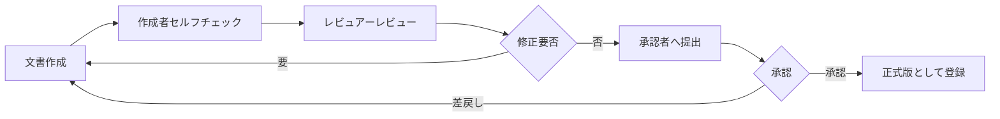

# プロジェクトコミュニケーション管理計画書

| 文書番号 | バージョン | 作成日 | 作成者 | 承認者 |
| --- | --- | --- | --- | --- |
| P-COM-001 | 1.0 | 202X/XX/XX | [作成者名] | [承認者名] |

---

## 目次

1. [はじめに](#1-はじめに)
   - 1.1. 本計画書の目的と位置づけ
   - 1.2. コミュニケーション管理の重要性
   - 1.3. コミュニケーションの基本プロセス
   - 1.4. コミュニケーションにおける障壁と対策

2. [ステークホルダー分析とエンゲージメント戦略](#2-ステークホルダー分析とエンゲージメント戦略)
   - 2.1. ステークホルダーの特定と分析
   - 2.2. エンゲージメント戦略（パワー/インタレスト・グリッド）
   - 2.3. ステークホルダー別コミュニケーション計画マトリクス
   - 2.4. コミュニケーション要求事項分析

3. [コミュニケーションの基本原則](#3-コミュニケーションの基本原則)
   - 3.1. プロジェクトコミュニケーションの3原則
   - 3.2. コミュニケーション品質基準（5つのC）
   - 3.3. コミュニケーションチャネルの複雑性管理

4. [プロジェクトタイプ別コミュニケーション戦略](#4-プロジェクトタイプ別コミュニケーション戦略)
   - 4.1. ウォーターフォール型プロジェクト
   - 4.2. アジャイル型プロジェクト
   - 4.3. ハイブリッド型プロジェクト

5. [コミュニケーション手法と会議体](#5-コミュニケーション手法と会議体)
   - 5.1. 主要なコミュニケーション手法
   - 5.2. 会議体定義マップ
   - 5.3. 会議運営のベストプラクティス
   - 5.4. 議事録テンプレート
   - 5.5. メール・チャットの使い分けルール
   - 5.6. 会議削減ガイドライン

6. [コミュニケーションプラットフォーム（CDE）](#6-コミュニケーションプラットフォームcde)
   - 6.1. プラットフォームの選定と役割
   - 6.2. ツール間の連携ルール

7. [コミュニケーションにおける役割と責任（RACIマトリクス）](#7-コミュニケーションにおける役割と責任raciマトリクス)
   - 7.1. RACIマトリクスとは
   - 7.2. RACIの定義
   - 7.3. RACIマトリクス作成のルール
   - 7.4. コミュニケーション活動のRACIマトリクス
   - 7.5. RACIマトリクステンプレート
   - 7.6. RACIマトリクス運用上の注意点

8. [エスカレーション・フロー（問題解決経路）](#8-エスカレーションフロー問題解決経路)
   - 8.1. エスカレーションレベル
   - 8.2. エスカレーションフロー図
   - 8.3. 緊急時のコミュニケーション対応
   - 8.4. RAIDログとの連携
   - 8.5. 承認フロー・決裁ルート

9. [情報管理の運用ルール](#9-情報管理の運用ルール)
   - 9.1. フォルダ構成と命名規則
   - 9.2. アクセス権限管理
   - 9.3. 情報セキュリティとコンプライアンス

10. [リモートワーク対応](#10-リモートワーク対応)
    - 10.1. リモートワーク環境の整備
    - 10.2. リモートワークでのコミュニケーションのベストプラクティス
    - 10.3. タイムゾーン対応
    - 10.4. リモートワークにおける孤立防止策
    - 10.5. オーバーコミュニケーションの防止

11. [多様な文化・言語への対応](#11-多様な文化言語への対応)
    - 11.1. 多様な文化への対応
    - 11.2. 多言語対応

12. [外部ステークホルダーとのコミュニケーション](#12-外部ステークホルダーとのコミュニケーション)
    - 12.1. ベンダー・外部パートナー管理
    - 12.2. 顧客とのコミュニケーション
    - 12.3. 契約上の報告義務チェックリスト

13. [コンフリクト管理](#13-コンフリクト管理)
    - 13.1. コンフリクト管理の重要性
    - 13.2. コンフリクトの種類と対応方針
    - 13.3. コンフリクト解決の5つのアプローチ
    - 13.4. コンフリクト解決プロセス
    - 13.5. エスカレーション基準

14. [新規参画者のオンボーディング](#14-新規参画者のオンボーディング)
    - 14.1. オンボーディングの目的
    - 14.2. オンボーディングチェックリスト
    - 14.3. 必読ドキュメント一覧

15. [ナレッジマネジメント](#15-ナレッジマネジメント)
    - 15.1. 目的
    - 15.2. ナレッジの分類
    - 15.3. ナレッジ蓄積の仕組み
    - 15.4. Lessons Learned（教訓）の管理

16. [コミュニケーション計画の監視と評価](#16-コミュニケーション計画の監視と評価)
    - 16.1. 監視と評価の方法
    - 16.2. 監視指標 (KPI)
    - 16.3. 計画の見直しと改善

17. [実践的なチェックリストとテンプレート](#17-実践的なチェックリストとテンプレート)
    - 17.1. コミュニケーション管理チェックリスト
    - 17.2. ステークホルダー登録簿テンプレート
    - 17.3. コミュニケーション計画マトリクステンプレート

18. [トラブルシューティングガイド](#18-トラブルシューティングガイド)
    - 18.1. よくある問題と対策

19. [ケーススタディ](#19-ケーススタディ)
    - 19.1. ケーススタディ1: リモートチームでのコミュニケーション
    - 19.2. ケーススタディ2: 多様な文化を持つチームでのコミュニケーション

20. [生成AI活用ガイドライン](#20-生成ai活用ガイドライン)
    - 20.1. 利用可能な場面
    - 20.2. 禁止事項
    - 20.3. 承認されたツール

21. [付録](#21-付録)
    - A. 用語集
    - B. 参考資料
    - C. RACIマトリクステンプレート
    - D. 変更履歴

---

## 1. はじめに

### 1.1. 本計画書の目的と位置づけ

プロジェクトの成功は、その関係者間の効果的なコミュニケーションに大きく依存します。PMBOKによれば、コミュニケーション管理とは「プロジェクトとステークホルダーの情報ニーズが、資料の作成と効果的な情報交換を達成するために意図された活動を通して、満たされていることを確実にするために必要なプロセス」と定義されています。

本計画書は、この定義に基づき、以下の実現を目的とした公式な指針です。

* プロジェクト関係者間の円滑な情報交換の保証
* ステークホルダーの期待値調整
* 潜在的な誤解やコンフリクトの未然防止
* 適切な情報が、適切なタイミングで、適切な人物に、適切な方法で伝達される仕組みの確立

### 1.2. コミュニケーション管理の重要性

#### 1.2.1. プロジェクト成功への影響

| 指標 | コミュニケーションが適切な場合 | コミュニケーションが不適切な場合 |
| :--- | :--- | :--- |
| **プロジェクト成功率** | 85%以上 | 40%以下 |
| **ステークホルダー満足度** | 高い | 低い |
| **課題の早期発見率** | 高い | 低い（課題の隠蔽が発生） |
| **意思決定の速度** | 速い | 遅い |
| **チームのモチベーション** | 高い | 低い |

#### 1.2.2. コミュニケーション管理の3つの目的

1. **情報共有の効率化**: 必要な情報を必要な人に、必要なタイミングで提供する
2. **意思決定の加速**: 適切な情報に基づいて迅速に意思決定を行う
3. **信頼関係の構築**: 透明性の高いコミュニケーションにより、ステークホルダーとの信頼関係を構築する

### 1.3. コミュニケーションの基本プロセス

コミュニケーションが成立するためには、以下の4つの基本要素から成るプロセスを理解することが不可欠です。このプロセスを把握することは、コミュニケーションにおける障壁を特定し、それを克服するための第一歩となります。

1. **送信者 (Sender):** メッセージを発信する個人またはグループ。情報の正確なコード化（言語化）に責任を持つ。
2. **メッセージ (Message):** 伝達される情報そのもの。
3. **受信者 (Receiver):** メッセージを受け取る個人またはグループ。情報を解読し、理解する責任を持つ。
4. **フィードバック (Feedback):** 受信者がメッセージをどのように解釈したかを送信者に伝える反応。これにより相互理解が確認される。

### 1.4. コミュニケーションにおける障壁と対策

プロジェクト遂行中には、メッセージが意図通りに伝わることを阻害する様々な障壁が発生し得ます。主要な障壁は以下の3つに分類されます。プロジェクトマネージャー（PM）はこれらを予見し、以下の対策を講じます。

| 障壁の種類 | 定義と具体例 | 対策方針 | 具体的な対策例 |
| --- | --- | --- | --- |
| **外部的障壁** | コミュニケーションが行われる物理的環境に起因する障壁。<br><br>例：騒音、話者との物理的な距離、あるいはビデオ会議システム（Zoom, Teams, Slack）の技術的な問題や接続不良など、仮想会議環境特有の課題。プロジェクトマネージャーは、これらの物理的・技術的障壁を予見し、会議の事前準備や代替ツールの確保を通じて、その影響を最小限に抑える責務を負う。 | 会議の事前接続テスト、代替通信手段（電話等）の確保、静寂な環境の推奨。 | • 会議開始15分前に接続テストを実施<br>• 代替通信手段（電話、チャット）を準備<br>• 静かな環境での参加を推奨<br>• 録画・録音機能を活用 |
| **内部的障壁** | 送信者または受信者自身の内部状態に起因する障壁。<br><br>例：その日の出来事による注意散漫、空想、会議中のマルチタスキングなど、メッセージへの集中を妨げる心理的要因。プロジェクトマネージャーは、会議の目的とアジェンダを明確に共有し、参加者の集中を促すことで、これらの内部的障壁を軽減する責任がある。 | 会議アジェンダの事前共有による目的意識の統一、ビデオONの推奨、会議時間の短縮。 | • 会議の24時間前にアジェンダを共有<br>• ビデオONを推奨（可能な限り）<br>• 会議時間を短縮（最大1時間）<br>• マルチタスキングを禁止 |
| **意味的障壁** | 言葉の解釈に関わる障壁。個人の言語、文化、経歴、個人的な経験の違いから生じます。<br><br>例：特定の文化圏で年齢が重視される場合、話者と受信者の年齢差がメッセージの伝え方や受け取られ方に影響を与え、フィードバックの質を歪める可能性があります。プロジェクトマネージャーは、ステークホルダーの多様な背景を理解し、専門用語を避けるなど平易な言葉で伝える努力をすることで、意味的障壁による誤解を防ぐ責務がある。 | 専門用語の定義集（用語集）の作成、平易な言葉（Plain Language）の使用、図解の活用。 | • プロジェクト用語集を作成・共有<br>• 専門用語を使う場合は定義を併記<br>• 図解・ビジュアルを活用<br>• 多言語対応が必要な場合は翻訳を準備 |

これらの基本原則と潜在的な障壁を理解することは、本計画書の後半で詳述する具体的なコミュニケーション戦略と戦術を構築するための土台となります。

---

## 2. ステークホルダー分析とエンゲージメント戦略

### 2.1. ステークホルダーの特定と分析

プロジェクトの成功は、すべての利害関係者（ステークホルダー）を特定し、彼らの期待、関心、そしてプロジェクトに対する影響力を深く理解することから始まります。ステークホルダーは、プロジェクトの成果に直接的または間接的に影響を受ける、あるいは影響を与える可能性のあるすべての個人や組織を指します。この分析は、誰に、何を、いつ、どのように伝えるべきかを決定するための基盤であり、コミュニケーション戦略全体を方向づける羅針盤となります。

#### 2.1.1. ステークホルダー特定のプロセス

1. **ブレインストーミング**: プロジェクトチームでステークホルダーを洗い出す
2. **分類**: 内部/外部、直接/間接、支持/反対などで分類
3. **分析**: 影響力と関心度を評価
4. **登録**: ステークホルダー登録簿に記録
5. **更新**: プロジェクト進行に伴い定期的に更新

#### 2.1.2. ステークホルダー登録簿（サンプル）

以下に、本プロジェクトにおける主要なステークホルダーを特定し、その特性を整理したサンプル登録簿を示します。
*(実際の運用では、別紙「ステークホルダー登録簿」にて個人名を含めて管理し、本計画書には分類基準のみを記載する場合もあります)*

| ID | ステークホルダー名・役職 | 組織 | 関心度 (高/中/低) | 影響力 (高/中/低) | 主な期待・関心事 | コミュニケーション頻度 | コミュニケーション方法 |
|----|--------------------|------|-------------------|-------------------|----------------|-------------------|-------------------|
| 1 | プロジェクトスポンサー (CTO) | 自社 | 高 | 高 | プロジェクトの目標達成、予算とリソースの承認、最終的な意思決定 | 週次 | 定例会議、メール報告 |
| 2 | プロジェクトマネージャー | 自社 | 高 | 高 | プロジェクトの計画、実行、監視、成功に対する全責任 | 日次 | 定例会議、チャット |
| 3 | IT部門 | 自社 | 高 | 高 | 技術リソースの提供、システムの統合、セキュリティ基準の遵守 | 週次 | 定例会議、メール |
| 4 | 外部顧客（組織） | 顧客企業 | 高 | 低 | 新システムの機能性、利便性の向上、円滑な業務プロセス | 月次 | ステークホルダー報告会、メール |
| 5 | 外部顧客（個人） | N/A | 低 | 低 | サービスの価格、利便性、使いやすさ | 四半期 | ニュースレター、Webサイト |
| 6 | 規制当局 | 政府機関 | 低 | 高 | 法令遵守、品質基準、安全基準の適合性 | 必要時 | 公式報告書、メール |

### 2.2. エンゲージメント戦略（パワー/インタレスト・グリッド）

特定したステークホルダーを効果的に管理するため、「影響力（Power）」と「関心度（Interest）」を軸としたパワー/インタレスト・グリッドを用いて分類します。このグリッドはステークホルダーを4つの象限に分け、それぞれに最適なコミュニケーション戦略を定義するのに役立ちます。

#### 2.2.1. 4象限の戦略

1. **高影響力・高関心度（主要プレイヤー）**
* **戦略:** **密接に管理する（Manage Closely）**
* **解説:** この象限にはプロジェクトスポンサーやプロジェクトマネージャーが含まれます。彼らはプロジェクトの成功に最も大きな影響力と関心を持つ意思決定者です。戦略としては、彼らを意思決定プロセスに深く関与させ、定期的かつ詳細な進捗報告、課題やリスクに関する透明性の高い情報提供を密に行います。彼らの期待を確実に満たし、プロジェクトの強力な支持者であり続けてもらうことが不可欠です。
* **アクション:** 
  - 定例会議への参加要請
  - 意思決定への即時関与
  - 課題の早期報告
  - 週次または日次の進捗報告
* **コミュニケーション頻度:** 週次以上
* **コミュニケーション方法:** 定例会議、メール、チャット

2. **高影響力・低関心度（満足を維持）**
* **戦略:** **満足させる（Keep Satisfied）**
* **解説:** 規制当局などがこのカテゴリに分類されます。彼らは日常的なプロジェクト活動への関心は低いものの、その権限によってプロジェクトを遅延させたり停止させたりする力を持っています。したがって、過度な情報で彼らに負担をかけるべきではありません。要点を押さえた簡潔な報告を定期的に行い、必要な基準や規制を遵守していることを示すことで、彼らの満足度を維持し、不必要な介入を避けることが重要です。
* **アクション:** 
  - 要点を絞った定期報告
  - 法令・基準遵守の証明
  - 重要なマイルストーンでの報告
* **コミュニケーション頻度:** 月次またはマイルストーン毎
* **コミュニケーション方法:** 公式報告書、メール

3. **低影響力・高関心度（情報提供を維持）**
* **戦略:** **情報を提供する（Keep Informed）**
* **解説:** 組織顧客やプロジェクトの成果を直接利用するエンドユーザーなどが該当します。彼らはプロジェクトの意思決定に直接的な影響力は持ちませんが、プロジェクトの成果に高い関心を持っています。彼らからのフィードバックは、プロジェクトの詳細を改善する上で非常に有益です。定期的なニュースレターや進捗報告会を通じて情報を提供し、大きな問題が発生していないかを確認することで、彼らの関与を維持し、プロジェクト成果物の受け入れを円滑にします。
* **アクション:** 
  - ニュースレターの配信
  - デモ会の開催
  - FAQの提供
  - フィードバックの収集
* **コミュニケーション頻度:** 月次または四半期
* **コミュニケーション方法:** ニュースレター、デモ会、Webサイト

4. **低影響力・低関心度（最小限の労力で監視）**
* **戦略:** **監視する（Monitor）**
* **解説:** 一般公衆や occasional な個人顧客などが含まれます。彼らに対して過剰なコミュニケーションを行う必要はありません。しかし、市場の変化や特定の事象により、彼らの関心度や影響力が変化する可能性は常に存在します。そのため、一般的な情報提供（例：月次のニュースレター）に留めつつ、彼らの動向を最低限の労力で監視し続けることが賢明です。
* **アクション:** 
  - Webサイトでの情報提供
  - 一般向け広報
  - 状況変化の監視
* **コミュニケーション頻度:** 四半期または必要時
* **コミュニケーション方法:** Webサイト、プレスリリース

このステークホルダー分析に基づいたエンゲージメント戦略は、次のセクションで定義する、すべてのコミュニケーション活動の基盤となる基本原則を適用する際の具体的な指針となります。

### 2.3. ステークホルダー別コミュニケーション計画マトリクス

各ステークホルダーに対して、具体的なコミュニケーション計画を策定します。

| ステークホルダー | 情報ニーズ | 提供頻度 | 提供方法 | 提供内容 | 責任者 |
| :--- | :--- | :--- | :--- | :--- | :--- |
| プロジェクトスポンサー | 進捗状況、課題、リスク、予算 | 週次 | 定例会議、メール | 進捗報告書、課題管理表、リスク管理表 | PM |
| エンドユーザー | 機能説明、デモ、FAQ | 月次 | デモ会、ニュースレター | 機能説明資料、デモ動画、FAQ | PL |
| 規制当局 | コンプライアンス遵守状況 | 必要時 | 公式報告書 | コンプライアンス報告書 | PM |


| ステークホルダー | 情報ニーズ | 詳細度 | 提供頻度 | 提供方法 | 提供内容 | 責任者 | 成功基準 | フィードバック方法 |
|:---|:---|:---|:---|:---|:---|:---|:---|:---|
| プロジェクトスポンサー | 進捗・予算・リスク | サマリー | 週次 | 定例会議 | 進捗報告書 | PM | 承認を得られる | 会議でのコメント |
| IT部門長 | 技術課題・リソース | 詳細 | 週次 | メール＋会議 | 技術報告書 | PL | 課題が解決される | メール返信 |
| エンドユーザー | 機能・操作方法 | 概要 | 月次 | デモ会 | デモ・FAQ | PL | 質問が減少する | アンケート |


### 2.4. コミュニケーション要求事項分析

ステークホルダーごとに、具体的なコミュニケーション要求事項を分析し、期待とのギャップを防止します。

#### 2.4.1. 要求事項の収集方法

1. **インタビュー**: 主要ステークホルダーに個別ヒアリング
2. **アンケート**: 標準化された質問票で要求を収集
3. **過去プロジェクトの教訓**: 類似プロジェクトでの要求事項を参照

#### 2.4.2. 要求事項分析テンプレート

| ステークホルダー | 必要な情報 | 情報の詳細度 | 希望頻度 | 希望形式 | 希望チャネル | 特記事項 |
|:---|:---|:---|:---|:---|:---|:---|
| プロジェクトスポンサー | 進捗・予算・リスク | サマリーレベル | 週次 | PowerPoint | 対面会議 | 悪いニュースは即時報告 |
| IT部門長 | 技術課題・リソース状況 | 詳細レベル | 週次 | Excel/文書 | メール＋会議 | 技術用語OK |
| エンドユーザー代表 | 機能・スケジュール | 概要レベル | 月次 | デモ動画 | メール | 専門用語は避ける |
| 外部ベンダー | 仕様・スケジュール・課題 | 詳細レベル | 週次 | 議事録 | 定例会議 | 契約上の報告義務あり |

#### 2.4.3. 情報の詳細度の定義

| レベル | 説明 | 対象者例 |
|:---|:---|:---|
| **エグゼクティブサマリー** | 1ページ以内の要約。結論と重要指標のみ | 経営層、スポンサー |
| **サマリーレベル** | 主要項目の概要。詳細は必要に応じて参照 | 部門長、顧客窓口 |
| **詳細レベル** | すべての項目を網羅した詳細情報 | PM、PL、実務担当者 |
---

## 3. コミュニケーションの基本原則

プロジェクト全体を通じてコミュニケーションの一貫性と品質を確保するため、すべてのコミュニケーション活動が従うべき一連の基本原則を確立します。これらの原則は、ステークホルダーとの間に信頼と透明性を構築し、プロジェクト情報が正確かつ効率的に伝達されることを保証する上で中心的な役割を果たします。

### 3.1. プロジェクトコミュニケーションの3原則

プロジェクトにおけるステークホルダーとのコミュニケーションを成功に導くため、以下の3つの核心的原則を定めます。

1. **フォーマット（Format）: 標準化による効率化**
* **解説:** 報告書、議事録、プレゼンテーション資料など、情報伝達に用いる文書のフォーマットを統一します。一貫したフォーマットは、受け手が情報を迅速に理解し、重要なポイントを効率的に把握することを助けます。テンプレート化された構造は、情報の抜け漏れを防ぎ、報告の信頼性を高める効果があります。プロジェクトが計画通りに進んでいない場合でも、標準化されたフォーマットで客観的な情報を提供することが、ステークホルダーの信頼を維持する鍵となります。
* **実践方法:**
  - 報告書、議事録は指定のテンプレートを使用する
  - 受け手が情報の所在（どこに結論があるか）を即座に把握できるようにする
  - テンプレートはプロジェクト開始時に全員に共有する
  - テンプレートの変更は変更管理プロセスに従う

2. **ケイデンス（Cadence）: リズムによる安心感**
* **解説:** 定期的かつ予測可能なタイミングで情報発信を行うことの重要性を指します。週次進捗報告や月次のステークホルダー報告会など、定められた周期（ケイデンス）で情報が提供されることは、ステークホルダーに安心感を与え、プロジェクトが管理されているという信頼を醸成します。また、定期的なコミュニケーションは、ステークホルダーからのフィードバックを計画的に収集する機会を創出し、問題の早期発見と軌道修正を可能にします。
* **実践方法:**
  - 「毎週○曜日の○時に情報が来る」という予測可能性を維持する
  - 悪いニュースであっても、定例のタイミングで報告されることが信頼につながる
  - ケイデンスはプロジェクト開始時に全員に周知する
  - ケイデンスの変更は事前に通知する

3. **透明性（Transparency）: 事実に基づく報告**
* **解説:** プロジェクトの進捗、課題、リスクなどの状況を、感情や主観を排し、客観的な事実に基づいてありのままに伝えることを意味します。これは単にメールを転送する行為ではありません。透明性の高いコミュニケーションは、ステークホルダーとの間に強固な信頼関係を築きます。特に問題が発生した際には、状況を正確に伝えることで、意思決定者が必要なリソースの追加投入や計画変更といった迅速かつ適切な判断を下すことを可能にし、プロジェクト全体のリスクを低減させます。
* **実践方法:**
  - 「Bad News First」を徹底する
  - 課題やリスクは隠蔽せず、客観的事実とデータ（数値）に基づいて報告する
  - 感情や希望的観測は排除する
  - 不確実な情報は「不確実」と明記する

これら3つの原則は独立して機能するのではなく、相互に作用し効果を増幅させる。一貫したフォーマットで、予測可能なケイデンスに従って情報が提供されることで、プロジェクトの透明性が担保され、ステークホルダーとの間に揺ぎない信頼関係が構築されるのである。

### 3.2. コミュニケーション品質基準（5つのC）

書面および口頭でのコミュニケーションの品質を保証するための国際的な指針として、以下の「5つのC」をすべてのコミュニケーション活動において遵守します。

| C | 基準 | チェックポイント | 実践例 |
| :--- | :--- | :--- | :--- |
| **Correct (正確性)** | 正しい文法と誤りのない記述を用いる。事実誤認や誤字脱字がない。 | • 事実確認<br>• スペルチェック<br>• 数値の検証<br>• 日付の確認 | • 報告書を提出前に必ず見直す<br>• 数値は2回確認する<br>• 専門用語の定義を確認する |
| **Concise (簡潔性)** | 冗長な表現を避け、過剰な言葉を排除し、要点を簡潔にまとめる。 | • 1つのメッセージは1つの主題<br>• 不要な修飾語を削除<br>• 箇条書きを活用 | • メールは3段落以内<br>• 報告書は1ページに要約<br>• 箇条書きで要点を整理 |
| **Clear (明瞭性)** | 伝達の目的を明確にし、受け手のニーズに合わせた表現を用いる。目的が明確で、曖昧な表現がない。 | • 目的を最初に明記<br>• 専門用語を避ける<br>• 具体例を挙げる | • 「本メールの目的は...」で始める<br>• 専門用語は定義を併記<br>• 図解を活用する |
| **Coherent (一貫性)** | アイデアや情報が論理的に構成され、一貫した流れを持つ。論理矛盾がなく、前後の文脈がつながっている。 | • 論理的な構成<br>• 前後の整合性<br>• 用語の統一 | • 結論→理由→詳細の順<br>• 前回の報告との整合性を確認<br>• 用語集を参照する |
| **Controlling (制御性)** | 言葉とアイデアの流れをコントロールし、メッセージが意図した通りに伝わるようにする。話の主導権を持ち、意図した方向に議論を導く。 | • アジェンダの明確化<br>• 時間管理<br>• 結論の明確化 | • 会議のアジェンダを事前共有<br>• 会議時間を厳守<br>• 決定事項を明確に記録 |

これらの原則は、次に示す具体的なコミュニケーション手法やツールを選定し、効果的に運用するための判断基準となります。


### 3.3. コミュニケーションチャネルの複雑性管理

#### 3.3.1. チャネル数の算出

プロジェクトにおけるコミュニケーションチャネル数は、関係者数nに対して以下の公式で算出されます。

**チャネル数 = n(n-1) / 2**

| 関係者数 | チャネル数 | 複雑性 |
|:---:|:---:|:---|
| 5人 | 10 | 低（管理容易） |
| 10人 | 45 | 中（注意が必要） |
| 20人 | 190 | 高（構造化が必須） |
| 50人 | 1,225 | 極高（階層化・グループ化が必須） |

#### 3.3.2. 複雑性への対策

| 対策 | 説明 |
|:---|:---|
| **階層化** | PMを中心としたハブ＆スポーク型の情報伝達構造を採用 |
| **グループ化** | 機能・領域ごとにサブチームを構成し、チーム間はリーダー経由で連携 |
| **情報の集約** | 全体共有が必要な情報はCDE（共通データ環境）に集約 |
| **定例会議の活用** | 個別連絡を減らし、定例会議で情報を一括共有 |
---

## 4. プロジェクトタイプ別コミュニケーション戦略

プロジェクトのタイプ（ウォーターフォール、アジャイル、ハイブリッド）に応じて、コミュニケーション戦略を調整します。

### 4.1. ウォーターフォール型プロジェクト

#### 4.1.1. 特徴
- フェーズごとに明確な成果物がある
- 計画の正確性が重視される
- 変更が少ない

#### 4.1.2. コミュニケーション戦略
- **頻度**: フェーズごとの公式な報告会が中心
- **方法**: 公式な報告書、フェーズレビュー会議
- **重点**: 計画との差異、フェーズ完了条件の達成状況

### 4.2. アジャイル型プロジェクト

#### 4.2.1. 特徴
- 柔軟性と迅速なフィードバックが求められる
- 頻繁な変更がある
- 継続的な改善が重要

#### 4.2.2. コミュニケーション戦略
- **頻度**: 日次の短い会議（デイリースクラム）、スプリントレビュー
- **方法**: チャット、タスクボード、デモ会
- **重点**: 進捗の可視化、ブロッカーの早期発見、フィードバックの収集

### 4.3. ハイブリッド型プロジェクト

#### 4.3.1. 特徴
- ウォーターフォールとアジャイルの要素を併せ持つ
- フェーズによって手法を変える

#### 4.3.2. コミュニケーション戦略
- **頻度**: フェーズに応じて調整
- **方法**: フェーズに応じて最適な方法を選択
- **重点**: フェーズごとに戦略を見直す

---

## 5. コミュニケーション手法と会議体

### 5.1. 主要なコミュニケーション手法

プロジェクトの状況、フェーズ、そして目的に応じて、最も適切なコミュニケーション手法を選択することが極めて重要です。例えば、柔軟性と迅速なフィードバックが求められるアジャイル型プロジェクトでは日次の短い会議が効果的である一方、計画の正確性が重視されるウォーターフォール型プロジェクトでは、フェーズごとの公式な報告会が中心となります。本プロジェクトでは、状況に応じて以下の手法を組み合わせて活用します。

| 手法 | 目的 | 頻度 | 参加者 | 使用ツール/媒体 | 成果物 | 所要時間 |
| :--- | :--- | :--- | :--- | :--- | :--- | :--- |
| **キックオフミーティング** | プロジェクトの目標、範囲、計画の共有と合意形成 | プロジェクト開始時に1回 | 全ステークホルダー | 対面/ビデオ会議、プレゼンテーション資料 | 会議資料、合意録 | 2-4時間 |
| **デイリースクラム** | 日々の進捗確認、課題の共有、計画の微調整（アジャイル開発の場合） | 毎日（15分） | 開発チーム、スクラムマスター | ビデオ会議（Huddles）、Slackチャンネル | タスクボード更新 | 15分 |
| **定例進捗会議** | 週次の進捗報告、課題・リスクの確認、意思決定 | 週次 | プロジェクトマネージャー、主要チームメンバー、関係部署代表 | ビデオ会議、進捗報告書、課題管理ツール | 週次報告書、課題管理表 | 1時間 |
| **スプリントレビュー** | スプリントの成果物をステークホルダーに提示し、フィードバックを収集（アジャイル開発の場合） | 各スプリント終了時 | 開発チーム、プロダクトオーナー、ステークホルダー | ビデオ会議、デモ環境 | バックログ更新 | 1-2時間 |
| **ステークホルダー報告会** | プロジェクト全体の進捗、マイルストーン達成状況を上級管理職やスポンサーに報告 | 月次またはマイルストーン毎 | プロジェクトマネージャー、プロジェクトスポンサー、経営層 | 対面/ビデオ会議、公式報告書 | 月次報告書、承認エビデンス | 1-2時間 |
| **非同期コミュニケーション** | 日常的な質疑応答、情報共有、簡単なアップデート | 随時 | 全プロジェクトメンバー | Slack、Microsoft Teams、Asana、Trello | チャットログ、コメント | 随時 |

### 5.2. 会議体定義マップ

会議の目的と参加者を明確にし、無駄な会議を削減します。

| 会議体名称 | 頻度 | 目的 | 必須参加者 | 成果物 | 所要時間 | 準備時間 |
| --- | --- | --- | --- | --- | --- | --- |
| **キックオフ** | 開始時 | 目標、範囲、役割分担の合意 | 全員 | 会議資料、合意録 | 2-4時間 | 1週間前 |
| **デイリースクラム** | 毎日 (15分) | 昨日やったこと、今日やること、障害の共有 | 実務チーム | タスクボード更新 | 15分 | 5分前 |
| **定例進捗会議** | 週次 | 進捗確認、課題・リスクの対策検討 | PM, リーダー層 | 週次報告書、課題管理表 | 1時間 | 1日前 |
| **ステアリングコミッティ** | 月次/マイルストーン | 経営判断、予算・スケジュールの変更承認 | PM, スポンサー | 月次報告書、承認エビデンス | 1-2時間 | 1週間前 |
| **スプリントレビュー** | 2-4週毎 | 成果物デモ、フィードバック収集 | チーム, ユーザー代表 | バックログ更新 | 1-2時間 | 3日前 |
| **レトロスペクティブ** | スプリント終了時 | 改善点の特定とアクションアイテムの設定 | チーム全員 | 改善アクションリスト | 1-2時間 | 1日前 |

### 5.3. 会議運営のベストプラクティス

#### 5.3.1. 会議前の準備

- **アジェンダの作成**: 会議の24時間前にアジェンダを作成し、参加者に共有する
- **資料の事前共有**: 会議資料は24時間前に共有し、参加者が事前に確認できるようにする
- **参加者の確認**: 必須参加者の出席を確認する
- **技術的な準備**: ビデオ会議の場合は、15分前に接続テストを実施する

#### 5.3.2. 会議中の運営

- **時間管理**: 開始時間と終了時間を厳守する
- **アジェンダの遵守**: アジェンダに沿って進行する
- **参加者の関与**: 全員が発言できる機会を作る
- **決定事項の記録**: 決定事項はその場で記録する

#### 5.3.3. 会議後のフォローアップ

- **議事録の共有**: 24時間以内に議事録を共有する
- **アクションアイテムの確認**: アクションアイテムを明確にし、担当者と期限を設定する
- **次回会議の確認**: 次回会議の日程を確認する

### 5.4. 議事録テンプレート

```markdown
# 第X回 [会議体名称] 議事録

## 基本情報
* **日時**: 202X/MM/DD HH:MM-HH:MM
* **場所**: [会議室名] + [オンラインツール名]
* **参加者**: 
  - 出席: 田中(PM), 鈴木(PL), 佐藤(メンバー), ...
  - 欠席: 高橋(メンバー) - 理由: 体調不良
* **議事録作成者**: 田中(PM)
* **承認者**: 鈴木(PL)

## 1. 決定事項 (Decisions)
* 画面Aのレイアウトについて、B案を採用することで合意した。
  * 理由: 操作性が従来の業務フローに近く、教育コストが低いため。
  * 決定日: 202X/MM/DD
  * 承認者: 全員

## 2. 議論・共有事項 (Discussion)
* インフラ構築の遅延について
  * 状況: ハードウェア納入が1週間遅れる見込み
  * 影響: 開発環境への影響は軽微だが、ST環境構築にはキャッチアップが必要
  * 対応: ベンダーと協議し、納期を確認する

## 3. ToDo (Actions)
| No | タスク | 期限 | 担当者 | ステータス |
|----|--------|------|--------|-----------|
| 1 | 画面Bのモックアップ修正 | MM/DD | 伊藤 | 未着手 |
| 2 | ハードウェアベンダーへの納期確認 | 本日中 | 高橋 | 進行中 |

## 4. 次回会議
* **日時**: 202X/MM/DD HH:MM-HH:MM
* **場所**: [会議室名] + [オンラインツール名]
* **アジェンダ**: 
  1. 前回ToDoの確認
  2. 進捗報告
  3. 課題・リスクの討議
```

### 5.5. メール・チャットの使い分けルール

| コミュニケーション手段 | 用途 | レスポンス期待時間 | 記録 | 例 |
| :--- | :--- | :--- | :--- | :--- |
| **メール** | 公式な報告、承認依頼、外部との連絡 | 24時間以内 | 必須 | 進捗報告、承認依頼、外部ベンダーとの連絡 |
| **チャット（Slack/Teams）** | 日常的な質疑応答、緊急連絡 | 2時間以内 | 推奨 | 技術的な質問、緊急の連絡、雑談 |
| **ビデオ会議** | 複雑な議論、意思決定 | リアルタイム | 必須（議事録） | 設計レビュー、課題討議、意思決定会議 |
| **電話** | 緊急連絡、簡潔な確認 | リアルタイム | 推奨（メモ） | 緊急時の連絡、簡潔な確認 |


### 5.6. 会議削減ガイドライン

#### 5.6.1. 会議開催の判断基準
以下の場合は会議を開催せず、非同期コミュニケーションで対応する：
- 情報共有のみが目的の場合 → メールまたはドキュメント共有
- 単純な承認依頼の場合 → メールまたはチャット
- 1対1で解決できる場合 → 個別チャットまたは電話

#### 5.6.2. 会議時間の上限
- 標準会議：最大60分
- ワークショップ：最大90分（休憩を含む）
- 30分で終わる内容は30分で設定する
---

---

## 7. コミュニケーションにおける役割と責任（RACIマトリクス）

### 7.1. RACIマトリクスとは

RACIマトリクスは、プロジェクトにおける各活動やタスクに対して、誰がどのような責任を持つかを明確にするためのツールです。コミュニケーション管理においては、「誰が情報を発信するのか」「誰が承認するのか」「誰に相談すべきか」「誰に通知すべきか」を明確にすることで、情報伝達の漏れや重複を防ぎます。

### 7.2. RACIの定義

| 記号 | 役割 | 英語 | 説明 |
|:---:|:---|:---|:---|
| **R** | 実行責任者 | Responsible | タスクを実際に実行する人。1つのタスクに複数のRが存在する場合がある。 |
| **A** | 説明責任者 | Accountable | タスクの最終的な責任を持ち、承認権限を持つ人。1つのタスクに必ず1人のみ。 |
| **C** | 協議先 | Consulted | タスク実行前に意見を求められる人。双方向のコミュニケーションが発生。 |
| **I** | 報告先 | Informed | タスクの結果や進捗を通知される人。一方向のコミュニケーション。 |

### 7.3. RACIマトリクス作成のルール

1. **Aは必ず1人**: 各タスクに対して、説明責任者（A）は必ず1人だけ割り当てる。複数人にすると責任が曖昧になる。
2. **Rは1人以上**: 実行責任者（R）は1人以上必要。誰も実行しないタスクは存在しない。
3. **A=Rも可**: 説明責任者が実行責任者を兼ねることは可能（特に小規模プロジェクト）。
4. **空欄も可**: すべてのセルを埋める必要はない。関係のない役割は空欄にする。
5. **定期的な見直し**: プロジェクトフェーズの変化に応じて、RACIマトリクスを見直す。

### 7.4. コミュニケーション活動のRACIマトリクス

以下に、本プロジェクトにおける主要なコミュニケーション活動の責任分担を示します。

#### 7.4.1. 報告・文書作成に関するRACI

| コミュニケーション活動 | PM | PL | メンバー | スポンサー | 顧客 |
|:---|:---:|:---:|:---:|:---:|:---:|
| **週次進捗報告書の作成** | A | R | C | I | I |
| **月次ステークホルダー報告書の作成** | A/R | C | C | I | I |
| **議事録の作成** | A | R | R | I | I |
| **課題管理表の更新** | A | R | R | I | - |
| **リスク管理表の更新** | A/R | R | C | I | - |
| **プロジェクト計画書の更新** | A/R | C | C | I | I |

#### 7.4.2. 会議体に関するRACI

| 会議体 | PM | PL | メンバー | スポンサー | 顧客 |
|:---|:---:|:---:|:---:|:---:|:---:|
| **キックオフミーティング（開催）** | A/R | C | I | C | I |
| **デイリースクラム（ファシリテート）** | I | A/R | R | - | - |
| **週次定例会議（ファシリテート）** | A/R | R | R | I | - |
| **ステアリングコミッティ（報告）** | R | C | - | A | I |
| **スプリントレビュー（デモ実施）** | A | R | R | I | C |

#### 7.4.3. エスカレーション・意思決定に関するRACI

| 活動 | PM | PL | メンバー | スポンサー | 顧客 |
|:---|:---:|:---:|:---:|:---:|:---:|
| **レベル1課題の解決** | I | A | R | - | - |
| **レベル2課題のエスカレーション** | A | R | R | I | - |
| **レベル3課題の意思決定** | R | C | - | A | C |
| **スコープ変更の承認** | R | C | - | A | C |
| **予算変更の承認** | R | - | - | A | I |
| **緊急事態の初動対応** | A | R | R | I | I |
| **緊急事態のステークホルダー通知** | A/R | C | - | I | I |

#### 7.4.4. 情報管理に関するRACI

| 活動 | PM | PL | メンバー | スポンサー | IT部門 |
|:---|:---:|:---:|:---:|:---:|:---:|
| **フォルダ構成の設計** | A | R | C | - | C |
| **アクセス権限の設定** | A | C | - | - | R |
| **外部共有の承認** | A | R | - | I | C |
| **アーカイブの実施** | A | R | R | - | - |
| **セキュリティ監査** | I | I | - | I | A/R |

### 7.5. RACIマトリクステンプレート

プロジェクト固有の活動に対してRACIを定義する際は、以下のテンプレートを使用します。

| コミュニケーション活動 | [役割1] | [役割2] | [役割3] | [役割4] | [役割5] |
|:---|:---:|:---:|:---:|:---:|:---:|
| [活動1] | | | | | |
| [活動2] | | | | | |
| [活動3] | | | | | |

### 7.6. RACIマトリクス運用上の注意点

#### 7.6.1. よくある問題と対策

| 問題 | 症状 | 対策 |
|:---|:---|:---|
| **Aが複数存在** | 誰が最終責任者か不明確で、意思決定が遅延する | 必ず1人に絞る。組織的に困難な場合は、領域ごとにAを分ける |
| **Rが不在** | タスクが実行されない、または誰かが善意で対応し属人化する | タスク定義時に必ずRを割り当てる |
| **Cが多すぎる** | 合意形成に時間がかかりすぎる | 本当に協議が必要な人のみに絞る。IをCに昇格させない |
| **Iへの通知漏れ** | ステークホルダーが「聞いていない」と不満を持つ | 通知のタイミングとチャネルを明確にする |
| **RACIの形骸化** | 作成したが誰も参照しない | 定例会議でRACIを確認する習慣をつける |

#### 7.6.2. RACIの見直しタイミング

以下のタイミングでRACIマトリクスを見直し、必要に応じて更新します。

- プロジェクトフェーズの移行時（要件定義→設計→開発など）
- 主要メンバーの参画・離脱時
- 組織変更やステークホルダーの変更時
- 責任の曖昧さに起因する問題が発生した時
- 月次のコミュニケーション計画レビュー時

---


## 6. コミュニケーションプラットフォーム（CDE）

プロジェクトにおける情報のサイロ化を防ぎ、一貫性と信頼性を確保するため、共通データ環境（Common Data Environment - CDE） を導入します。CDEとは、プロジェクトチーム全体のドキュメント、モデル、非グラフィカルデータを収集、管理、配布するために使用される信頼できる唯一の情報源（single source of truth） です。CDEを確立することで、チーム間のコラボレーションが促進され、情報の重複やミスを回避し、プロジェクト全体の透明性と品質が向上します。

### 6.1. プラットフォームの選定と役割

本プロジェクトでは、以下のプラットフォームをCDEとして定義し、それぞれの役割を明確にして運用します。

#### 6.1.1. プライマリプラットフォーム: SharePoint / Microsoft Teams (ストック情報)

* **用途:** プロジェクト計画書、設計書、公式な議事録、契約書など、すべての公式ドキュメントの保管庫として機能します。厳格なバージョン管理を行い、常に最新版が参照されることを保証します。また、チームサイトを情報集約のハブとし、フォルダレベルでのアクセス権限管理を徹底することで、情報セキュリティを確保します。
* **役割:** 公式ドキュメント、成果物、契約書の保管。
* **ルール:** 
  - ここにあるものが「正」である
  - バージョン管理機能を有効化する
  - 重要な決定事項は必ずここに記録する
* **運用:** 
  - 週次で最新版を確認する
  - 古いバージョンはアーカイブする

#### 6.1.2. セカンダリプラットフォーム（非同期連携）: Slack / Teams Chat (フロー情報)

* **用途:** チーム内の日常的かつ迅速なコミュニケーション、質疑応答、ファイルの一時的な共有に使用します。Slack Huddles機能による迅速な音声会議も活用する。ただし、Slack上で交わされた重要な決定事項や承認、最終的な成果物ファイルは、必ずプライマリプラットフォームであるSharePointに記録・保管することをルールとします。
* **役割:** 迅速な質疑応答、雑談、緊急連絡。
* **ルール:** 
  - ここでの決定事項は必ずSharePoint上の議事録や課題管理表に転記する
  - フロー情報は流れて消えるものと認識する
  - 重要な情報はメールまたはSharePointに転記する
* **運用:** 
  - チャンネルごとに目的を明確にする
  - 定期的にチャンネルの整理を行う

#### 6.1.3. タスク・進捗管理ツール: Asana / JIRA / Trello (タスク情報)

* **用途:** WBS（Work Breakdown Structure）に基づいた個別のタスク割り当て、担当者の明確化、進捗状況の可視化を行います。各タスクに関連する具体的なコミュニケーションやファイル共有もツール内で完結させ、タスクの背景や経緯を追跡しやすくします。
* **役割:** タスクの担当者、期限、ステータスの可視化。
* **ルール:** 
  - 「誰が」「いつまでに」を明確にし、進捗はここで更新する
  - タスクの完了は必ずここで記録する
  - タスクの関連情報はここに集約する
* **運用:** 
  - 日次でタスクの進捗を更新する
  - 週次でタスクの見直しを行う

### 6.2. ツール間の連携ルール

| ツール | 連携先 | 連携内容 | 連携頻度 |
| :--- | :--- | :--- | :--- |
| Slack | SharePoint | 重要な決定事項、承認 | 随時 |
| JIRA | SharePoint | 課題管理表、進捗報告書 | 週次 |
| Teams | SharePoint | 議事録、決定事項 | 会議後24時間以内 |

---

## 8. エスカレーション・フロー（問題解決経路）

課題が現場レベルで解決できない場合の報告・相談ルートを定義します。

### 8.1. エスカレーションレベル

1. **レベル 1: 担当者間解決**
* **対象:** タスクレベルの問題
* **対応:** 当事者同士で話し合い、解決策を実行する
* **期限目安:** 1日以内
* **記録:** チャットまたはメールで記録

2. **レベル 2: チームリーダー/PMへの報告**
* **対象:** 担当者間で解決できない、または他チームへの影響がある場合
* **対応:** PMはリソース調整や優先順位変更の判断を行う
* **期限目安:** 3日以内
* **記録:** 課題管理表に記録

3. **レベル 3: スポンサー/ステアリングコミッティへの上申**
* **対象:** 予算超過、納期遅延（ベースライン変更）、契約に関わる問題
* **対応:** PMが状況、影響、対策案（複数）を提示し、意思決定を仰ぐ
* **期限目安:** 1週間以内
* **記録:** 公式報告書に記録

### 8.2. エスカレーションフロー図


### 8.3. 緊急時のコミュニケーション対応

#### 8.3.1. 緊急事態の定義

- **システムダウン**: 本番環境が停止している
- **セキュリティインシデント**: 情報漏洩の可能性がある
- **重大なバグ**: リリースブロッカーとなるバグが発生
- **リソース不足**: プロジェクト継続が困難な状況

#### 8.3.2. 緊急時の連絡フロー

1. **即座の報告**: 緊急事態を発見したら、即座にPMに報告する
2. **状況の確認**: PMは状況を確認し、影響範囲を評価する
3. **ステークホルダーへの通知**: 影響を受けるステークホルダーに通知する
4. **対策の実施**: 緊急対策を実施する
5. **事後報告**: 事後報告書を作成し、関係者に共有する

#### 8.3.3. 緊急連絡先リスト

| 役割 | 名前 | 電話番号 | メールアドレス | 連絡可能時間 |
| :--- | :--- | :--- | :--- | :--- |
| プロジェクトマネージャー | [名前] | [電話番号] | [メール] | 24時間 |
| プロジェクトスポンサー | [名前] | [電話番号] | [メール] | 営業時間 |
| IT部門責任者 | [名前] | [電話番号] | [メール] | 24時間 |


### 8.4. RAIDログとの連携

エスカレーションされた課題は、RAIDログ（Risk, Assumption, Issue, Decision）と連携して管理する。

| 分類 | 説明 | 記録先 | 更新頻度 |
|-----|------|--------|---------|
| Risk | 発生可能性のあるリスク | リスク管理表 | 週次 |
| Assumption | 前提条件 | 前提条件一覧 | 必要時 |
| Issue | 顕在化した課題 | 課題管理表 | 日次 |
| Decision | 重要な意思決定 | 決定事項ログ | 発生時 |


### 8.5. 承認フロー・決裁ルート

#### 8.5.1. 承認が必要な文書・決定事項

| 分類 | 対象文書・決定事項 | 承認者 | 承認方法 | 承認期限 |
|:---|:---|:---|:---|:---|
| **計画系** | プロジェクト計画書、WBS | スポンサー | 署名/メール承認 | 提出後5営業日 |
| **設計系** | 基本設計書、詳細設計書 | 顧客、IT部門長 | レビュー会議 | レビュー後3営業日 |
| **変更系** | スコープ変更、予算変更 | スポンサー | ステアリング会議 | 次回会議まで |
| **成果物系** | 納品物、テスト結果報告 | 顧客 | 検収書 | 提出後10営業日 |
| **契約系** | 契約書、NDA、発注書 | 法務部門、スポンサー | 署名 | 案件による |

#### 8.5.2. 承認フロー図


#### 8.5.3. 承認の記録

- 承認はメールまたは承認管理台帳に記録する
- 「口頭承認」は正式な承認とみなさない（必ず書面化）
- 承認者が不在の場合の代理承認者を事前に定義する
---

## 9. 情報管理の運用ルール

### 8.1. フォルダ構成と命名規則

一貫性のある情報管理を実現するため、すべてのプロジェクトメンバーは以下のルールを遵守します。

#### 9.1.1. フォルダ階層の原則 (3階層ルール)

* **階層の簡潔化:** ナビゲーションを容易にし、ファイルパスの文字数制限（例：SharePointにおける400文字）に抵触するリスクを回避するため、フォルダ階層は原則として **3階層** までとします。過度に深い階層は、情報の発見性を著しく低下させます。
* **役割ベースの構成:** ルートレベルには、「01_計画」「02_設計」「03_成果物」「04_議事録」「05_共有」のように、番号を付与した業務プロセスや成果物の種類に基づくフォルダを設置します。これにより、フォルダが常に意図した順序で表示されます。
* **アクセスレベルの分離:** 内部チーム専用のフォルダと、外部ステークホルダーと共有するためのフォルダを明確に分離し、誤った情報共有のリスクを未然に防ぎます。

#### 9.1.2. 標準フォルダ構成

```text
Project_Root/
├── 00_PMO (管理)
│   ├── 10_計画書・契約書
│   ├── 20_進捗・課題管理 (WBS, 課題管理表)
│   ├── 30_会議議事録
│   │   ├── 01_キックオフ
│   │   ├── 02_定例進捗会議
│   │   ├── 03_ステアリングコミッティ
│   │   └── 99_その他
│   └── 90_予算・支払
├── 10_Requirements (要件定義)
├── 20_Design (設計)
│   ├── 10_Basic (基本設計)
│   └── 20_Detail (詳細設計)
├── 30_Dev (製造・単体)
├── 40_Test (テスト)
│   ├── 10_IT (結合)
│   ├── 20_ST (総合)
│   └── 30_UAT (受入)
├── 90_Delivery (納品・リリース)
└── 99_Archive (アーカイブ)
```

#### 9.1.3. ファイル命名規則

* **基本フォーマット:** すべてのファイル名は、以下の形式で統一します。これにより、ファイル名だけで内容、作成日、バージョンが一目で識別可能になります。
  * `YYYYMMDD_プロジェクト名_文書名_vX.X`
    * YYYYMMDD: 作成日または最終更新日（例: 20251027）
    * プロジェクト名: プロジェクト固有の略称や識別子
    * 文書名: ファイルの内容を具体的に示す名称（例: 進捗報告書, 要件定義書）
    * vX.X: バージョン番号（例: v1.0, v1.1）
* **禁止事項:** 「最終」「最新版」「修正版」「fix」といった主観的で曖昧な用語の使用を固く禁止します。版管理はバージョン番号によってのみ、客観的かつ厳密に行います。
* **例:**
  * `20251027_PJ-Alpha_進捗報告書_v1.0.pdf`
  * `20251027_PJ-Alpha_要件定義書_v2.1.docx`

#### 9.1.4. 旧ファイルの取り扱い

* **アーカイブ:** タスクが完了した、あるいは古くなったが記録として残す必要のあるファイルは、削除せずに各階層に設けた「_archive」フォルダに移動させます。これにより、誤削除のリスクを防ぎつつ、作業中のフォルダを常にクリーンな状態に保ち、必要な情報へのアクセス速度を向上させる。

### 8.2. アクセス権限管理

情報漏洩や不正な改ざん・削除のリスクを最小化するため、最小権限の原則を厳格に適用します。これは、ユーザーには自身の業務を遂行するために必要最低限のアクセス権限のみを付与するという考え方です。

#### 9.2.1. グループベースの権限付与

* アクセス権限は、個々のユーザーアカウントに直接割り当てるのではなく、Microsoft 365 グループやセキュリティグループに対して割り当てます。これにより、人事異動や役割変更が発生した際に、管理者はユーザーを適切なグループに追加・削除するだけで済み、権限管理が大幅に簡素化され、設定ミスを防止できます。

#### 9.2.2. 権限レベルの定義

* 管理の煩雑化を避けるため、カスタム権限の作成は原則として行わず、以下の標準的な権限レベルを役割に応じて割り当てます。
  * **所有者（フルコントロール）:** サイトの全ての管理権限。プロジェクト管理者など、ごく一部のユーザーに限定します。
  * **メンバー（編集）:** ファイルの追加、編集、削除が可能。プロジェクトのコアメンバーに割り当てます。
  * **閲覧者（読み取り）:** ファイルの閲覧とダウンロードのみが可能。一般的なステークホルダーや情報共有のみを目的とする関係者に割り当てます。

#### 9.2.3. 権限の継承

* 特定のフォルダやファイルに個別の「固有の権限」を設定することは、管理の複雑化と設定漏れの原因となるため、極力避けます。原則として、すべてのコンテンツは上位のサイトやライブラリから権限設定を継承する運用とします。

#### 9.2.4. 外部ユーザー共有ポリシー

* 外部ユーザーとのファイル共有は、プロジェクト管理者の事前承認を得た場合にのみ許可されます。共有リンクを作成する際は、有効期限とパスワードを設定することを必須とし、意図しない第三者への情報拡散を防ぎます。

#### 9.2.5. 機密情報の管理

* 個人情報や重要機密を含むファイルは、専用のセキュリティフォルダ（アクセス制限強化）に格納する。

### 9.3. 情報セキュリティとコンプライアンス

#### 9.3.1. 情報の分類

| 分類 | 定義 | 取り扱い | 例 |
| :--- | :--- | :--- | :--- |
| **公開情報** | 外部に公開しても問題ない情報 | 制限なし | プロジェクト概要、公開資料 |
| **内部情報** | 社内のみで共有する情報 | 社内のみ | 進捗報告、会議議事録 |
| **機密情報** | 限られた関係者のみがアクセスできる情報 | アクセス制限 | 個人情報、契約書、予算情報 |
| **極秘情報** | 最高レベルの機密情報 | 厳格なアクセス制限 | 戦略情報、機密技術情報 |

#### 9.3.2. 情報セキュリティ対策

- **暗号化**: 機密情報を含むファイルは暗号化する
- **アクセスログ**: アクセスログを定期的に確認する
- **バックアップ**: 定期的にバックアップを取得する
- **ウイルス対策**: ウイルス対策ソフトを導入する

---

## 10. リモートワーク対応

### 9.1. リモートワーク環境の整備

#### 9.1.1. 必要なツールと環境

- **ビデオ会議ツール**: Zoom, Microsoft Teams, Google Meet
- **チャットツール**: Slack, Microsoft Teams Chat
- **ファイル共有**: SharePoint, Google Drive, Dropbox
- **タスク管理**: JIRA, Asana, Trello
- **ネットワーク環境**: 安定したインターネット接続

#### 9.1.2. リモートワークのルール

- **勤務時間**: 勤務時間を明確にし、チーム内で共有する
- **連絡可能時間**: 連絡可能な時間帯を明確にする
- **レスポンス時間**: レスポンス時間の期待値を設定する
- **会議の準備**: ビデオ会議の15分前に接続テストを実施する

### 9.2. リモートワークでのコミュニケーションのベストプラクティス

#### 9.2.1. ビデオ会議の運営

- **ビデオON**: 可能な限りビデオをONにする
- **マイクのミュート**: 発言しない時はマイクをミュートにする
- **背景の設定**: 適切な背景を設定する
- **画面共有**: 資料を共有する際は画面共有を活用する

#### 9.2.2. 非同期コミュニケーションの活用

- **チャットの活用**: 簡潔な質問や確認はチャットで行う
- **メールの活用**: 公式な報告や承認依頼はメールで行う
- **ドキュメントの共有**: 重要な情報はドキュメントで共有する

### 9.3. タイムゾーン対応

#### 9.3.1. タイムゾーンの考慮事項

| 項目 | ガイドライン |
|:---|:---|
| **会議時間の設定** | 参加者全員のコアタイム（重複する業務時間帯）に設定 |
| **ローテーション** | 特定のタイムゾーンに負担が偏らないよう、会議時間をローテーション |
| **録画の活用** | リアルタイム参加が困難な場合は録画を共有 |
| **非同期の優先** | 可能な限り非同期コミュニケーションを優先 |

### 9.4. リモートワークにおける孤立防止策

| 施策 | 説明 | 頻度 |
|:---|:---|:---|
| **バーチャルコーヒーブレイク** | 業務外の雑談時間を設ける | 週1回 |
| **1on1ミーティング** | 上長との定期的な個別面談 | 隔週 |
| **チームチャンネルでの雑談** | 業務外の話題も許容するチャンネル | 常時 |
| **オンラインチームビルディング** | オンラインでのチーム活動 | 月1回 |

### 9.5. オーバーコミュニケーションの防止

| 問題 | 対策 |
|:---|:---|
| 会議が多すぎる | 会議の必要性を毎回確認、非同期で代替可能か検討 |
| チャットの通知が多すぎる | 通知設定の最適化、集中時間の設定 |
| 常時オンラインの期待 | 「連絡可能時間」を明示、即レス文化を改める |

---

## 11. 多様な文化・言語への対応

### 10.1. 多様な文化への対応

#### 10.1.1. 文化の違いを理解する

- **コミュニケーションスタイル**: 直接的/間接的、高コンテキスト/低コンテキスト
- **時間の概念**: 時間厳守の重要性、会議の時間感覚
- **意思決定のプロセス**: トップダウン/ボトムアップ、合意形成の方法
- **階層意識**: 階層の重要性、敬語の使い方

#### 10.1.2. 対応策

- **文化の違いを認識する**: チームメンバーの文化的背景を理解する
- **共通のルールを設定する**: プロジェクト共通のコミュニケーションルールを設定する
- **柔軟に対応する**: 文化の違いを尊重し、柔軟に対応する

### 10.2. 多言語対応

#### 10.2.1. 言語の選定

- **共通言語**: プロジェクトの共通言語を設定する（通常は英語または日本語）
- **翻訳の必要性**: 必要に応じて翻訳を準備する
- **用語集の作成**: プロジェクト用語集を多言語で作成する

#### 10.2.2. コミュニケーションの工夫

- **平易な言葉を使う**: 専門用語を避け、平易な言葉を使う
- **図解を活用する**: 言葉だけでなく、図解を活用する
- **確認を徹底する**: 理解を確認し、誤解を防ぐ

---

## 16. コミュニケーション計画の監視と評価

コミュニケーション計画は、一度策定して終わりではありません。プロジェクトの進行に伴う状況の変化に対応し、その有効性を継続的に維持するためには、計画的な監視と評価が不可欠です。このプロセスは、計画の形骸化を防ぎ、改善のサイクルを回すための鍵となります。

### 11.1. 監視と評価の方法

コミュニケーション活動の有効性を客観的に測定し、改善点を特定するために、以下の手法を定期的に実施します。

#### 16.1.1. 監査ログの定期的レビュー

SharePointやMicrosoft 365の監査ログを月次でレビューします。特に、意図しない外部共有、機密情報に対する通常業務時間外のアクセス、短期間での大量ダウンロード、予期せぬ権限設定の変更などを重点的に監視し、セキュリティポリシー違反やその兆候を早期に検出します。

#### 16.1.2. ステークホルダー満足度調査

プロジェクトの主要なマイルストーンを達成したタイミングで、主要なステークホルダー（スポンサー、主要顧客、部門長など）に対し、匿名の簡単なアンケートを実施します。これにより、提供される情報の量、質、タイミングに対する満足度を定量的に評価し、改善のインプットとします。

**アンケート項目例:**
- 情報の量は適切か（5段階評価）
- 情報の質は適切か（5段階評価）
- 情報のタイミングは適切か（5段階評価）
- コミュニケーション方法は適切か（5段階評価）
- 改善提案（自由記述）

#### 16.1.3. 会議の効率性評価

定例進捗会議の終了後、参加者からアジェンダの明確さ、議事進行の効率性、決定事項の明瞭さについて、5段階評価などの簡単なフィードバックを収集します。これにより、非効率な会議の改善を図ります。

#### 16.1.4. 課題・問題の傾向分析

課題管理ツールに登録されたデータを定期的に分析し、コミュニケーション不足や認識の齟齬に起因する手戻りや問題が多発していないかを確認します。同様の課題が繰り返される場合は、コミュニケーションのプロセスや手法に根本的な問題があると判断し、見直しを行います。

### 16.2. 監視指標 (KPI)

計画が形骸化しないよう、PDCAサイクルを回します。

| KPI | 定義 | 目標値 | 測定頻度 |
| :--- | :--- | :--- | :--- |
| **会議出席率** | 主要メンバーの出席率 | 90%以上 | 週次 |
| **期限遵守率** | 報告書や議事録が期限内に提出された割合 | 95%以上 | 週次 |
| **課題解決時間** | 課題発生からクローズまでのリードタイム | Critical: 3日以内<br>High: 7日以内<br>Medium: 14日以内 | 週次 |
| **ステークホルダー満足度** | ステークホルダー満足度調査の平均点 | 4.0以上（5段階） | マイルストーン毎 |
| **情報共有の速度** | 情報が共有されるまでの時間 | 24時間以内 | 週次 |

### 11.3. 計画の見直しと改善

上記の監視・評価活動から得られた洞察に基づき、以下のプロセスを通じてコミュニケーション計画を継続的に見直し、改善します。

#### 16.3.1. 定例見直し会

月次のプロジェクト進捗会議のアジェンダに「コミュニケーション計画のレビュー」という項目を正式に組み込みます。この場で監視・評価の結果を報告し、問題点や改善策についてチームで議論し、次のアクションを決定します。

#### 16.3.2. 変更管理

コミュニケーションツールやプラットフォームの変更、主要な報告サイクルの変更など、計画に大きな変更を加える場合は、正式な変更管理プロセスに従います。変更内容、理由、影響を全ステークホルダーに明確に通知し、合意形成を図った上で、本計画書を改訂し、バージョン管理を行います。

#### 16.3.3. 危機発生後のレビュー

重大な情報漏洩やPR上の危機など、コミュニケーションに関連するインシデントが発生した場合は、臨時のコミュニケーション監査を実施します。根本原因を徹底的に究明し、具体的な再発防止策を策定して本計画に反映させます。

#### 16.3.4. 教訓（Lessons Learned）

プロジェクト終了（またはフェーズ終了）時に、コミュニケーション上の反省点を文書化し、次期プロジェクトへ引き継ぐ。

この「監視・評価・改善」のサイクルを規律として実践し続けることこそが、プロジェクト環境の変化にプロフェッショナルとして適応し、ステークホルダーとの強固な信頼を築き、最終的にプロジェクトの成功を確実にするための、最も重要な責務である。

---

## 17. 実践的なチェックリストとテンプレート

### 12.1. コミュニケーション管理チェックリスト

#### 12.1.1. プロジェクト開始時

- [ ] ステークホルダーを特定し、登録簿を作成した
- [ ] ステークホルダー分析を実施し、エンゲージメント戦略を策定した
- [ ] コミュニケーションプラットフォームを選定し、設定した
- [ ] フォルダ構成と命名規則を定義し、共有した
- [ ] 会議体を定義し、スケジュールを設定した
- [ ] 議事録テンプレートを作成し、共有した
- [ ] エスカレーションフローを定義し、共有した
- [ ] 緊急連絡先リストを作成し、共有した

#### 12.1.2. プロジェクト実行中

- [ ] 週次で進捗報告を実施している
- [ ] 会議の議事録を24時間以内に共有している
- [ ] ステークホルダーに適切な頻度で情報を提供している
- [ ] 課題やリスクを適切にエスカレーションしている
- [ ] コミュニケーションのKPIを監視している
- [ ] 月次でコミュニケーション計画を見直している

#### 12.1.3. プロジェクト終了時

- [ ] プロジェクト終了報告書を作成した
- [ ] ステークホルダーに最終報告を実施した
- [ ] 教訓（Lessons Learned）を文書化した
- [ ] プロジェクトドキュメントをアーカイブした

### 12.2. ステークホルダー登録簿テンプレート

| ID | ステークホルダー名・役職 | 組織 | 関心度 | 影響力 | 主な期待・関心事 | コミュニケーション頻度 | コミュニケーション方法 | 連絡先 |
|----|--------------------|------|--------|--------|----------------|-------------------|-------------------|--------|
| | | | | | | | | |

### 12.3. コミュニケーション計画マトリクステンプレート

| ステークホルダー | 情報ニーズ | 提供頻度 | 提供方法 | 提供内容 | 責任者 | 成功基準 |
| :--- | :--- | :--- | :--- | :--- | :--- | :--- |
| | | | | | | |


---

## 13. コンフリクト管理

### 13.1. コンフリクト管理の重要性

プロジェクトでは、立場・利害・認識の違いから対立（コンフリクト）が発生することは避けられません。コンフリクトを適切に管理することで、建設的な議論を促進し、より良い意思決定につなげることができます。

### 13.2. コンフリクトの種類と対応方針

| 種類 | 例 | 対応方針 |
|:---|:---|:---|
| **技術的対立** | 設計方針の違い、ツール選定の意見相違 | データ・事実に基づく議論で解決 |
| **リソース対立** | 人員・予算の取り合い | 優先順位の明確化、スポンサー判断 |
| **スケジュール対立** | 納期と品質のトレードオフ | リスク評価に基づく意思決定 |
| **人間関係対立** | 性格の不一致、コミュニケーションスタイルの違い | 1on1での対話、必要に応じて第三者介入 |
| **組織間対立** | 部門間の利害対立、責任の押し付け合い | 上位マネジメントによる調整 |

### 13.3. コンフリクト解決の5つのアプローチ

| アプローチ | 説明 | 適用場面 |
|:---|:---|:---|
| **協調（Collaborating）** | Win-Winの解決策を模索 | 時間があり、両者の関係が重要な場合 |
| **妥協（Compromising）** | 双方が譲歩して中間点を見つける | 完全な合意が困難だが、前に進む必要がある場合 |
| **受容（Accommodating）** | 相手の意見を受け入れる | 関係維持が重要、または自分の主張が弱い場合 |
| **回避（Avoiding）** | 対立を先送りにする | 冷却期間が必要、または重要度が低い場合 |
| **強制（Forcing）** | 自分の意見を押し通す | 緊急時、または明らかに正しい場合のみ |

### 13.4. コンフリクト解決プロセス

1. **認識**: 対立の存在を認識し、当事者を特定する
2. **分析**: 対立の原因・背景を理解する（立場ではなく利害に注目）
3. **対話**: 当事者間で冷静に対話する機会を設ける
4. **選択肢の検討**: 複数の解決策を検討する
5. **合意**: 解決策に合意し、文書化する
6. **フォローアップ**: 合意事項の履行を確認する

### 13.5. エスカレーション基準

以下の場合は、PMまたは上位マネジメントにエスカレーションします。

- 当事者間で3日以上解決しない場合
- プロジェクトの進捗に影響が出ている場合
- 感情的な対立がエスカレートしている場合
- 組織間・契約上の問題が絡む場合

---

## 14. 新規参画者のオンボーディング

### 14.1. オンボーディングの目的

プロジェクト途中から参画するメンバーが、迅速にキャッチアップし、生産的に貢献できるようにします。

### 14.2. オンボーディングチェックリスト

| # | 項目 | 担当 | 完了期限 | 確認 |
|:---|:---|:---|:---|:---|
| 1 | プロジェクト概要の説明（目的、スコープ、体制） | PM/PL | 参画初日 | [ ] |
| 2 | 主要ステークホルダーの紹介 | PM | 参画3日以内 | [ ] |
| 3 | コミュニケーションツールへのアクセス権付与 | PM | 参画初日 | [ ] |
| 4 | 共有フォルダ・CDEへのアクセス権付与 | PM | 参画初日 | [ ] |
| 5 | 必読ドキュメントの案内 | PL | 参画初日 | [ ] |
| 6 | 定例会議への招待 | PM | 参画初日 | [ ] |
| 7 | 担当タスクの説明 | PL | 参画3日以内 | [ ] |
| 8 | メンター/バディの割り当て | PM | 参画初日 | [ ] |
| 9 | 1週間後フォローアップ面談 | PM/PL | 参画1週間後 | [ ] |

### 14.3. 必読ドキュメント一覧

| 優先度 | ドキュメント | 目的 |
|:---|:---|:---|
| 必須 | プロジェクト計画書 | 全体像の理解 |
| 必須 | 本コミュニケーション管理計画書 | ルールの理解 |
| 必須 | 体制図・連絡先リスト | 関係者の把握 |
| 推奨 | 直近の週次報告書（3回分） | 現状の把握 |
| 推奨 | 課題管理表 | 課題状況の把握 |


---

## 15. ナレッジマネジメント

### 15.1. 目的

プロジェクトで得られた知識・経験を蓄積・共有し、チーム内での学習促進と将来のプロジェクトへの活用を図ります。

### 15.2. ナレッジの分類

| 分類 | 説明 | 例 |
|:---|:---|:---|
| **形式知** | 文書化された明示的な知識 | 設計書、手順書、FAQ、テンプレート |
| **暗黙知** | 個人の経験・ノウハウに基づく知識 | トラブル対応のコツ、ステークホルダー対応のポイント |

### 15.3. ナレッジ蓄積の仕組み

#### 15.3.1. 形式知の蓄積

| 対象 | 蓄積場所 | 更新タイミング | 責任者 |
|:---|:---|:---|:---|
| FAQ | SharePoint/Wiki | 質問発生時 | 各担当者 |
| トラブル対応記録 | 課題管理ツール | 解決時 | 対応者 |
| ベストプラクティス | ナレッジベース | フェーズ終了時 | PL |
| テンプレート | 共有フォルダ | 改善時 | PM |

#### 15.3.2. 暗黙知の共有

| 手法 | 説明 | 頻度 |
|:---|:---|:---|
| **ペアワーク** | 経験者と未経験者のペアで作業 | 随時 |
| **勉強会・共有会** | チーム内での知識共有セッション | 隔週 |
| **レトロスペクティブ** | 振り返りでの学びの共有 | スプリント毎 |
| **引継ぎセッション** | メンバー交代時の知識移転 | 発生時 |

### 15.4. Lessons Learned（教訓）の管理

#### 15.4.1. 収集タイミング

- 各フェーズ終了時
- 重大な課題・リスクの解決後
- プロジェクト終了時

#### 15.4.2. 教訓記録テンプレート

| 項目 | 内容 |
|:---|:---|
| **カテゴリ** | 計画/実行/コミュニケーション/技術/その他 |
| **状況** | 何が起きたか |
| **原因** | なぜ起きたか |
| **影響** | どのような影響があったか |
| **対応** | どのように対応したか |
| **教訓** | 次回どうすべきか |
| **推奨事項** | 将来のプロジェクトへの提言 |


---

## 12. 外部ステークホルダーとのコミュニケーション

### 12.1. ベンダー・外部パートナー管理

#### 12.1.1. 外部コミュニケーションの原則

| 原則 | 説明 |
|:---|:---|
| **窓口の一本化** | 外部とのコミュニケーションは指定された窓口担当者を経由する |
| **契約に基づく報告** | 契約書・SLAに定められた報告義務を遵守する |
| **記録の徹底** | 外部とのやり取りは必ず文書化（議事録、メール）する |
| **機密情報の管理** | NDAに基づき、共有可能な情報を明確にする |

#### 12.1.2. ベンダーコミュニケーション計画

| ベンダー | 窓口担当者 | 報告頻度 | 報告内容 | 会議体 | 契約上の義務 |
|:---|:---|:---|:---|:---|:---|
| [ベンダーA] | [担当者名] | 週次 | 進捗、課題、リソース | 週次定例 | 月次報告書提出 |
| [ベンダーB] | [担当者名] | 隔週 | 成果物レビュー | レビュー会議 | マイルストーン報告 |

### 12.2. 顧客とのコミュニケーション

| 項目 | 内容 |
|:---|:---|
| **顧客窓口** | [担当者名・役職] |
| **当社窓口** | PM（[名前]） |
| **定例会議** | 毎週○曜日 ○時〜○時 |
| **報告書提出** | 毎月○日までに月次報告書を提出 |
| **緊急連絡** | 重大課題発生時は○時間以内に第一報 |

### 12.3. 契約上の報告義務チェックリスト

- [ ] 月次進捗報告書の提出期限を確認した
- [ ] マイルストーン完了報告の形式を合意した
- [ ] 課題・リスクの報告基準を合意した
- [ ] 変更管理プロセスを合意した
- [ ] 検収条件・プロセスを合意した
---


## 18. トラブルシューティングガイド

### 18.1. よくある問題と対策

#### 18.1.1. 情報が共有されない

**症状**: 必要な情報が共有されず、作業が停滞する

**原因**:
- 情報共有のルールが不明確
- 共有する責任者が不明確
- 共有するタイミングが不明確

**対策**:
- 情報共有のルールを明確にする
- 共有する責任者を明確にする
- 共有するタイミングを明確にする
- 定期的に情報共有の状況を確認する

#### 18.1.2. 会議が非効率

**症状**: 会議が長引き、決定事項が不明確

**原因**:
- アジェンダが不明確
- 参加者が多すぎる
- 時間管理ができていない

**対策**:
- アジェンダを事前に共有する
- 必須参加者のみを招待する
- 時間を厳守する
- 決定事項を明確に記録する

#### 18.1.3. ステークホルダーからのフィードバックが得られない

**症状**: ステークホルダーからのフィードバックが得られず、方向性が不明確

**原因**:
- コミュニケーション頻度が低い
- コミュニケーション方法が適切でない
- フィードバックを求める仕組みがない

**対策**:
- コミュニケーション頻度を上げる
- コミュニケーション方法を見直す
- フィードバックを求める仕組みを作る
- フィードバックの重要性を説明する

---

## 19. ケーススタディ

### 19.1. ケーススタディ1: リモートチームでのコミュニケーション

**状況**: チームメンバーが複数のタイムゾーンに分散している

**課題**: リアルタイムでのコミュニケーションが困難

**対策**:
- 非同期コミュニケーションを活用する
- 会議時間を複数のタイムゾーンに配慮して設定する
- 重要な情報はドキュメントで共有する
- 定期的な1対1のミーティングを設定する

**結果**: コミュニケーションの質が向上し、プロジェクトが成功

### 19.2. ケーススタディ2: 多様な文化を持つチームでのコミュニケーション

**状況**: チームメンバーが複数の文化圏から来ている

**課題**: 文化の違いによる誤解が発生

**対策**:
- 文化の違いを理解し、尊重する
- 共通のルールを設定する
- 平易な言葉を使う
- 図解を活用する

**結果**: 誤解が減り、チームの協力が向上

---
## 20. 生成AI活用ガイドライン

### 20.1. 利用可能な場面
- 議事録のドラフト作成補助
- 文書の校正・翻訳補助
- 定型的な報告書のテンプレート生成

### 20.2. 禁止事項
- 機密情報・個人情報の入力
- AI出力をそのまま公式文書として使用（必ず人間がレビュー）
- 契約書・法的文書の作成

### 20.3. 承認されたツール
- [組織で承認されたAIツールを記載]


---

## 21. 付録

### 21.A. 用語集

| 用語 | 説明 |
| :--- | :--- |
| **ステークホルダー** | プロジェクトの成果に影響を受ける、または影響を与える個人や組織 |
| **エンゲージメント** | ステークホルダーとの関わり方、関係構築 |
| **ケイデンス** | コミュニケーションの頻度、リズム |
| **CDE** | Common Data Environment（共通データ環境） |
| **エスカレーション** | 問題を上位層に報告すること |

### 21.B. 参考資料

- PMBOK Guide（プロジェクトマネジメント知識体系ガイド）
- IPA/SEC プロジェクトマネジメントガイド
- 各社のプロジェクトマネジメント標準

### 21.C. RACIマトリクステンプレート

| 活動 | PM | PL | メンバー | スポンサー |
|-----|----|----|---------|-----------|
| 週次報告書作成 | A | R | C | I |
| 課題エスカレーション | A | R | R | I |

R=Responsible, A=Accountable, C=Consulted, I=Informed

### 21.D. 変更履歴

| バージョン | 日付 | 変更内容 | 変更者 |
| --- | --- | --- | --- |
| 1.0 | 202X/XX/XX | 初版作成 | [作成者名] |

