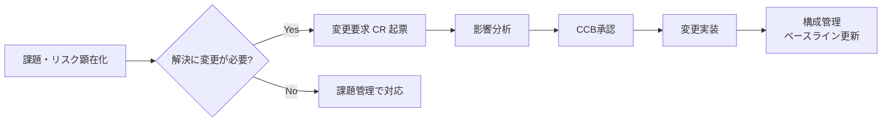
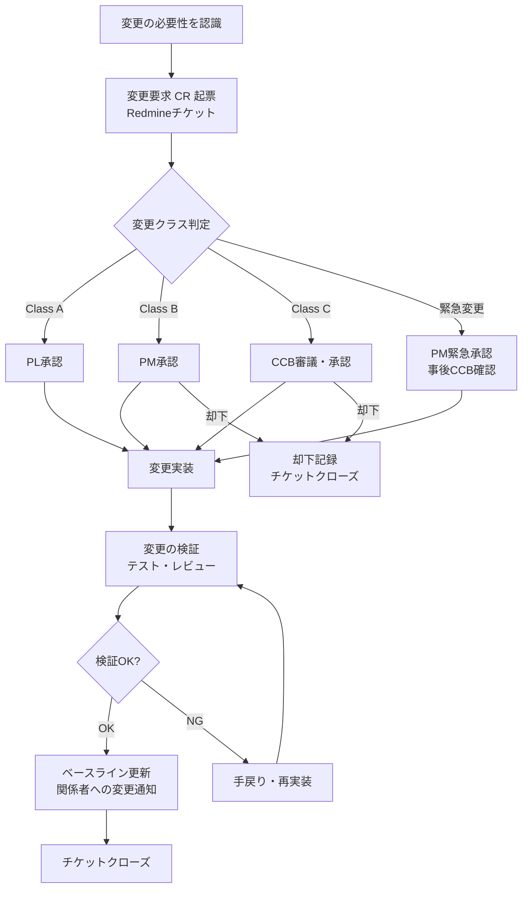
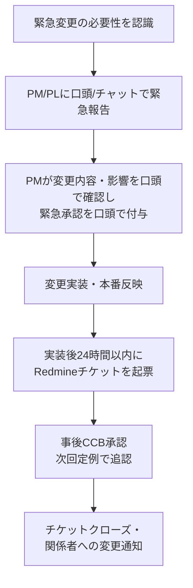
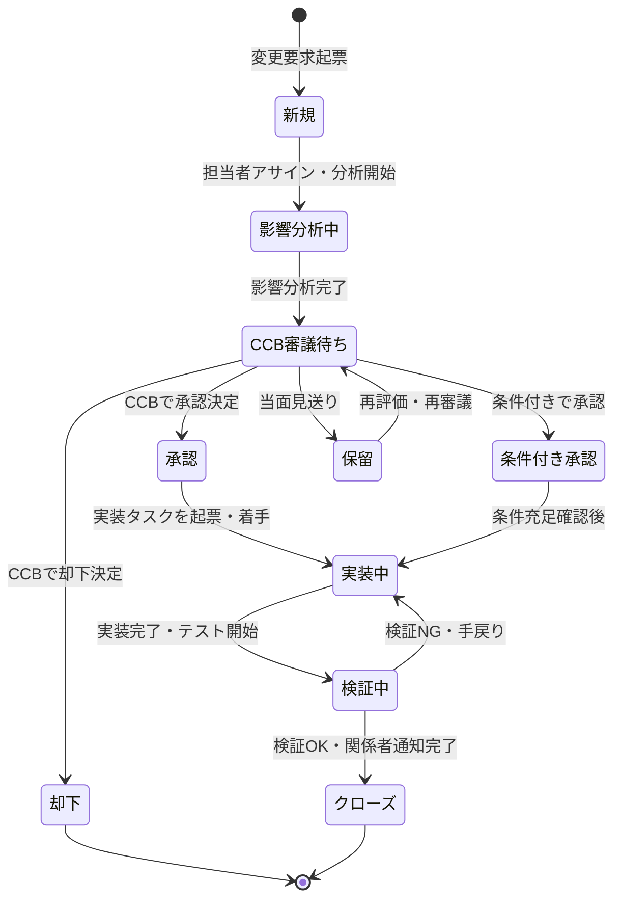

# プロジェクト変更マネジメント 実践ガイドライン

| 項目 | 内容 |
| :--- | :--- |
| 文書番号 | PMO-STD-007 |
| バージョン | 1.0 |
| 作成日 | 2026-02-22 |
| 対象者 | PM・PL・PMO担当者・ステークホルダー |

---

## 目次

- [1. はじめに：変更管理の本質](#1-はじめに変更管理の本質)
  - [1.1 変更管理の目的と位置づけ](#11-変更管理の目的と位置づけ)
  - [1.2 変更管理が必要な理由](#12-変更管理が必要な理由)
  - [1.3 構成管理・課題管理との役割分担](#13-構成管理課題管理との役割分担)
  - [1.4 変更管理が機能しないプロジェクトの典型パターン](#14-変更管理が機能しないプロジェクトの典型パターン)
- [2. 変更の分類と識別](#2-変更の分類と識別)
  - [2.1 変更の種類](#21-変更の種類)
  - [2.2 変更の発生源](#22-変更の発生源)
  - [2.3 変更の規模分類（変更クラス）](#23-変更の規模分類変更クラス)
- [3. 変更要求（CR）のライフサイクル](#3-変更要求crのライフサイクル)
  - [3.1 全体フロー](#31-全体フロー)
  - [3.2 ステップ1：変更要求の識別・起票](#32-ステップ1変更要求の識別起票)
  - [3.3 ステップ2：影響分析](#33-ステップ2影響分析)
  - [3.4 ステップ3：CCBによる審議・承認](#34-ステップ3ccbによる審議承認)
  - [3.5 ステップ4：変更の実装](#35-ステップ4変更の実装)
  - [3.6 ステップ5：変更の検証・クローズ](#36-ステップ5変更の検証クローズ)
- [4. 変更管理委員会（CCB）の運営](#4-変更管理委員会ccbの運営)
  - [4.1 CCBの目的と構成](#41-ccbの目的と構成)
  - [4.2 CCBの権限と承認基準](#42-ccbの権限と承認基準)
  - [4.3 CCB会議の運営](#43-ccb会議の運営)
  - [4.4 緊急変更（Emergency Change）の承認フロー](#44-緊急変更emergency-changeの承認フロー)
- [5. 変更の影響分析](#5-変更の影響分析)
  - [5.1 影響分析の観点](#51-影響分析の観点)
  - [5.2 影響度の評価基準](#52-影響度の評価基準)
  - [5.3 影響分析テンプレート](#53-影響分析テンプレート)
- [6. Redmineによる変更要求チケット管理](#6-redmineによる変更要求チケット管理)
  - [6.1 変更要求専用トラッカーの設定](#61-変更要求専用トラッカーの設定)
  - [6.2 チケット項目の定義と活用](#62-チケット項目の定義と活用)
  - [6.3 ステータスの定義と遷移ルール](#63-ステータスの定義と遷移ルール)
  - [6.4 変更管理の週次サイクル（Redmine運用）](#64-変更管理の週次サイクルredmine運用)
  - [6.5 カスタムクエリの活用](#65-カスタムクエリの活用)
- [7. 変更管理の運用プロセス](#7-変更管理の運用プロセス)
  - [7.1 変更管理の会議体](#71-変更管理の会議体)
  - [7.2 ステークホルダーへの変更報告](#72-ステークホルダーへの変更報告)
  - [7.3 ベースライン変更の取り扱い](#73-ベースライン変更の取り扱い)
- [8. よくある失敗パターンと対策](#8-よくある失敗パターンと対策)
- [付録A: 変更管理チェックリスト](#付録a-変更管理チェックリスト)
- [付録B: Redmineカスタムクエリ例](#付録b-redmineカスタムクエリ例)
- [付録C: 用語集](#付録c-用語集)

---

## 1. はじめに：変更管理の本質

### 1.1 変更管理の目的と位置づけ

変更管理（Change Management）とは、プロジェクトのスコープ・スケジュール・コスト・品質に影響する変更要求を**体系的に受付・評価・承認・実装・記録**するプロセスである。変更を「禁止する」のではなく、「適切に評価した上で、影響を把握して承認・却下する」仕組みを整えることが目的となる。

PMBOK® Guide では、変更管理はプロジェクト統合マネジメントの一部として位置づけられており、「統合変更管理」として全ての変更要求が一元的にコントロールされることを定めている。

**変更管理が達成する3つの目的**

| 目的 | 説明 |
| :--- | :--- |
| **影響の可視化** | 変更がスコープ・スケジュール・コスト・品質に与える影響を事前に評価し、承認判断の根拠を明確にする |
| **合意形成の担保** | 変更内容と影響をステークホルダー全員が把握した上で承認するため、後から「聞いていない」「そんな変更は知らなかった」を防ぐ |
| **追跡可能性の確保** | 「誰が・なぜ・何を変えたか」を記録し、後から変更の経緯を追えるようにする。障害発生時・監査時・後続フェーズでの設計根拠確認に不可欠 |

> [!NOTE]
> 変更管理は「変更を阻止するための障壁」ではない。適切な変更は積極的に承認すべきであり、プロセスの目的はあくまで「影響を把握した上での意思決定」である。プロセスが重すぎると現場は変更を隠蔽し始める。必要最小限のプロセスで十分な統制を実現する設計が重要。

### 1.2 変更管理が必要な理由

プロジェクトにおいて変更は必然的に発生する。問題は変更の発生ではなく、**管理されない変更（Scope Creep）**がプロジェクトを蝕むことにある。

| 変更管理なしに起きること | 変更管理があれば防げること |
| :--- | :--- |
| 「ついでにここも直しておきました」がスケジュールを圧迫する | 変更のスコープが明確になり、追加分の工数・期日への影響を可視化できる |
| 「そんな変更は承認していない」と後から揉める | 承認記録が残るため、合意済みであることを証明できる |
| 変更の影響が下流工程（テスト・移行）で発覚し、手戻りが爆発する | 影響分析を変更前に行うため、波及コストを事前に把握できる |
| 「なぜこの仕様になっているのか」が誰も分からない | 変更履歴から設計根拠を追跡できる |

> [!TIP]
> 小規模な変更こそ要注意。「これぐらいは口頭で了解してやっておこう」が積み重なると、気づいた時にはスコープが膨張し、誰も全体像を把握できない状態になる。金額・工数ベースで「この規模以上は必ずCRを起票」という閾値を最初に決めておくと運用しやすい。

### 1.3 構成管理・課題管理との役割分担

変更管理・構成管理・課題管理は密接に連携するが、役割は明確に異なる。

| 管理領域 | 主な関心事 | 変更との関係 |
| :--- | :--- | :--- |
| **変更管理（本ファイル）** | 「変更を承認すべきか」「変更の影響は何か」 | 変更要求を受付・評価・承認し、実装指示を出す中心機能 |
| **構成管理**（50.構成管理参照） | 「今何が正式な状態か」「過去の状態に戻せるか」 | 承認された変更が実装された後、新しいバージョンとしてベースラインを更新する |
| **課題管理**（40.課題リスク管理参照） | 「プロジェクト目標達成を阻害する要因を解消する」 | 課題の解決策として変更が必要になることがある。その場合は変更要求として起票する |



### 1.4 変更管理が機能しないプロジェクトの典型パターン

| 典型パターン | 引き起こされる問題 |
| :--- | :--- |
| 変更が口頭・チャットのみで承認される | 「聞いていない」「そんな変更は合意していない」という後からの紛争が生まれる |
| 影響分析なしにすぐ実装される | 下流工程（テスト・移行）で設計変更の影響が発覚し、手戻りが発生する |
| 変更履歴が残らない | 数ヶ月後に「なぜこの仕様になっているのか」が誰も分からなくなる |
| 変更プロセスが重すぎて誰も使わない | 変更が非公式ルートで実施され、管理が形骸化する |
| 全ての変更が「緊急」扱いになる | 影響分析・承認プロセスがスキップされ続ける |

> [!WARNING]
> 変更管理の形骸化で最も多いパターンは「変更要求書を書くのが面倒なので、口頭で合意してそのまま実装する」。これが繰り返されると、最終的な成果物が当初の計画と大幅に乖離しているのに、その経緯を誰も説明できない状態になる。プロセスをシンプルに保ち、「起票のコスト」を下げることが形骸化防止の鍵。

---

## 2. 変更の分類と識別

### 2.1 変更の種類

プロジェクトで発生する変更は、影響する管理対象によって以下のように分類できる。

| 変更種別 | 定義 | 例 |
| :--- | :--- | :--- |
| **スコープ変更** | 成果物・機能・作業範囲の追加・削除・変更 | 要件追加、機能削除、画面仕様変更、帳票レイアウト変更 |
| **スケジュール変更** | マイルストーン・期日の変更 | リリース日延期、フェーズ期間の再設定 |
| **コスト/予算変更** | 予算・工数の変更 | 追加要員の投入、外部委託費の追加、設備費の変更 |
| **品質基準変更** | テスト合格基準・非機能要件の変更 | パフォーマンス目標の緩和、テストカバレッジ基準の変更 |
| **技術仕様変更** | 使用技術・アーキテクチャの変更 | フレームワーク変更、DBエンジン変更、外部API変更 |
| **運用・移行方針変更** | 本番移行方法・運用方針の変更 | 移行方式の変更（一括→段階移行）、サポート体制の変更 |

> [!NOTE]
> 実務ではスコープ変更が最も頻繁に発生し、かつ影響範囲が最も広い。スコープ変更は必ずスケジュール・コストの再評価とセットで行う。「機能を追加するが、期日もコストも変わらない」という前提は多くの場合成立しない。

### 2.2 変更の発生源

変更要求がどこから来るかを把握することで、対応の優先順位や調整先を判断しやすくなる。

| 発生源 | 例 | 特徴と注意点 |
| :--- | :--- | :--- |
| **ユーザー/業務部門** | 業務フローの変更に伴う機能追加、使い勝手改善要求 | 要望が際限なく発生しやすい。スコープの境界を明確にした上で評価する |
| **プロジェクトチーム** | 技術的制約による設計変更、品質改善のためのリファクタリング | 合理的な理由があるが、内向きの変更になりやすい。影響範囲を外部に説明できることが重要 |
| **外部ベンダー/システム** | 外部API仕様変更、法改正対応、OS/MWのセキュリティアップデート | 外部起因のため回避困難。早期に情報収集し、影響を先読みして変更管理に組み込む |
| **リスク顕在化** | リスク管理台帳に記録していたリスクが現実になった場合 | リスク対応計画が変更要求として具体化する。迅速な判断が求められる |
| **法規制・コンプライアンス** | 法改正対応、セキュリティポリシー変更 | 拒否できない変更。スケジュール・コストへの影響を早期に評価し、ステークホルダーへ報告する |

### 2.3 変更の規模分類（変更クラス）

変更の規模によって、承認権限・プロセスの詳細度を使い分ける。変更を全て同じプロセスで通すと、小さな変更でも重いプロセスになり形骸化の原因になる。

| クラス | 規模の目安 | 承認者 | プロセス |
| :--- | :--- | :--- | :--- |
| **Class A（軽微）** | 工数 8時間未満、スケジュール・コスト・品質への影響なし | PL | Redmineチケット起票のみ。次回定例で報告 |
| **Class B（中規模）** | 工数 8〜40時間、または期日に最大1週間の影響 | PM | 影響分析を実施し、次回週次定例または臨時CCBで承認を得る |
| **Class C（大規模）** | 工数 40時間超、または期日・コストへの重大な影響 | CCB（PM・PL・発注者代表） | 正式な影響分析・承認会議を実施。承認記録と変更指示書を発行する |
| **緊急変更** | 本番障害対応・法規制対応等、迅速な実施が不可避 | PM（事後CCB承認） | 口頭で緊急承認後、事後的にチケット起票・CCB承認を行う |

> [!TIP]
> Class Aを「PL承認 + 定例報告」と定義しておくと、現場の小さな改善を速やかに進めながら、PMは全体把握できる。「PMが全ての変更を個別承認する」運用はPMのボトルネックを生み、変更が滞留する。権限委譲の設計が重要。

---

## 3. 変更要求（CR）のライフサイクル

### 3.1 全体フロー



### 3.2 ステップ1：変更要求の識別・起票

#### 3.2.1 起票のルール

**誰でも起票できる文化を作る**。変更要求を「担当者が判断して却下する」のではなく、「まず記録し、その後評価・審議する」という原則を徹底する。

**起票の判断基準**（以下のいずれかに該当する場合は必ず起票する）:
- スコープ（成果物・機能・作業範囲）に影響する
- スケジュール（マイルストーン・期日）に影響する
- コスト・工数に影響する
- 品質基準・非機能要件に影響する
- 既に合意・承認した設計・仕様を変更する

> [!WARNING]
> 「これぐらいは口頭でOKをもらえばいい」という判断が積み重なると、スコープクリープが発生する。変更の大小に関わらず、Redmineチケットとして記録する習慣を根付かせることがプロジェクト全体の透明性を担保する。Class A（軽微）であっても起票は必須。

#### 3.2.2 変更要求の記述方法

**チケットタイトルの形式**: `【変更種別】変更内容の概要（例：【スコープ追加】受注画面に承認フローを追加）`

**説明欄に含める必須情報**:

| 項目 | 内容 |
| :--- | :--- |
| **変更の背景** | なぜこの変更が必要になったか（発生源・経緯） |
| **変更内容** | 何を・どのように変更するか（現状 → 変更後） |
| **変更の目的・効果** | この変更によって何が解決されるか |
| **影響の初期見込み** | スコープ・スケジュール・コストへの影響の概算（起票時点の見込みで可） |
| **変更要求者** | 誰がこの変更を要求しているか |
| **必要な判断期限** | いつまでに変更の可否を判断する必要があるか |

> [!TIP]
> 「影響の初期見込み」は起票時点では概算で構わない。詳細な影響分析は評価フェーズ（ステップ2）で行う。「影響分析ができるまで起票しない」となると記録が遅れる。まず起票し、影響分析を後から追記する運用が現実的。

### 3.3 ステップ2：影響分析

変更要求を承認・却下する前に、影響範囲と規模を定量的に評価する。影響分析の詳細は [第5章](#5-変更の影響分析) を参照。

**影響分析の実施責任者**:
- Class A: PL（影響が軽微なため簡易評価で可）
- Class B/C: PMO + 技術担当（詳細な工数・スケジュール影響を評価）

影響分析の結果はRedmineチケットのコメントに記録する。影響分析なしで承認を行うことは禁止とする。

### 3.4 ステップ3：CCBによる審議・承認

影響分析の結果を踏まえ、CCB（または権限委譲されたPM/PL）が変更要求に対して以下のいずれかを決定する。

| 決定区分 | 定義 | 対応 |
| :--- | :--- | :--- |
| **承認（Approve）** | 影響を踏まえた上で変更を実施する | 変更指示書（変更承認記録）を発行し、実装担当者にアサイン |
| **条件付き承認（Conditional Approve）** | 条件を満たした上で変更を実施する | 条件をRedmineチケットに記録し、条件充足を確認後に実装着手 |
| **保留（Defer）** | 当面は変更しない。次フェーズ以降で再検討 | 保留理由と再検討タイミングをチケットに記録し、ステータスを「保留」に変更 |
| **却下（Reject）** | 変更しない | 却下理由をチケットに記録し、要求者に説明。チケットをクローズ |

> [!NOTE]
> 「却下」はネガティブな結論ではなく、「影響を評価した結果、現時点では実施しない」という合理的な意思決定である。却下の際は必ず理由をチケットに記録し、要求者に丁寧に説明する。記録のない却下は後から揉める原因になる。

### 3.5 ステップ4：変更の実装

承認された変更は、通常のタスク管理プロセス（WBS・Redmineチケット）に組み込んで実装する。

**実装時の注意事項**:
- 変更要求チケット（CRチケット）と実装タスクチケットを**親子関係で紐付ける**
- 承認された変更内容と実装内容に乖離が生じた場合は、必ず変更要求者・承認者に報告する
- 変更によって影響を受けるドキュメント（要件定義書・設計書等）は、変更実装と並行して更新する
- バージョン管理ツールのコミットメッセージに変更要求チケット番号を含める（例: `#CR-042 受注画面に承認フローを追加`）

> [!WARNING]
> 「実装しながら仕様が変わった」のに変更管理プロセスを通さずに対応するケースがある。実装中に承認済み内容から逸脱した場合は、新たな変更要求として追加起票する。「小さな変更だから」という自己判断で実装を拡大すると、最終成果物と承認済みスコープの乖離が生まれる。

### 3.6 ステップ5：変更の検証・クローズ

変更実装後、以下を確認してからクローズする。

**完了確認チェックリスト**:
- [ ] 変更内容が承認された仕様通りに実装されているか（レビュー・テストで確認）
- [ ] 影響を受けるドキュメント（設計書・仕様書・運用手順書等）が更新されているか
- [ ] 構成管理上の更新（バージョン番号・ベースライン）が実施されているか
- [ ] 変更の影響を受けるステークホルダーへの通知が完了しているか
- [ ] 変更によって新たな課題・リスクが発生していないか

---

## 4. 変更管理委員会（CCB）の運営

### 4.1 CCBの目的と構成

CCB（Change Control Board: 変更管理委員会）は、変更要求の承認・却下を審議する意思決定機能である。変更の承認者・権限・プロセスを明確にすることで、「誰がどの変更を承認すべきか」の曖昧さをなくす。

**CCBの役割**:
- 変更要求の影響分析結果を評価する
- 変更の承認・条件付き承認・保留・却下を決定する
- 承認した変更の優先順位を決定する
- 大量の変更要求が発生した場合のトリアージを行う

**CCBの構成（規模別推奨）**:

| プロジェクト規模 | 推奨CCB構成 |
| :--- | :--- |
| **小規模（〜5人）** | PM = CCB。変更管理はPMが単独で判断・承認。週次定例で変更状況を共有 |
| **中規模（10〜20人）** | PM + PL（複数いる場合は各PL）+ PMO。週次または隔週のCCB会議で審議 |
| **大規模（20人超）** | PM + 各チームPL + ユーザー側代表（業務担当） + インフラ担当。スコープ・コスト・技術・業務の観点から多角的に審議 |
| **発注者との共同プロジェクト** | 上記に発注者PM・業務担当者を加える。スコープ変更は発注者承認を必須とする |

> [!NOTE]
> CCBは「会議体」としてフォーマルに設置しなくても機能する。重要なのは「誰が何を承認できるか」の権限を明確にし、記録を残すことである。小規模プロジェクトではPMが週次定例でまとめて審議する運用でも十分。

### 4.2 CCBの権限と承認基準

| 変更クラス | 必要な承認者 | 承認の前提条件 |
| :--- | :--- | :--- |
| **Class A（軽微）** | PL | 影響がない（またはごく軽微な）ことを確認。作業時間 < 8H |
| **Class B（中規模）** | PM | 影響分析が完了していること。スコープ・期日・コストへの影響が定量的に評価されていること |
| **Class C（大規模）** | CCB全員合意 | 詳細な影響分析が完了していること。変更後の計画（スケジュール・コスト・リソース）が提示されていること |
| **ベースライン変更を伴う変更** | CCB + 発注者（ある場合） | 変更後のスケジュール・コスト見直し計画が承認されていること |

> [!TIP]
> 承認の前提として「影響分析が完了していること」を必須にすることが重要。影響分析なしで「承認するか却下するか」を議論しても実のある意思決定にならない。CCB会議前に担当者が影響分析を完了させ、CCBに提案する形式にすると会議が短縮される。

### 4.3 CCB会議の運営

#### 4.3.1 定例CCB会議

CCBは独立した会議を設けるのではなく、週次定例のアジェンダの一部として組み込むことが実務では多い。

**週次定例内でのCCBアジェンダ（目安20〜30分）**:

| 時間 | 内容 | 担当 |
| :--- | :--- | :--- |
| 5分 | 先週承認した変更の実装状況確認 | PM |
| 10〜15分 | 新規変更要求の審議（影響分析済みのもの） | 各CR担当者→CCB |
| 5分 | 保留中CRの状況確認・再評価 | PM |
| 5分 | 変更の優先順位・スケジュール調整の確認 | PM |

**CCB審議に必要な情報（提案者が事前に準備する）**:
1. 変更の概要（何を・なぜ変えるのか）
2. 影響分析結果（スコープ・スケジュール・コスト・品質への影響）
3. 推奨する対応案（可能な場合は複数案と比較）
4. 判断に必要な期限

#### 4.3.2 承認記録の残し方

CCB会議の承認結果は必ずRedmineチケットのコメントに記録する。

```
承認記録例（Redmineコメント）:
---
CCB承認記録
承認日: 2026-02-22
承認者: 田中（PM）、鈴木（PL）、ユーザー代表：山田様
決定: 承認（条件付き）
条件: 期日を3/31から4/14に変更し、工数上限を40Hとする
承認後スケジュール: MS3（基本設計完了）を1週間延期（3/31 → 4/7）
変更承認番号: CR-2026-042
---
```

> [!WARNING]
> 口頭での変更承認は禁止する。承認はRedmineチケットへの記録をもって正式とする。会議で承認した場合も、会議後24時間以内にチケットにコメントを追記することをルール化する。「チケットに記録がなければ承認されていない」という原則を全員に周知する。

### 4.4 緊急変更（Emergency Change）の承認フロー

本番障害対応・法規制への緊急対応など、通常の変更管理プロセスを経る時間的余裕がない場合の例外フロー。



> [!NOTE]
> 「緊急」を乱用すると通常プロセスが空洞化する。緊急変更は「本番障害対応」「法規制期限対応」「セキュリティ脆弱性対応」等、事後に誰が見ても緊急性が明らかなものに限定する。月に2件以上の緊急変更が発生している場合は、変更管理プロセスや計画精度に問題がある可能性を疑う。

---

## 5. 変更の影響分析

### 5.1 影響分析の観点

変更がプロジェクトの4つの制約（スコープ・スケジュール・コスト・品質）に与える影響を多角的に評価する。

| 評価観点 | 確認事項 |
| :--- | :--- |
| **スコープへの影響** | この変更によって追加・削除・変更される機能・成果物は何か。他の要件との整合性は保たれるか |
| **スケジュールへの影響** | 変更の実装にかかる追加工数は何時間か。マイルストーン・リリース日への影響はあるか |
| **コストへの影響** | 追加工数・追加資材に伴うコスト増は何円（時間）か。予算の範囲内か |
| **品質への影響** | 変更によってテスト計画の見直しが必要か。既存機能への影響（デグレード）はないか |
| **技術的影響** | アーキテクチャ・DB設計・インタフェース設計への影響はあるか |
| **依存関係への影響** | 他のタスク・チケット・外部システムへの影響はあるか |
| **運用・移行への影響** | 移行手順・運用手順書の変更が必要か。本番環境の設定変更が伴うか |

### 5.2 影響度の評価基準

変更の影響度を定量的に評価することで、CCBの審議を客観的な根拠に基づいて行えるようにする。

| 影響度 | スコープ | スケジュール | コスト |
| :--- | :--- | :--- | :--- |
| **重大（S）** | 主要機能の追加・削除 | マイルストーン遅延・リリース延期 | 予算の10%超過 |
| **高（A）** | 機能の一部変更・複数画面への影響 | 1週間以上の遅延 | 予算の5〜10%超過 |
| **中（B）** | 単一機能内の仕様変更 | 1週間未満の遅延 | 予算の2〜5%超過 |
| **低（C）** | 軽微な表示変更・バグ相当の修正 | 遅延なし（工数 < 8H） | 予算の2%未満 |

### 5.3 影響分析テンプレート

影響分析の結果は以下のテンプレートをRedmineチケットのコメントに記入する。

```markdown
## 影響分析結果
変更要求番号: CR-2026-042
分析実施者: 鈴木（PL）
分析実施日: 2026-02-22

### 変更内容
受注画面に3段階承認フロー（担当者 → 係長 → 部長）を追加する

### 影響評価
| 観点 | 影響度 | 詳細 |
| :--- | :--- | :--- |
| スコープ | A（高） | 受注画面の仕様変更・承認通知メール機能の追加が必要 |
| スケジュール | B（中） | 追加工数 32H。MS3（基本設計完了）を1週間延期が必要 |
| コスト | B（中） | 追加工数 32H × 5,000円/H = 160,000円の追加 |
| 品質 | C（低） | 承認フロー関連のテストケース 20件追加が必要 |
| 技術 | C（低） | 既存のDB設計に承認テーブルを追加するのみ。大きな影響なし |
| 依存関係 | B（中） | 通知メール機能の実装前提として、メールサーバー設定の確認が必要 |

### 変更オプションの比較
| オプション | 内容 | 追加工数 | スケジュール影響 |
| :--- | :--- | :--- | :--- |
| オプションA（推奨） | 3段階承認フローを当初リリースに含める | 32H | 1週間延期 |
| オプションB | 1段階承認フローのみ当初リリースに含め、2段階目以降を第2フェーズへ | 12H | 延期なし（スコープ縮小） |

### 推奨案
オプションBを推奨。ユーザー業務上の優先度を確認の上、第2フェーズ扱いの可否をユーザー代表に判断いただきたい。
```

---

## 6. Redmineによる変更要求チケット管理

### 6.1 変更要求専用トラッカーの設定

Redmineでは変更要求（CR）を専用トラッカーで管理する。タスクチケット・課題チケットと混在させると、変更要求の状況把握が困難になる。

**推奨トラッカー構成**:

| トラッカー名 | 用途 |
| :--- | :--- |
| タスク | 工程内の作業単位（WBS対応） |
| 課題 | プロジェクト目標達成を阻害する事項 |
| **変更要求（CR）** | スコープ・スケジュール・コスト・品質に影響する変更要求 |
| バグ | テスト工程で検出した不具合 |

> [!NOTE]
> 「変更要求」トラッカーの設置が難しい場合は、タスクトラッカーのカスタムフィールドで「変更要求フラグ」を立てる運用でも代替できる。ただし専用トラッカーの方がフィルタリングや集計の精度が高く、運用が安定しやすい。

### 6.2 チケット項目の定義と活用

#### 6.2.1 標準フィールドの活用

| Redmineフィールド | 変更要求チケットでの使い方 |
| :--- | :--- |
| **題名** | `【変更種別】変更内容の概要` 形式で記載（例：`【スコープ追加】受注画面に承認フローを追加`） |
| **説明** | 変更の背景・変更内容・影響の初期見込みを記載。影響分析結果と承認記録はコメントに追記 |
| **ステータス** | 6.3節の遷移ルールに従う |
| **優先度** | 判断期限の緊急度に応じて設定：即急 / 高め / 通常 / 低め |
| **担当者** | 影響分析・承認申請の責任者（通常はPL）を設定 |
| **期日** | 変更の可否を判断する必要がある期限（≠変更実装の完了期日） |
| **親チケット** | 実装タスクチケットを子チケットとして紐付ける |

#### 6.2.2 推奨カスタムフィールド

| カスタムフィールド名 | 型 | 選択肢 / 入力規則 | 目的 |
| :--- | :--- | :--- | :--- |
| **変更種別** | リスト | スコープ / スケジュール / コスト / 品質 / 技術仕様 / 運用・移行方針 | 変更の種類を分類してフィルタリング・集計に活用 |
| **変更クラス** | リスト | Class A / Class B / Class C / 緊急 | 承認権限と適用プロセスを決定する |
| **変更要求者** | テキスト | 氏名または部署名（例：業務部門・田中様） | 誰の要求かを記録。変更要求の傾向分析にも使える |
| **影響度** | リスト | 重大（S）/ 高（A）/ 中（B）/ 低（C） | 影響分析の結果を簡易記録。CCBでの優先順位判断に使用 |
| **CCB判定** | リスト | 未審議 / 承認 / 条件付き承認 / 保留 / 却下 | CCBの決定を記録。「承認済み」「却下済み」をフィルタで抽出可能 |
| **変更承認番号** | テキスト | 例: `CR-2026-042`（YYYY連番形式） | 変更履歴の参照・監査対応に使用 |

> [!TIP]
> **変更承認番号**は後から変更の経緯を追う際の鍵になる。コミットメッセージ・設計書の変更履歴・議事録に変更承認番号を記載することで、「この実装はどのCRで承認されたものか」を瞬時に特定できる。番号体系は `CR-{年}-{3桁連番}`（例: `CR-2026-042`）が管理しやすい。

#### 6.2.3 変更要求チケットの記述例

**チケット題名**:
```
【スコープ追加】受注画面に3段階承認フローを追加（業務部門要求）
```

**説明欄（変更要求内容）**:
```markdown
## 変更の背景
業務部門より「受注データの登録時に、担当者→係長→部長の3段階承認を経て確定する
フローが必要」との要求が提起された（2026-02-15 定例会議にて）。
現行の設計では担当者が直接確定操作を行う仕様になっており、内部統制上の問題がある。

## 変更内容（現状→変更後）
- 現状: 担当者が受注データを入力後、直接「確定」ボタンで確定
- 変更後: 担当者入力 → 係長承認 → 部長最終承認 → 確定という3段階フローを追加

## 影響の初期見込み（詳細は影響分析コメントを参照）
- 追加工数: 30〜40H（概算）
- スケジュール: 基本設計完了マイルストーンへの影響あり（詳細分析中）
- コスト: 工数増加分のコスト増加あり

## 変更要求者
業務部門・経理課・田中様

## 判断が必要な期限
2026-03-07（次の月次定例）までにGo/No-Go判断が必要
```

### 6.3 ステータスの定義と遷移ルール



| ステータス | 定義 | 遷移時の必須アクション |
| :--- | :--- | :--- |
| **新規** | 変更要求が起票された直後 | 変更種別・変更クラス・変更要求者・判断期限を設定する |
| **影響分析中** | 担当者が影響分析を実施中 | 担当者を設定し、期日（判断期限）を確認する |
| **CCB審議待ち** | 影響分析完了、CCBの審議を待つ状態 | 影響分析結果をコメントに記録する。次回CCBのアジェンダに追加する |
| **承認** | CCBが変更を承認した | 承認記録（承認者・承認日・変更承認番号）をコメントに記録する |
| **条件付き承認** | 条件付きで承認された | 条件内容と充足確認の担当者・期日をコメントに記録する |
| **保留** | 当面変更しない決定 | 保留理由と再検討タイミングをコメントに記録する |
| **却下** | 変更しないことが決定した | 却下理由をコメントに記録する。変更要求者への説明を行う |
| **実装中** | 承認を受けて実装作業中 | 実装タスクチケットを子チケットとして起票し、紐付ける |
| **検証中** | 実装完了、テスト・レビューを実施中 | 検証方法と担当者をコメントに記録する |
| **クローズ** | 変更実装・検証完了 | 完了内容・ドキュメント更新状況・関係者通知完了をコメントに記録する |

> [!WARNING]
> 「承認」ステータスのまま実装が着手されないまま放置されるケースがある。承認後は必ず次のアクション（実装タスクチケットの起票・担当者アサイン）をセットで行い、変更要求が「承認されたのに実装されていない」状態を防ぐ。Redmineのカスタムクエリ「承認後30日以上経過したCR」を定期的に確認すること。

### 6.4 変更管理の週次サイクル（Redmine運用）


**週次確認項目（Redmineカスタムクエリで抽出）**:

| 確認事項 | 使用クエリ |
| :--- | :--- |
| 判断期限が今週の変更要求 | 期日=今週 AND ステータス≠クローズ・却下 |
| 影響分析が完了し審議待ちのCR | ステータス=CCB審議待ち |
| 承認後に実装未着手のCR | ステータス=承認 AND 更新日 > 1週間前 |
| 保留中CRの定期見直し | ステータス=保留 AND 更新日 > 4週間前 |

### 6.5 カスタムクエリの活用

詳細なフィルタ設定は [付録B](#付録b-redmineカスタムクエリ例) を参照。

---

## 7. 変更管理の運用プロセス

### 7.1 変更管理の会議体

変更管理の審議は、独立した会議を別途設けるよりも、既存の週次定例・月次ステアリングに組み込む方が定着しやすい。

#### 7.1.1 週次定例内のCCBセッション

**目的**: 新規変更要求の審議・保留中CRの再評価

**参加者**: PM、PL全員（Class B/C審議時は発注者代表も招集）

**時間**: 20〜30分（定例の一部として）

**運用のポイント**:
- Redmineカスタムクエリで「CCB審議待ち」を表示しながら進める
- 影響分析が未完了のCRは審議しない（担当者に分析完了期限を確認する）
- 承認記録は会議後24時間以内にRedmineコメントに記録する

> [!TIP]
> 週次定例内でのCCBを有効に機能させるには「審議材料の準備」が鍵。変更要求担当者は定例の前日までに影響分析をコメントに追記し、「承認するための情報がそろった状態」で会議に臨むルールにする。「今日初めて内容を知る」状態での審議は形式的になりやすい。

#### 7.1.2 月次ステアリングでの変更報告

**目的**: 発注者・経営層への変更状況の報告・大規模変更の最終承認

**参加者**: プロジェクトオーナー、PM、必要に応じてPL

**報告内容**:

```markdown
## 変更管理月次サマリー（202X年X月）

### 変更要求統計
| 区分 | 件数 |
| :--- | :--- |
| 今月の新規変更要求 | 8件 |
| 承認 | 5件 |
| 却下 | 1件 |
| 保留 | 2件 |
| クローズ（実装完了） | 4件 |
| オープン合計 | 10件 |

### 承認変更のスケジュール・コストへの累積影響
- スケジュール影響累計: MS3（基本設計完了）が2週間延期
- コスト影響累計: 追加工数 120H相当（+600,000円）

### 今月の主要変更
- CR-2026-042: 受注画面に3段階承認フローを追加（承認・実装中）
- CR-2026-041: セキュリティ要件追加（ログイン試行回数制限）（承認・完了）

### 判断が必要な案件
- CR-2026-045: 月次帳票の追加（Class C・CCB審議中）→来月のステアリングで方向性判断をお願いしたい
```

### 7.2 ステークホルダーへの変更通知

承認・実装された変更は、影響を受けるステークホルダーに適切なタイミングで通知する。

| 通知タイミング | 通知先 | 通知内容 |
| :--- | :--- | :--- |
| **変更要求が起票されたとき** | PM・担当PL | 変更要求の概要・影響分析の指示 |
| **CCBで承認されたとき** | 実装担当者・変更要求者 | 承認内容・実装指示・変更承認番号 |
| **変更が実装・完了したとき** | テスト担当者・運用担当者・変更要求者 | 変更内容・テスト計画への影響・ドキュメント更新状況 |
| **変更が却下されたとき** | 変更要求者 | 却下理由・代替案の有無 |
| **大規模変更が承認されたとき** | プロジェクト全員 | スケジュール・コストへの影響・変更後の計画 |

> [!NOTE]
> 変更通知の漏れがプロジェクト内の混乱を招く典型例：テスト担当者が「設計変更されたのに誰も知らせてくれなかった」という状況。Redmineの通知機能（ウォッチャー設定）を活用し、関係者をウォッチャーとして追加することで自動通知が機能する。

### 7.3 ベースライン変更の取り扱い

CCBが承認した変更がベースライン（正式に承認された成果物の集合）に影響する場合、構成管理プロセスと連動してベースラインを更新する。

**ベースライン変更が必要な典型ケース**:
- 要件定義書・設計書の仕様を変更した場合
- テスト計画・合格基準を変更した場合
- スケジュール・コスト計画を変更した場合

**ベースライン変更の手順**:

1. CCBが変更を承認する（CCB承認記録をRedmineに記録）
2. 変更された成果物をリポジトリに反映し、新バージョンを登録する
3. 変更前後のバージョンを明示したドキュメント変更履歴を記録する
4. 必要に応じてリポジトリに新しいベースラインタグを設定する
5. 変更後のスケジュール・コスト計画を正式な計画値として更新する

> [!WARNING]
> ベースライン設定済みの成果物を変更管理なしに変更することは禁止。「ちょっとした修正だから」という自己判断での設計書書き換えは、プロジェクト全体の一貫性を崩す。変更の大小に関わらず、承認記録なしのベースライン変更は認めないルールを徹底する。

---

## 8. よくある失敗パターンと対策

| 失敗パターン | 症状 | 対策 |
| :--- | :--- | :--- |
| **スコープクリープ** | 小さな変更が積み重なり、当初スコープが膨張する。「ついでに」が止まらない | Class A（軽微）の変更も必ずRedmineチケットとして起票する。累積影響を月次で集計・報告する |
| **変更の隠蔽** | 変更管理プロセスが重すぎて、非公式ルートで変更が実施される | プロセスを変更クラスに応じて軽量化する。Class Aは「起票 + 定例報告」のみにする |
| **影響分析スキップ** | 「急いでいるから」と影響分析なしにすぐ実装する | 影響分析なしの承認を禁止とする。「影響分析が完了したもののみCCBに上げる」ルールを徹底する |
| **記録なし承認** | 口頭で合意した変更が記録されず、後から「そんな変更は知らない」となる | 口頭承認の禁止を宣言する。承認は「Redmineコメントへの記録」をもって有効とする |
| **全て緊急扱い** | 「緊急」が濫用されてプロセスが空洞化する | 緊急変更の定義（本番障害・法規制対応等）を明確にする。緊急件数を月次で報告し、多い場合は原因を分析する |
| **保留の放置** | 「保留」にした変更が長期間放置され、プロジェクト終了時に大量の未処理CRが残る | 保留中CRを毎月定例で棚卸しする。4週間以上更新がない保留CRは再評価を強制する |
| **実装後の乖離** | 承認した変更と実際の実装内容が乖離している | CCBで承認した内容を変更した場合は必ず追加のCRを起票させる。完了検証で承認内容と実装内容の突合確認を必須にする |
| **変更通知漏れ** | 変更が実装されたのに関係者（テスト担当・運用担当等）に伝わらない | Redmineのウォッチャー設定を活用する。完了時の必須アクションとして「関係者への変更通知完了」をチェックリスト化する |

> [!WARNING]
> **「変更管理プロセスがあるのに誰も使っていない」は、プロセスが重すぎるシグナル**。Redmineチケット1枚の起票と定例でのCCB審議という最小限のプロセスから始め、変更件数や変更の影響が増えてきたら段階的に厳密化する。最初から完璧なプロセスを構築しようとすると現場に受け入れられない。

---

## 付録A: 変更管理チェックリスト

### A.1 プロジェクト開始時

- [ ] 変更管理計画（本ファイル）が作成・チームに共有されている
- [ ] Redmineに変更要求（CR）トラッカーが設定されている（カスタムフィールド含む）
- [ ] 変更クラスの定義（Class A/B/C・緊急）と承認権限がチームに周知されている
- [ ] CCBの構成メンバーと権限が定義されている
- [ ] 変更要求の起票ルール（判断基準・記述方法）が周知されている
- [ ] 変更承認番号の採番ルールが決定されている
- [ ] 週次定例内でのCCBアジェンダが設定されている

### A.2 変更要求の起票時

- [ ] 変更の背景・変更内容・影響の初期見込みが記述されている
- [ ] 変更種別・変更クラスが設定されている
- [ ] 変更要求者が記録されている
- [ ] 判断期限が設定されている（期日フィールド）
- [ ] 担当者（影響分析責任者）が設定されている

### A.3 影響分析完了時

- [ ] スコープ・スケジュール・コスト・品質への影響が定量的に評価されている
- [ ] 影響度フィールドが更新されている
- [ ] 影響分析結果がチケットのコメントに記録されている
- [ ] 複数の変更オプションがある場合は比較が行われ推奨案が提示されている
- [ ] CCBへの提案資料（コメント）が準備されている

### A.4 CCB審議・承認時

- [ ] 影響分析完了を確認してから審議を開始している
- [ ] 承認・条件付き承認・保留・却下のいずれかが決定されている
- [ ] CCB判定フィールドが更新されている
- [ ] 承認記録（承認者・承認日・変更承認番号・条件等）がコメントに記録されている
- [ ] 変更要求者への決定通知が行われている

### A.5 変更実装・クローズ時

- [ ] 実装タスクチケットが変更要求チケットの子チケットとして起票されている
- [ ] 承認内容通りに実装されていること（レビュー・テストで確認）
- [ ] 影響を受けるドキュメント（設計書・仕様書・運用手順書）が更新されている
- [ ] 構成管理上の更新（バージョン番号・ベースライン）が実施されている
- [ ] 変更の影響を受けるステークホルダーへの通知が完了している
- [ ] チケットのステータスが「クローズ」に更新されている

---

## 付録B: Redmineカスタムクエリ例

変更要求（CR）トラッカー向けの推奨カスタムクエリ。Redmineの「チケット」→「フィルタを追加」で設定し、名前をつけて保存する。

| クエリ名 | フィルタ条件 | ソート | 用途 |
| :--- | :--- | :--- | :--- |
| **CCB審議待ちCR** | トラッカー=変更要求 AND ステータス=CCB審議待ち | 期日昇順 | 週次定例CCBの審議対象確認 |
| **今週判断期限のCR** | トラッカー=変更要求 AND ステータス≠クローズ・却下 AND 期日=今週 | 期日昇順 | 緊急度の高いCRの確認 |
| **承認後・実装未着手のCR** | トラッカー=変更要求 AND ステータス=承認 AND 更新日 < 7日前 | 更新日昇順 | 承認後に放置されたCRの検出 |
| **保留中CRの棚卸し** | トラッカー=変更要求 AND ステータス=保留 AND 更新日 < 28日前 | 更新日昇順 | 長期保留CRの定期見直し |
| **今月の変更要求サマリー** | トラッカー=変更要求 AND 作成日=今月 | 作成日降順 | 月次報告の変更統計 |
| **承認済みCR一覧（実装状況確認）** | トラッカー=変更要求 AND CCB判定=承認 AND ステータス≠クローズ | 優先度降順 | 承認済み変更の実装進捗の一元確認 |
| **Class C大規模変更一覧** | トラッカー=変更要求 AND 変更クラス=Class C AND ステータス≠クローズ・却下 | 影響度降順 | 影響度の高い変更の重点管理 |
| **今月クローズした変更要求** | トラッカー=変更要求 AND ステータス=クローズ AND 更新日=今月 | 更新日降順 | 月次報告のクローズ件数・完了変更の確認 |

---

## 付録C: 用語集

| 用語 | 説明 |
| :--- | :--- |
| **変更要求（CR: Change Request）** | スコープ・スケジュール・コスト・品質に影響する変更の要求。Redmineの変更要求チケットで管理する |
| **変更管理委員会（CCB: Change Control Board）** | 変更要求の承認・却下を審議する委員会または担当者。小規模プロジェクトではPMが兼任することが多い |
| **スコープクリープ（Scope Creep）** | 管理されない小さな変更が積み重なり、プロジェクトのスコープが際限なく膨張していく現象。変更管理が機能していない場合に発生する |
| **影響分析（Impact Analysis）** | 変更がスコープ・スケジュール・コスト・品質に与える影響を定量的に評価するプロセス。承認判断の根拠となる |
| **変更クラス** | 変更の規模・影響度に応じて承認権限とプロセスを使い分けるための分類。Class A（軽微）〜Class C（大規模）と緊急変更に分類する |
| **変更承認番号** | 承認された変更要求に付与される一意の識別番号（例: CR-2026-042）。コミットメッセージ・設計書変更履歴に記載して追跡可能性を担保する |
| **ベースライン（Baseline）** | 特定時点で正式に承認された成果物の集合。変更管理で承認された変更のみがベースラインを更新できる |
| **緊急変更（Emergency Change）** | 通常の変更管理プロセスを経る時間的余裕がない変更（本番障害対応・法規制期限対応等）。口頭での緊急承認後、事後的にRedmineに記録してCCBで追認する |
| **変更指示書** | CCBが変更を承認した際に発行する公式ドキュメント（またはRedmineコメントの承認記録）。承認内容・承認者・変更承認番号・実装指示が含まれる |
| **統合変更管理（Integrated Change Control）** | PMBOK® Guideにおける変更管理の概念。全ての変更要求を一元的に受付・評価・承認・実装・記録するプロセス |
| **変更クラスA（軽微）** | 工数8時間未満でスケジュール・コスト・品質への影響がない変更。PL承認で実施可能 |
| **変更クラスC（大規模）** | 工数40時間超または期日・コストへの重大な影響を伴う変更。CCB全員合意が必要 |
| **QCDS** | Quality（品質）・Cost（コスト）・Delivery（納期）・Scope（スコープ）の略。プロジェクト管理の4大制約 |
