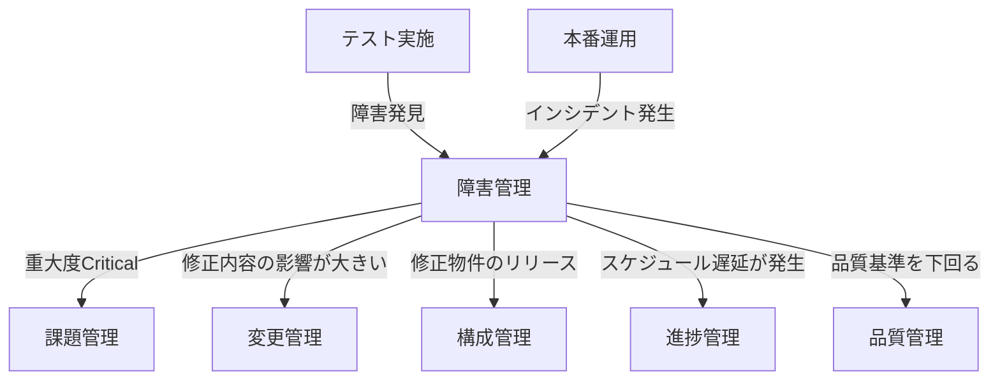
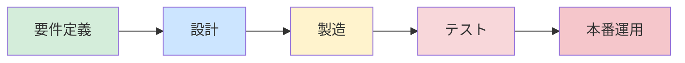
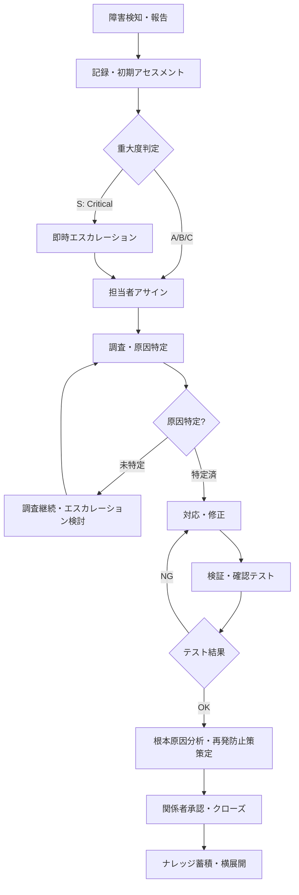
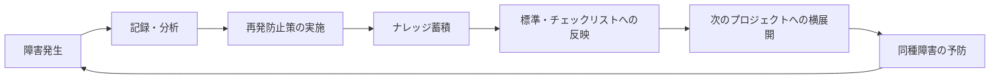
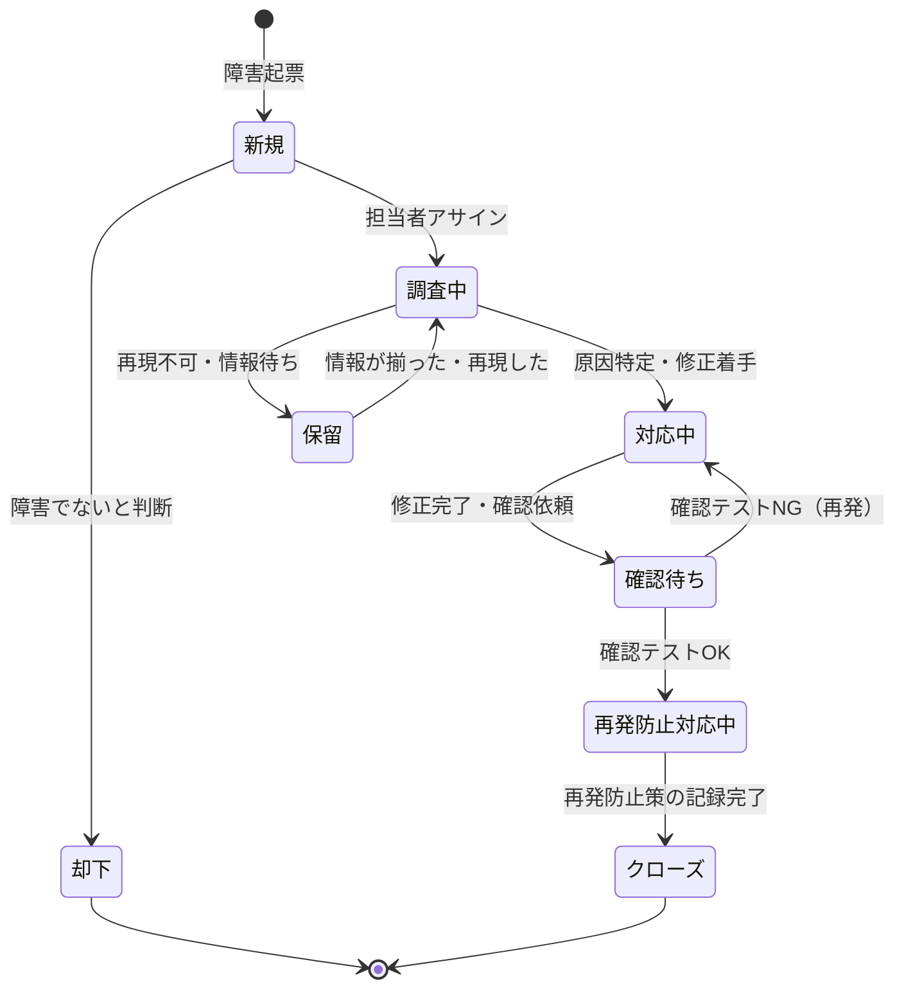

# プロジェクト障害マネジメント 実践ガイドライン


## 目次

- [1. はじめに：障害管理の本質](#1-はじめに障害管理の本質)
  - [1.1 障害管理の目的と位置づけ](#11-障害管理の目的と位置づけ)
  - [1.2 障害管理が持つ3つの本質的価値](#12-障害管理が持つ3つの本質的価値)
  - [1.3 他の管理プロセスとの関係](#13-他の管理プロセスとの関係)
  - [1.4 障害管理が機能しないプロジェクトの典型パターン](#14-障害管理が機能しないプロジェクトの典型パターン)
- [2. 障害の定義と分類](#2-障害の定義と分類)
  - [2.1 「障害」とは何か：厳密な定義](#21-障害とは何か厳密な定義)
  - [2.2 重大度ランクの定義](#22-重大度ランクの定義)
  - [2.3 障害の種類・発生源による分類](#23-障害の種類発生源による分類)
  - [2.4 発生フェーズによる分類と意味合い](#24-発生フェーズによる分類と意味合い)
- [3. 障害管理のライフサイクル](#3-障害管理のライフサイクル)
  - [3.1 全体フロー](#31-全体フロー)
  - [3.2 ステップ1：検知・報告](#32-ステップ1検知報告)
  - [3.3 ステップ2：記録・初期アセスメント](#33-ステップ2記録初期アセスメント)
  - [3.4 ステップ3：調査・原因特定](#34-ステップ3調査原因特定)
  - [3.5 ステップ4：対応・修正](#35-ステップ4対応修正)
  - [3.6 ステップ5：検証・確認テスト](#36-ステップ5検証確認テスト)
  - [3.7 ステップ6：再発防止策の策定・クローズ](#37-ステップ6再発防止策の策定クローズ)
- [4. 障害分析の手法](#4-障害分析の手法)
  - [4.1 なぜ根本原因分析（RCA）が重要か](#41-なぜ根本原因分析rcaが重要か)
  - [4.2 5Why分析（なぜなぜ分析）](#42-5why分析なぜなぜ分析)
  - [4.3 特性要因図（フィッシュボーン分析）](#43-特性要因図フィッシュボーン分析)
  - [4.4 根本原因の分類フレームワーク（4M+1E）](#44-根本原因の分類フレームワーク4m1e)
  - [4.5 ポストモーテム（事後検証会）の実施](#45-ポストモーテム事後検証会の実施)
- [5. 再発防止の実践](#5-再発防止の実践)
  - [5.1 再発防止の考え方：「人を責めず、仕組みを直す」](#51-再発防止の考え方人を責めず仕組みを直す)
  - [5.2 再発防止策の種類と有効性の序列](#52-再発防止策の種類と有効性の序列)
  - [5.3 再発防止策の実施・追跡](#53-再発防止策の実施追跡)
  - [5.4 組織学習への転換：ナレッジ蓄積のサイクル](#54-組織学習への転換ナレッジ蓄積のサイクル)
- [6. Redmineによる障害チケット管理](#6-redmineによる障害チケット管理)
  - [6.1 障害チケットの設計方針](#61-障害チケットの設計方針)
  - [6.2 チケット項目の定義](#62-チケット項目の定義)
  - [6.3 ステータス遷移](#63-ステータス遷移)
  - [6.4 重大度ランクに応じた運用ルール](#64-重大度ランクに応じた運用ルール)
  - [6.5 週次・月次の運用サイクル](#65-週次月次の運用サイクル)
  - [6.6 カスタムクエリの活用](#66-カスタムクエリの活用)
- [7. 障害対応における役割と責任](#7-障害対応における役割と責任)
  - [7.1 役割定義（RACIマトリクス）](#71-役割定義raciマトリクス)
  - [7.2 エスカレーション・プロトコル](#72-エスカレーションプロトコル)
  - [7.3 顧客・ステークホルダーへの報告](#73-顧客ステークホルダーへの報告)
- [8. 障害管理のメトリクス（KPI）](#8-障害管理のメトリクスkpi)
  - [8.1 測定すべき指標](#81-測定すべき指標)
  - [8.2 障害レポートの作成・活用](#82-障害レポートの作成活用)
- [9. よくある失敗パターンと対策](#9-よくある失敗パターンと対策)
- [付録A: 障害チケット起票チェックリスト](#付録a-障害チケット起票チェックリスト)
- [付録B: 根本原因分析ワークシート（5Why）](#付録b-根本原因分析ワークシート5why)
- [付録C: Redmineカスタムクエリ例](#付録c-redmineカスタムクエリ例)
- [付録D: 用語集](#付録d-用語集)

---

## 1. はじめに：障害管理の本質

### 1.1 障害管理の目的と位置づけ

障害管理とは、システム開発・保守プロジェクトにおいて発生するあらゆる障害（バグ、不具合、システム停止、データ誤り等）を**体系的に記録・調査・対応し、根本原因を究明して再発を防止するためのガバナンス活動**である。

単なる「バグ票の管理」と捉えてはならない。障害管理の本質は以下の2点にある。

1. **プロジェクトへの影響を最小化する**：障害の早期検知・迅速な対応により、品質・スケジュール・コストへの波及を抑制する
2. **組織の技術力・プロセス品質を向上させる**：障害から学び、同じ失敗を繰り返さない仕組みを構築する

> [!NOTE]
> 障害管理は「守り」の活動ではなく「攻め」の活動である。障害をゼロにすることが目的ではなく、障害から何を学んでチームとシステムを強くするか、という視点で運用することが重要である。

### 1.2 障害管理が持つ3つの本質的価値

| 価値 | 説明 | 具体的な効果 |
| :--- | :--- | :--- |
| **品質の可視化** | 障害データを定量的に把握することで、システムの品質状況を客観的に評価できる | バグ密度・修正完了率・再発率などのKPIによる品質トレンドの把握 |
| **リスクの制御** | 重大度に応じた優先順位付けにより、プロジェクトへの致命的影響を未然に防ぐ | Critical障害の早期検知・エスカレーションによる手戻りコスト削減 |
| **組織学習の促進** | 根本原因分析と再発防止策の蓄積により、チーム・組織の技術力を継続的に向上させる | ナレッジベース化による類似障害の予防、新人教育への活用 |

### 1.3 他の管理プロセスとの関係

障害管理は独立したプロセスではなく、他の管理プロセスと密接に連動する。



| 連動先管理プロセス | 連動するタイミング | 対応 |
| :--- | :--- | :--- |
| **課題管理** | Critical障害がプロジェクト目標達成を阻害するとき | 課題チケットを別途起票し、障害チケットからリンク |
| **変更管理** | 障害修正がシステム設計・仕様の変更を伴うとき | 変更要求（CR）を起票し、変更審議を経て対応 |
| **構成管理** | 障害修正物件をリリースするとき | リリース管理チケットと関連付け、バージョンを記録 |
| **進捗管理** | 障害対応工数がスケジュールに影響するとき | EVM・バーンダウンチャートに反映し、計画を見直し |

### 1.4 障害管理が機能しないプロジェクトの典型パターン

以下のような状態に陥っているプロジェクトは、障害管理が形骸化している。

> [!WARNING]
> **「直したら終わり」症候群**：障害を修正して動けばOKという文化。原因分析も再発防止策も記録されず、同じ障害が繰り返し発生する。テスト工程の末期で突然バグが多発するのはこれが原因のことが多い。

> [!WARNING]
> **重大度のインフレ**：担当者が焦っていると全部「Critical」にしてしまう。重大度基準が曖昧なままだと、本当に重要な障害が埋もれて優先度付けが機能しない。

> [!WARNING]
> **チケットの放置と幽霊チケット**：「調査中」のまま数週間動かないチケット、担当者不在のチケット、クローズ条件が曖昧なまま放置されたチケット。未対応チケットが積み上がり品質状況を正確に把握できなくなる。

> [!WARNING]
> **報告のための記録**：チケットに「対応済み」とだけ書いて何をしたかの記録がない。後から追跡しようとしても何も分からず、根本原因分析が不可能になる。

---

## 2. 障害の定義と分類

### 2.1 「障害」とは何か：厳密な定義

プロジェクトにおける「障害」を以下のように定義する。

| 用語 | 定義 | 例 |
| :--- | :--- | :--- |
| **障害（Defect / Bug）** | 仕様・設計・ユーザー要件に対して、システムが期待通りに動作しない状態 | 画面表示崩れ、計算結果の誤り、機能が動かない |
| **インシデント（Incident）** | 本番稼働中のシステムで発生したサービス停止・性能劣化・セキュリティ異常 | サーバーダウン、応答遅延、不正アクセス |
| **不具合（Malfunction）** | テスト工程で発見した仕様との差異（障害の開発工程版） | 単体テスト・結合テストでのNG |

> [!NOTE]
> 本ガイドラインでは、開発工程での「不具合」と本番運用での「インシデント」を包括する概念として**「障害」**を用いる。管理の枠組みは共通であり、発生フェーズによって対応の優先度と報告先が異なる。

### 2.2 重大度ランクの定義

障害の対応優先度を決める最重要分類。業務影響の大きさで判定する。

| ランク | 名称 | 定義 | 具体例 | 目標対応時間 |
| :--- | :--- | :--- | :--- | :--- |
| **S（Critical）** | 致命的 | 業務が完全停止、または重大なデータ損傷・セキュリティ侵害が発生している | 本番DB全損、決済機能停止、個人情報漏洩 | **即時（検知後1時間以内に着手）** |
| **A（High）** | 重大 | 主要機能が使用不能で業務に深刻な影響があるが、回避策が存在する | 主要帳票が出力不能、一部ユーザーがログイン不可 | **当日中（4時間以内）** |
| **B（Medium）** | 中程度 | 機能は使用できるが正常ではない。業務への影響は限定的 | 一部画面の表示崩れ、特定条件下のみ発生するエラー | **3営業日以内** |
| **C（Low）** | 軽微 | 業務影響はほぼなし。UI/UX上の改善レベル | 誤字・表記揺れ、操作性の軽微な不具合 | **次期リリースまで** |

> [!TIP]
> **重大度判定の原則**：「誰が困るか」「業務はどの程度止まるか」で判定する。技術的な複雑さや修正工数は重大度とは無関係。難しい障害でも業務影響が軽微であればB/Cランク。逆に単純な修正でも業務停止を招くならSランク。

> [!WARNING]
> 開発チームが「自分たちで直せる」かどうかで重大度を決めてはいけない。重大度はあくまでも**ユーザー・業務への影響度**で判定する。開発上の難易度や工数は「優先度」フィールドで管理する。

### 2.3 障害の種類・発生源による分類

#### 2.3.1 障害種別

| 種別 | 説明 | 特徴的な調査観点 |
| :--- | :--- | :--- |
| **機能障害** | 機能が仕様通り動作しない | 要件定義書・設計書との差異確認 |
| **性能障害** | 応答時間・スループットが基準を下回る | 負荷テスト結果・ボトルネック箇所の特定 |
| **データ障害** | データが欠損・重複・不整合を起こしている | DB整合性チェック・トランザクション処理の確認 |
| **セキュリティ障害** | 不正アクセス・認証不備・情報漏洩 | セキュリティ要件・脆弱性診断結果との照合 |
| **UI/UX障害** | 画面表示・レイアウトが意図と異なる | デザイン仕様・ブラウザ互換性の確認 |
| **環境障害** | インフラ・OS・ミドルウェアに起因する問題 | ログ分析・環境差分の確認 |
| **連携障害** | 外部システム・APIとの接続・データ連携の不具合 | I/F仕様書・通信ログの確認 |

#### 2.3.2 根本的な発生源による分類（後の分析に活用）

| 発生源 | 説明 | 再発防止の方向性 |
| :--- | :--- | :--- |
| **要件不備** | 要件が曖昧・不完全で実装に誤りが生じた | 要件レビューの強化・確認事項のチェックリスト化 |
| **設計不良** | 設計段階での誤り・考慮漏れ | 設計レビューの観点追加・設計パターンの標準化 |
| **実装ミス** | コーディングの誤り・ロジックミス | コードレビューの強化・静的解析ツールの導入 |
| **テスト不足** | テストケースの網羅性不足・テスト環境の不備 | テスト設計の見直し・境界値・例外ケースの強化 |
| **環境問題** | 本番と開発環境の差異・インフラ設定の誤り | 環境差分管理の徹底・IaC（Infrastructure as Code）の導入 |
| **外部要因** | 外部APIの仕様変更・インフラベンダーの障害 | 依存関係のモニタリング・フォールバック設計 |

### 2.4 発生フェーズによる分類と意味合い

同じ障害でも、どのフェーズで発見されたかによって**修正コストと意味合い**が大きく異なる。



| 発見フェーズ | 修正コスト比 | 意味合い | PMとして着目すべき点 |
| :--- | :--- | :--- | :--- |
| 要件定義 | ×1 | 最も早期で影響最小 | 積極的なレビューで発見できている証拠 |
| 設計 | ×3〜5 | 設計の考慮漏れが多い | 設計レビューの質を問う指標 |
| 製造 | ×10 | 実装力・理解度の問題 | コーディング標準・コードレビューの効果を確認 |
| テスト（単体・結合） | ×30〜50 | テストで発見できたが工程遅延リスク | バグ密度が品質基準内か確認 |
| 本番運用 | ×100〜200 | 最悪のシナリオ | 顧客信頼への影響を最優先で対処 |

> [!TIP]
> **「バグは早く見つけるほど安い」**という原則（シフトレフト）を障害管理データで証明できる。発見フェーズを記録しておくと、「製造フェーズでの発見が多い＝コードレビュー強化が必要」というアクションに直結する。

---

## 3. 障害管理のライフサイクル

### 3.1 全体フロー



### 3.2 ステップ1：検知・報告

#### 3.2.1 障害発見のチャネル

| 検知チャネル | 説明 | 対応速度の目安 |
| :--- | :--- | :--- |
| **テスト実施中** | テスト担当者が手動・自動テストで発見 | 当日中に起票 |
| **コードレビュー** | レビュー時に潜在的な不具合を発見 | 当日中に起票 |
| **ユーザー報告** | ユーザー受入テスト（UAT）・本番での報告 | 即時対応 |
| **監視システム** | APM・ログ監視・死活監視からのアラート | 自動通知後即時確認 |
| **定例会議** | 週次進捗会議での口頭報告 | 会議中に起票 |

> [!TIP]
> **テスト担当者が「後でまとめて起票する」は危険**。メモに留めているうちに詳細を忘れ、再現手順が不明確になる。発見した瞬間に最低限のタイトルと再現手順だけでも記録する運用にする。Redmineはモバイルからでも起票可能。

#### 3.2.2 良い障害報告の書き方

**NG例**:
- 「ログインできない」
- 「エラーが出る」
- 「画面がおかしい」

**OK例**（以下の4要素を含む）:
1. **事象**：何が起きているか（事実のみ）
2. **再現手順**：どうすれば再現するか（環境・操作手順・データ条件）
3. **期待値**：本来どうなるべきか（仕様・設計書の根拠）
4. **実際の結果**：実際にどうなったか（エラーメッセージ・スクリーンショット）

```
【OK例】
事象: ログイン画面でパスワード欄に半角英数字以外（全角・記号）を入力した場合、
      バリデーションエラーが表示されず、そのまま認証処理が走ってサーバーエラーになる。

再現手順:
  1. ログイン画面を開く（URL: /login）
  2. ユーザーIDに有効なIDを入力
  3. パスワードに全角文字「ａｂｃ」を入力
  4. ログインボタンをクリック

期待値: 入力チェックエラーが表示される（設計書 4-2-1 参照）
実際の結果: 500エラー画面が表示される（スクリーンショット添付）
発生環境: 結合テスト環境 / Chrome 120 / Windows 11
```

### 3.3 ステップ2：記録・初期アセスメント

起票された障害チケットに対して、**PMまたはPL**が以下を確認・判定する。

| 確認項目 | 内容 |
| :--- | :--- |
| 重大度の判定 | ユーザー・業務への影響を基準に S/A/B/C を決定 |
| 担当者のアサイン | 原因調査・修正の担当者を明確にする |
| 対応期限の設定 | 重大度ランクの目標対応時間を参考に設定 |
| 重複チェック | 既存チケットとの重複がないか確認 |
| 関連チケットのリンク | 関連する課題・変更・リリースチケットをリンク |

> [!WARNING]
> **「とりあえず担当者に任せる」は禁止**。起票直後に担当者不明・期限未設定のままにすると確実に放置される。初期アセスメントは起票後24時間以内に完了させる。

### 3.4 ステップ3：調査・原因特定

#### 3.4.1 調査の進め方

障害調査は仮説検証のプロセスである。むやみにコードを変更するのではなく、以下の順序で進める。

1. **事象の再現確認**：報告された手順で同じ事象が再現するか確認。再現しない場合は環境・データ・手順を詳細に確認
2. **影響範囲の特定**：同一の問題が他の機能・他のユーザーに影響していないか確認
3. **ログ・トレースの分析**：アプリケーションログ・DBログ・インフラログを時系列で追跡
4. **仮説の立案と検証**：「〇〇が原因ではないか」という仮説を立て、テストデータや設定変更で検証
5. **根本原因の特定**：直接原因（表面上の問題）だけでなく、なぜその状態が生まれたか（根本原因）まで追う

> [!TIP]
> 調査中は**チケットに調査ログを随時記録**する。「〇〇を確認したが問題なし」「〇〇のログにエラーが見つかった」という記録が、引き継ぎ時やエスカレーション時に極めて重要になる。

#### 3.4.2 調査が行き詰まった時のアクション

| 状況 | 取るべきアクション |
| :--- | :--- |
| 再現しない | 環境・OS・ブラウザ・データを変えて試す。「再現不可」として一時保留し、再発時に再調査 |
| 原因特定に時間がかかる | 暫定対応（ワークアラウンド）を先に実施してユーザー影響を軽減し、根本原因調査を並行して継続 |
| 技術的に解決困難 | PLまたは技術リーダーにエスカレーション。外部ベンダー・有識者に相談 |
| 影響範囲が広い | PMに報告し、課題チケットとして別途管理。ステークホルダーへの説明も視野に |

### 3.5 ステップ4：対応・修正

#### 3.5.1 対応の種類

| 対応種別 | 説明 | 使い分け |
| :--- | :--- | :--- |
| **恒久対応** | 根本原因を解消する正式な修正 | 原則これを目指す |
| **暫定対応（ワークアラウンド）** | 根本原因は残るが、ユーザー影響を回避するための一時策 | S/Aランク障害で早期リリースが必要な時に先行実施 |
| **受容** | 修正コストが影響より大きい・修正リスクが高い場合に現状を受け入れる | Cランク・次期バージョンで対応、等の合意が前提 |

> [!WARNING]
> **暫定対応を「対応完了」としてチケットをクローズしてはならない**。「暫定対応済み（恒久対応：〇月〇日リリース予定）」のように明記し、恒久対応が完了するまでチケットを開け続ける。暫定対応のまま忘れられた技術的負債が積み上がるのが最大の失敗パターン。

#### 3.5.2 修正時の注意事項

- **変更の影響範囲を必ず確認**：障害修正が他の機能に副作用を与えていないか、デグレード確認を行う
- **修正内容をチケットに記録**：「何を・なぜ・どのように変えたか」を残す。コミットIDやファイル名も記載
- **変更管理との連携**：修正内容が設計変更を伴う場合は変更管理プロセスに従う

### 3.6 ステップ5：検証・確認テスト

修正後は、以下を確認してからクローズに進む。

| 確認項目 | 内容 |
| :--- | :--- |
| **修正確認テスト** | 報告された事象が解消されたか、同じ手順で再現しないことを確認 |
| **デグレード確認** | 修正箇所に関連する機能が正常に動作することを確認 |
| **影響範囲テスト** | 同一の原因から派生する可能性がある箇所を重点確認 |
| **環境確認** | 修正が適用される全ての環境（ステージング・本番）で確認 |

> [!TIP]
> 確認テストは**起票者または第三者**が実施する。修正した担当者が自分で「修正OK」と確認するのは客観性に欠ける。特にA/Sランク障害は、PM・PLが最終確認することを運用ルールにする。

### 3.7 ステップ6：再発防止策の策定・クローズ

確認テストOK後、そのままクローズするのではなく、**根本原因分析と再発防止策の策定**をセットで行う。

- **B/Cランク**：チケット内に根本原因と再発防止策を記載してクローズ
- **A/Sランク**：ポストモーテム（事後検証会）を開催し、レポートを作成してチケットにリンク

> [!TIP]
> クローズ前に「この障害から次のプロジェクトで何を変えるか」を必ず一言記録する。この一言が半年後・次のプロジェクトで価値を発揮する。「対応済み」だけで終わらせない文化を作ることが障害管理の真の目的。

---

## 4. 障害分析の手法

### 4.1 なぜ根本原因分析（RCA）が重要か

障害は**直接原因（Symptom）** と**根本原因（Root Cause）** の2層構造を持つ。

```
直接原因（表面の事象）：「ログインボタンをクリックすると500エラーになる」
  ↓ なぜ？
一次原因：「入力値のバリデーションが実装されていなかった」
  ↓ なぜ？
二次原因：「設計書にバリデーション仕様が記載されていなかった」
  ↓ なぜ？
根本原因：「要件定義段階でセキュリティ要件のレビューが行われていなかった」
```

直接原因だけを修正すると、似たような障害が別の箇所で再発する。根本原因を特定して対策することで、**同種の障害を組織全体で予防**できる。

| 分析レベル | 対策の効果 |
| :--- | :--- |
| 直接原因のみ対策 | この箇所の再発は防げるが、類似箇所には無力 |
| 一次原因まで対策 | 同じ実装パターンでの再発は防げる |
| 根本原因まで対策 | プロセス・文化レベルの改善により組織全体で予防できる |

### 4.2 5Why分析（なぜなぜ分析）

最もシンプルで実践的な根本原因分析手法。「なぜ？」を繰り返し問いかけることで根本原因に到達する。

**実施手順**:

1. 問題の事実を一文で明確に定義する
2. 「なぜそれが起きたか」を問い、答えを記録する
3. 答えに対して再度「なぜ？」を問う
4. これを5回程度繰り返す（3〜7回が目安）
5. 「これ以上なぜと問えない」または「対策可能な原因」に到達したら停止

**実施例**:

| Why | 問い | 答え |
| :--- | :--- | :--- |
| Why 1 | なぜログイン時に500エラーになるのか？ | 入力値のバリデーションがなく、不正な文字がDBクエリに渡るため |
| Why 2 | なぜバリデーションが実装されていないのか？ | 設計書にバリデーション仕様が書かれていなかったため |
| Why 3 | なぜ設計書にバリデーション仕様がないのか？ | セキュリティ要件を設計に落とし込むプロセスがなかったため |
| Why 4 | なぜセキュリティ要件を設計に落とす仕組みがないのか？ | 設計レビューにセキュリティ観点のチェックリストが存在しないため |
| Why 5 | なぜセキュリティ観点のチェックリストがないのか？ | **根本原因**：プロジェクト開始時にセキュリティ設計標準が定義されていなかった |

**根本原因に基づく対策**:
- セキュリティ設計チェックリストを作成し、設計レビューに組み込む（プロセス改善）
- 既存の設計書全体をバリデーション観点でレビューし直す（横展開）

> [!WARNING]
> **5Whyの落とし穴**：「人が悪い・注意不足」で止まってはいけない。「なぜその人がミスをしやすい状況になっていたのか」まで掘り下げることで、プロセスや仕組みの問題が見えてくる。人を責める分析は再発防止に繋がらない。

### 4.3 特性要因図（フィッシュボーン分析）

複数の要因が絡み合う複雑な障害に有効。問題（魚の頭）に対して、原因となる要素（骨）を4M+1Eの観点で洗い出す。

```
                    ┌─────────────────────────────────────┐
                    │         特性要因図（概念図）          │
                    └─────────────────────────────────────┘

   Man（人）           Machine（機械・環境）
      │                        │
      ├── スキル不足            ├── 開発環境の不備
      ├── 確認不足              ├── テストツールの問題
      │                        │
      └───────────┬────────────┘
                  │
   Method（方法）  ─────── ★ 障害（問題）
                  │
      ┌───────────┴────────────┐
      │                        │
      ├── 設計プロセスの欠陥    ├── 仕様書の品質不良
      ├── レビュープロセス不備  │
   Method（方法）        Material（成果物・情報）
```

**4M+1Eの観点**:

| 観点 | 内容 | プロジェクトにおける例 |
| :--- | :--- | :--- |
| **Man（人）** | 担当者のスキル・経験・知識・コミュニケーション | スキル不足、担当者変更による引き継ぎ不備 |
| **Machine（機械）** | 開発環境・ツール・インフラ・ハードウェア | 環境差異、ツールのバグ、インフラ設定誤り |
| **Method（方法）** | プロセス・手順・ルール・レビュー方法 | レビュー不足、テスト設計の甘さ、手順の欠落 |
| **Material（材料）** | 設計書・仕様書・テストケース・データ | 仕様の曖昧さ、ドキュメントの不備、テストデータ不足 |
| **Environment（環境）** | 作業環境・スケジュール・組織文化 | 工期の逼迫、コミュニケーション不全、横断的な問題 |

### 4.4 根本原因の分類フレームワーク（4M+1E）

障害の根本原因を以下のカテゴリで分類し、Redmineチケットに記録する。蓄積されたデータが傾向分析に活用できる。

| 根本原因カテゴリ | 定義 | 主な再発防止の方向性 |
| :--- | :--- | :--- |
| **要件・仕様不備** | 要件定義・仕様書が不明確・不完全だった | 要件レビュー強化、要件確認チェックリスト |
| **設計不良** | 設計段階での誤り・考慮漏れ | 設計レビュー観点の追加、設計パターン標準化 |
| **実装ミス** | コーディングの誤り・ロジックバグ | コードレビュー強化、静的解析ツール導入 |
| **テスト不足** | テストケースの網羅性不足・テスト実施漏れ | テスト設計の見直し、テストカバレッジ計測 |
| **環境・設定問題** | 開発/本番環境の差異・インフラ設定誤り | 環境差分管理、IaC、デプロイ自動化 |
| **外部要因** | 外部システム・ライブラリ・インフラ起因 | 依存関係モニタリング、フォールバック設計 |
| **コミュニケーション不全** | 情報共有・認識齟齬・引き継ぎ不備 | ドキュメント整備、定例での確認強化 |

### 4.5 ポストモーテム（事後検証会）の実施

S/Aランクの重大障害が発生した際は、修正・クローズ後に**ポストモーテム（事後検証会）**を開催する。

#### 4.5.1 ポストモーテムの原則

> [!TIP]
> ポストモーテムは**「誰が悪いか」を追及する場ではなく、「何が悪かったか」を分析する場**である。Blame-Free（責任追及なし）の文化を明示的に宣言して開催する。人を特定して責めることは学びを阻害し、次回から問題の隠蔽に繋がる。

#### 4.5.2 ポストモーテムのアジェンダ

| 項目 | 内容 | 時間目安 |
| :--- | :--- | :--- |
| 事象の確認 | 何が起きたか・タイムラインの共有 | 10分 |
| 影響の整理 | ユーザー・業務・スケジュール・コストへの影響 | 10分 |
| 根本原因分析 | 5Whyまたはフィッシュボーンを使い原因を深掘り | 20分 |
| 再発防止策の議論 | 具体的な対策・担当者・期限を決める | 20分 |
| アクションプランの確認 | 決定した対策をチケット化して全員で確認 | 10分 |

#### 4.5.3 ポストモーテムレポートの構成

```markdown
# ポストモーテムレポート

## 概要
- 障害名：
- 発生日時：
- 検知方法：
- 解決日時：
- 影響範囲：

## タイムライン（時系列）
| 時刻 | 出来事 |
| :--- | :--- |
| XX:XX | 最初の異常検知 |
| XX:XX | 担当者への連絡 |
| ... | ... |

## 根本原因
（5Why分析の結果を記載）

## 影響の評価
- ユーザー影響：
- ビジネス影響：
- スケジュール影響：

## 再発防止策
| アクション | 担当者 | 期限 | Redmineチケット |
| :--- | :--- | :--- | :--- |

## 今回学んだこと（KPT形式）
- Keep（良かった点）：
- Problem（問題点）：
- Try（次回試すこと）：
```

---

## 5. 再発防止の実践

### 5.1 再発防止の考え方：「人を責めず、仕組みを直す」

障害再発防止の本質は、**個人の注意力に頼るのをやめ、仕組みで防ぐ**ことである。

| アプローチ | 例 | 持続性 |
| :--- | :--- | :--- |
| **人に頼る（悪い例）** | 「今後は気をつけてください」「チェックリストを読んでください」 | 低い（属人的・忘れる） |
| **仕組みに頼る（良い例）** | レビューフローにチェック項目を追加する・CIで自動チェックを走らせる | 高い（自動・強制） |

> [!TIP]
> 再発防止策を検討する時は「この対策は、担当者が忘れても自動的に機能するか？」を問う。機能しないなら、もう一段、仕組みレベルに落とし込む。

### 5.2 再発防止策の種類と有効性の序列

有効性が高い順に並べると以下の通り。上位の対策を優先的に採用する。

| 有効性 | 対策種別 | 例 |
| :---: | :--- | :--- |
| 高 | **排除**（そもそも発生しない設計） | 危険な操作そのものをUIで不可能にする |
| ↑ | **自動検出**（自動で検知・防止） | 静的解析・CI/CDパイプラインでの自動チェック |
| ↑ | **プロセス改善**（手順・ルールを変える） | レビューチェックリストの追加・必須化 |
| ↑ | **教育・訓練**（知識・スキルを高める） | 勉強会・コーディング規約の周知 |
| 低 | **注意喚起**（意識を高める） | 「次は気をつけましょう」 |

### 5.3 再発防止策の実施・追跡

再発防止策はRedmineチケットに必ず記録し、実施完了まで追跡する。

| 管理項目 | 内容 |
| :--- | :--- |
| 対策内容 | 何をするか（具体的に） |
| 担当者 | 誰が実施するか |
| 期限 | いつまでに完了させるか |
| チケット番号 | 実施作業のRedmineチケット番号 |
| 完了確認方法 | どうやって効果を確認するか |

> [!WARNING]
> **再発防止策を「TODO」のまま放置しない**。障害チケットをクローズしたら対策も終わり、と思われがちだが、再発防止策チケットが別途オープンになっていることを定例で確認し続ける。「再発防止策 未完了」のRedmineカスタムクエリを作り、毎週確認するのが効果的。

### 5.4 組織学習への転換：ナレッジ蓄積のサイクル

障害管理データを蓄積し、プロジェクト・組織全体の学びに変えるサイクルを構築する。



**ナレッジ蓄積の実践**:

1. **障害データの定期集計**：月次で根本原因カテゴリ別の件数を集計し、傾向を把握する
2. **チェックリストへの反映**：新しい種類の障害が発生したら、レビュー・テストのチェックリストに追加する
3. **横展開の実施**：重大障害の再発防止策は他チーム・他プロジェクトにも共有する
4. **振り返りへの活用**：スプリントレトロスペクティブやフェーズ完了時の振り返りで障害データを活用する

---

## 6. Redmineによる障害チケット管理

### 6.1 障害チケットの設計方針

障害チケットは**タスクトラッカー（進捗管理）・課題トラッカーとは別の「障害トラッカー」**として独立させる。

| 方針 | 理由 |
| :--- | :--- |
| トラッカーを分離する | 障害特有のステータス遷移・カスタムフィールドを持たせるため |
| 1チケット = 1障害 | 複数の障害をまとめると追跡・分析が困難になるため |
| クローズ条件を明確にする | 「対応済み」「確認OK」「再発防止策の記録あり」の3つが揃ってクローズ |
| 根本原因を必ず記録する | 傾向分析・ナレッジ蓄積のため |

### 6.2 チケット項目の定義

#### 6.2.1 標準フィールド

| フィールド | 用途 | 運用ルール |
| :--- | :--- | :--- |
| **タイトル** | 障害の内容を一行で表現 | `[画面名/機能名] 事象の概要`の形式 |
| **担当者** | 現在の対応責任者 | ステータス変更時に担当者も更新する |
| **優先度** | 対応の緊急度 | 即急 / 高め / 通常 / 低め |
| **開始日** | 対応着手日 | 担当アサイン時に設定 |
| **期日** | 対応完了期限 | 重大度ランクの目標時間を基準に設定 |
| **説明** | 再現手順・期待値・実際の結果・添付資料 | 起票時に必須 |

#### 6.2.2 カスタムフィールド（推奨）

| カスタムフィールド | 型 | 選択肢 | 用途 |
| :--- | :--- | :--- | :--- |
| **重大度（Severity）** | リスト | 重大 / 高 / 中 / 低 | ユーザー・業務への影響度 |
| **障害種別** | リスト | 機能障害 / 性能障害 / データ障害 / セキュリティ障害 / UI障害 / 連携障害 / 環境障害 | 傾向分析に活用 |
| **発生環境** | リスト | 本番 / ステージング / 結合テスト / 単体テスト | フェーズ別の品質把握 |
| **発生フェーズ** | リスト | 要件定義 / 基本設計 / 詳細設計 / 製造 / 結合テスト / UAT / 本番運用 | 発見コスト分析に活用 |
| **根本原因カテゴリ** | リスト | 要件・仕様不備 / 設計不良 / 実装ミス / テスト不足 / 環境・設定問題 / 外部要因 / コミュニケーション不全 | 傾向分析・再発防止に活用 |
| **根本原因（詳細）** | テキスト | （自由記述） | 分析結果の記録 |
| **再発防止策** | テキスト | （自由記述） | 対策内容の記録 |
| **一時対応（ワークアラウンド）** | テキスト | （自由記述） | 暫定対応内容の記録 |
| **確認テスト担当者** | ユーザー | （ユーザー選択） | 修正確認の担当者 |

### 6.3 ステータス遷移



| ステータス | 意味 | 次のアクション |
| :--- | :--- | :--- |
| **新規** | 起票されたが担当者未アサイン | PMがアセスメント・担当者アサイン |
| **調査中** | 担当者が原因調査中 | 調査ログをチケットに随時記録 |
| **保留** | 情報待ち・再現不可で一時停止 | 保留理由と再開条件を記載 |
| **対応中** | 修正作業中 | 修正内容をチケットに記録 |
| **確認待ち** | 修正完了・確認テスト待ち | 確認担当者が確認テストを実施 |
| **再発防止対応中** | 確認OK・再発防止策を記録中 | 根本原因・再発防止策を入力 |
| **クローズ** | 全対応完了 | 再発防止策チケットが別途オープンの場合はリンク確認 |
| **却下** | 障害でないと判断 | 却下理由を必ず記載 |

> [!NOTE]
> 「再発防止対応中」ステータスをわざわざ設けているのは、確認テストOKですぐクローズさせないためである。根本原因と再発防止策の記録が完了してはじめてクローズを許可するフローにする。

### 6.4 重大度ランクに応じた運用ルール

| 重大度 | 起票後の対応 | 報告ルール |
| :--- | :--- | :--- |
| **S（Critical）** | 即時担当者アサイン・PMへの即時報告 | PM→顧客への即時連絡。1時間ごとに状況報告 |
| **A（High）** | 当日中に担当者アサイン・当日PMへ報告 | 日次進捗報告に必ず含める |
| **B（Medium）** | 3営業日以内に担当者アサイン | 週次定例で確認 |
| **C（Low）** | 次のスプリント・リリース計画で対応 | 月次レポートで集計確認 |

### 6.5 週次・月次の運用サイクル

#### 6.5.1 週次サイクル

```
月曜日:
  - 未アサイン障害チケットの確認・担当者アサイン
  - 「調査中」で長期停滞しているチケットの確認

週次定例（週1回）:
  - A/Bランク未対応チケットの状況確認
  - 「保留」チケットの再開判断
  - 新規発生件数・クローズ件数の報告

金曜日:
  - 週次障害サマリーの作成（件数・重大度別・未対応件数）
  - 翌週の対応計画の確認
```

#### 6.5.2 月次サイクル

```
月次:
  - 根本原因カテゴリ別の障害件数集計・傾向分析
  - バグ密度（件数/機能規模）の計算と品質基準との比較
  - 再発防止策の実施状況確認
  - ポストモーテムで決まったアクションの進捗確認
  - 月次障害レポートの作成・報告
```

### 6.6 カスタムクエリの活用

Redmineのカスタムクエリを活用し、状況把握を効率化する。

| クエリ名 | フィルター条件 | 用途 |
| :--- | :--- | :--- |
| **未対応Critical/High障害** | 重大度=Critical or High、ステータス≠クローズ・却下 | 毎朝最初に確認すべき一覧 |
| **担当者未アサイン障害** | 担当者=未設定、ステータス=新規 | アサイン漏れの検出 |
| **長期停滞チケット** | ステータス=調査中・保留、更新日≦7日前 | 放置チケットの発見 |
| **確認待ち一覧** | ステータス=確認待ち | 確認担当者が毎日確認 |
| **今週クローズ予定** | 期日≦今週末、ステータス≠クローズ・却下 | 今週の対応完了目標 |
| **根本原因未記載チケット** | ステータス=クローズ、根本原因カテゴリ=未設定 | データ品質の維持 |
| **再発防止策 未完了** | 再発防止策チケット（サブトラッカー）、ステータス≠クローズ | 再発防止策の追跡 |
| **月次集計用** | 作成日=今月、ステータス=全て | 月次レポート作成に活用 |

> [!TIP]
> **「未対応Critical/High障害」クエリをチームのホーム画面に固定表示**する設定にしておくと、朝イチに誰でも状況を把握できる。Redmineの「マイページ」や「プロジェクト概要」にクエリを追加しておくのが効果的。

---

## 7. 障害対応における役割と責任

### 7.1 役割定義（RACIマトリクス）

| 活動 | PM | PL | 開発リーダー | 開発担当者 | テスト担当者 | PMO |
| :--- | :---: | :---: | :---: | :---: | :---: | :---: |
| 障害起票 | - | - | △ | **R** | **R** | △ |
| 重大度判定・担当者アサイン | **A** | **R** | C | - | - | C |
| 原因調査 | - | C | **A** | **R** | C | - |
| 修正実施 | - | - | **A** | **R** | - | - |
| 確認テスト | - | **A** | C | - | **R** | - |
| S/A障害のエスカレーション | **R** | **A** | C | - | - | C |
| 根本原因分析・記録 | - | **A** | **R** | C | - | C |
| ポストモーテム開催・進行 | **R** | **A** | C | C | C | C |
| 月次障害レポート作成 | **A** | C | - | - | - | **R** |
| 再発防止策の横展開 | **A** | **R** | C | - | - | C |

R: 実施責任 / A: 承認責任 / C: 相談・支援 / △: 任意参加 / -: 関与なし

### 7.2 エスカレーション・プロトコル

#### 7.2.1 エスカレーションの判断基準

以下のいずれかに該当する場合、即座にPMへエスカレーションする。

- **重大度Sランク（Critical）**の障害が発生した
- **重大度Aランク**で4時間以内に原因特定の見込みが立たない
- **障害の影響範囲が当初想定より拡大**している
- **本番環境・顧客データに影響**が及んでいる可能性がある
- 対応に**他部門・外部ベンダーの協力**が必要になった

#### 7.2.2 エスカレーション時の報告フォーマット

```
【障害エスカレーション報告】
チケット番号: #XXXX
重大度: S（Critical）
発生日時: YYYY/MM/DD HH:MM

【事象の概要】
（何が起きているか・誰に影響しているか）

【現在の状況】
（対応状況・調査の進捗）

【業務への影響】
（具体的にどの業務が・どの程度影響を受けているか）

【現在取っている一時対応】
（ワークアラウンドの有無・内容）

【必要な意思決定・支援】
（PMに判断を求めること・リソース追加要請等）

【次回報告予定】
（XX時 / 〇〇が分かり次第）
```

### 7.3 顧客・ステークホルダーへの報告

重大障害発生時の顧客報告は、報告タイミングと内容が信頼に直結する。

| 報告タイミング | 報告内容 | 留意事項 |
| :--- | :--- | :--- |
| **障害検知後（速報）** | 障害発生の事実・影響範囲・現在対応中である旨 | 原因が不明でも「現在調査中」として速報を出す。沈黙が最悪の対応 |
| **対応中（中間報告）** | 調査状況・暫定対応の内容・復旧見込み | 1〜2時間ごとに定期報告。情報がなくても「引き続き調査中」を送る |
| **対応完了（完了報告）** | 復旧完了の事実・根本原因の概要・再発防止策の概要 | 詳細なポストモーテムレポートは後日提出でよい |
| **事後（詳細報告）** | ポストモーテムレポートの提出・再発防止策の実施計画 | 対応完了後5営業日以内を目安 |

> [!WARNING]
> **「原因が分かってから報告しよう」は禁物**。顧客は「原因不明でも何かしている」ことより「何も連絡が来ない」方を不安に感じる。第一報は事実（何が起きているか）だけでよい。推測は書かない。

---

## 8. 障害管理のメトリクス（KPI）

### 8.1 測定すべき指標

障害管理の状態を定量的に把握するための主要指標。

#### 8.1.1 障害検出・解決に関する指標

| 指標 | 定義 | 目安・活用方法 |
| :--- | :--- | :--- |
| **障害件数（バグ密度）** | 期間中の発生件数、規模（FP・KLOC）あたりの件数 | フェーズ完了基準・品質判定の目安 |
| **重大度別件数** | S/A/B/C別の件数・割合 | Sランク比率が高い場合は品質リスクが高い |
| **平均検出時間（MTTD）** | 障害発生から検知までの平均時間 | 監視体制・テストカバレッジの評価 |
| **平均対応時間（MTTR）** | 検知から対応完了までの平均時間 | 対応体制・スキルの評価 |
| **クローズ率** | 全チケット中クローズの割合 | リリース可否判断の一指標 |
| **再発率** | 同一根本原因による再発件数の割合 | 再発防止策の有効性評価 |

#### 8.1.2 品質傾向に関する指標

| 指標 | 定義 | 活用方法 |
| :--- | :--- | :--- |
| **フェーズ別発見率** | 各フェーズで発見された障害の割合 | テスト・レビューの効果測定 |
| **根本原因カテゴリ別件数** | カテゴリ別の発生件数推移 | プロセス改善の優先順位決定 |
| **未対応件数の推移** | 未クローズチケット数の週次推移 | バーンダウン管理・リリース判断 |
| **ポストモーテム実施率** | S/Aランク障害に対するポストモーテム実施割合 | 組織学習の実施状況評価 |

### 8.2 障害レポートの作成・活用

#### 8.2.1 月次障害レポートの構成

```markdown
# 月次障害レポート（YYYY年MM月）

## サマリー
| 項目 | 今月 | 先月 | 累計 |
| :--- | :--- | :--- | :--- |
| 新規発生件数 | XX件 | XX件 | XX件 |
| クローズ件数 | XX件 | XX件 | XX件 |
| 未対応件数（月末時点） | XX件 | XX件 | - |
| Critical障害件数 | XX件 | XX件 | XX件 |

## 重大度別内訳（グラフ）
（S/A/B/C別の件数・割合）

## 根本原因カテゴリ別分析
（カテゴリ別件数・傾向のコメント）

## 今月の主要障害
（A/Sランク障害の概要と対応状況）

## 再発防止策の実施状況
（今月完了した再発防止策・未完了の再発防止策）

## 来月の重点対応
（課題と対策方針）
```

---

## 9. よくある失敗パターンと対策

| 失敗パターン | なぜ起きるか | 対策 |
| :--- | :--- | :--- |
| **「直したら終わり」で分析なし** | 忙しさ・プレッシャーで再発防止まで手が回らない | クローズ条件に「根本原因記録あり」を含める。ステータス「再発防止対応中」を必須化 |
| **重大度の形骸化（全部High）** | 重大度基準が曖昧・担当者が保険をかけている | 判定基準を明文化してチームで合意。「誰が・何の業務が止まるか」で判定する |
| **起票遅延・口頭で終わる** | 手間・記録文化がない | 「発見したらその場でRedmineに起票」を徹底。件名だけでもOKとする |
| **担当者不明・放置チケット** | アサインルールが不明確 | 新規チケットは24時間以内にPMがアセスメント・アサインするルールを設ける |
| **暫定対応でクローズ** | 対応完了プレッシャー・記録の手間 | ワークアラウンド対応はステータス「確認待ち」止まりとし、恒久対応後にのみクローズを許可 |
| **再発防止策が「注意する」で終わる** | 時間がない・手軽な回答で済ませる | 「仕組みで防げるか？」の視点でレビューする。チェックリスト・自動化・ルール化を優先 |
| **同じ障害が繰り返し発生** | 過去の障害が検索・参照されていない | ポストモーテムレポートを検索しやすい場所に保存。類似障害の確認を対応プロセスに組み込む |
| **本番障害の隠蔽** | 責任追及を恐れる文化 | Blame-Free文化の宣言。障害報告を評価する姿勢をPMが示す |

---

## 付録A: 障害チケット起票チェックリスト

起票時に以下を確認する。

**必須項目**
- [ ] タイトルに機能名・事象の概要が含まれている
- [ ] 再現手順が具体的に記載されている（環境・操作・データ条件）
- [ ] 期待値と実際の結果が明記されている
- [ ] 発生環境が記録されている
- [ ] スクリーンショット・エラーログが添付されている（取得可能な場合）
- [ ] 重大度（Severity）が設定されている
- [ ] 障害種別が設定されている

**起票後（24時間以内に担当者が確認）**
- [ ] 担当者がアサインされている
- [ ] 対応期限が設定されている
- [ ] 重複チケットがないことを確認した
- [ ] 関連チケット（課題・変更・リリース）にリンクされている

**クローズ前に確認**
- [ ] 修正内容がチケットに記録されている
- [ ] 確認テストが第三者によって実施された
- [ ] 根本原因カテゴリが設定されている
- [ ] 根本原因（詳細）が記述されている
- [ ] 再発防止策が記述されている（または別チケットへのリンクがある）
- [ ] A/Sランクの場合：ポストモーテムが実施されている

---

## 付録B: 根本原因分析ワークシート（5Why）

```markdown
# 根本原因分析ワークシート

## 対象障害
- チケット番号：
- 障害名：
- 分析実施日：
- 分析担当者：

## 問題の定義
（何が起きたか、事実を一文で明確に記述）

---

## 5Why分析

| ステップ | 問い | 答え |
| :---: | :--- | :--- |
| Why 1 | なぜ [問題] が起きたのか？ | |
| Why 2 | なぜ [Why1の答え] なのか？ | |
| Why 3 | なぜ [Why2の答え] なのか？ | |
| Why 4 | なぜ [Why3の答え] なのか？ | |
| Why 5 | なぜ [Why4の答え] なのか？ | |

## 根本原因の特定
（これ以上掘り下げられない・対策可能な最終的な原因）

**根本原因**：

**根本原因カテゴリ**：
（要件・仕様不備 / 設計不良 / 実装ミス / テスト不足 / 環境・設定問題 / 外部要因 / コミュニケーション不全）

---

## 再発防止策

| # | 対策内容 | 種別 | 担当者 | 期限 | チケット番号 |
| :--- | :--- | :--- | :--- | :--- | :--- |
| 1 | | プロセス改善 / 自動化 / 教育 / 排除 | | | |
| 2 | | | | | |

## 横展開の要否
- [ ] 他チームへの共有が必要（対象：〇〇チーム）
- [ ] チェックリストへの追加が必要
- [ ] 次のプロジェクトへの申し送りが必要
- [ ] 横展開不要
```

---

## 付録C: Redmineカスタムクエリ例

```
# 未対応Critical/High障害
フィルター:
  - トラッカー: 障害
  - 重大度: Critical, High
  - ステータス: !=クローズ, !=却下

表示列: ID / タイトル / 重大度 / 担当者 / 期日 / 更新日
並び順: 重大度（昇順）、期日（昇順）
```

```
# 長期停滞チケット（7日以上更新なし）
フィルター:
  - トラッカー: 障害
  - ステータス: 調査中, 保留
  - 更新日: <= 7日前

表示列: ID / タイトル / 重大度 / 担当者 / ステータス / 更新日
```

```
# 根本原因未記載チケット（データ品質維持）
フィルター:
  - トラッカー: 障害
  - ステータス: クローズ
  - 根本原因カテゴリ: 未設定

表示列: ID / タイトル / クローズ日 / 担当者
並び順: クローズ日（降順）
```

```
# 月次集計用（重大度別・根本原因別）
フィルター:
  - トラッカー: 障害
  - 作成日: 今月

グループ: 根本原因カテゴリ
表示列: ID / タイトル / 重大度 / 障害種別 / 根本原因カテゴリ / ステータス
```

---

## 付録D: 用語集

| 用語 | 説明 |
| :--- | :--- |
| **障害（Defect/Bug）** | システムが仕様・設計・ユーザー要件に対して期待通りに動作しない状態 |
| **インシデント（Incident）** | 本番稼働中のサービス停止・性能劣化・セキュリティ異常等の事象 |
| **重大度（Severity）** | ユーザー・業務への影響の大きさ。S（Critical）/A（High）/B（Medium）/C（Low） |
| **優先度（Priority）** | 対応の緊急度。重大度とは独立した概念 |
| **根本原因（Root Cause）** | 障害を引き起こした最も根本的な原因。直接原因とは区別する |
| **直接原因（Symptom）** | 表面上に現れている障害の直接的な要因 |
| **RCA（Root Cause Analysis）** | 根本原因分析。5Why・フィッシュボーン等の手法が代表的 |
| **MTTD（Mean Time To Detect）** | 平均検知時間。障害発生から検知までの平均時間 |
| **MTTR（Mean Time To Repair）** | 平均修復時間。検知から対応完了までの平均時間 |
| **ワークアラウンド（Workaround）** | 根本原因を修正せずにユーザー影響を回避するための一時的な対策 |
| **ポストモーテム（Post-mortem）** | 重大障害の事後検証会。Blame-Freeな学習の場として実施する |
| **バグ密度** | 機能規模（KLOC・FP等）あたりのバグ件数。品質の定量指標 |
| **シフトレフト（Shift Left）** | テスト・品質確認を開発の早い段階に前倒しすること |
| **Blame-Free** | 障害の責任を個人に帰属させず、プロセス・仕組みの問題として扱うアプローチ |
| **デグレード（Regression）** | 修正によって以前は正常だった機能が壊れること |
