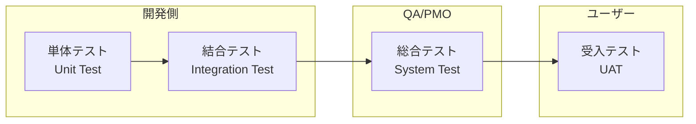
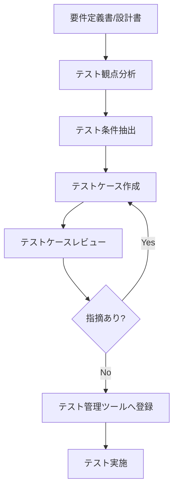
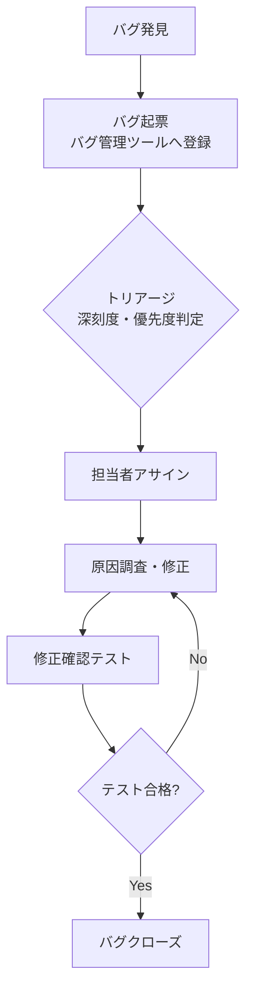
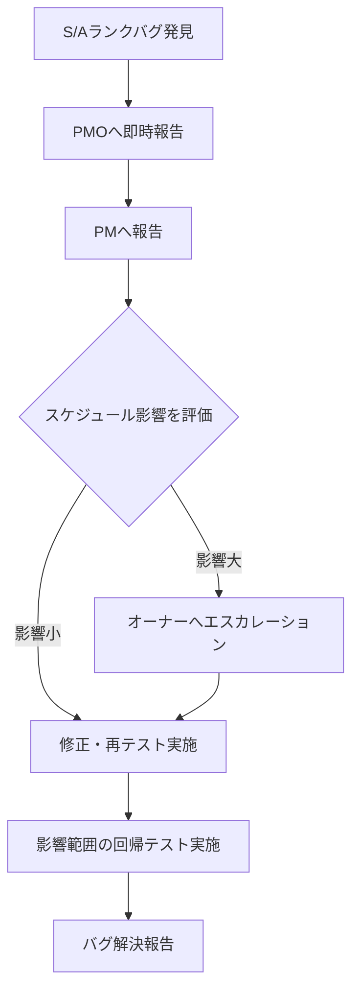

# テスト計画書

| 文書番号 | バージョン | 作成日 | 最終更新日 |
| --- | --- | --- | --- |
| P-TST-001 | 1.0 | 202X/XX/XX | 202X/XX/XX |

---

## 目次

1. [テスト戦略・方針](#1-テスト戦略方針)
2. [テスト種別と実施内容](#2-テスト種別と実施内容)
3. [テスト環境](#3-テスト環境)
4. [テストスケジュール](#4-テストスケジュール)
5. [テスト設計・実施プロセス](#5-テスト設計実施プロセス)
6. [バグ管理](#6-バグ管理)
7. [テスト完了基準](#7-テスト完了基準)
8. [テスト組織・役割](#8-テスト組織役割)
9. [ツール](#9-ツール)
10. [付録](#付録)

---

## 1. テスト戦略・方針

### 1.1 テストの目的

本計画書は、システムが要件・設計を正しく実装し、定めた品質基準を満たしていることを確認するためのテスト活動を計画・管理することを目的とする。

### 1.2 テスト方針

| 方針 | 内容 |
| :--- | :--- |
| **シフトレフト** | 欠陥は早期工程で発見・修正するほどコストが低い。単体テスト・コードレビューを徹底する |
| **リスクベーステスト** | 限られた時間を最大活用するため、リスクの高い機能（重要業務・複雑ロジック）を優先してテストする |
| **自動化優先** | 回帰テストは自動化し、品質を維持しながらリリースサイクルを短縮する |
| **独立性の確保** | 開発者が自身のコードを単体テストし、別担当者が結合・総合テストを実施する |
| **エビデンス取得** | 全テストケースの実施結果とスクリーンショット等のエビデンスを保管する |

### 1.3 テストスコープ

| スコープ | 対象 | 対象外 |
| :--- | :--- | :--- |
| **機能テスト** | システムの全機能 | OS・ミドルウェア・外部パッケージの内部テスト |
| **性能テスト** | 主要業務トランザクション（TPS定義分） | 全機能の性能テスト |
| **セキュリティ** | OWASPトップ10に対応するリスク項目 | 物理セキュリティ |
| **データ移行** | 過去Xヶ月分の本番データ移行 | 対象外データのアーカイブ確認 |
| **環境テスト** | 動作保証ブラウザ・OS | 保証外ブラウザの詳細動作確認 |

---

## 2. テスト種別と実施内容

### 2.1 テスト種別の全体像



### 2.2 単体テスト（Unit Test / UT）

**目的**: 関数・モジュール単位の動作確認。欠陥の早期発見と実装品質の担保。

| 項目 | 内容 |
| :--- | :--- |
| **実施主体** | 開発担当者（自己テスト） |
| **対象** | 全実装モジュール |
| **使用ツール** | JUnit（Java）/ Pytest（Python）/ Jest（JS）等 |
| **カバレッジ目標** | 行カバレッジ80%以上（クリティカル機能：90%以上） |
| **完了基準** | 全テストケースがパスし、カバレッジ目標を達成 |
| **成果物** | 単体テスト仕様書・テスト成績書・カバレッジレポート |

**テスト観点**:
- 正常系（正常な入力値での動作確認）
- 異常系（不正入力・NULL・境界値での動作確認）
- 境界値（最大値・最小値・閾値でのテスト）

### 2.3 結合テスト（Integration Test / IT）

**目的**: モジュール間・機能間の連携動作確認。インターフェース不整合の検出。

| 項目 | 内容 |
| :--- | :--- |
| **実施主体** | PL・開発担当者（別担当者によるクロステスト推奨） |
| **対象** | 機能間・システム間インターフェース |
| **テスト区分** | 機能内結合テスト（FIT）→ 機能間結合テスト（SIT） |
| **完了基準** | テスト実施率100%、S/Aランクバグ0件 |
| **成果物** | 結合テスト仕様書・テスト成績書・バグ管理表 |

**テスト観点**:
- 画面→業務ロジック→DBの一連の処理フロー
- 外部API・外部システムとのインターフェース
- バッチ処理の連携・順序
- データ整合性（複数テーブルにまたがる処理）

### 2.4 総合テスト（System Test / ST）

**目的**: システム全体として要件・非機能要件を満たすかの確認。

| 項目 | 内容 |
| :--- | :--- |
| **実施主体** | PMO・QA担当者（開発チームと独立した担当者） |
| **対象** | システム全体（機能・非機能） |
| **テスト区分** | 機能テスト・性能テスト・セキュリティテスト・回帰テスト |
| **完了基準** | テスト実施率100%、S/Aランクバグ0件、性能目標値達成 |
| **成果物** | 総合テスト仕様書・テスト成績書・性能テストレポート・セキュリティテストレポート |

**テスト種類**:

| テスト種類 | 目的 | 実施タイミング |
| :--- | :--- | :--- |
| 機能テスト | 全機能要件の充足確認 | ST開始〜 |
| 業務シナリオテスト | エンドツーエンドの業務フロー確認 | ST中盤〜 |
| 回帰テスト | バグ修正後に既存機能への影響がないことを確認 | バグ修正後 |
| 性能テスト | 応答時間・スループット・リソース使用率の確認 | ST後半 |
| セキュリティテスト | 脆弱性・認可制御の確認 | ST後半 |
| 移行テスト（リハーサル） | 本番移行手順の検証 | ST完了後 |

### 2.5 受入テスト（User Acceptance Test / UAT）

**目的**: ユーザー視点でシステムが業務要件を満たし、実際に使えることを確認する。

| 項目 | 内容 |
| :--- | :--- |
| **実施主体** | ユーザー部門（業務担当者） |
| **支援** | PMO・開発チームがサポート役として参加 |
| **対象** | 業務シナリオ・ユーザーストーリー |
| **テスト方法** | 実業務に近いシナリオベースのテスト |
| **完了基準** | ユーザーが受入可否を判定・署名 |
| **成果物** | UATシナリオ書・テスト成績書・受入完了報告書 |

**UAT実施の注意事項**:
- テストシナリオはユーザーが実際に行う業務手順を元に作成する
- テスト期間中は開発チームのサポートデスクを設置する
- 重大な不具合が発見された場合の判断プロセスを事前に合意する
- 本番に近いデータを使用する（個人情報は匿名化・マスキング）

### 2.6 非機能テスト

#### 2.6.1 性能テスト

| テスト種類 | 目的 | 測定指標 |
| :--- | :--- | :--- |
| **負荷テスト（Load Test）** | 想定同時接続数での動作確認 | レスポンスタイム・エラーレート |
| **スパイクテスト（Spike Test）** | 急激な負荷上昇への耐性確認 | 応答時間変化・リカバリ時間 |
| **耐久テスト（Soak Test）** | 長時間稼働時のメモリリークなど確認 | メモリ・CPUの推移 |
| **限界テスト（Stress Test）** | システムの限界値・障害点の特定 | 破綻する負荷の閾値 |

**性能目標例**:

| 指標 | 目標値 | 測定条件 |
| :--- | :--- | :--- |
| レスポンスタイム（平均） | 1秒以内 | 通常時（同時50ユーザー） |
| レスポンスタイム（95%ile） | 3秒以内 | 同上 |
| スループット | ○○TPS以上 | ピーク時（同時100ユーザー） |
| エラーレート | 0.1%以下 | 上記条件下 |
| CPU使用率 | ピーク時80%以下 | 上記条件下 |

#### 2.6.2 セキュリティテスト

| テスト項目 | 対象 | テスト方法 |
| :--- | :--- | :--- |
| **認証・認可テスト** | ログイン機能・アクセス制御 | 権限のないリソースへのアクセス試行 |
| **SQLインジェクション** | 入力フォーム・クエリパラメータ | OWASP ZAP / 手動テスト |
| **XSS（クロスサイトスクリプティング）** | 入力フォーム・表示箇所 | OWASP ZAP / 手動テスト |
| **CSRFテスト** | フォーム送信機能 | トークン検証確認 |
| **セッション管理** | セッション有効期限・固定化 | 手動テスト |
| **脆弱性スキャン** | 使用ライブラリ・ミドルウェア | OWASP Dependency-Check / Snyk |

---

## 3. テスト環境

### 3.1 環境構成

| 環境 | 用途 | 管理担当 | 備考 |
| :--- | :--- | :--- | :--- |
| **開発環境（DEV）** | 開発・単体テスト | 開発担当者 | 個人PC or 開発サーバー |
| **結合テスト環境（IT）** | 結合テスト | PL | 本番に近い構成 |
| **総合テスト環境（ST）** | 総合テスト・UAT準備 | PMO | 本番同等構成 |
| **UAT環境** | UAT（受入テスト） | PMO/ユーザー | 本番同等構成 |
| **本番環境（PROD）** | 本番稼働 | 運用担当 | 移行リハーサル後に使用 |

### 3.2 環境管理ルール

- **データ管理**: テスト環境には本番データを直接使用しない。匿名化・マスキングしたデータを使用する
- **環境差分管理**: 環境間の差分（設定値・ミドルウェアバージョン等）を管理表で管理する
- **環境リセット**: 各テストフェーズ開始前に環境をクリーンな状態にリセットする手順を整備する
- **アクセス管理**: 本番環境へのアクセスは最小権限の原則に従い、開発担当者のアクセスを制限する

### 3.3 動作保証環境（ブラウザ・OS）

| カテゴリ | 保証環境 | 備考 |
| :--- | :--- | :--- |
| **Webブラウザ** | Google Chrome（最新版）、Microsoft Edge（最新版） | IE/旧ブラウザは対象外 |
| **OS（クライアント）** | Windows 11、Windows 10 | macOS: 別途要確認 |
| **OS（サーバー）** | Amazon Linux 2 / Ubuntu 22.04 LTS | プロジェクト方針による |
| **画面解像度** | 1920×1080以上 | 1280×720でも表示崩れないこと |
| **モバイル** | 別途定義（対応する場合） | |

---

## 4. テストスケジュール

### 4.1 テストフェーズとスケジュール概要

| フェーズ | 期間 | 主な作業 |
| :--- | :--- | :--- |
| **テスト計画** | 設計フェーズ中 | テスト計画書作成・レビュー |
| **テスト設計（UT）** | 詳細設計中 | 単体テスト仕様書作成 |
| **単体テスト** | 製造中〜完了直後 | UT実施・カバレッジ測定 |
| **テスト設計（IT/ST）** | 製造フェーズ中 | 結合/総合テスト仕様書作成 |
| **結合テスト** | 製造完了後 〇週間 | IT実施・バグ修正 |
| **総合テスト** | IT完了後 〇週間 | ST実施・性能/セキュリティテスト |
| **UAT** | ST完了後 〇週間 | ユーザー受入テスト |
| **移行リハーサル** | UAT期間中 | 本番移行手順の検証 |

### 4.2 日次テスト管理サイクル

| タイミング | 作業 | 担当 |
| :--- | :--- | :--- |
| 朝会（9:30-9:45） | テスト進捗確認・ブロッカー報告 | テストリード |
| 終業前（17:30） | テスト実績をツールへ入力 | テスト担当者 |
| 日次 | バグ状況集計・テスト進捗更新 | PMO |
| 週次 | 品質レポート作成・会議体報告 | PMO |

---

## 5. テスト設計・実施プロセス

### 5.1 テストケース作成プロセス



### 5.2 テストケース作成の観点

**機能テストの観点**:

| 観点 | 内容 | 例 |
| :--- | :--- | :--- |
| **正常系** | 正常な入力・操作での動作確認 | 正しいデータで受注登録が成功する |
| **異常系** | 不正な入力・操作でのエラー処理確認 | 必須入力を空白のまま送信 → エラーメッセージが表示される |
| **境界値** | 最大値・最小値・閾値付近のテスト | 文字数: 0文字、99文字、100文字（上限）、101文字 |
| **権限** | ユーザー権限に応じた表示・操作制御 | 閲覧権限のみのユーザーは編集ボタンが表示されない |
| **業務シナリオ** | 実業務のエンドツーエンドフロー | 受注→在庫引当→出荷→請求の一連操作 |

### 5.3 テストケーステンプレート

| 項目 | 内容 |
| :--- | :--- |
| **テストケースID** | TC-XXXX（一意の識別子） |
| **テスト対象機能** | 対象となる機能名・画面名 |
| **テスト観点** | 正常系 / 異常系 / 境界値 / 権限 / シナリオ |
| **テスト条件** | テスト実施に必要な前提条件・テストデータ |
| **操作手順** | テストの実施手順（ステップバイステップ） |
| **期待結果** | 正しい動作・表示内容 |
| **実際の結果** | テスト実施後の実際の動作（実施後に記載） |
| **合否** | Pass / Fail / N/A |
| **バグID** | Failの場合、関連するバグのID |
| **実施日・実施者** | テスト実施の日付と担当者 |

### 5.4 テストケース例

| TC-ID | 対象機能 | 観点 | 条件 | 操作手順 | 期待結果 | 合否 |
| :--- | :--- | :--- | :--- | :--- | :--- | :--- |
| TC-001 | 受注登録 | 正常系 | ログイン済み、在庫あり | ①商品を選択 ②数量を入力 ③登録ボタンをクリック | 受注が登録され「登録完了」メッセージが表示される | Pass |
| TC-002 | 受注登録 | 異常系 | ログイン済み、在庫なし | ①在庫0の商品を選択 ②数量を入力 ③登録ボタンをクリック | 「在庫不足です」エラーメッセージが表示され、登録されない | Pass |
| TC-003 | 受注登録 | 境界値 | ログイン済み | 数量に最大値999を入力して登録 | 正常に登録される | Pass |
| TC-004 | 受注登録 | 境界値 | ログイン済み | 数量に最大値+1の1000を入力して登録 | 「数量は999以内で入力してください」エラーが表示される | Fail |

---

## 6. バグ管理

### 6.1 バグ管理プロセス



### 6.2 バグ深刻度・優先度定義

品質管理計画書 §5「欠陥管理」を参照。

### 6.3 バグ対応SLA

| 深刻度 | 担当者アサイン | 対応着手 | 修正完了目標 |
| :--- | :--- | :--- | :--- |
| **S（Critical）** | 即時 | 即時 | 24時間以内 |
| **A（Major）** | 4時間以内 | 当日中 | 3営業日以内 |
| **B（Normal）** | 翌営業日 | 翌週中 | 次のリリースサイクル |
| **C（Minor）** | 週次トリアージで判断 | 計画対応 | 次フェーズ以降で検討可 |

### 6.4 バグ発生時の対応フロー（ST/UAT中の重大バグ）



---

## 7. テスト完了基準

### 7.1 単体テスト完了基準

- [ ] 全実装モジュールの単体テストが完了している
- [ ] コードカバレッジが目標値（行カバレッジ80%）以上を達成している
- [ ] 全テストケースがパスしている（Failが0件）
- [ ] 単体テスト成績書が作成されている

### 7.2 結合テスト完了基準

- [ ] テスト実施率が100%（全テストケースを実施）
- [ ] テスト合格率が95%以上（Passが全体の95%以上）
- [ ] S/Aランクバグが残存していない（残存ゼロ）
- [ ] Bランク以下のバグについて、対応方針が合意されている
- [ ] 結合テスト成績書が作成・承認されている
- [ ] 総合テスト環境の準備が完了している

### 7.3 総合テスト完了基準

- [ ] テスト実施率が100%
- [ ] S/Aランクバグが残存していない
- [ ] 性能テストで全目標値を達成している
- [ ] セキュリティテストで重大・高リスク脆弱性がゼロ
- [ ] Bランク以下のバグの残存数と対応計画が関係者に合意されている
- [ ] 総合テスト成績書が作成・承認されている
- [ ] UAT環境の準備が完了している

### 7.4 UAT完了基準

- [ ] ユーザー部門の担当者が全テストシナリオを実施している
- [ ] ユーザーが「業務上受け入れ可能」と判定している
- [ ] 受入テスト完了報告書にユーザー担当者の署名がある
- [ ] UAT中に発生した指摘事項の対応方針が合意されている

### 7.5 リリース判定基準

| 判定基準 | 内容 | 判定者 |
| :--- | :--- | :--- |
| **機能品質** | UAT完了・S/Aバグ0件 | PM + ユーザー |
| **性能品質** | 全性能目標値クリア | PM |
| **セキュリティ** | 重大・高リスク脆弱性ゼロ | PM |
| **移行準備** | リハーサル完了・手順書確定 | PM |
| **運用準備** | 監視設定・運用マニュアル整備 | PM |
| **残存課題** | Bランク以下の残存バグ対応計画合意 | PM + ユーザー |

---

## 8. テスト組織・役割

| 役割 | 担当 | 主な責任 |
| :--- | :--- | :--- |
| **テストマネージャー** | PMO | テスト全体の計画・管理・報告・品質ゲート判定 |
| **テストリード（機能）** | PL | テスト設計・テスト実施管理・バグトリアージ |
| **テストリード（性能）** | インフラPL | 性能テスト計画・実施・分析 |
| **テストエンジニア** | 開発/QAメンバー | テストケース作成・テスト実施・バグ報告 |
| **UAT調整担当** | PMO | UATシナリオ整備・ユーザーとの調整・UATサポート |

---

## 9. ツール

| 用途 | ツール | 備考 |
| :--- | :--- | :--- |
| **テスト管理** | TestRail / Zephyr（Jira連携）/ Redmine | テストケース・実施結果・進捗管理 |
| **バグ管理** | Jira / Redmine / Backlog | バグのライフサイクル管理 |
| **自動テスト（単体）** | JUnit / Pytest / Jest | CI/CDへ組み込み |
| **自動テスト（E2E）** | Selenium / Playwright / Cypress | UIの回帰テスト自動化 |
| **負荷テスト** | Apache JMeter / Gatling / k6 | 性能テストシナリオ実行 |
| **セキュリティ** | OWASP ZAP / Snyk | 脆弱性スキャン |
| **静的解析** | SonarQube / ESLint | コード品質チェック |
| **エビデンス管理** | SharePoint / Confluence / Git | テスト実施画面のスクリーンショット保管 |

---

## 付録

### A. テスト工程別チェックリスト

#### A.1 テスト開始前チェック（各テストフェーズ共通）

- [ ] テスト環境が構築され、動作確認が取れている
- [ ] テストデータが準備されている
- [ ] テスト仕様書のレビューが完了している
- [ ] バグ管理ツールの設定が完了している
- [ ] 全テスト担当者にツールのアクセス権が付与されている
- [ ] テスト開始の判定（前フェーズの完了基準が満たされている）

#### A.2 バグ起票チェック

- [ ] バグタイトルに「事象＋影響」が記述されている
- [ ] 再現手順が具体的に記述されている
- [ ] 期待結果と実際の結果が明確に区別されている
- [ ] 深刻度・優先度が設定されている
- [ ] スクリーンショット・ログ等のエビデンスが添付されている
- [ ] 再現環境（ブラウザ・OS・テスト環境）が記録されている

### B. 業務シナリオテストのシナリオ例

#### B.1 受注〜出荷の業務シナリオ

```
【シナリオ概要】
新規の受注から在庫引当→出荷指示→出荷完了までの一連の業務フローを確認する。

【前提条件】
- 商品Aの在庫：10個
- 営業担当者権限でログイン

【手順】
1. 受注管理画面から新規受注を入力する（商品A: 3個）
2. 受注登録後、在庫が7個に減少していることを確認する
3. 出荷管理画面で当該受注の出荷指示を行う
4. 出荷完了登録を行う
5. 受注明細の状態が「出荷完了」になっていることを確認する
6. 請求管理画面で請求データが生成されていることを確認する

【確認ポイント】
- 各画面での在庫数の整合性
- 受注ステータスの遷移（受注受付→引当済み→出荷完了）
- 帳票（納品書）の出力内容
```

### C. 用語集

| 用語 | 説明 |
| :--- | :--- |
| **テストケース** | テストの実施手順・入力・期待結果をまとめた仕様書の最小単位 |
| **テスト成績書** | テスト実施の記録（実施日・実施者・合否・バグID）をまとめた文書 |
| **エビデンス** | テスト実施を証明するスクリーンショット・ログ等の証拠資料 |
| **回帰テスト** | バグ修正・機能変更後に、既存機能への影響がないことを確認するテスト |
| **シフトレフト** | テストや品質確認を開発の早い段階（左）に移動させる考え方 |
| **カバレッジ** | テストによって実行されたコード・要件の割合 |
| **TPS** | Transactions Per Second（1秒あたりのトランザクション数）。性能指標 |
| **UAT** | User Acceptance Test（ユーザー受入テスト） |
| **OWASP** | Open Web Application Security Project。Webセキュリティの標準ガイドライン |

### D. 参考資料

- JSTQB テスト技術者資格制度 Foundation Level シラバス
- OWASP Testing Guide
- ISO/IEC 29119 ソフトウェアテスト国際規格
- IPA/SEC ソフトウェア開発データ白書（テスト工程の実績値参考）
