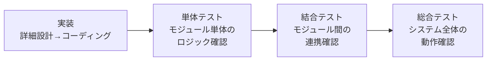
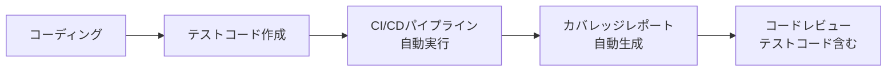
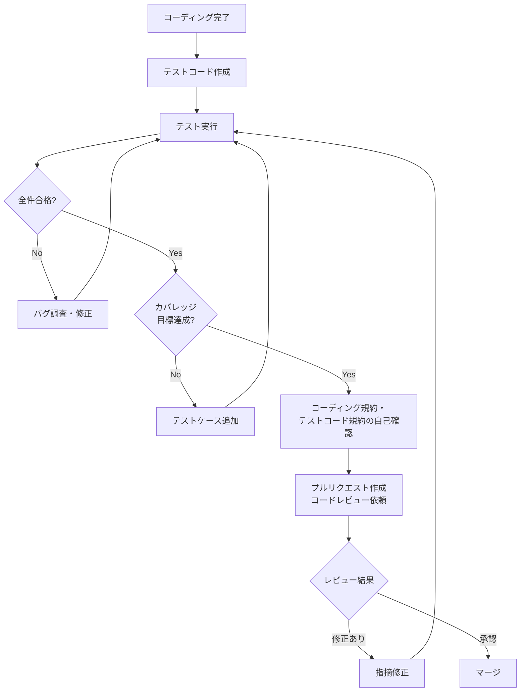
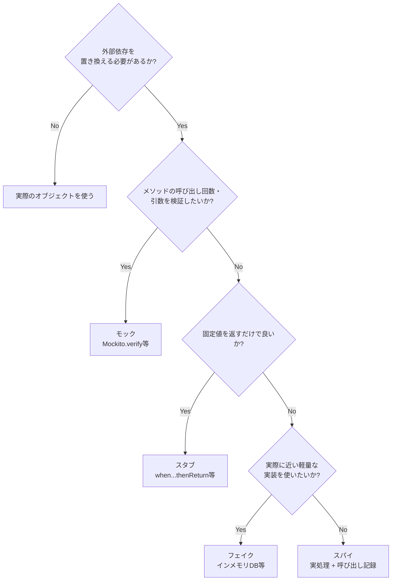

# 単体テスト計画書

| 文書番号 | バージョン | 作成日 | 最終更新日 |
| --- | --- | --- | --- |
| T-UT-001 | 1.0 | 202X/XX/XX | 2026/02/25 |

---

## 目次

1. [単体テストの基本方針](#1-単体テストの基本方針)
2. [テスト対象・スコープ](#2-テスト対象スコープ)
3. [テスト種別](#3-テスト種別)
4. [テスト環境・ツール](#4-テスト環境ツール)
5. [テストスケジュール](#5-テストスケジュール)
6. [役割と責任](#6-役割と責任)
7. [テスト設計手法](#7-テスト設計手法)
8. [テストケース設計・管理](#8-テストケース設計管理)
9. [テスト実施プロセス](#9-テスト実施プロセス)
10. [バグ管理](#10-バグ管理)
11. [テスト完了基準（品質ゲート）](#11-テスト完了基準品質ゲート)
12. [リスク管理](#12-リスク管理)
13. [成果物一覧](#13-成果物一覧)
14. [Redmineによる管理](#14-redmineによる管理)
15. [付録](#付録)

---

## 1. 単体テストの基本方針

### 1.1 単体テストの目的

単体テスト（Unit Test）は、システムを構成する個々のモジュール・関数・クラスを**他のコンポーネントから切り離した最小単位**で検証するテストフェーズである。

**単体テストで確認する主な観点**:

| 確認観点 | 内容 |
| :--- | :--- |
| **処理の正確性** | 関数・メソッドが仕様通りの出力・戻り値を返すか |
| **条件分岐の網羅** | if / switch等の全分岐が意図通りに動作するか |
| **境界値の動作** | 入力値の上限・下限・特殊値で正しく動作するか |
| **例外処理** | 異常な入力・状態に対して適切に例外を発生・捕捉するか |
| **コードカバレッジ** | テストによってコードのどの割合が実行されているか |
| **外部依存の分離** | DB・APIなどの外部依存をモック化し、ロジック単体を検証できているか |

### 1.2 テストフェーズにおける位置づけ



単体テストは**品質の最初の砦**であり、ここで発見・修正されなかったバグは結合テスト以降で発見されるほど修正コストが増加する（詳細は品質管理計画書 1.3節参照）。

| 発見フェーズ | 単体テスト | 結合テスト | 総合テスト | リリース後 |
| :--- | :---: | :---: | :---: | :---: |
| 修正コスト比 | 1 | 10 | 40 | 100以上 |

### 1.3 テスト戦略

#### 1.3.1 実施タイミング

| タイミング | 実施内容 |
| :--- | :--- |
| **コーディング中（推奨）** | TDD（テスト駆動開発）：テストを先に書いてから実装する。設計品質が向上しやすい |
| **コーディング後（標準）** | 実装完了後にテストコードを追加する。最低限このタイミングでテストを書く |
| **バグ修正時（必須）** | バグを再現するテストを書いてから修正する。回帰防止に有効 |

> [!TIP]
> TDDが理想だが、チームに定着するまでは時間がかかる。まず「コーディング後に必ずテストを書く」文化を定着させ、慣れてきたらTDDに移行するアプローチが現実的。TDDの最大の価値はテストコードが増えることではなく、「テストしやすい設計」に自然と誘導されることにある。

#### 1.3.2 自動テストの活用

単体テストは自動化を原則とする。手動での動作確認（ブレークポイントでのデバッグ等）は補助的な手段であり、テストケースとしては記録・再現できないため正式なエビデンスとして認めない。



> [!WARNING]
> 「動作確認したから単体テスト完了」という扱いは認めない。手動動作確認は再現性がなく、後から証跡として確認できない。必ずテストコードとして記述し、自動実行できる状態にする。

### 1.4 単体テストの基本原則（FIRST原則）

良い単体テストが満たすべき性質を定義する。

| 原則 | 英語 | 内容 |
| :--- | :--- | :--- |
| **速い** | Fast | テストの実行が速いこと。1件あたり数ms〜数百ms以内が目安 |
| **独立** | Independent | テストケース間に依存関係がないこと。実行順序によって結果が変わらない |
| **再現可能** | Repeatable | 何度実行しても同じ結果になること。外部環境・時刻に依存しない |
| **自己検証** | Self-Validating | テスト自体がOK/NGを判定できること。目視確認を要しない |
| **適時** | Timely | コードと同時またはコード前に書くこと |

---

## 2. テスト対象・スコープ

### 2.1 テスト対象

| カテゴリ | テスト対象 | 具体例 |
| :--- | :--- | :--- |
| **ビジネスロジック層** | サービスクラス・ドメインモデルのロジック | 料金計算・ステータス遷移・バリデーションロジック |
| **ユーティリティ・共通処理** | 共通関数・ヘルパークラス | 日付変換・文字列整形・コード変換 |
| **データ変換・マッピング** | DTO変換・レスポンス整形 | EntityからDTOへの変換処理 |
| **バリデーション処理** | 入力値チェックロジック | 必須チェック・形式チェック・範囲チェック |
| **バッチ処理ロジック** | バッチの個別処理ロジック | データ集計・変換ロジック |
| **アルゴリズム** | 複雑なロジック・計算処理 | 在庫引当ロジック・料金計算 |

### 2.2 テストスコープ外

| スコープ外 | 理由 | 確認フェーズ |
| :--- | :--- | :--- |
| 画面・UI操作 | 結合テスト・総合テストで確認 | 結合テスト |
| DB・外部APIとの実際の連携動作 | モック化して単体で確認する。連携は結合テストで確認 | 結合テスト |
| フレームワーク・ライブラリ自体の動作 | フレームワーク・ライブラリ提供元の責任。自作コードのみを対象とする | 対象外 |
| 性能・負荷 | 総合テストで確認 | 総合テスト |
| ブラウザ互換性 | 総合テストで確認 | 総合テスト |
| 設定ファイルの値 | 環境依存のため別途確認 | 結合テスト・総合テスト |

> [!NOTE]
> 「DB・外部APIを呼ぶコード」でも、DBアクセス部分をモック化すれば上位のビジネスロジックは単体テストの対象になる。モック化の対象・範囲はチームで統一した方針を持つことが重要。

### 2.3 テスト対象モジュール一覧（記入用）

| No | モジュール名 | クラス・ファイル名 | テスト担当者 | 優先度 | 備考 |
| :--- | :--- | :--- | :--- | :---: | :--- |
| 1 | ユーザー管理 | UserService | - | 高 | |
| 2 | 認証処理 | AuthService | - | 高 | |
| 3 | 共通ユーティリティ | DateUtils | - | 中 | |
| … | … | … | … | … | … |

---

## 3. テスト種別

### 3.1 ロジックテスト（主軸）

最も基本となるテスト種別。メソッド・関数が正しい処理を行うことを確認する。

| テスト観点 | 内容 |
| :--- | :--- |
| **正常系** | 正しい入力値で期待する出力が得られるか |
| **異常系** | 異常な入力値で適切なエラーが返るか |
| **境界値** | 上限・下限・境界値での動作が正しいか |
| **条件分岐** | if/switch の全分岐が正しく動作するか |
| **計算精度** | 四則演算・丸め処理が正確か |

### 3.2 例外テスト

例外の発生・捕捉が仕様通りに動作することを確認する。

| テスト観点 | 内容 |
| :--- | :--- |
| **例外の発生** | 想定された条件で正しい例外がスローされるか |
| **例外の種類** | スローされる例外の型・クラスが正しいか |
| **例外メッセージ** | 例外メッセージ・エラーコードが仕様通りか |
| **例外の捕捉** | try-catchで例外が正しく捕捉されるか |
| **リソース解放** | 例外発生時にDB接続・ファイル等が正しくクローズされるか |

### 3.3 テストダブルを使ったテスト

外部依存（DB・外部API・時刻等）をテストダブルで置き換え、ロジック単体を検証する。

| テストダブルの種類 | 用途 | 具体例 |
| :--- | :--- | :--- |
| **スタブ（Stub）** | テスト用の固定値を返す | DBを呼ばずに「ユーザー有り」「ユーザー無し」のケースを作る |
| **モック（Mock）** | 呼び出しの検証も行う | 「このメソッドが1回呼ばれたか」を検証する |
| **フェイク（Fake）** | 軽量な代替実装を使う | インメモリDBをリポジトリの代わりに使う |
| **スパイ（Spy）** | 実際の処理を行いつつ呼び出し状況を記録 | 実際のメソッドを呼びつつ引数を記録する |
| **ダミー（Dummy）** | 呼ばれないが引数として必要なオブジェクト | テスト対象外のパラメータを埋めるためのオブジェクト |

> [!TIP]
> モック・スタブの使い分けで迷ったら「このテストで検証したいのは何か」に立ち返る。「メソッドが呼ばれたかどうか」を検証したい → モック。「特定の値を返してほしいだけ」 → スタブ。モックを多用しすぎると「実装の詳細をテストしている」状態になり、リファクタリングのたびにテストコードが壊れる。

### 3.4 パラメータ化テスト

同じロジックを異なる入力値で繰り返し確認する場合に使用する。テストコードの重複を減らしつつ多くのケースをカバーできる。

```java
// 例：JUnit 5 の @ParameterizedTest（Java の場合）
@ParameterizedTest
@CsvSource({
    "1000, 0.1, 100",   // 金額1000円、税率10%、期待結果100円
    "500,  0.1, 50",
    "0,    0.1, 0",
})
void 税額計算テスト(int price, double rate, int expected) {
    assertEquals(expected, TaxCalculator.calculate(price, rate));
}
```

> [!NOTE]
> パラメータ化テストは境界値・同値クラスのテストに特に有効。複数ケースをまとめて管理できるため、後から観点を追加しやすい。ただしケース数が増えすぎるとテスト失敗時の原因特定が難しくなるため、意味のあるケースに絞る。

### 3.5 回帰テスト（バグ修正時）

バグを修正した後、同じバグが再発しないことを確認するテスト。

**手順**:
1. バグを再現するテストケースを作成する（修正前はNG確認）
2. バグを修正する
3. テストがOKになることを確認する
4. テストコードを永続的にテストスイートに追加する

> [!TIP]
> バグ修正時の回帰テストを書く習慣は「同じバグが2度と起きない」ことへの最も確実な投資。修正だけして終わりにすると、後日の改修でバグが再発するリスクが残る。「バグを直す前にテストを書く」ルールをチームに徹底することを推奨する。

---

## 4. テスト環境・ツール

### 4.1 テストフレームワーク

プロジェクトで使用する言語・フレームワークに応じて選択する。

| 言語 | テストフレームワーク | モック・スタブライブラリ | カバレッジツール |
| :--- | :--- | :--- | :--- |
| **Java** | JUnit 5 | Mockito | JaCoCo |
| **Python** | pytest / unittest | unittest.mock | pytest-cov / Coverage.py |
| **JavaScript / TypeScript** | Jest / Vitest | Jest内蔵 / Sinon | Istanbul（Jest内蔵）|
| **C#** | xUnit / NUnit / MSTest | Moq / NSubstitute | Coverlet |
| **Go** | testing（標準）| testify/mock | go test -cover |
| **PHP** | PHPUnit | Prophecy / Mockery | PHPUnit内蔵 |

### 4.2 実行環境

| 実行シーン | 環境 | 説明 |
| :--- | :--- | :--- |
| **ローカル開発時** | 開発者のPC | コーディングと並行して随時実行 |
| **コミット時** | CI/CDパイプライン（GitHub Actions / Jenkins 等）| コミット・プッシュをトリガーに自動実行 |
| **PR（プルリクエスト）マージ時** | CI/CDパイプライン | 全テスト + カバレッジレポートを確認してからマージ |

### 4.3 静的解析ツールとの連携

単体テストと合わせて静的解析を実施し、テストでは検出しにくい問題を補完する。

| ツール種別 | ツール例 | 検出する問題 | 実行タイミング |
| :--- | :--- | :--- | :--- |
| **コーディング規約チェック** | Checkstyle / ESLint / Pylint | コーディング規約違反・スタイル違反 | コミット前 / CI |
| **バグ静的検出** | SonarQube / SpotBugs / Semgrep | バグパターン・セキュリティ脆弱性 | CI / PR |
| **型チェック** | mypy（Python）/ TypeScript | 型の不整合 | コミット前 / CI |
| **脆弱性スキャン** | OWASP Dependency-Check / Snyk | 使用ライブラリの脆弱性 | CI / 週次 |

> [!NOTE]
> 静的解析のルールセットはデフォルトのまま適用すると警告が大量に出てチームが疲弊しやすい。導入初期は「Critical / High のみCIの失敗条件にする」など段階的に厳しくしていくアプローチが定着しやすい。

### 4.4 CI/CDパイプラインとの統合

単体テストはCIパイプラインに組み込み、コード変更のたびに自動実行する。

```
コミット・プッシュ
  ↓
①静的解析（ESLint / Checkstyle 等）
  ↓ 問題なければ
②単体テスト自動実行（テストフレームワーク）
  ↓ 全件合格すれば
③カバレッジレポート生成
  ↓ カバレッジが目標値以上なら
④コードレビュー受付（PRのステータスが緑になる）
```

> [!TIP]
> CIの失敗条件に「カバレッジ目標値未達」を含めると、テストを書かないコードがマージできなくなる。導入初期は「カバレッジが前回より下がったらNG（ratchet方式）」にすると、既存コードのカバレッジを下げずに新規コードのテストを促進できる。

---

## 5. テストスケジュール

### 5.1 テストフェーズのマイルストーン

| マイルストーン | 内容 | 目安タイミング |
| :--- | :--- | :--- |
| **UT開始** | テスト方針合意・テストフレームワーク環境構築完了 | 詳細設計完了・コーディング開始時 |
| **UT中間確認** | カバレッジ状況・バグ発生傾向の中間レビュー | コーディング期間の折り返し点 |
| **UT全件完了** | 全対象モジュールのテスト完了・カバレッジ目標達成 | コーディング完了予定日 |
| **UT完了判定** | 完了基準の充足確認・コードレビュー完了 | 結合テスト開始前 |

### 5.2 コーディング工程との並行スケジュール

単体テストはコーディングと並行して実施する。「コーディングが全部終わってからテストを書く」は推奨しない。

| 作業 | 週1 | 週2 | 週3 | 週4 |
| :--- | :---: | :---: | :---: | :---: |
| コーディング | ████ | ████ | ██── | ──── |
| 単体テスト作成 | ████ | ████ | ████ | ──── |
| バグ修正 | ──── | ──── | ████ | ████ |
| コードレビュー | ──── | ──── | ──── | ████ |

> [!WARNING]
> 「コーディング完了後にまとめてテストを書く」計画はスケジュール圧縮の際に真っ先に削られる。コーディングとテストを同一タスクとして工数見積もりし、テスト作成をタスクチケットの完了条件に含めることで、後回しを防ぐ。

### 5.3 スケジュールリスク

| リスク | 影響 | 対応策 |
| :--- | :--- | :--- |
| テストコード作成の工数見積もり漏れ | コーディング完了後にテストを書く時間がなくなる | テスト作成工数を設計・製造タスクに含めて計上する |
| テストが難しい設計（密結合）によるテスト作成遅延 | 外部依存を切り離せずモック化できない | 詳細設計時点でDI（依存性の注入）を意識した設計に誘導する |
| カバレッジが目標に届かない | 品質ゲートを通過できず結合テストに移行できない | 週次でカバレッジを確認し、未テストモジュールを早期に特定する |

---

## 6. 役割と責任

### 6.1 役割定義

| 役割 | 担当者 | 主な責任 |
| :--- | :--- | :--- |
| **PM** | - | 単体テスト方針の承認・品質ゲートGo/NoGo判断 |
| **PMO** | - | カバレッジ・バグ密度等の品質メトリクス収集と分析・週次品質レポート作成 |
| **PL（プロジェクトリーダー）** | - | テスト方針の策定・コードレビュー実施・カバレッジ目標の管理 |
| **開発担当者** | - | テストコードの作成・実行・バグ修正・コードカバレッジの維持 |

### 6.2 単体テストにおける開発担当者の責任

単体テストは**開発担当者自身が作成・実行する**。以下を作成者の責任として定義する。

- [ ] 担当モジュールのテストコードを作成する
- [ ] テストが全件合格することを確認してからコードレビューを依頼する
- [ ] カバレッジが目標値を満たすことを確認してからPRを出す
- [ ] バグ修正時は再現テストを追加してから修正する
- [ ] テストコードもコーディング規約に準拠する

> [!WARNING]
> 「テストを書いた」だけで満足してはいけない。「テストが意味のある検証をしているか」が重要。常にtrueを返すアサーションや、内部実装を過度にテストするテストは、カバレッジ数値を上げるだけで品質保証としての意味をなさない。PLはコードレビュー時にテストコードの「質」も確認する。

---

## 7. テスト設計手法

### 7.1 テストケース設計の基本アプローチ

| 設計手法 | 概要 | 主な適用シーン |
| :--- | :--- | :--- |
| **同値クラス分割** | 同じ動作をする入力値をグループに分け、各グループから代表値を1件選ぶ | 入力バリデーション・範囲チェック |
| **境界値分析** | 上限・下限・境界値±1を重点的にテスト | 数値範囲・文字数制限 |
| **デシジョンテーブル** | 条件の組み合わせを表形式で整理してテストケースを設計 | 複数条件が絡む業務ルール・料金計算 |
| **状態遷移テスト** | 状態の遷移パターンをテスト | ステータス管理・ワークフローロジック |
| **条件網羅（MC/DC）** | 安全性が重要なシステムで全条件の組み合わせを網羅 | 航空・医療等の安全要件があるシステム |

### 7.2 同値クラス分割の設計例

**例: 年齢入力（1〜120の整数）**

| クラス | 代表値 | 期待結果 |
| :--- | :---: | :--- |
| 有効クラス（1〜120） | 30 | 正常処理 |
| 無効クラス（0以下） | 0, -1 | バリデーションエラー |
| 無効クラス（121以上） | 121, 999 | バリデーションエラー |
| 無効クラス（小数） | 1.5 | バリデーションエラー |
| 無効クラス（数値以外） | "abc", null | バリデーションエラー |

### 7.3 境界値分析の設計例

**例: 文字数制限（1〜50文字）**

| 境界値 | 入力値 | 期待結果 |
| :--- | :---: | :--- |
| 下限未満 | 0文字（空文字）| バリデーションエラー |
| 下限（ちょうど）| 1文字 | 正常処理 |
| 下限+1 | 2文字 | 正常処理 |
| 上限-1 | 49文字 | 正常処理 |
| 上限（ちょうど）| 50文字 | 正常処理 |
| 上限+1 | 51文字 | バリデーションエラー |

### 7.4 デシジョンテーブルの設計例

**例: 割引適用ロジック（会員か / 購入金額1万円以上か）**

| 条件 / ルール | R1 | R2 | R3 | R4 |
| :--- | :---: | :---: | :---: | :---: |
| 会員か | Y | Y | N | N |
| 購入金額1万円以上か | Y | N | Y | N |
| **期待結果：割引率** | 15% | 10% | 5% | 0% |

> [!TIP]
> デシジョンテーブルは条件が3つ以上になると組み合わせ数が急増する（2^n通り）。実際にはビジネス的にありえない組み合わせを除外してテストケース数を絞る。「全組み合わせを網羅しなければならない」わけではなく、「意味のある組み合わせを漏らさない」ことが目的。

### 7.5 テストケースの優先度付け

| 優先度 | 対象 | 例 |
| :--- | :--- | :--- |
| **P1（必須）** | ビジネス価値が高い処理・バグ時の影響が大きいロジック | 料金計算・認証ロジック・在庫引当 |
| **P2（重要）** | 頻繁に呼ばれる共通処理 | 日付変換・コード変換・バリデーション |
| **P3（通常）** | 影響範囲が限定的なロジック | 補助的なユーティリティ処理 |
| **P4（低）** | 単純な getter / setter・設定値の読み込み | 自明な処理でバグが混入しにくいもの |

> [!NOTE]
> P4に分類した「getter/setter」「単純な設定読み込み」はテストを省略する判断も合理的。ただし「単純だから」の判断を個人に委ねるとバラツキが出るため、チームで「テスト不要の例外ルール」を明文化しておく。

---

## 8. テストケース設計・管理

### 8.1 テストコードの構成規則（AAAパターン）

テストコードは **Arrange（準備）→ Act（実行）→ Assert（検証）** の3段階で記述する。

```java
// Java / JUnit 5 の例
@Test
void 税額計算_税率10パーセントの場合_正しい税額が返る() {
    // Arrange（準備）
    int price = 1000;
    double taxRate = 0.10;
    TaxCalculator calculator = new TaxCalculator();

    // Act（実行）
    int result = calculator.calculate(price, taxRate);

    // Assert（検証）
    assertEquals(100, result);
}
```

```python
# Python / pytest の例
def test_税額計算_税率10パーセントの場合_正しい税額が返る():
    # Arrange
    calculator = TaxCalculator()
    price, tax_rate = 1000, 0.10

    # Act
    result = calculator.calculate(price, tax_rate)

    # Assert
    assert result == 100
```

### 8.2 テストメソッド命名規則

テスト名から「何を・どんな条件で・どうなるか」が分かるように命名する。

**推奨命名パターン**: `[テスト対象]_[条件]_[期待結果]`

| NG例 | OK例 |
| :--- | :--- |
| `test1()` | `税額計算_税率10パーセントの場合_正しい税額が返る()` |
| `testCalculate()` | `calculate_マイナス金額の場合_例外がスローされる()` |
| `testNull()` | `getUserById_存在しないIDの場合_Nullが返る()` |

> [!TIP]
> テスト名は「ドキュメント」として機能する。テストが失敗したとき、名前を見るだけで「何が壊れたか」が分かるテスト名は、原因調査の時間を大幅に短縮する。長くなっても良いので具体的に書く。

### 8.3 1テストにつき1アサーション原則

1つのテストケースで確認する内容は1つにする。複数のアサーションをまとめると、前のアサーションが失敗した時点で後のアサーションが実行されず、問題の全体像が把握しにくくなる。

```java
// NG: 1テストで複数の観点を混在させている
@Test
void 登録テスト() {
    User user = service.register("田中", "tanaka@example.com");
    assertNotNull(user.getId());           // 観点1
    assertEquals("田中", user.getName()); // 観点2
    assertNotNull(user.getCreatedAt());   // 観点3
}

// OK: 観点ごとにテストを分ける
@Test
void 登録後_IDが採番される() { ... }

@Test
void 登録後_入力した名前が保存される() { ... }

@Test
void 登録後_登録日時が設定される() { ... }
```

### 8.4 テストコードの品質基準

テストコードは本番コードと同等の品質で管理する。以下の観点でコードレビューを行う。

| 観点 | チェックポイント |
| :--- | :--- |
| **可読性** | テスト名・変数名が意図を明確に表しているか |
| **独立性** | テストの実行順序を変えても結果が変わらないか |
| **再現性** | 現在時刻・乱数・環境依存の値をハードコードしていないか |
| **アサーションの質** | `assertTrue(true)` のような常にパスするアサーションがないか |
| **重複** | 共通処理が適切に `setUp` / `@BeforeEach` に切り出されているか |
| **テストダブルの適切さ** | モック・スタブが必要最小限の範囲で使われているか |
| **エラーメッセージ** | assertが失敗した時に原因が分かるメッセージが付いているか |

---

## 9. テスト実施プロセス

### 9.1 入場基準（単体テスト開始条件）

| 条件 | 確認者 |
| :--- | :--- |
| 詳細設計書（またはその相当ドキュメント）が完成し、レビュー済みである | PL |
| テスト対象モジュールのコーディングが完了している | 開発担当者 |
| テストフレームワーク・CIパイプラインの環境構築が完了している | PL / インフラ担当 |
| コーディング規約・テストコード規約がチームに周知されている | PL |

### 9.2 テスト実施フロー



### 9.3 コーディング実施時のルール

**コーディング中（開発担当者）**:
- テストコードも同一ブランチで管理する（本番コードとテストコードをセットでコミットする）
- ローカルで全テストが合格している状態でプッシュする
- CIが失敗した場合は当日中に原因を確認・対応する

**コードレビュー（PL・レビュアー）**:
- テストコードも必ずレビュー対象に含める
- カバレッジレポートをレビュー時に確認し、未テスト箇所を指摘する
- 「テストが通っている」だけでなく「テストが意味ある検証をしている」かを確認する

> [!WARNING]
> 「コードレビューでテストコードを見ない」慣行は品質管理上の大きな穴。本番コードのロジックが正しくても、テストの期待値が間違っていれば欠陥の検出力はゼロになる。テストコードのレビューは本番コードと同等の優先度で実施する。

### 9.4 テスト実施記録

自動テストの場合、以下をCI/CDツールまたはテストフレームワークのレポートで管理する。

| 記録項目 | 内容 | 取得方法 |
| :--- | :--- | :--- |
| テスト実施日時 | 自動テスト実行日時 | CIログ / テストレポート |
| テスト実施件数 | 全テストケース数・合格数・失敗数 | JUnitレポート / Jest結果 |
| カバレッジ | 行・分岐カバレッジの割合 | JaCoCo / Istanbul レポート |
| 失敗したテスト | 失敗したテストケース名・エラー内容 | テストレポート |
| 実行時間 | テストスイート全体の実行時間 | CIログ |

---

## 10. バグ管理

> [!NOTE]
> 単体テストで発見されたバグは、開発担当者が自己修正するケースが多い。ただし以下の基準でRedmineへの起票要否を判断する。詳細なバグ管理プロセスは **[PJT計画補足-障害管理.md](../00.管理/80.障害管理/PJT計画補足-障害管理.md)** を参照。

### 10.1 バグの起票ルール

| 状況 | 対応 |
| :--- | :--- |
| 実装ミスによるバグ → 当日中に自己修正できる | Redmine起票不要。修正してテストを通す |
| 原因が不明 / 調査に時間がかかる | Redmine起票。深刻度・状況をチケットに記録 |
| 仕様の解釈が曖昧でバグか仕様か判断できない | Redmine起票し、PLに確認を仰ぐ |
| 設計上の問題が原因（設計書の修正が必要） | Redmine起票。設計書の変更管理プロセスへ連携 |
| 重要度の高いロジックミス（A/Sランク相当）| 必ずRedmine起票。PLに即報告 |

### 10.2 バグ深刻度（単体テスト文脈）

| 深刻度 | 記号 | 単体テストでの定義 |
| :--- | :---: | :--- |
| **Critical** | S | データ破損・セキュリティ脆弱性・コアロジックの根本的な欠陥 |
| **Major** | A | 主要機能のロジックが仕様と大きく異なる |
| **Normal** | B | 一部のケースで誤った結果を返すが限定的 |
| **Minor** | C | 軽微なロジックミス・コーディング規約違反 |

### 10.3 修正後の確認ルール

- バグ修正後は、バグを再現するテストケースを追加してから修正する
- 修正後にテストスイート全体を再実行し、デグレードが発生していないことを確認する
- テストが全件合格してから次の作業に進む

---

## 11. テスト完了基準（品質ゲート）

以下の全条件を満たした時点で、対象モジュールの単体テスト完了と見なす。

### 11.1 テストコード作成基準

- [ ] 全対象モジュール・クラスのテストコードが作成されている
- [ ] テストコードがCI/CDパイプラインで自動実行されている

### 11.2 テスト合格基準

- [ ] 全テストケースが合格している（失敗・エラーが0件）
- [ ] テストが常に同じ結果を返す（実行順序・環境に依存しない）

### 11.3 コードカバレッジ基準

| カバレッジ種別 | 目標値 | 計測対象 |
| :--- | :---: | :--- |
| **行カバレッジ（Line Coverage）** | 80%以上 | 全対象モジュール |
| **分岐カバレッジ（Branch Coverage）** | 70%以上 | 全対象モジュール |
| **重要モジュールの行カバレッジ** | 90%以上 | 料金計算・認証等のコアロジック |

> [!NOTE]
> 上記は参考値。プロジェクトの特性・技術スタック・リスクに応じてPLが設定する。カバレッジ目標はプロジェクト開始時にユーザー・PM・PLで合意し、品質計画書に明記する。

### 11.4 バグ修正基準

- [ ] Sランクバグが0件である
- [ ] Aランクバグが0件である
- [ ] BランクのバグはRedmineに起票し、対応方針（修正 / 保留）が決定している

### 11.5 成果物基準

- [ ] テストコードがコードレビューで承認されている
- [ ] カバレッジレポートが最新状態で保管されている
- [ ] バグ管理台帳（Redmine）が最新状態である

---

## 12. リスク管理

### 12.1 テストリスク一覧

| リスク | 発生確率 | 影響度 | 対応策 |
| :--- | :---: | :---: | :--- |
| テストコード作成工数の見積もり漏れ | 高 | 高 | 製造工数にテスト作成を含めて見積もる（目安: 製造工数の30〜50%追加） |
| 密結合な設計によりモック化できない | 中 | 高 | 詳細設計時にDI・インターフェース設計を徹底。設計レビューで確認 |
| テストが外部依存を切り離せておらず実行が不安定 | 中 | 中 | テストダブルの適切な使用をコードレビューで確認 |
| カバレッジ数値を上げるだけの意味のないテスト | 中 | 高 | テストコードのレビューで「検証の質」を確認する |
| テスト実行時間が長くなりCIが遅延 | 低 | 中 | テストの実行速度を定期的に確認。遅いテストを特定・改善 |
| バグ修正時に回帰テストを追加しない | 中 | 中 | バグ修正PRのテンプレートに「回帰テスト追加」を必須項目として設定 |

### 12.2 テストが書きにくい設計パターンと対処

単体テストが書きにくいコードは設計上の問題を示していることが多い。

| 書きにくいパターン | 根本原因 | 対処 |
| :--- | :--- | :--- |
| `new` でインスタンスを直接生成しているためモックできない | 依存関係が直接結合している | DI（依存性の注入）パターンを使う |
| メソッドが長すぎて観点が多すぎる | 単一責任の原則違反 | メソッドを責任ごとに分割する |
| 静的メソッドだらけでモックできない | 静的依存が多い | 静的メソッドをインスタンスメソッド化・インターフェース化する |
| グローバル変数・シングルトンに依存している | 状態の共有によるテスト間の干渉 | 依存をコンストラクタ・メソッドの引数で受け取る設計に変える |
| 現在時刻を `new Date()` / `LocalDateTime.now()` で取得している | 時刻が外部から制御できない | 時刻取得をインターフェース化・DI化し、テスト時に固定値を注入できるようにする |

---

## 13. 成果物一覧

| 成果物 | 作成者 | 作成タイミング | 保管場所 |
| :--- | :--- | :--- | :--- |
| **単体テスト計画書**（本書） | PL | コーディング開始前 | ドキュメント管理フォルダ |
| **テストコード** | 開発担当者 | コーディングと並行 | ソースリポジトリ（本番コードと同一）|
| **カバレッジレポート** | CI自動生成 | テスト実行時 | CIツール / 成果物フォルダ |
| **テストレポート（合格・失敗件数）** | CI自動生成 | テスト実行時 | CIツール |
| **バグ管理台帳** | 開発担当者（Redmine） | バグ発見時 | Redmine |
| **コードレビュー記録** | レビュアー | レビュー実施時 | プルリクエスト / レビューシート |
| **単体テスト完了報告書** | PL | UT完了時 | ドキュメント管理フォルダ |

---

## 14. Redmineによる管理

### 14.1 製造・単体テストタスクのチケット管理

単体テスト作業は製造タスクと一体のチケットで管理する（テスト作成を製造の完了条件に含める）。

| チケット項目 | 運用方法 |
| :--- | :--- |
| **題名** | 「製造 - [サブシステム名] [機能名]」形式で統一 |
| **担当者** | 開発担当者 |
| **開始日 / 期日** | コーディング〜単体テスト完了までの期間 |
| **進捗率** | 「コーディング中：50% / テストコード作成中：75% / レビュー完了：100%」の目安で更新 |
| **親チケット** | 「製造工程」を親チケットとしてサブシステム単位にまとめる |

**完了条件（チケットを100%にする前の確認事項）**:
- [ ] テストコードが作成済みである
- [ ] テストが全件合格している
- [ ] カバレッジが目標値を達成している
- [ ] コードレビューが完了している

### 14.2 バグチケットの管理

単体テストで発見したバグのうち、Redmine起票が必要なものは「バグ」トラッカーで管理する。

**バグチケットの必須フィールド（単体テスト用）**:

| フィールド | 内容 |
| :--- | :--- |
| 発見フェーズ | 「単体テスト」を選択 |
| 深刻度 | S / A / B / C |
| 関連チケット | 対応する製造タスクチケットをリンク |
| 再現手順 | テストケース名・テストコードの該当箇所 |
| 原因分類 | 実装ミス / 仕様誤解 / 設計漏れ |

### 14.3 カバレッジ状況の管理

週次でカバレッジ状況をPMO・PLが確認できるよう、定期的にレポートを共有する。

| 確認タイミング | 確認内容 | 確認者 |
| :--- | :--- | :--- |
| 日次（CI自動） | テスト合格率・カバレッジの変化 | PL（自動通知で確認） |
| 週次 | 全体カバレッジのトレンド・未テストモジュールの洗い出し | PL / PMO |
| UT完了時 | カバレッジ目標の達成確認 | PL → PMO → PM |

---

## 付録

### A. 単体テスト完了チェックリスト（モジュール別）

各モジュールのテスト完了確認に使用する。

**テストコード作成確認**
- [ ] 正常系のテストケースが作成されている
- [ ] 異常系・例外のテストケースが作成されている
- [ ] 境界値のテストケースが作成されている
- [ ] 全条件分岐のテストケースが作成されている
- [ ] AAAパターンで記述されている
- [ ] テストメソッド名が「テスト対象_条件_期待結果」形式になっている

**テスト実行・品質確認**
- [ ] 全テストケースが合格している
- [ ] 行カバレッジが目標値（80%以上）を達成している
- [ ] 分岐カバレッジが目標値（70%以上）を達成している
- [ ] 常にパスするアサーション（意味のないテスト）がないことを確認した

**コードレビュー確認**
- [ ] テストコードのレビューが完了している
- [ ] バグ修正時は再現テストが追加されている

---

### B. テストコードのアンチパターン（やってはいけない書き方）

テストコードのレビュー時にチェックする「品質を下げるパターン」を示す。

| アンチパターン | 問題 | 改善方法 |
| :--- | :--- | :--- |
| **常にtrueなアサーション** | テストが失敗することがないため、欠陥を検出できない | 期待値を具体的な値で指定する |
| **テストの中にif文** | 条件によってテストの内容が変わり、再現性が失われる | if文ごとに別のテストメソッドに分ける |
| **テスト間で状態を共有** | テストの実行順序によって結果が変わる | setUp / tearDown で毎回初期化する |
| **`Thread.sleep()` でタイミング調整** | 実行環境によって待ち時間が不足しテストが不安定になる | 非同期処理を適切なWait / MockTimer で制御する |
| **テスト名が `test1()` / `testA()`** | 失敗時に何が壊れたか分からない | 「対象_条件_期待結果」の命名規則を使う |
| **1テストに複数のアサーション** | 最初のassertが失敗すると後のassertが実行されない | アサーションごとにテストを分ける |
| **本番データ・本番環境への接続** | テストが環境依存になり、副作用で本番データが変更されうる | テストダブル（モック・スタブ）または専用テストDBを使う |
| **テストコードのコピペ** | 修正が必要な時に全コピー箇所を直さなければならない | 共通処理を `setUp` やヘルパーメソッドに抽出する |

---

### C. テストダブルの選択フローチャート

どのテストダブルを使うか迷った時の判断フロー。



---

### D. カバレッジ目標値の設定ガイド

プロジェクト開始時にカバレッジ目標値を設定する際の参考基準。

| モジュール分類 | 推奨カバレッジ | 根拠 |
| :--- | :---: | :--- |
| コアビジネスロジック（料金計算・在庫管理・認証等）| 90%以上 | バグの影響が大きいため高いカバレッジが必要 |
| サービス層・アプリケーション層 | 80%以上 | 業務フローの中心であり品質が重要 |
| ユーティリティ・共通処理 | 80%以上 | 多くの場所から呼ばれるため影響範囲が広い |
| インフラ層（DBアクセス・外部API呼び出し）| 60%以上 | 結合テストで補完されるため単体では必須部分のみ |
| 自動生成コード・設定クラス | 対象外 | テストの対象とせず対象から除外する |

> [!NOTE]
> カバレッジ計測から除外すべきコードを明示的に設定する（アノテーション or 設定ファイル）。自動生成コード・設定クラス・エントリポイント等を除外しないと、カバレッジ目標の達成が余計に困難になる。

---

### E. 週次テスト状況レポート（テンプレート）

```markdown
# 第X週 単体テスト 品質状況レポート
**期間**: YYYY/MM/DD 〜 YYYY/MM/DD

## 1. 品質ステータス: 🟢 Green / 🟡 Yellow / 🔴 Red

## 2. カバレッジ状況
| モジュール | 行カバレッジ | 分岐カバレッジ | 目標 | 状況 |
|-----------|------------|--------------|------|------|
| UserService | 85% | 78% | 80% | 🟢 |
| TaxCalculator | 62% | 55% | 80% | 🔴 |
| 全体 | 78% | 70% | 80% | 🟡 |

## 3. バグ状況
| 深刻度 | 今週新規 | 今週クローズ | 累計残存 |
|--------|----------|-------------|---------|
| S | 0 | 0 | 0 |
| A | 1 | 0 | 1 |
| B | 3 | 2 | 5 |
| C | 2 | 2 | 0 |

## 4. 特記事項・リスク
- TaxCalculatorのカバレッジが目標を大幅に下回っている（原因：複雑な分岐が多くテスト設計に時間がかかっている）
- Aランクバグ「料金計算で消費税の丸め処理が誤っている」が未解決（担当：〇〇、期限：XX/XX）

## 5. 来週の計画
- TaxCalculatorのテストケース追加（担当：〇〇）
- Aランクバグの修正・確認
```

---

### F. 用語集

| 用語 | 説明 |
| :--- | :--- |
| **単体テスト（UT）** | Unit Test。個別モジュール・関数・クラスを切り離して検証するテスト |
| **TDD** | Test-Driven Development（テスト駆動開発）。テストを先に書いてから実装する手法 |
| **AAAパターン** | Arrange（準備）/ Act（実行）/ Assert（検証）の3段階でテストを構成する規則 |
| **テストダブル** | テスト用に本物の依存を置き換えるオブジェクトの総称。スタブ・モック・フェイク等が含まれる |
| **スタブ（Stub）** | 固定値を返すだけのテストダブル |
| **モック（Mock）** | 呼び出し回数・引数の検証もできるテストダブル |
| **フェイク（Fake）** | 本物に近い動作をする軽量な代替実装。インメモリDBなど |
| **スパイ（Spy）** | 実際の処理を行いつつ呼び出し状況を記録するテストダブル |
| **カバレッジ** | テストによって実行されたコードの割合。行・分岐・条件などの種別がある |
| **行カバレッジ** | テストで実行されたコード行の割合 |
| **分岐カバレッジ** | if/switchの各分岐（true/false）がテストされた割合 |
| **DI（依存性の注入）** | Dependency Injection。依存オブジェクトをコンストラクタ等で外から注入する設計パターン |
| **パラメータ化テスト** | 同一のテストロジックを異なる入力値で繰り返し実行する仕組み |
| **回帰テスト** | バグ修正後に同じバグが再発しないことを確認するテスト |
| **CI/CD** | Continuous Integration / Continuous Delivery。コードの変更をトリガーに自動的にテスト・デプロイを行う仕組み |
| **FIRST原則** | 良い単体テストが満たすべき性質。Fast / Independent / Repeatable / Self-Validating / Timely |

---

### G. 参考資料

- Kent Beck 著「テスト駆動開発」
- Robert C. Martin 著「Clean Code」/ 「Clean Architecture」
- JSTQB テスト技術者資格制度 Foundation Level シラバス
- [テスト観点一覧.md](./テスト観点一覧.md)（3章「単体テストの観点」も参照）
- [PJT計画補足-品質管理.md](../00.管理/30.品質管理/PJT計画補足-品質管理.md)
- [PJT計画補足-障害管理.md](../00.管理/80.障害管理/PJT計画補足-障害管理.md)
