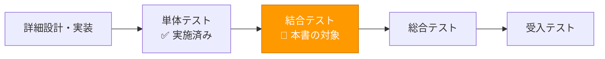
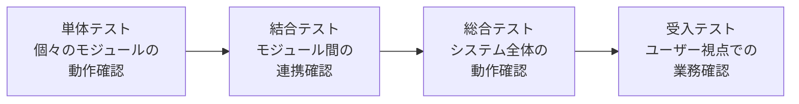
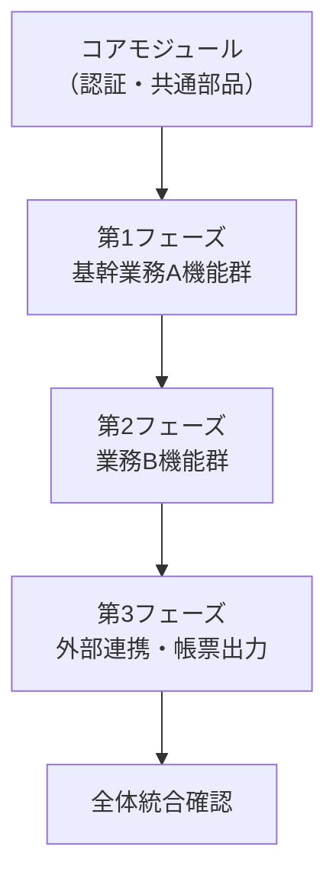
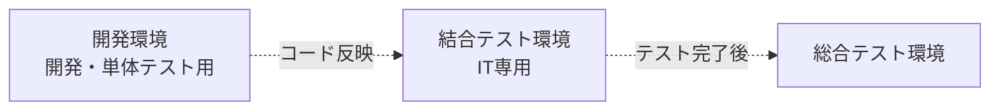
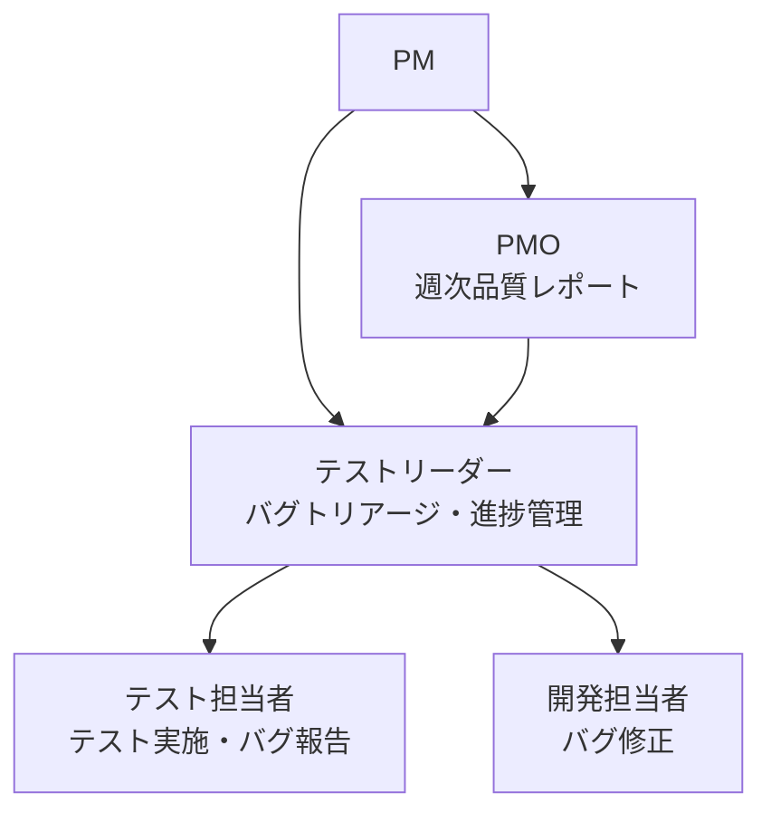
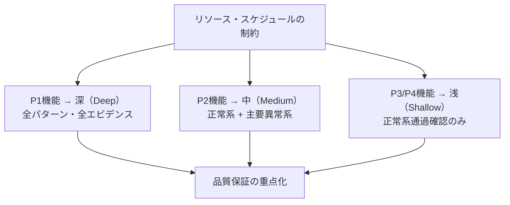
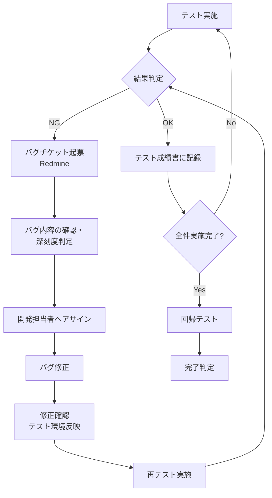
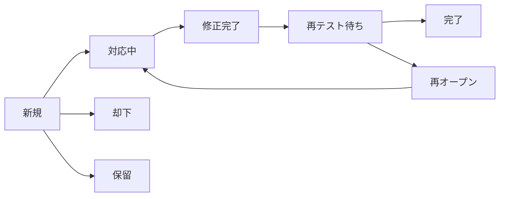
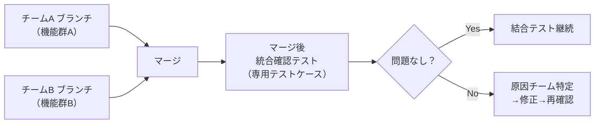

# 結合テスト計画書

| 文書番号 | バージョン | 作成日 | 最終更新日 |
| --- | --- | --- | --- |
| T-INT-001 | 1.0 | 202X/XX/XX | 2026/02/25 |

---

## 目次

- [テスト工程全体における本書の位置づけ](#テスト工程全体における本書の位置づけ)

1. [結合テストの基本方針](#1-結合テストの基本方針)
   - 1.5 [テストへの投資対効果（1:10:100の法則）](#15-テストへの投資対効果110100の法則)
2. [テスト対象・スコープ](#2-テスト対象スコープ)
3. [テスト種別](#3-テスト種別)
4. [テスト環境](#4-テスト環境)
5. [テストスケジュール](#5-テストスケジュール)
6. [役割と責任](#6-役割と責任)
7. [テスト設計手法](#7-テスト設計手法)
   - 7.2.3 [設計書品質確認の観点](#723-設計書品質確認の観点)
   - 7.4 [テスト深度の考え方（深・中・浅）](#74-テスト深度の考え方深中浅)
8. [テストケース設計・管理](#8-テストケース設計管理)
9. [テスト実施プロセス](#9-テスト実施プロセス)
10. [バグ管理](#10-バグ管理)
11. [テスト完了基準（品質ゲート）](#11-テスト完了基準品質ゲート)
12. [リスク管理](#12-リスク管理)
    - 12.3 [複数チーム並行開発時のマージリスク管理](#123-複数チーム並行開発時のマージリスク管理)
13. [成果物一覧](#13-成果物一覧)
14. [Redmineによる管理](#14-redmineによる管理)
15. [付録](#付録)

---

## テスト工程全体における本書の位置づけ

本書は**結合テスト（IT: Integration Test）**フェーズを対象としたテスト計画書である。
結合テストはテスト工程の中盤に位置し、単体テストで個別に検証した各モジュール・機能を実際に組み合わせ、モジュール間・画面間・システム間の連携が正しく動作することを確認する工程である。



### これまでのテスト：単体テスト（UT）

**対象文書**: 単体テスト計画書 T-UT-001

単体テストでは、各モジュール・関数・クラスを**他のコンポーネントから切り離した最小単位**で検証した。DB・外部APIはモック（スタブ）に置き換えてロジック単体の動作を確認している。

| 確認済みの観点 | 内容 |
| :--- | :--- |
| **処理の正確性** | 関数・メソッドが仕様通りの出力・戻り値を返すか |
| **条件分岐の網羅** | if / switch 等の全分岐が意図通りに動作するか |
| **境界値の動作** | 入力値の上限・下限・特殊値での正常動作 |
| **例外処理** | 異常入力・異常状態への適切なエラーハンドリング |
| **外部依存の分離** | DB・API をモック化し、ロジック単体を検証 |

> [!NOTE]
> 単体テストではモックを使って外部依存を切り離しているため、「実際に組み合わせたときに正しく動くか」は確認できていない。それを確認するのが結合テストの役割である。

### 本書の対象：結合テスト（IT）

単体テストを通過したモジュール群を**実際の環境で組み合わせ**、インターフェースと業務フロー全体の整合性を確認する。単体テストでモック化していた部分を「本物」に差し替えるため、ここで初めて顕在化するバグが多い。

| 結合テストで新たに確認する観点 | 単体テストで確認できなかった理由 |
| :--- | :--- |
| **モジュール間のデータ受け渡し** | 単体テストはモックI/Fを使うため、実際のデータ型・形式の不整合は検出できない |
| **画面遷移・業務フローの連続性** | 単体テストは1機能単位の検証。複数機能をまたぐシナリオは対象外 |
| **DBトランザクションの整合性** | 単体テストではDBをモック化しており、実際のDB操作・ロールバック動作は未確認 |
| **外部システム・APIとの実連携** | 単体テストでは外部APIをスタブ化しており、実環境での通信・レスポンスは未確認 |
| **権限・認証の連携動作** | 単体テストでは認証処理を切り離しており、実際のセッション・アクセス制御は未確認 |

### この後のテスト：総合テスト（ST）・受入テスト（UAT）

結合テスト完了後は、より広い範囲・視点でのテストが続く。

| テストフェーズ | 主な確認内容 | 実施主体 |
| :--- | :--- | :--- |
| **総合テスト（ST）** | システム全体の機能動作・非機能要件（性能・負荷・セキュリティ）・データ移行・運用手順・障害復旧 | テスト担当者（開発側） |
| **受入テスト（UAT）** | 業務要件の充足確認・ユーザー操作感・実業務シナリオでの総合検証 | ユーザー担当者 |

> [!WARNING]
> 結合テストは**開発チーム内での品質確認の最終ライン**である。総合テスト以降はユーザーや運用担当者の目に触れる。結合テストで主要な業務フローの不具合を解消しておかないと、総合テスト・受入テストで手戻りが発生し、スケジュールへの影響が大きくなる。

---

## 1. 結合テストの基本方針

### 1.1 結合テストの目的

結合テスト（Integration Test）は、単体テストで個別に検証したコンポーネントを組み合わせ、複数モジュール・画面・機能間のインターフェースおよびデータ連携が正常に機能することを確認するテストフェーズである。

**結合テストで確認する主な観点**:

| 確認観点 | 内容 |
| :--- | :--- |
| **インターフェース整合性** | 画面・機能間のデータ受け渡し、API呼び出しの入出力が仕様と一致しているか |
| **業務フロー連続性** | 複数画面・複数機能をまたぐ業務シナリオが正常に完結するか |
| **データ整合性** | DBへの登録・更新・削除がトランザクション単位で正しく完結するか |
| **外部連携** | 外部システム・APIとのI/Fが仕様通りに動作するか |
| **エラー処理** | 異常値・エラー発生時に適切なエラーハンドリングが行われるか |
| **権限・認証** | ログイン認証・画面アクセス権限が正しく機能するか |

### 1.2 テストフェーズにおける位置づけ



| テストフェーズ | 主な確認対象 | 実施主体 |
| :--- | :--- | :--- |
| **単体テスト（UT）** | 個別モジュール・クラス・関数の動作 | 開発担当者 |
| **結合テスト（IT）** | モジュール間・画面間・システム間の連携 | テスト担当者（開発側） |
| **総合テスト（ST）** | システム全体の機能・非機能 | テスト担当者（開発側） |
| **受入テスト（UAT）** | 業務要件の充足、ユーザー操作観点 | ユーザー担当者 |

### 1.3 テスト戦略

結合テストの進め方として以下の戦略を採用する。

#### 1.3.1 インクリメンタルテスト（推奨）

機能を段階的に統合しながらテストを進める方法。バグの特定が容易で、デバッグ効率が高い。



> [!TIP]
> 「全機能が完成してから一度にテスト（ビッグバン）」は避ける。バグが多発した際に原因特定に時間がかかり、スケジュールリスクが高い。サブシステム・機能群単位で段階的に統合・テストするインクリメンタルアプローチが安全。

#### 1.3.2 テスト優先順位付けの考え方

| 優先度 | 対象 | 理由 |
| :--- | :--- | :--- |
| **高** | 基幹業務フロー（登録〜参照〜更新〜削除）| 後続テストの前提となる基本機能 |
| **高** | 認証・権限制御 | セキュリティ上の影響範囲が広い |
| **高** | 外部システム連携・API | I/F不整合は発見が遅れやすい |
| **中** | サブ業務フロー・オプション機能 | 基幹機能に依存するため順序に注意 |
| **低** | 帳票出力・参照のみ機能 | 単独動作が多く、他機能への影響が少ない |

### 1.4 結合テスト計画策定時の注意点

> [!WARNING]
> 単体テストの完了を待たずに結合テストを開始すると、単体品質の問題と連携品質の問題が混在して原因特定が困難になる。**結合テスト入場基準（9.1節参照）を必ず設定し、単体テスト完了を前提条件として明文化する。**

> [!NOTE]
> テスト環境の準備は計画より時間がかかることが多い。特に外部システムとの連携テスト環境は先方の都合に左右されるため、早期に調整を開始する。環境起因の待ち時間はスケジュールリスクとして明示的に計上する。

### 1.5 テストへの投資対効果（1:10:100の法則）

「なぜ今テストに時間とコストを投じるのか」という経営的・PM的な根拠を持って計画に臨む。テストを「コスト」と捉えるのではなく、「下流での大きな損失を防ぐ投資」として位置づけることが重要である。

#### 1:10:100の法則

「欠陥の発見・修正コストは、発見フェーズが下流に行くほど指数的に増大する」という実証則。NIST（米国国立標準技術研究所）やIBM社の研究で知られ、ソフトウェア品質管理の基本原則として広く参照される。

| 発見フェーズ | コスト比率 | 主な対応作業 |
| :--- | :---: | :--- |
| **要件定義・設計** | 1 | 仕様書・設計書の記載修正のみ |
| **単体テスト** | 5 | コード修正 + 単体テスト再実行 |
| **結合テスト（本フェーズ）** | 10 | 影響範囲調査 + 修正 + 関連テスト再実行 |
| **総合テスト** | 20 | 広範な影響調査 + 環境調整 + 回帰テスト |
| **本番障害（リリース後）** | 30〜100 | 緊急障害対応 + 顧客対応 + 信頼失墜 + 事後報告書 |

> [!TIP]
> 結合テストを「手を抜きたいコスト」と考えるか、「下流での30倍以上のコストを防ぐ投資」と考えるかで、テスト計画への向き合い方が変わる。PMや経営層への説明時には、この数字をプロジェクト規模に当てはめて試算すると説得力が増す。

#### 本番障害コスト試算の例（30倍の根拠）

（前提）結合テストでバグ1件を発見・修正するコスト = 担当者 3h × 2名 = **6h**

同じバグを本番障害として発見した場合のコスト試算:

| コスト項目 | 想定時間 |
| :--- | :--- |
| 障害検知・初動対応・影響範囲特定 | 4h |
| 原因調査（本番ログ解析） | 8h |
| 緊急パッチ作成・テスト | 12h |
| 本番適用・リリース作業 | 4h |
| 顧客対応・説明・障害報告書作成 | 10h |
| **合計** | **38h（≒ 結合テスト発見コストの約6倍、直接コストのみ）** |

> [!NOTE]
> 上記は直接コスト（工数）のみの試算。本番障害では「機会損失」「顧客信頼の毀損」「再発防止策の策定」「役員への報告・謝罪対応」等の間接コストが加わる。これらを含めると30〜100倍というコスト差になる。コストの試算値はプロジェクト規模・重要度によって変わるため、プロジェクト固有の数値に置き換えてステークホルダーに示すことを推奨する。

---

## 2. テスト対象・スコープ

### 2.1 テスト対象

本結合テストの対象範囲を以下に示す。テスト対象の詳細リストは別紙「テスト対象機能一覧」を参照。

| カテゴリ | テスト対象 |
| :--- | :--- |
| **画面・機能** | 本プロジェクトで新規開発・改修した全画面・機能 |
| **業務フロー** | 複数画面・機能にまたがる業務シナリオ |
| **データ連携** | 画面入力→DB登録→一覧表示・参照 等の一連のデータフロー |
| **API・I/F** | 内部API、外部システムとのI/F（Web API、ファイル連携等） |
| **バッチ処理** | 定時バッチ・手動実行バッチの入出力・データ整合性 |
| **エラー制御** | 入力バリデーション、例外処理、エラーメッセージ表示 |
| **権限制御** | ロール別アクセス制御、画面表示・操作制限 |

### 2.2 テストスコープ外

以下は本結合テストの対象外とする。

| スコープ外 | 理由 | 確認フェーズ |
| :--- | :--- | :--- |
| 個別モジュールの内部ロジック | 単体テストで確認済み | 単体テスト |
| 性能・負荷 | 専用の非機能テストで確認 | 総合テスト |
| セキュリティ診断 | 専門ツール・手法で別途実施 | 総合テスト |
| ユーザー業務適合性 | ユーザーの判断が必要 | 受入テスト（UAT） |
| 本番環境での動作 | 総合テスト・移行リハーサルで確認 | 総合テスト・移行 |

### 2.3 テスト対象機能一覧（サンプル形式）

| No | サブシステム | 機能名 | 画面ID | 優先度 | 担当者 |
| :--- | :--- | :--- | :--- | :---: | :--- |
| 1 | ユーザー管理 | ログイン認証 | SCR-001 | 高 | - |
| 2 | ユーザー管理 | ユーザー登録 | SCR-002 | 高 | - |
| 3 | 業務A | ○○登録 | SCR-010 | 高 | - |
| 4 | 業務A | ○○一覧表示 | SCR-011 | 高 | - |
| … | … | … | … | … | … |

> [!NOTE]
> 上記は記載形式のサンプル。プロジェクトの機能一覧・画面一覧を基に、PL・テストリーダーが全機能を洗い出して作成する。優先度付けはプロジェクト初期に実施し、スケジュールに余裕がない場合の調整基準として活用する。

---

## 3. テスト種別

### 3.1 機能結合テスト（シナリオテスト）

業務ユースケースを模したシナリオに沿って、複数機能を連続して操作し正常動作を確認する。結合テストの主軸となるテスト種別。

**シナリオの設計観点**:
- ユーザーが実際に行う業務の流れを一連のテストステップとして記述する
- 正常系（Happy Path）を先にカバーし、その後に準正常系・異常系を追加する
- 業務上重要度の高いシナリオから優先してテストケースを作成する

> [!TIP]
> シナリオテストはテストケースの数が増えやすい。「業務ユースケース単位」で1シナリオとし、画面単位ではなく「○○業務を完結させる」という粒度で設計するとケース数を適切にコントロールできる。

### 3.2 インターフェーステスト

システム内外のI/Fが仕様通りに動作することを確認する。

| 種類 | 確認内容 |
| :--- | :--- |
| **画面→DB** | 画面で入力した値がDBに正確に保存されるか |
| **DB→画面** | DBのデータが画面に正確に表示されるか |
| **内部API** | APIのリクエスト・レスポンスが仕様書通りか |
| **外部システム連携** | 外部APIへの呼び出し・受信データの処理が正常か |
| **ファイル連携** | ファイルの入出力フォーマット・文字コード・改行コードが仕様通りか |
| **バッチ→DB** | バッチ処理後のDBデータ整合性 |

### 3.3 回帰テスト（デグレード確認）

バグ修正・コード変更による既存機能への悪影響（デグレード）がないことを確認する。

**実施タイミング**:
- バグ修正後、修正箇所に関連する機能の再テスト
- テスト後半の大きな仕様変更・修正が入った場合
- 結合テスト完了前の最終確認として実施

> [!WARNING]
> 「直した以外は変わっていない」は思い込みに過ぎない。特に共通部品・共通ロジックの修正は影響範囲が広いため、変更の影響範囲を修正担当者が明示し、テストリーダーが回帰テスト範囲を決定する。変更影響分析を省略すると、後で気づかなかった箇所のデグレードがUATや本番環境で発覚するリスクがある。

### 3.4 境界値・異常系テスト

| テスト種別 | 確認内容 |
| :--- | :--- |
| **境界値テスト** | 入力値の上限・下限・ちょうどの値での動作確認 |
| **入力バリデーション** | 必須チェック・形式チェック・文字数制限のエラーメッセージ |
| **セッション・タイムアウト** | セッション切れ後の操作、タイムアウト処理 |
| **同時アクセス** | 複数ユーザーの同時操作によるデータ競合の確認 |
| **データ不整合** | マスタ未登録状態での業務操作、削除済みデータの参照 |

---

## 4. テスト環境

### 4.1 環境構成

結合テスト専用の環境（IT環境）を用意し、開発環境や総合テスト環境と分離して管理する。



| 環境要素 | 内容 | 管理担当 |
| :--- | :--- | :--- |
| **Webサーバー** | 本番相当のミドルウェア・バージョンで構築 | インフラ担当 |
| **APサーバー** | テスト対象アプリケーションをデプロイ | 開発PL |
| **DBサーバー** | テスト用DB。本番スキーマをベースに構築 | インフラ担当 |
| **外部システムスタブ** | 本番外部システムの代わりに応答するスタブ | 開発担当 |
| **ファイルサーバー** | ファイル連携テスト用 | インフラ担当 |

> [!NOTE]
> 外部システムが本物のテスト環境を提供できる場合でも、テストデータの投入・クリアが自由にできるかを先方に確認する。「外部環境のテストデータが自社の権限で操作できない」という状況はよく発生し、テスト効率を大幅に下げる。スタブを用意する選択肢もあわせて検討する。

### 4.2 テストデータ管理

| データ種別 | 準備方法 | 管理担当 |
| :--- | :--- | :--- |
| **マスタデータ** | テスト用マスタを事前に投入。テスト実施前にリストア可能にしておく | テストリーダー |
| **トランザクションデータ** | テストシナリオごとに必要なデータを事前に用意・定義する | テスト担当者 |
| **個人情報含むデータ** | 本番データは使用しない。ダミーデータを生成する | テストリーダー |
| **ファイル連携データ** | 仕様書に準拠したサンプルファイルを事前に用意する | テスト担当者 |

> [!WARNING]
> テストデータ汚染（テスト実施によりデータが予期せず書き換わる）は、テストケース間の独立性を失わせる。テストケースの実行順序に依存しないよう、各テストシナリオの開始前にデータを初期状態に戻す手順を明記しておく。全件リストアが難しい場合は、シナリオ別にデータ投入スクリプトを用意する。

### 4.3 環境管理ルール

- テスト環境へのソース反映は **テストリーダーの承認を得た上でリリース担当者のみ**が実施する
- ソース反映後は反映内容・日時・バージョンを環境管理台帳に記録する
- バグ修正ソースの反映は、バグ修正完了を確認してからまとめてリリースする（頻繁な差分リリースは環境を不安定にする）
- テスト実施中に環境障害が発生した場合は即座にテストリーダーに報告し、テストを一時中断する

> [!TIP]
> 「直してすぐデプロイ」を繰り返すと、バグを修正したつもりがデプロイされていない、別の修正が混じって入ったなどの問題が発生しやすい。修正→コードレビュー→デプロイのサイクルを1日1回など定周期化すると環境が安定する。

---

## 5. テストスケジュール

### 5.1 テストフェーズのマイルストーン

| マイルストーン | 内容 | 目安タイミング |
| :--- | :--- | :--- |
| **IT準備完了** | 環境構築・テストデータ準備・テスト仕様書レビュー完了 | 結合テスト開始の1週間前 |
| **IT入場判定** | 単体テスト完了確認・入場基準チェック | 結合テスト開始日 |
| **IT中間確認** | テスト進捗・バグ状況の中間レビュー | 期間の折り返し点 |
| **IT全件実施完了** | 全テストケースの実施完了 | 結合テスト終了予定日の3営業日前 |
| **IT回帰テスト完了** | バグ修正後の回帰テスト完了 | 結合テスト終了予定日の1営業日前 |
| **IT完了判定** | 完了基準の充足確認・品質ゲート通過 | 結合テスト終了日 |

### 5.2 テストスケジュール詳細（例）

| 週 | 主な作業 | 完了基準 |
| :--- | :--- | :--- |
| 第1週 | テスト仕様書レビュー・環境セットアップ・テストデータ投入 | 環境確認OK・仕様書レビュー指摘クローズ |
| 第2〜3週 | 機能結合テスト実施（優先度高の機能から順次） | 優先度高のテストケース完了 |
| 第4〜5週 | 機能結合テスト完了・異常系・権限テスト | 全テストケース完了 |
| 第6週 | バグ修正・回帰テスト・完了判定 | 完了基準充足・品質ゲート通過 |

> [!NOTE]
> 上記は6週間を想定した例。プロジェクトの規模・テストケース数・バグ状況によって変動する。特に最終週のバグ修正・回帰テストの期間は短縮しやすいが、品質担保のために必ず余裕を持たせる。

### 5.3 スケジュールリスク

| リスク | 影響 | 対応策 |
| :--- | :--- | :--- |
| 単体テスト完了の遅延 | 結合テスト開始が後ろ倒しになる | IT入場基準を厳格に設定。単体テスト遅延を週次で把握 |
| 外部システム環境の不安定 | テスト待ち時間が発生する | スタブによる代替テストを並行して進める |
| 大量バグによる修正待ち | テスト実施が滞る | 優先度別にバグ対応順を決め、修正待ちの間に他ケースを実施 |
| 仕様変更によるテストケース修正 | 実施済みテストの再実施が必要になる | 変更管理プロセスに沿って影響範囲を確認し、テスト計画を見直す |

---

## 6. 役割と責任

### 6.1 役割定義

| 役割 | 担当者 | 主な責任 |
| :--- | :--- | :--- |
| **PM（プロジェクトマネージャー）** | - | 結合テスト計画の承認・品質ゲートGo/NoGo判断・リスク判断 |
| **PMO** | - | 品質メトリクス収集・週次品質レポート作成・品質状況のモニタリング |
| **PL（プロジェクトリーダー）** | - | テスト仕様書レビュー・バグ修正優先順位付け・開発担当者の作業管理 |
| **テストリーダー** | - | テスト計画・仕様書の作成管理・テスト実施の進行管理・バグトリアージ |
| **テスト担当者** | - | テストケース実施・バグ報告・回帰テスト実施 |
| **開発担当者** | - | バグ原因調査・修正・修正内容の開発環境での確認 |
| **インフラ担当者** | - | テスト環境の構築・維持・ソース反映の実施 |

### 6.2 テストフェーズにおけるコミュニケーション体制



### 6.3 バグ対応の決裁ルール

| 事項 | 決裁者 |
| :--- | :--- |
| バグの深刻度判定（初期トリアージ） | テストリーダー |
| S/Aランクバグの対応優先順位 | PL → PM承認 |
| バグの「修正しない（保留・却下）」判断 | PL → PM承認（Bランク以下）、PM → ユーザー合意（Aランク以上） |
| リリース可否の最終判断 | PM（ユーザーと合意の上） |

---

## 7. テスト設計手法

### 7.1 テスト設計の基本アプローチ

結合テストのテストケース設計には以下の手法を組み合わせて使用する。

| 手法 | 概要 | 適用シーン |
| :--- | :--- | :--- |
| **シナリオテスト** | ユーザーの業務フローに沿ってテストケースを設計 | 業務フロー全体の正常系確認 |
| **同値クラス分割** | 同じ動作をする入力値グループに分けてテスト | 入力フォームのバリデーション |
| **境界値分析** | 上限・下限・境界±1の値でテスト | 数値範囲・文字数制限 |
| **デシジョンテーブル** | 条件の組み合わせを表形式で整理してテスト | 複数条件が絡むビジネスルール |
| **状態遷移テスト** | 状態の遷移パターンをテスト | ステータス管理・ワークフロー機能 |
| **ペアワイズテスト** | 多数のパラメータから代表的な組み合わせを選択 | 多パラメータの組み合わせ確認 |

### 7.2 テスト観点の設定

テストケースを設計する前に「何を確認するか（テスト観点）」を整理する。観点ごとにテストケースをグルーピングすることで、網羅性の確認とレビューが容易になる。

#### 7.2.1 共通テスト観点

以下は全機能に共通して確認すべき観点。

| 観点カテゴリ | 具体的な確認内容 |
| :--- | :--- |
| **正常系** | 正しい入力値・操作手順で期待通りの結果になるか |
| **異常系** | 不正な入力値・操作でエラーが適切に返るか |
| **境界値** | 上限・下限・境界値での動作 |
| **データ連携** | 入力値がDBに正確に登録・反映されるか |
| **表示確認** | 画面に表示されるデータがDBの値と一致しているか |
| **必須チェック** | 必須項目が未入力の場合にエラーが表示されるか |
| **権限制御** | 権限のないユーザーが操作できないか |
| **二重送信防止** | ボタンの二重クリックで二重登録が起きないか |
| **セッション** | ログインせずにURL直接アクセスしてリダイレクトされるか |

#### 7.2.2 機能別テスト観点

| 機能種別 | 追加で確認すべき観点 |
| :--- | :--- |
| **登録機能** | 同一キーの重複登録エラー / 全項目の保存確認 / 登録日時の自動設定 |
| **更新機能** | 変更前後の値の確認 / 更新日時・更新者の自動更新 / 排他制御（同時編集） |
| **削除機能** | 論理削除か物理削除か / 関連データの整合性（FK制約） / 削除確認ダイアログ |
| **検索機能** | 条件なし全件表示 / 複合条件検索 / 0件時の表示 / 大量データ時の表示 |
| **一覧表示** | ソート・ページング / 表示件数 / 項目の過不足 |
| **CSV出力** | 文字コード / 改行コード / 特殊文字（カンマ・ダブルクォート）のエスケープ |
| **ファイルアップロード** | 許可拡張子・サイズ上限 / 不正ファイルのエラー |
| **バッチ処理** | 正常終了・異常終了の確認 / データ件数と処理結果の整合性 |
| **外部API連携** | 正常レスポンス / タイムアウト / エラーレスポンス時の処理 |

> [!TIP]
> 「二重送信防止」は見落とされやすいが、本番障害の原因になりやすい観点。Webアプリケーションでは処理中のボタンを非活性化する実装が一般的だが、テストでは実際に素早く連打して確認することを推奨する。ブラウザの「戻る」ボタンを押した後の再送信も確認すること。

#### 7.2.3 設計書品質確認の観点

結合テストは「プログラムが動くかどうか」の確認にとどまらず、「プログラムが設計書通りに作られているか」「設計書同士の整合性が取れているか」を検証する役割も担う。特に複数担当者・複数チームで並行開発した場合、設計書とプログラムの乖離は起きやすい。

| 観点カテゴリ | 具体的な確認内容 |
| :--- | :--- |
| **画面設計書との整合性** | 画面設計書に定義された項目名・配置・バリデーションルール・エラーメッセージが実装と一致しているか |
| **API仕様書との整合性** | API定義書（リクエスト/レスポンスの項目名・型・必須区分・エラーコード）と実際の動作が一致しているか |
| **DB設計書との整合性** | テーブル定義書のカラム名・データ型・桁数・NOT NULL制約・デフォルト値が実装と一致しているか |
| **データ型・桁数の整合性** | DB定義の文字列長・数値型の範囲と、画面のバリデーションルールが一貫しているか（例：DB側がVARCHAR(100)なのに画面で150文字まで入力できる） |
| **NULL/NOT NULL の整合性** | DB側でNOT NULL制約のある項目に対して、画面側の必須チェックが対応しているか |
| **業務ロジックの仕様書反映** | 詳細設計書に記載された条件分岐・計算式・コード体系が正しく実装されているか |

> [!WARNING]
> 「テストでOKだった」のに設計書との乖離が後から発覚するパターンはよくある。特に「仕様書は古いまま、実装だけ変わっていた」状態で結合テストを実施すると、テストは通っても設計書ベースの正しさが担保されない。結合テスト入場前に最新化された設計書が揃っているかを確認すること（9.1節の入場基準参照）。

> [!TIP]
> DB設計書との整合性確認は、「情報スキーマをSELECTして実際のカラム定義を取得し、設計書と突合する」手法が効率的。テスト開始前の環境確認の一環として実施するとよい。発見した乖離はバグではなく「設計書vs実装の不一致」として別途管理し、どちらが正しいかをPLと確認してから対処する。

### 7.3 テストケース設計の優先度付け

全テストケースを均等に実施するのではなく、リスクと重要度に基づいて優先度を設定する。

| 優先度 | 定義 | 例 |
| :--- | :--- | :--- |
| **P1（必須）** | 基幹業務に直結し、失敗したら業務が停止するテスト | ログイン・基幹CRUD・決済処理 |
| **P2（重要）** | 頻繁に利用するが代替手段がある機能のテスト | 検索・CSV出力・帳票印刷 |
| **P3（通常）** | 利用頻度は低いが品質上確認が必要なテスト | 管理機能・設定変更 |
| **P4（低）** | 利用頻度が非常に低いか影響範囲が限定的なテスト | 参照のみ機能・オプション機能 |

### 7.4 テスト深度の考え方（深・中・浅）

優先度（P1〜P4）が「どのテストを先に実施するか」の順序を示すのに対し、**テスト深度**は「1つの機能をどこまで詳細に確認するか」の厚みを示す概念である。リソース制約がある中で品質にメリハリをつけ、重要な箇所に確認の密度を集中させるために活用する。

| 深度 | 定義 | 主な適用場面 | テストの実施例 |
| :--- | :--- | :--- | :--- |
| **深（Deep）** | 正常系・異常系・境界値の全パターンを網羅的に確認。全ステップのエビデンスを詳細に取得 | 基幹業務・前フェーズでバグが多発した機能・外部連携I/F | 全入力パターン確認 / DB値の1行単位突合 / エラーメッセージの文言まで確認 |
| **中（Medium）** | 正常系と主要異常系を確認。代表的なエラーパターンのみ。エビデンスは画面単位 | 一般機能・前フェーズで大きな問題がなかった機能 | 代表的な正常系 + リスクの高い異常系のみ確認 |
| **浅（Shallow）** | 主要フローの正常系のみ確認。エビデンスは最終状態のみ | 低優先度機能・参照のみ・オプション機能 | 「機能が動くこと」の通過確認のみ |

**優先度 × 深度の推奨組み合わせ**:

| 優先度 | 推奨テスト深度 | 判断理由 |
| :---: | :--- | :--- |
| **P1** | 深（Deep） | 障害が起きれば業務停止。手を抜けない |
| **P2** | 中（Medium） | 重要だが代替手段あり。主要ケース網羅で十分 |
| **P3** | 中〜浅（Medium〜Shallow） | リスクに応じてテストリーダーが判断 |
| **P4** | 浅（Shallow） | リソース不足時はスコープから外す判断も可 |



> [!TIP]
> スケジュールが逼迫したとき、全テストケースを「浅」に変えてしまう判断は誤り。P1機能を浅にした結果、基幹業務で本番障害が起きるリスクが高まる。リソースが足りない場合は「P4をスコープから外す（テスト対象外にする）」方が安全な判断である。

> [!NOTE]
> テスト深度はテスト計画時にテストリーダーが設定し、テスト仕様書の「テスト観点」欄に明記する。テスト実施中に深度を変更する場合はPLと合意し、変更理由と影響範囲を記録しておく。

---

## 8. テストケース設計・管理

### 8.1 テストケースの構成

テスト仕様書は以下の構造で作成する。

**テスト仕様書の階層**:

```
テスト仕様書
├── シナリオグループ（業務・サブシステム単位）
│   ├── テストシナリオ（業務フロー単位）
│   │   ├── テストケース（操作手順単位）
│   │   │   ├── テスト手順（ステップ）
│   │   │   └── 期待結果
│   │   └── …
│   └── …
└── …
```

### 8.2 テストケースの必須記載項目

| 項目 | 内容 |
| :--- | :--- |
| **テストケースID** | 一意に識別できるID（例: IT-SCR001-001）|
| **テストシナリオID** | 所属するシナリオのID |
| **テスト対象機能** | 画面ID・機能名 |
| **テスト観点** | 何を確認するテストか（上記7.2の観点を参照） |
| **優先度** | P1〜P4 |
| **前提条件** | テスト実施に必要な状態・データ |
| **テスト手順** | 操作の具体的なステップ（番号付きリスト） |
| **テストデータ** | 使用する入力値・データの指定 |
| **期待結果** | 各ステップの期待する結果（具体的に記載） |
| **実施日** | テスト実施日 |
| **実施者** | テスト担当者名 |
| **結果** | OK / NG / 保留 |
| **バグID** | NGの場合、起票したバグチケットID（RedmineチケットNo）|

### 8.3 テストケース記載例

| 項目 | 記載内容 |
| :--- | :--- |
| テストケースID | IT-SCR010-001 |
| テストシナリオID | TS-A-001（○○業務の登録〜参照フロー） |
| テスト対象機能 | SCR-010 ○○登録画面 |
| テスト観点 | 正常系・データ連携（登録した値がDB・一覧画面に反映されること）|
| 優先度 | P1 |
| 前提条件 | ・ログイン済み（一般ユーザー権限）/ ・マスタデータが初期化済み |
| テスト手順 | 1. ○○登録画面を開く / 2. 項目Aに「テスト値001」を入力する / 3. 項目Bに「2026/02/25」を入力する / 4. 「登録」ボタンをクリックする |
| 期待結果 | ・「登録が完了しました」のメッセージが表示される / ・○○一覧画面に遷移し、登録した内容が1件表示される / ・DBのテーブルXXに入力値が正確に保存されている |

### 8.4 テストケースのレビュー

テスト実施前に必ずテストケースをレビューする。レビュー完了後にテスト実施を開始する。

**テストケースレビューのチェックポイント**:

- [ ] テスト対象の機能・業務フローに漏れがないか（テスト対象機能一覧との突合）
- [ ] テスト観点がP1〜P2について網羅されているか
- [ ] 期待結果が具体的・明確に記載されているか（「〜であること」と明示）
- [ ] 前提条件（データ・ログイン状態等）が明記されているか
- [ ] テストデータが特定されているか
- [ ] テスト手順が再現可能な粒度で記載されているか（担当者が交代しても同じ手順で実施できるか）

> [!TIP]
> 「期待結果が曖昧」は最もよくあるテストケースの品質問題。「正常に動作すること」という記載では判定できない。「○○メッセージが表示されること」「DBのXXカラムに○○が登録されること」のように判定可能な形で記載する。

### 8.5 テストケース管理の運用

| 管理項目 | 運用方法 |
| :--- | :--- |
| **テストケースの保管** | 所定のファイルサーバー・ドキュメント管理ツールに格納 |
| **バージョン管理** | テスト仕様書のバージョンを明記。改版時はバージョンアップ |
| **実施状況の管理** | テストケースシートの「結果」列を日次で更新 |
| **進捗集計** | テストリーダーが日次で実施件数・OK件数・NG件数を集計 |

---

## 9. テスト実施プロセス

### 9.1 入場基準（テスト開始条件）

以下の全条件を満たしていることを確認してから結合テストを開始する。

- [ ] 対象機能の単体テストが完了し、テスト成績書が提出されている
- [ ] 単体テストのS/Aランクバグが全て修正・確認済みである
- [ ] テスト環境の構築が完了し、動作確認（スモークテスト）が済んでいる
- [ ] テストデータの投入が完了している
- [ ] テスト仕様書のレビューが完了し、指摘が全てクローズしている
- [ ] テスト担当者のアサインが確定している
- [ ] バグ管理ツール（Redmine）の設定が完了している
- [ ] テスト環境へのアクセス権限がテスト担当者全員に付与されている

> [!WARNING]
> 入場基準を設けても「とりあえず始める」圧力がかかりやすい。入場基準を満たしていない状態でのテスト開始は、基盤品質の問題に起因するバグと機能バグの区別がつかなくなり、最終的により多くの手戻りを生む。基準を満たさない場合は、不足項目と対応期限をPMに報告してから開始日を調整する。

### 9.2 テスト実施フロー



### 9.3 テスト実施時の基本ルール

**実施前の確認**:
- 当日実施するテストケースを確認し、前提条件・テストデータを準備する
- テスト環境の状態を確認する（前日のテストでデータが変化していないか）
- バグ修正ソースがデプロイされている場合は、反映バージョンを確認する

**実施中の記録**:
- テスト結果（OK/NG）を実施と同時に記録する（後でまとめて記録しない）
- NGの場合は、バグチケットを即時起票する（操作手順・期待結果・実際の結果・証跡を記載）
- スクリーンショット・ログを証跡として保存する

**実施後の報告**:
- 当日の実施件数・OK件数・NG件数をテストリーダーに報告する
- 判定に迷うケースは「保留」とし、テストリーダーに確認を仰ぐ（自己判断でNGをOKにしない）

### 9.4 証跡の管理

| 証跡種別 | 取得方法 | 保管場所 |
| :--- | :--- | :--- |
| **スクリーンショット** | テスト実施時にキャプチャ | バグチケットに添付 or 証跡フォルダ |
| **エラーログ** | アプリケーションログ・ブラウザコンソール | バグチケットに添付 |
| **DBデータ** | SELECT結果のスクリーンショット | バグチケットに添付 |
| **テスト成績書** | テストケースシートに結果を記録 | ドキュメント管理ツール |

> [!TIP]
> 証跡を後から集めようとすると、テスト環境のデータが上書きされていて再現できないケースが多い。「テスト実施と同時に証跡を取得・添付する」習慣を徹底する。バグ報告の質が高いほど開発担当者の調査時間が短くなり、プロジェクト全体の生産性が上がる。

---

## 10. バグ管理

> [!NOTE]
> バグ管理の詳細（深刻度定義・ライフサイクル・Redmine運用・根本原因分析等）は **[PJT計画補足-障害管理.md](../00.管理/80.障害管理/PJT計画補足-障害管理.md)** も参照。本章では結合テストフェーズにおける運用のポイントを記載する。

### 10.1 バグ深刻度（Severity）

| 深刻度 | 記号 | 定義（結合テスト文脈） | 目標修正期間 |
| :--- | :---: | :--- | :--- |
| **Critical** | S | テストが続行不能・データ破損・セキュリティインシデント相当 | 即日対応・翌日確認 |
| **Major** | A | 主要業務フローが完了できない・回避策なし | 2営業日以内 |
| **Normal** | B | 一部機能が誤動作するが業務継続可能 | 1週間以内 |
| **Minor** | C | 画面表示の軽微な誤り・操作性の問題 | テスト完了前まで |

### 10.2 バグ報告の必須記載項目

| 項目 | 内容 |
| :--- | :--- |
| **バグタイトル** | 何が起きているかを一言で（例：「○○画面で登録ボタン押下後に500エラーが発生する」）|
| **深刻度** | S / A / B / C |
| **発見日** | バグを発見した日付 |
| **発見者** | テスト担当者名 |
| **テストケースID** | 関連するテストケースID |
| **テスト環境** | 環境名・バージョン |
| **再現手順** | 番号付きで具体的な操作手順 |
| **期待する動作** | 本来どうなるべきか |
| **実際の動作** | 実際に何が起きているか |
| **証跡** | スクリーンショット・ログファイル |

### 10.3 バグのライフサイクル



| ステータス | 定義 | 操作者 |
| :--- | :--- | :--- |
| **新規** | バグを報告した初期状態 | テスト担当者 |
| **対応中** | 開発担当者が原因調査・修正中 | 開発担当者 |
| **修正完了** | コード修正が完了しレビュー済み | 開発担当者 |
| **再テスト待ち** | テスト環境への反映待ち | テストリーダー |
| **完了** | 再テストでOKが確認できた | テスト担当者 |
| **再オープン** | 再テストでNGだった場合 | テスト担当者 |
| **却下** | バグではなく仕様であると判断 | PL（記録を残す） |
| **保留** | 今回は修正しないと合意したもの | PM（対応方針を明記）|

### 10.4 バグトリアージ

バグトリアージは、テストリーダーとPLが実施し、バグの深刻度確認・対応優先順位・担当者アサインを行う。

**実施頻度**: 原則1日1回（朝）/ S・Aランクバグは即日トリアージ

**トリアージで決定する事項**:
1. 深刻度の確認（報告者の判定が妥当か）
2. 仕様バグか実装バグかの判断
3. 修正担当者のアサイン
4. 修正期限の設定
5. 修正しないバグの場合、保留・却下理由の記録

> [!TIP]
> バグトリアージを行わず「各自で対応」にすると、修正の優先順位がバラバラになり、S/Aランクバグが後回しになる事態が起きやすい。特にテスト中盤以降はバグが溜まりやすいため、毎朝の定例でバグ状況を共有・整理する習慣が重要。

---

## 11. テスト完了基準（品質ゲート）

結合テスト完了の条件として以下の全項目を満たすこと。

### 11.1 テスト実施基準

- [ ] 全テストケースが実施済みである（実施率100%）
- [ ] テスト成績書が作成されている

### 11.2 バグ修正基準

- [ ] Sランクバグが0件である
- [ ] Aランクバグが0件である
- [ ] Bランクバグについて、残存件数と対応方針（修正・保留・受容）がPMおよびユーザーと合意されている
- [ ] Cランクバグについて、残存件数と対応方針が合意されている
- [ ] 「保留」バグに対して、代替対応策または改修計画が明確になっている

### 11.3 品質指標基準

| 指標 | 目標値 | 計測値 |
| :--- | :---: | :---: |
| テスト実施率 | 100% | - |
| テスト合格率（OKケース / 全実施ケース） | 95%以上 | - |
| Sランクバグ残存数 | 0件 | - |
| Aランクバグ残存数 | 0件 | - |
| バグ収束率（最終週の新規バグ / 全バグ） | 5%以下 | - |

### 11.4 成果物基準

- [ ] テスト成績書が提出されている
- [ ] バグ管理台帳（Redmineデータ）が最新状態である
- [ ] 残存バグの対応方針が文書化されている
- [ ] 総合テスト環境への移行準備が完了している

> [!TIP]
> 「テスト合格率95%以上」という基準は一見厳しそうだが、テストケースの設計が甘い場合（NGが出にくいケースばかり）は容易に達成できてしまう。合格率と合わせてバグ密度（件/kStep）も確認し、業界参考値と大きく乖離している場合はテスト設計の質を見直す。

---

## 12. リスク管理

### 12.1 テストリスク一覧

| リスク | 発生確率 | 影響度 | 対応策 |
| :--- | :---: | :---: | :--- |
| 単体テスト品質不足で結合テストに大量バグが流入 | 中 | 高 | 入場基準の厳格化 / 単体テスト完了状況の早期確認 |
| テスト環境の不安定・頻繁なダウン | 中 | 高 | 環境監視体制の確立 / バックアップ環境の準備 |
| 外部システムのテスト環境提供遅延 | 中 | 中 | スタブによる代替テスト計画 / 早期調整開始 |
| テスト担当者の技術力不足（手順通りに実施できない） | 低 | 中 | 事前のテスト実施トレーニング / テストリーダーによるサポート |
| テストケース不足による品質見落とし | 中 | 高 | テスト仕様書レビューの徹底 / チェックリスト活用 |
| バグ修正による大規模デグレード | 低 | 高 | 変更影響分析の徹底 / 回帰テスト計画の策定 |
| 仕様変更によるテストケース全面見直し | 低 | 高 | 変更管理プロセスの適用 / テストへの影響範囲を変更承認プロセスに含める |
| **複数チーム・複数ブランチのマージ後に整合性が破綻する** | **高** | **高** | **マージ後の統合確認テストを計画に組み込む / マージタイミングを段階的に設計する** |

### 12.2 リスク対応の優先順位

**重点管理リスク（発生確率×影響度が高いもの）**:

1. **単体テスト品質不足** → 入場基準チェックリストを厳格に運用。PMOがチェック
2. **テストケース不足** → テスト仕様書レビューを必須化。観点チェックリストを活用
3. **テスト環境不安定** → 環境変更はリリース担当者のみが実施し、変更ログを記録
4. **マージ後の整合性破綻** → 12.3の対応策を計画に組み込む（後述）

### 12.3 複数チーム並行開発時のマージリスク管理

複数チームが別ブランチで並行開発している場合、マージ後に予期しない整合性破綻が起きやすい。このリスクは「テスト環境の不安定」や「バグ修正デグレード」とは性質が異なり、**個々のチームが正しく実装していても、合流後に初めて問題が顕在化する**点が特徴である。

**代表的なリスク発生パターン**:

| パターン | 具体例 | 対応策 |
| :--- | :--- | :--- |
| **共通テーブルへの同時変更** | チームAがマスタテーブルにカラム追加、チームBが同テーブルを参照する機能を並行開発 → マージ後にNULL参照エラーが発生 | DB変更を伴うタスクはマージ前に全チームへ事前連絡し、影響調査を必須とする |
| **共通部品・APIの仕様変更** | チームAが共通APIのレスポンス形式を変更 → チームBが旧フォーマットで実装 → マージ後に疎通不可 | 共通部品・APIの変更は「インターフェース変更通知」として全チームに即時共有する |
| **設定ファイルの競合** | 両チームが同一設定ファイルを別々に変更 → マージ後に片方の設定が消失 | 設定ファイルの変更は変更管理プロセスを経る。マージ時の差分確認を手順化する |
| **テストデータの依存関係の破綻** | チームAのテストデータ設定がチームBのテストケースに干渉 → テストが意図しない結果になる | テストデータのスコープをチーム・機能単位で分離し、共有データは読み取り専用とする |
| **業務ルールの重複・矛盾** | 同一の業務ルール（例：数量チェック）を両チームが独自に実装 → ロジックが異なる状態でマージ → 機能によって挙動が変わる | 業務ルールの実装場所（共通ロジック or 各機能）を設計段階で明確化する |

**マージ後テストの計画化**:



> [!WARNING]
> マージ後の統合確認テストを計画に入れていないと、結合テストの終盤でマージ起因の問題が多発し、「どのチームの問題か」の切り分けに時間を取られる。マージのタイミングと統合確認テストのスケジュールを計画書に明示することを推奨する。

> [!TIP]
> フィーチャーブランチが長期間mainから乖離するほどマージリスクは増大する。可能であれば小さい単位で頻繁にマージ（トランクベース開発）する方がリスクを低減できる。大規模マージは週末や結合テスト開始直前には避け、問題対応の時間的余裕を確保する。

---

## 13. 成果物一覧

| 成果物 | 作成者 | 作成タイミング | 提出先 |
| :--- | :--- | :--- | :--- |
| **結合テスト計画書**（本書） | テストリーダー | テスト開始前 | PM / PMO |
| **テスト仕様書** | テスト担当者 / テストリーダー | テスト開始前 | PL / PMO |
| **テスト成績書** | テスト担当者 | テスト実施中〜完了後 | テストリーダー / PM |
| **バグ管理台帳** | テスト担当者（Redmine） | テスト実施中 | テストリーダー / PM |
| **週次品質レポート** | PMO | 毎週 | PM / PL |
| **結合テスト完了報告書** | テストリーダー | テスト完了時 | PM / ユーザー |

---

## 14. Redmineによる管理

### 14.1 バグチケット管理

バグは専用の「バグ」トラッカーでチケット管理する。

**バグチケットの必須カスタムフィールド**:

| フィールド名 | 種別 | 値の選択肢 |
| :--- | :--- | :--- |
| **深刻度** | リスト | S（Critical）/ A（Major）/ B（Normal）/ C（Minor） |
| **発見フェーズ** | リスト | 単体テスト / 結合テスト / 総合テスト / UAT / 本番 |
| **原因分類** | リスト | 実装ミス / 仕様誤解 / 設計漏れ / テスト環境起因 / 仕様通り（却下）|
| **修正確認日** | 日付 | - |
| **テストケースID** | テキスト | 関連テストケースIDを記入 |

**バグチケットの構造（親子関係）**:

```
【親チケット】結合テスト - バグ管理（サブシステムA）
  └── 【子チケット】バグ#001 ○○画面で登録ボタン押下後に500エラーが発生する
  └── 【子チケット】バグ#002 ○○一覧の件数表示が誤っている
  …
```

### 14.2 テスト進捗チケット管理

テスト実施のタスクはテスト担当者のチケットで管理する。

| チケット項目 | 運用方法 |
| :--- | :--- |
| 題名 | 「結合テスト実施 - [サブシステム名] [機能名]」形式で統一 |
| 担当者 | テスト担当者 |
| 開始日 / 期日 | テスト実施予定期間 |
| 進捗率 | 担当するテストケースの実施完了割合で更新 |
| 親チケット | 「結合テスト実施」を親チケットとしてまとめる |

### 14.3 カスタムクエリの設定

以下のクエリをRedmineに登録し、テスト状況を素早く把握できるようにする。

| クエリ名 | フィルタ条件 | 主な用途 |
| :--- | :--- | :--- |
| 未対応バグ（S/A）| トラッカー=バグ / 深刻度=S,A / ステータス≠完了,却下 | 毎日確認 |
| 全バグ一覧 | トラッカー=バグ / フェーズ=結合テスト | 週次品質レポート作成 |
| 再テスト待ちバグ | トラッカー=バグ / ステータス=再テスト待ち | テスト担当者の作業確認 |
| テスト実施進捗 | トラッカー=テスト / ステータス≠完了 | 進捗確認 |

---

## 付録

### A. 結合テスト完了チェックリスト

#### A.1 テスト実施確認

- [ ] 全テストケースの実施が完了している（実施率100%）
- [ ] テスト成績書に全ケースの結果（OK/NG/保留）が記録されている
- [ ] 「保留」ケースに対して対応方針が明記されている

#### A.2 バグ対応確認

- [ ] Sランクバグが0件である
- [ ] Aランクバグが0件である
- [ ] Bランクバグの残存件数と対応方針がPMと合意されている
- [ ] 「保留」バグに対して代替手段または改修計画が文書化されている
- [ ] 全バグチケットのステータスが「完了」「却下」「保留（合意済み）」のいずれかである

#### A.3 回帰テスト確認

- [ ] 修正バグに対する回帰テストが実施されている
- [ ] 共通部品・共通ロジック修正の影響範囲を確認し、関連機能の回帰テストが実施されている

#### A.4 成果物確認

- [ ] テスト仕様書（最新版）が保管されている
- [ ] テスト成績書が提出されている
- [ ] バグ管理台帳（Redmineデータ）が最新状態である
- [ ] 週次品質レポートが記録されている
- [ ] 結合テスト完了報告書が作成されている

#### A.5 次フェーズ準備確認

- [ ] 総合テスト環境の構築が完了している
- [ ] 総合テスト計画書が作成されている
- [ ] 残存バグの対応計画が総合テスト計画に組み込まれている

---

### B. バグ報告テンプレート

```markdown
## バグ報告

### 基本情報
- **バグID**: （Redmineチケット番号）
- **タイトル**:
- **深刻度**: S / A / B / C
- **発見日**: YYYY/MM/DD
- **発見者**:
- **テストケースID**:
- **テスト環境**: （環境名・アプリバージョン）

### 再現情報
**前提条件**:
- （ログイン状態・使用データ等）

**再現手順**:
1.
2.
3.

**期待する動作**:
-

**実際の動作**:
-

### 証跡
- スクリーンショット: （添付）
- エラーログ: （添付 or 貼り付け）
```

---

### C. テストケーステンプレート（簡易版）

| テストケースID | テスト対象 | テスト観点 | 優先度 | 前提条件 | テスト手順 | 期待結果 | 実施日 | 実施者 | 結果 | バグID |
| :--- | :--- | :--- | :---: | :--- | :--- | :--- | :--- | :--- | :---: | :--- |
| IT-XXX-001 | | | P1 | | | | | | - | |
| IT-XXX-002 | | | P2 | | | | | | - | |

**結果の記号**: ○（OK）/ ×（NG）/ △（保留）/ -（未実施）

---

### D. 週次バグ状況レポート（テンプレート）

```markdown
# 第X週 結合テスト バグ状況レポート
**期間**: YYYY/MM/DD 〜 YYYY/MM/DD

## 1. 品質ステータス: 🟢 Green / 🟡 Yellow / 🔴 Red

## 2. テスト進捗
| 項目 | 予定 | 実績 | 達成率 |
|------|------|------|--------|
| テストケース実施数 | - | - | -% |
| うちOK | - | - | -% |
| うちNG | - | - | -% |

## 3. バグ状況
| 深刻度 | 今週新規 | 今週クローズ | 累計残存 |
|--------|----------|-------------|---------|
| S | 0 | 0 | 0 |
| A | 0 | 0 | 0 |
| B | 0 | 0 | 0 |
| C | 0 | 0 | 0 |
| **合計** | **0** | **0** | **0** |

## 4. 特記事項・リスク
- （今週発生した問題・来週のリスク等）

## 5. 来週の計画
- （テスト実施計画・バグ対応計画）
```

---

### E. 用語集

| 用語 | 説明 |
| :--- | :--- |
| **結合テスト（IT）** | Integration Test。複数モジュール・機能間の連携動作を確認するテスト |
| **インターフェース** | システム内外の境界における入出力の仕様。API・画面・ファイル・DB等 |
| **スタブ（Stub）** | 未完成または外部のコンポーネントの代わりに使用する模擬モジュール |
| **デグレード** | バグ修正や機能追加により、正常動作していた機能が壊れること |
| **回帰テスト** | デグレードがないことを確認するためのテスト。リグレッションテストとも |
| **トリアージ** | バグの深刻度・優先度を評価し、対応順序を決める作業 |
| **入場基準** | テストフェーズを開始するための条件。Entry Criteriaとも |
| **完了基準** | テストフェーズを完了と見なすための条件。Exit Criteriaとも |
| **テスト密度** | テストケース数 ÷ 規模（kStep）。テストカバレッジの指標 |
| **バグ密度** | バグ件数 ÷ 規模（kStep）。品質の測定指標 |
| **信頼度成長曲線** | テスト進行に伴うバグ累積発見数の推移を曲線でモデル化したもの |
| **同値クラス分割** | 同じ動作をする入力値のグループに分けてテストケースを設計する手法 |
| **境界値分析** | 上限・下限・境界付近の値を重点的にテストする手法 |
| **デシジョンテーブル** | 条件と動作の組み合わせを表形式で整理するテスト設計手法 |
| **P1〜P4** | テストケースの優先度区分。P1が最優先 |

---

### F. 参考資料

- JIS X 29119 ソフトウェアテストの国際規格
- JSTQB テスト技術者資格制度 Foundation Level シラバス
- IPA/SEC ソフトウェア開発データ白書
- [PJT計画補足-品質管理.md](../00.管理/30.品質管理/PJT計画補足-品質管理.md)
- [PJT計画補足-障害管理.md](../00.管理/80.障害管理/PJT計画補足-障害管理.md)
